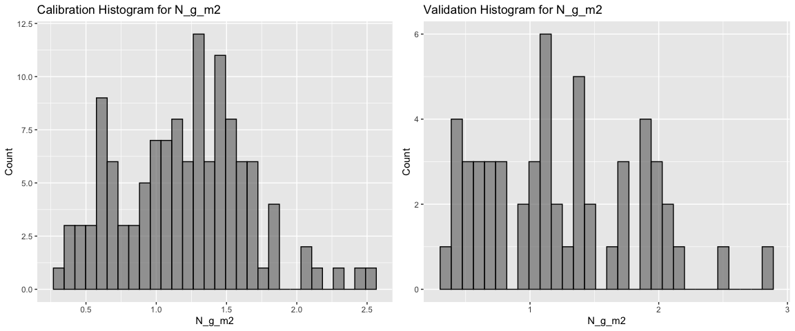
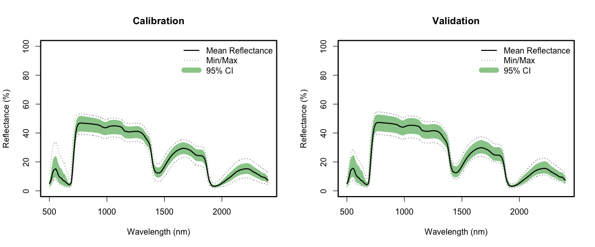
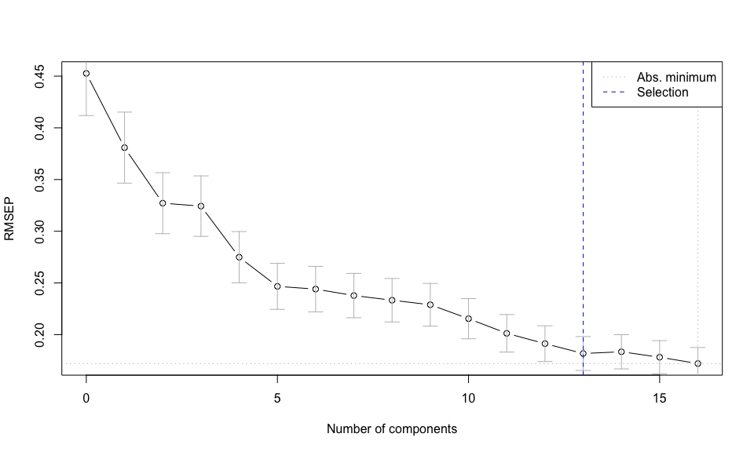
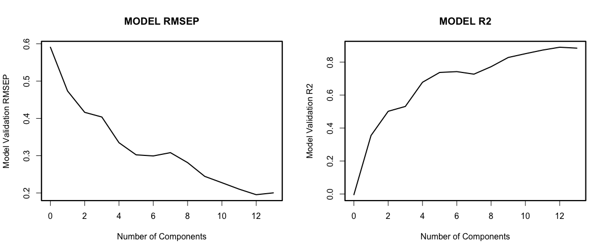
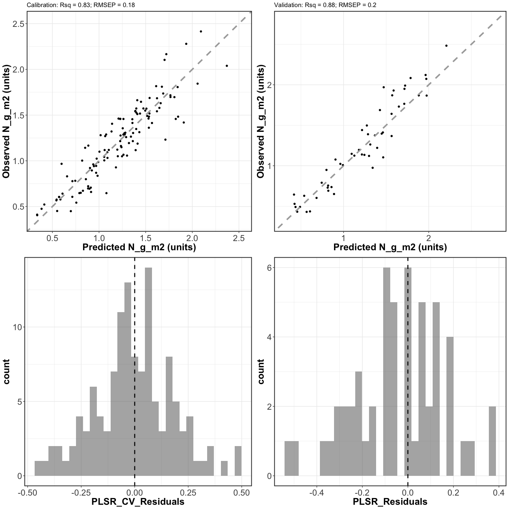
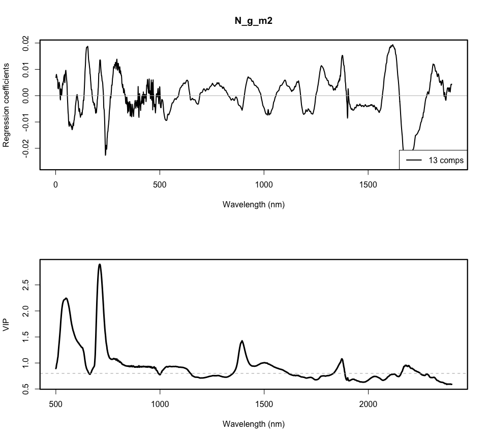
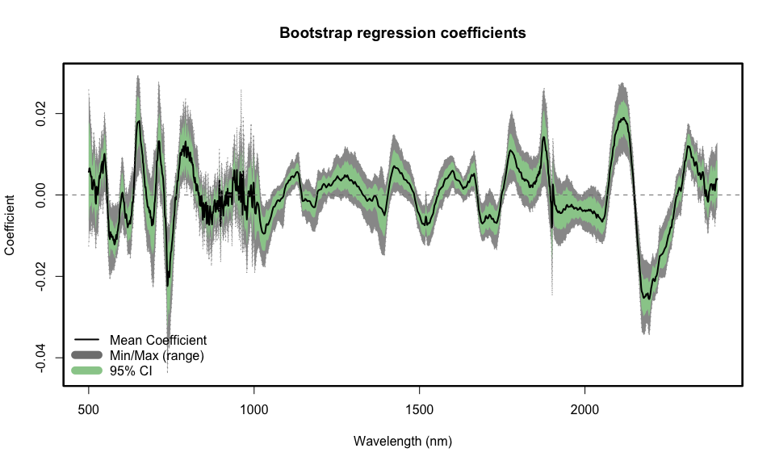
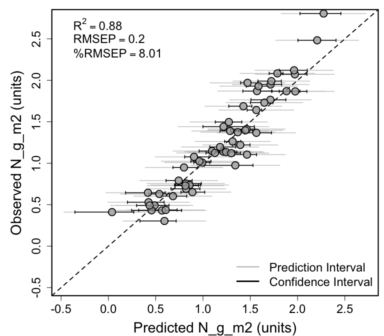

Spectra-trait PLSR example using leaf-level spectra and leaf nitrogen
content (Narea, g/m2) data from eight different crop species growing in
a glasshouse at Brookhaven National Laboratory
================
Shawn P. Serbin, Julien Lamour, & Jeremiah Anderson
2022-03-17

### Overview

This is an [R Markdown](http://rmarkdown.rstudio.com) Notebook to
illustrate how to load an internal dataset (“ely\_plsr\_data”), choose
the “optimal” number of plsr components, and fit a plsr model for leaf
nitrogen content (Narea, g/m2)

### Getting Started

### Load libraries

``` r
list.of.packages <- c("pls","dplyr","here","plotrix","ggplot2","gridExtra","spectratrait")
invisible(lapply(list.of.packages, library, character.only = TRUE))
```

    ## 
    ## Attaching package: 'pls'

    ## The following object is masked from 'package:stats':
    ## 
    ##     loadings

    ## Warning: package 'dplyr' was built under R version 4.0.5

    ## 
    ## Attaching package: 'dplyr'

    ## The following objects are masked from 'package:stats':
    ## 
    ##     filter, lag

    ## The following objects are masked from 'package:base':
    ## 
    ##     intersect, setdiff, setequal, union

    ## here() starts at /Users/sserbin/Data/GitHub/spectratrait

    ## 
    ## Attaching package: 'gridExtra'

    ## The following object is masked from 'package:dplyr':
    ## 
    ##     combine

### Setup other functions and options

``` r
### Setup options

# Script options
pls::pls.options(plsralg = "oscorespls")
pls::pls.options("plsralg")
```

    ## $plsralg
    ## [1] "oscorespls"

``` r
# Default par options
opar <- par(no.readonly = T)

# Specify output directory, output_dir 
# Options: 
# tempdir - use a OS-specified temporary directory 
# user defined PATH - e.g. "~/scratch/PLSR"
output_dir <- "tempdir"
```

### Load internal Ely et al 2019 dataset

``` r
data("ely_plsr_data")
head(ely_plsr_data)[,1:8]
```

    ##   Species_Code      Common_Name C_N_mass   C_g_m2 H20_g_m2 LMA_g_m2   N_g_m2
    ## 1        HEAN3 common sunflower     7.58 15.61210   167.63    36.40 2.103694
    ## 2        HEAN3 common sunflower     8.33 14.73724   164.68    34.65 1.231713
    ## 3        HEAN3 common sunflower     7.70 15.02495   156.95    35.08 1.764752
    ## 4        CUSA4  garden cucumber     7.40 11.14835   111.52    26.23 1.287963
    ## 5        CUSA4  garden cucumber     7.47 11.60735   123.58    26.71 1.411361
    ## 6        CUSA4  garden cucumber     7.43  8.06035   114.36    18.40 1.117704
    ##   Wave_500
    ## 1 4.782000
    ## 2 4.341714
    ## 3 4.502857
    ## 4 3.333429
    ## 5 3.313571
    ## 6 3.272286

``` r
# What is the target variable?
inVar <- "N_g_m2"
```

### Set working directory (scratch space)

    ## [1] "/private/var/folders/xp/h3k9vf3n2jx181ts786_yjrn9c2gjq/T/RtmpP2S4KY"

### Full PLSR dataset

``` r
Start.wave <- 500
End.wave <- 2400
wv <- seq(Start.wave,End.wave,1)
plsr_data <- ely_plsr_data
head(plsr_data)[,1:6]
```

    ##   Species_Code      Common_Name C_N_mass   C_g_m2 H20_g_m2 LMA_g_m2
    ## 1        HEAN3 common sunflower     7.58 15.61210   167.63    36.40
    ## 2        HEAN3 common sunflower     8.33 14.73724   164.68    34.65
    ## 3        HEAN3 common sunflower     7.70 15.02495   156.95    35.08
    ## 4        CUSA4  garden cucumber     7.40 11.14835   111.52    26.23
    ## 5        CUSA4  garden cucumber     7.47 11.60735   123.58    26.71
    ## 6        CUSA4  garden cucumber     7.43  8.06035   114.36    18.40

### Create cal/val datasets

``` r
### Create cal/val datasets
## Make a stratified random sampling in the strata USDA_Species_Code and Domain

method <- "base" #base/dplyr
# base R - a bit slow
# dplyr - much faster
split_data <- spectratrait::create_data_split(dataset=plsr_data, approach=method, 
                                              split_seed=23452135, prop=0.7, 
                                              group_variables="Species_Code")
```

    ## HEAN3   Cal: 70%

    ## CUSA4   Cal: 68.182%

    ## CUPE   Cal: 70.588%

    ## SOLYL   Cal: 70%

    ## OCBA   Cal: 68.421%

    ## POPUL   Cal: 71.429%

    ## GLMA4   Cal: 70.588%

    ## PHVU   Cal: 66.667%

``` r
names(split_data)
```

    ## [1] "cal_data" "val_data"

``` r
cal.plsr.data <- split_data$cal_data
head(cal.plsr.data)[1:8]
```

    ##    Species_Code      Common_Name C_N_mass   C_g_m2 H20_g_m2 LMA_g_m2   N_g_m2
    ## 1         HEAN3 common sunflower     7.58 15.61210   167.63    36.40 2.103694
    ## 2         HEAN3 common sunflower     8.33 14.73724   164.68    34.65 1.231713
    ## 4         CUSA4  garden cucumber     7.40 11.14835   111.52    26.23 1.287963
    ## 6         CUSA4  garden cucumber     7.43  8.06035   114.36    18.40 1.117704
    ## 7          CUPE    field pumpkin     7.20 11.43007   128.42    25.83 1.215333
    ## 10        SOLYL    garden tomato     7.89 11.61918   142.23    27.40 1.304110
    ##    Wave_500
    ## 1  4.782000
    ## 2  4.341714
    ## 4  3.333429
    ## 6  3.272286
    ## 7  2.943143
    ## 10 4.145714

``` r
val.plsr.data <- split_data$val_data
head(val.plsr.data)[1:8]
```

    ##    Species_Code      Common_Name C_N_mass    C_g_m2 H20_g_m2 LMA_g_m2    N_g_m2
    ## 3         HEAN3 common sunflower     7.70 15.024947   156.95    35.08 1.7647515
    ## 5         CUSA4  garden cucumber     7.47 11.607347   123.58    26.71 1.4113615
    ## 8          CUPE    field pumpkin     7.67 12.466238   124.67    29.22 1.1468413
    ## 9          CUPE    field pumpkin     7.64 17.100448   142.85    43.39 1.1390174
    ## 13        SOLYL    garden tomato     7.73  7.938866   129.95    17.96 0.9483533
    ## 15         OCBA      sweet basil     8.13 16.975969   173.30    38.65 1.1246459
    ##    Wave_500
    ## 3  4.502857
    ## 5  3.313571
    ## 8  2.868000
    ## 9  3.338286
    ## 13 3.960286
    ## 15 3.744000

``` r
rm(split_data)

# Datasets:
print(paste("Cal observations: ",dim(cal.plsr.data)[1],sep=""))
```

    ## [1] "Cal observations: 124"

``` r
print(paste("Val observations: ",dim(val.plsr.data)[1],sep=""))
```

    ## [1] "Val observations: 54"

``` r
cal_hist_plot <- qplot(cal.plsr.data[,paste0(inVar)],geom="histogram",
                       main = paste0("Cal. Histogram for ",inVar),
                       xlab = paste0(inVar),ylab = "Count",fill=I("grey50"),col=I("black"),
                       alpha=I(.7))
val_hist_plot <- qplot(val.plsr.data[,paste0(inVar)],geom="histogram",
                       main = paste0("Val. Histogram for ",inVar),
                       xlab = paste0(inVar),ylab = "Count",fill=I("grey50"),col=I("black"),
                       alpha=I(.7))
histograms <- grid.arrange(cal_hist_plot, val_hist_plot, ncol=2)
```

    ## `stat_bin()` using `bins = 30`. Pick better value with `binwidth`.

    ## `stat_bin()` using `bins = 30`. Pick better value with `binwidth`.

<!-- -->

``` r
ggsave(filename = file.path(outdir,paste0(inVar,"_Cal_Val_Histograms.png")), 
       plot = histograms, 
       device="png", width = 30, 
       height = 12, units = "cm",
       dpi = 300)
# output cal/val data
write.csv(cal.plsr.data,file=file.path(outdir,paste0(inVar,'_Cal_PLSR_Dataset.csv')),
          row.names=FALSE)
write.csv(val.plsr.data,file=file.path(outdir,paste0(inVar,'_Val_PLSR_Dataset.csv')),
          row.names=FALSE)
```

### Create calibration and validation PLSR datasets

``` r
### Format PLSR data for model fitting 
cal_spec <- as.matrix(cal.plsr.data[, which(names(cal.plsr.data) %in% paste0("Wave_",wv))])
cal.plsr.data <- data.frame(cal.plsr.data[, which(names(cal.plsr.data) %notin% paste0("Wave_",wv))],
                            Spectra=I(cal_spec))
head(cal.plsr.data)[1:5]
```

    ##    Species_Code      Common_Name C_N_mass   C_g_m2 H20_g_m2
    ## 1         HEAN3 common sunflower     7.58 15.61210   167.63
    ## 2         HEAN3 common sunflower     8.33 14.73724   164.68
    ## 4         CUSA4  garden cucumber     7.40 11.14835   111.52
    ## 6         CUSA4  garden cucumber     7.43  8.06035   114.36
    ## 7          CUPE    field pumpkin     7.20 11.43007   128.42
    ## 10        SOLYL    garden tomato     7.89 11.61918   142.23

``` r
val_spec <- as.matrix(val.plsr.data[, which(names(val.plsr.data) %in% paste0("Wave_",wv))])
val.plsr.data <- data.frame(val.plsr.data[, which(names(val.plsr.data) %notin% paste0("Wave_",wv))],
                            Spectra=I(val_spec))
head(val.plsr.data)[1:5]
```

    ##    Species_Code      Common_Name C_N_mass    C_g_m2 H20_g_m2
    ## 3         HEAN3 common sunflower     7.70 15.024947   156.95
    ## 5         CUSA4  garden cucumber     7.47 11.607347   123.58
    ## 8          CUPE    field pumpkin     7.67 12.466238   124.67
    ## 9          CUPE    field pumpkin     7.64 17.100448   142.85
    ## 13        SOLYL    garden tomato     7.73  7.938866   129.95
    ## 15         OCBA      sweet basil     8.13 16.975969   173.30

### plot cal and val spectra

``` r
par(mfrow=c(1,2)) # B, L, T, R
spectratrait::f.plot.spec(Z=cal.plsr.data$Spectra,wv=wv,plot_label="Calibration")
spectratrait::f.plot.spec(Z=val.plsr.data$Spectra,wv=wv,plot_label="Validation")
```

<!-- -->

``` r
dev.copy(png,file.path(outdir,paste0(inVar,'_Cal_Val_Spectra.png')), 
         height=2500,width=4900, res=340)
```

    ## quartz_off_screen 
    ##                 3

``` r
dev.off();
```

    ## quartz_off_screen 
    ##                 2

``` r
par(mfrow=c(1,1))
```

### Use permutation to determine optimal number of components

``` r
### Use permutation to determine the optimal number of components
if(grepl("Windows", sessionInfo()$running)){
  pls.options(parallel = NULL)
} else {
  pls.options(parallel = parallel::detectCores()-1)
}

method <- "pls" #pls, firstPlateau, firstMin
random_seed <- 1245565
seg <- 50
maxComps <- 16
iterations <- 80
prop <- 0.70
if (method=="pls") {
  nComps <- spectratrait::find_optimal_components(dataset=cal.plsr.data, targetVariable=inVar,
                                                  method=method, 
                                                  maxComps=maxComps, seg=seg, 
                                                  random_seed=random_seed)
  print(paste0("*** Optimal number of components: ", nComps))
} else {
  nComps <- spectratrait::find_optimal_components(dataset=cal.plsr.data, targetVariable=inVar,
                                                  method=method,
                                                  maxComps=maxComps, iterations=iterations, 
                                                  seg=seg, prop=prop, 
                                                  random_seed=random_seed)
}
```

    ## [1] "*** Identifying optimal number of PLSR components ***"
    ## [1] "*** Running PLS permutation test ***"

<!-- -->

    ## [1] "*** Optimal number of components: 13"

``` r
dev.copy(png,file.path(outdir,paste0(paste0(inVar,"_PLSR_Component_Selection.png"))), 
         height=2800, width=3400,  res=340)
```

    ## quartz_off_screen 
    ##                 3

``` r
dev.off();
```

    ## quartz_off_screen 
    ##                 2

### Fit final model

``` r
plsr.out <- plsr(as.formula(paste(inVar,"~","Spectra")),scale=FALSE,ncomp=nComps,validation="LOO",
                 trace=FALSE,data=cal.plsr.data)
fit <- plsr.out$fitted.values[,1,nComps]
pls.options(parallel = NULL)

# External validation fit stats
par(mfrow=c(1,2)) # B, L, T, R
pls::RMSEP(plsr.out, newdata = val.plsr.data)
```

    ## (Intercept)      1 comps      2 comps      3 comps      4 comps      5 comps  
    ##      0.5908       0.4735       0.4162       0.4037       0.3347       0.3023  
    ##     6 comps      7 comps      8 comps      9 comps     10 comps     11 comps  
    ##      0.2993       0.3081       0.2814       0.2445       0.2276       0.2104  
    ##    12 comps     13 comps  
    ##      0.1954       0.2003

``` r
plot(pls::RMSEP(plsr.out,estimate=c("test"),newdata = val.plsr.data), main="MODEL RMSEP",
     xlab="Number of Components",ylab="Model Validation RMSEP",lty=1,col="black",cex=1.5,lwd=2)
box(lwd=2.2)

pls::R2(plsr.out, newdata = val.plsr.data)
```

    ## (Intercept)      1 comps      2 comps      3 comps      4 comps      5 comps  
    ##   -0.004079     0.355010     0.501632     0.531088     0.677620     0.737143  
    ##     6 comps      7 comps      8 comps      9 comps     10 comps     11 comps  
    ##    0.742224     0.726835     0.772115     0.827942     0.850962     0.872685  
    ##    12 comps     13 comps  
    ##    0.890124     0.884529

``` r
plot(pls::R2(plsr.out,estimate=c("test"),newdata = val.plsr.data), main="MODEL R2",
     xlab="Number of Components",ylab="Model Validation R2",lty=1,col="black",cex=1.5,lwd=2)
box(lwd=2.2)
```

<!-- -->

``` r
dev.copy(png,file.path(outdir,paste0(paste0(inVar,"_Validation_RMSEP_R2_by_Component.png"))), 
         height=2800, width=4800,  res=340)
```

    ## quartz_off_screen 
    ##                 3

``` r
dev.off();
```

    ## quartz_off_screen 
    ##                 2

``` r
par(opar)
```

### PLSR fit observed vs. predicted plot data

``` r
#calibration
cal.plsr.output <- data.frame(cal.plsr.data[, which(names(cal.plsr.data) %notin% "Spectra")],
                              PLSR_Predicted=fit,
                              PLSR_CV_Predicted=as.vector(plsr.out$validation$pred[,,nComps]))
cal.plsr.output <- cal.plsr.output %>%
  mutate(PLSR_CV_Residuals = PLSR_CV_Predicted-get(inVar))
head(cal.plsr.output)
```

    ##    Species_Code      Common_Name C_N_mass   C_g_m2 H20_g_m2 LMA_g_m2   N_g_m2
    ## 1         HEAN3 common sunflower     7.58 15.61210   167.63    36.40 2.103694
    ## 2         HEAN3 common sunflower     8.33 14.73724   164.68    34.65 1.231713
    ## 4         CUSA4  garden cucumber     7.40 11.14835   111.52    26.23 1.287963
    ## 6         CUSA4  garden cucumber     7.43  8.06035   114.36    18.40 1.117704
    ## 7          CUPE    field pumpkin     7.20 11.43007   128.42    25.83 1.215333
    ## 10        SOLYL    garden tomato     7.89 11.61918   142.23    27.40 1.304110
    ##    PLSR_Predicted PLSR_CV_Predicted PLSR_CV_Residuals
    ## 1        1.820666          1.702501       -0.40119317
    ## 2        1.609632          1.711772        0.48005882
    ## 4        1.364985          1.275526       -0.01243687
    ## 6        1.126062          1.060119       -0.05758587
    ## 7        1.227538          1.226708        0.01137583
    ## 10       1.358638          1.365181        0.06107105

``` r
cal.R2 <- round(pls::R2(plsr.out,intercept=F)[[1]][nComps],2)
cal.RMSEP <- round(sqrt(mean(cal.plsr.output$PLSR_CV_Residuals^2)),2)

val.plsr.output <- data.frame(val.plsr.data[, which(names(val.plsr.data) %notin% "Spectra")],
                              PLSR_Predicted=as.vector(predict(plsr.out, 
                                                               newdata = val.plsr.data, 
                                                               ncomp=nComps, type="response")[,,1]))
val.plsr.output <- val.plsr.output %>%
  mutate(PLSR_Residuals = PLSR_Predicted-get(inVar))
head(val.plsr.output)
```

    ##    Species_Code      Common_Name C_N_mass    C_g_m2 H20_g_m2 LMA_g_m2    N_g_m2
    ## 3         HEAN3 common sunflower     7.70 15.024947   156.95    35.08 1.7647515
    ## 5         CUSA4  garden cucumber     7.47 11.607347   123.58    26.71 1.4113615
    ## 8          CUPE    field pumpkin     7.67 12.466238   124.67    29.22 1.1468413
    ## 9          CUPE    field pumpkin     7.64 17.100448   142.85    43.39 1.1390174
    ## 13        SOLYL    garden tomato     7.73  7.938866   129.95    17.96 0.9483533
    ## 15         OCBA      sweet basil     8.13 16.975969   173.30    38.65 1.1246459
    ##    PLSR_Predicted PLSR_Residuals
    ## 3       1.7125176   -0.052233917
    ## 5       1.4618447    0.050483171
    ## 8       1.0951891   -0.051652168
    ## 9       1.2152379    0.076220509
    ## 13      0.7992342   -0.149119020
    ## 15      1.1267054    0.002059572

``` r
val.R2 <- round(pls::R2(plsr.out,newdata=val.plsr.data,intercept=F)[[1]][nComps],2)
val.RMSEP <- round(sqrt(mean(val.plsr.output$PLSR_Residuals^2)),2)

rng_quant <- quantile(cal.plsr.output[,inVar], probs = c(0.001, 0.999))
cal_scatter_plot <- ggplot(cal.plsr.output, aes(x=PLSR_CV_Predicted, y=get(inVar))) + 
  theme_bw() + geom_point() + geom_abline(intercept = 0, slope = 1, color="dark grey", 
                                          linetype="dashed", size=1.5) + xlim(rng_quant[1], 
                                                                              rng_quant[2]) + 
  ylim(rng_quant[1], rng_quant[2]) +
  labs(x=paste0("Predicted ", paste(inVar), " (units)"),
       y=paste0("Observed ", paste(inVar), " (units)"),
       title=paste0("Calibration: ", paste0("Rsq = ", cal.R2), "; ", paste0("RMSEP = ", 
                                                                            cal.RMSEP))) +
  theme(axis.text=element_text(size=18), legend.position="none",
        axis.title=element_text(size=20, face="bold"), 
        axis.text.x = element_text(angle = 0,vjust = 0.5),
        panel.border = element_rect(linetype = "solid", fill = NA, size=1.5))

cal_resid_histogram <- ggplot(cal.plsr.output, aes(x=PLSR_CV_Residuals)) +
  geom_histogram(alpha=.5, position="identity") + 
  geom_vline(xintercept = 0, color="black", 
             linetype="dashed", size=1) + theme_bw() + 
  theme(axis.text=element_text(size=18), legend.position="none",
        axis.title=element_text(size=20, face="bold"), 
        axis.text.x = element_text(angle = 0,vjust = 0.5),
        panel.border = element_rect(linetype = "solid", fill = NA, size=1.5))

rng_quant <- quantile(val.plsr.output[,inVar], probs = c(0.001, 0.999))
val_scatter_plot <- ggplot(val.plsr.output, aes(x=PLSR_Predicted, y=get(inVar))) + 
  theme_bw() + geom_point() + geom_abline(intercept = 0, slope = 1, color="dark grey", 
                                          linetype="dashed", size=1.5) + xlim(rng_quant[1], 
                                                                              rng_quant[2]) + 
  ylim(rng_quant[1], rng_quant[2]) +
  labs(x=paste0("Predicted ", paste(inVar), " (units)"),
       y=paste0("Observed ", paste(inVar), " (units)"),
       title=paste0("Validation: ", paste0("Rsq = ", val.R2), "; ", paste0("RMSEP = ", 
                                                                           val.RMSEP))) +
  theme(axis.text=element_text(size=18), legend.position="none",
        axis.title=element_text(size=20, face="bold"), 
        axis.text.x = element_text(angle = 0,vjust = 0.5),
        panel.border = element_rect(linetype = "solid", fill = NA, size=1.5))

val_resid_histogram <- ggplot(val.plsr.output, aes(x=PLSR_Residuals)) +
  geom_histogram(alpha=.5, position="identity") + 
  geom_vline(xintercept = 0, color="black", 
             linetype="dashed", size=1) + theme_bw() + 
  theme(axis.text=element_text(size=18), legend.position="none",
        axis.title=element_text(size=20, face="bold"), 
        axis.text.x = element_text(angle = 0,vjust = 0.5),
        panel.border = element_rect(linetype = "solid", fill = NA, size=1.5))

# plot cal/val side-by-side
scatterplots <- grid.arrange(cal_scatter_plot, val_scatter_plot, cal_resid_histogram, 
                             val_resid_histogram, nrow=2,ncol=2)
```

    ## Warning: Removed 3 rows containing missing values (geom_point).
    ## Removed 3 rows containing missing values (geom_point).

    ## `stat_bin()` using `bins = 30`. Pick better value with `binwidth`.
    ## `stat_bin()` using `bins = 30`. Pick better value with `binwidth`.

<!-- -->

``` r
ggsave(filename = file.path(outdir,paste0(inVar,"_Cal_Val_Scatterplots.png")), 
       plot = scatterplots, device="png", 
       width = 32, 
       height = 30, units = "cm",
       dpi = 300)
```

### Generate Coefficient and VIP plots

``` r
vips <- spectratrait::VIP(plsr.out)[nComps,]
par(mfrow=c(2,1))
plot(plsr.out, plottype = "coef",xlab="Wavelength (nm)",
     ylab="Regression coefficients",legendpos = "bottomright",
     ncomp=nComps,lwd=2)
box(lwd=2.2)
plot(seq(Start.wave,End.wave,1),vips,xlab="Wavelength (nm)",ylab="VIP",cex=0.01)
lines(seq(Start.wave,End.wave,1),vips,lwd=3)
abline(h=0.8,lty=2,col="dark grey")
box(lwd=2.2)
```

<!-- -->

``` r
dev.copy(png,file.path(outdir,paste0(inVar,'_Coefficient_VIP_plot.png')), 
         height=3100, width=4100, res=340)
```

    ## quartz_off_screen 
    ##                 3

``` r
dev.off();
```

    ## quartz_off_screen 
    ##                 2

### Bootstrap validation

``` r
if(grepl("Windows", sessionInfo()$running)){
  pls.options(parallel =NULL)
} else {
  pls.options(parallel = parallel::detectCores()-1)
}

### PLSR bootstrap permutation uncertainty analysis
iterations <- 500    # how many permutation iterations to run
prop <- 0.70          # fraction of training data to keep for each iteration
plsr_permutation <- spectratrait::pls_permutation(dataset=cal.plsr.data, targetVariable=inVar,
                                                  maxComps=nComps, 
                                                  iterations=iterations, prop=prop,
                                                  verbose = FALSE)
```

    ## [1] "*** Running permutation test.  Please hang tight, this can take awhile ***"
    ## [1] "Options:"
    ## [1] "Max Components: 13 Iterations: 500 Data Proportion (percent): 70"
    ## [1] "*** Providing PRESS and coefficient array output ***"

``` r
bootstrap_intercept <- plsr_permutation$coef_array[1,,nComps]
bootstrap_coef <- plsr_permutation$coef_array[2:length(plsr_permutation$coef_array[,1,nComps]),
                                              ,nComps]
rm(plsr_permutation)

# apply coefficients to left-out validation data
interval <- c(0.025,0.975)
Bootstrap_Pred <- val.plsr.data$Spectra %*% bootstrap_coef + 
  matrix(rep(bootstrap_intercept, length(val.plsr.data[,inVar])), byrow=TRUE, 
         ncol=length(bootstrap_intercept))
Interval_Conf <- apply(X = Bootstrap_Pred, MARGIN = 1, FUN = quantile, 
                       probs=c(interval[1], interval[2]))
sd_mean <- apply(X = Bootstrap_Pred, MARGIN = 1, FUN = sd)
sd_res <- sd(val.plsr.output$PLSR_Residuals)
sd_tot <- sqrt(sd_mean^2+sd_res^2)
val.plsr.output$LCI <- Interval_Conf[1,]
val.plsr.output$UCI <- Interval_Conf[2,]
val.plsr.output$LPI <- val.plsr.output$PLSR_Predicted-1.96*sd_tot
val.plsr.output$UPI <- val.plsr.output$PLSR_Predicted+1.96*sd_tot
head(val.plsr.output)
```

    ##    Species_Code      Common_Name C_N_mass    C_g_m2 H20_g_m2 LMA_g_m2    N_g_m2
    ## 3         HEAN3 common sunflower     7.70 15.024947   156.95    35.08 1.7647515
    ## 5         CUSA4  garden cucumber     7.47 11.607347   123.58    26.71 1.4113615
    ## 8          CUPE    field pumpkin     7.67 12.466238   124.67    29.22 1.1468413
    ## 9          CUPE    field pumpkin     7.64 17.100448   142.85    43.39 1.1390174
    ## 13        SOLYL    garden tomato     7.73  7.938866   129.95    17.96 0.9483533
    ## 15         OCBA      sweet basil     8.13 16.975969   173.30    38.65 1.1246459
    ##    PLSR_Predicted PLSR_Residuals       LCI       UCI       LPI      UPI
    ## 3       1.7125176   -0.052233917 1.5070086 1.8760564 1.2810247 2.144011
    ## 5       1.4618447    0.050483171 1.2909822 1.5475356 1.0541359 1.869553
    ## 8       1.0951891   -0.051652168 0.9595488 1.2335912 0.6846083 1.505770
    ## 9       1.2152379    0.076220509 1.0746965 1.3367675 0.8068229 1.623653
    ## 13      0.7992342   -0.149119020 0.6820207 0.9451323 0.3899050 1.208563
    ## 15      1.1267054    0.002059572 1.0316572 1.2737521 0.7209233 1.532488

### Jackknife coefficient plot

``` r
# Bootstrap regression coefficient plot
spectratrait::f.plot.coef(Z = t(bootstrap_coef), wv = wv, 
            plot_label="Bootstrap regression coefficients",position = 'bottomleft')
abline(h=0,lty=2,col="grey50")
box(lwd=2.2)
```

<!-- -->

``` r
dev.copy(png,file.path(outdir,paste0(inVar,'_Bootstrap_Regression_Coefficients.png')), 
         height=2100, width=3800, res=340)
```

    ## quartz_off_screen 
    ##                 3

``` r
dev.off();
```

    ## quartz_off_screen 
    ##                 2

### Bootstrap validation plot

``` r
rmsep_percrmsep <- spectratrait::percent_rmse(plsr_dataset = val.plsr.output, 
                                              inVar = inVar, 
                                              residuals = val.plsr.output$PLSR_Residuals, 
                                              range="full")
RMSEP <- rmsep_percrmsep$rmse
perc_RMSEP <- rmsep_percrmsep$perc_rmse
r2 <- round(pls::R2(plsr.out, newdata = val.plsr.data, intercept=F)$val[nComps],2)
expr <- vector("expression", 3)
expr[[1]] <- bquote(R^2==.(r2))
expr[[2]] <- bquote(RMSEP==.(round(RMSEP,2)))
expr[[3]] <- bquote("%RMSEP"==.(round(perc_RMSEP,2)))
rng_vals <- c(min(val.plsr.output$LPI), max(val.plsr.output$UPI))
par(mfrow=c(1,1), mar=c(4.2,5.3,1,0.4), oma=c(0, 0.1, 0, 0.2))
plotrix::plotCI(val.plsr.output$PLSR_Predicted,val.plsr.output[,inVar], 
       li=val.plsr.output$LPI, ui=val.plsr.output$UPI, gap=0.009,sfrac=0.000, 
       lwd=1.6, xlim=c(rng_vals[1], rng_vals[2]), ylim=c(rng_vals[1], rng_vals[2]), 
       err="x", pch=21, col="black", pt.bg=scales::alpha("grey70",0.7), scol="grey80",
       cex=2, xlab=paste0("Predicted ", paste(inVar), " (units)"),
       ylab=paste0("Observed ", paste(inVar), " (units)"),
       cex.axis=1.5,cex.lab=1.8)
abline(0,1,lty=2,lw=2)
plotrix::plotCI(val.plsr.output$PLSR_Predicted,val.plsr.output[,inVar], 
       li=val.plsr.output$LCI, ui=val.plsr.output$UCI, gap=0.009,sfrac=0.004, 
       lwd=1.6, xlim=c(rng_vals[1], rng_vals[2]), ylim=c(rng_vals[1], rng_vals[2]), 
       err="x", pch=21, col="black", pt.bg=scales::alpha("grey70",0.7), scol="black",
       cex=2, xlab=paste0("Predicted ", paste(inVar), " (units)"),
       ylab=paste0("Observed ", paste(inVar), " (units)"),
       cex.axis=1.5,cex.lab=1.8, add=T)
legend("topleft", legend=expr, bty="n", cex=1.5)
legend("bottomright", legend=c("Prediction Interval","Confidence Interval"), 
       lty=c(1,1), col = c("grey80","black"), lwd=3, bty="n", cex=1.5)
box(lwd=2.2)
```

<!-- -->

``` r
dev.copy(png,file.path(outdir,paste0(inVar,"_PLSR_Validation_Scatterplot.png")), 
         height=2800, width=3200,  res=340)
```

    ## quartz_off_screen 
    ##                 3

``` r
dev.off();
```

    ## quartz_off_screen 
    ##                 2

### Output bootstrap results

``` r
# Bootstrap Coefficients
out.jk.coefs <- data.frame(Iteration=seq(1,length(bootstrap_intercept),1),
                           Intercept=bootstrap_intercept,t(bootstrap_coef))
names(out.jk.coefs) <- c("Iteration","Intercept",paste0("Wave_",wv))
head(out.jk.coefs)[1:6]
```

    ##   Iteration  Intercept      Wave_500     Wave_501     Wave_502     Wave_503
    ## 1         1 -0.6617899 -0.0067918917 -0.006451152 -0.005571355 -0.004909648
    ## 2         2 -0.4636504 -0.0040384348 -0.001804902  0.001375426  0.002477500
    ## 3         3 -0.8146267  0.0031055624  0.003529288  0.005078394  0.005883173
    ## 4         4  0.7030872  0.0003883207  0.002887701  0.003961071  0.003223096
    ## 5         5  0.4765138  0.0045652557  0.005822813  0.005979498  0.004861387
    ## 6         6  0.4146289  0.0085296345  0.009692141  0.010451131  0.009300204

``` r
write.csv(out.jk.coefs,file=file.path(outdir,paste0(inVar,
                                                    '_Bootstrap_PLSR_Coefficients.csv')),
          row.names=FALSE)
```

### Create core PLSR outputs

``` r
print(paste("Output directory: ", outdir))
```

    ## [1] "Output directory:  /var/folders/xp/h3k9vf3n2jx181ts786_yjrn9c2gjq/T//RtmpP2S4KY"

``` r
# Observed versus predicted
write.csv(cal.plsr.output,file=file.path(outdir,
                                         paste0(inVar,'_Observed_PLSR_CV_Pred_',
                                                nComps,'comp.csv')),
          row.names=FALSE)

# Validation data
write.csv(val.plsr.output,file=file.path(outdir,
                                         paste0(inVar,'_Validation_PLSR_Pred_',
                                                nComps,'comp.csv')),
          row.names=FALSE)

# Model coefficients
coefs <- coef(plsr.out,ncomp=nComps,intercept=TRUE)
write.csv(coefs,file=file.path(outdir,
                               paste0(inVar,'_PLSR_Coefficients_',
                                      nComps,'comp.csv')),
          row.names=TRUE)

# PLSR VIP
write.csv(vips,file=file.path(outdir,
                              paste0(inVar,'_PLSR_VIPs_',
                                     nComps,'comp.csv')))
```

### Confirm files were written to temp space

``` r
print("**** PLSR output files: ")
```

    ## [1] "**** PLSR output files: "

``` r
print(list.files(outdir)[grep(pattern = inVar, list.files(outdir))])
```

    ##  [1] "N_g_m2_Bootstrap_PLSR_Coefficients.csv"      
    ##  [2] "N_g_m2_Bootstrap_Regression_Coefficients.png"
    ##  [3] "N_g_m2_Cal_PLSR_Dataset.csv"                 
    ##  [4] "N_g_m2_Cal_Val_Histograms.png"               
    ##  [5] "N_g_m2_Cal_Val_Scatterplots.png"             
    ##  [6] "N_g_m2_Cal_Val_Spectra.png"                  
    ##  [7] "N_g_m2_Coefficient_VIP_plot.png"             
    ##  [8] "N_g_m2_Observed_PLSR_CV_Pred_13comp.csv"     
    ##  [9] "N_g_m2_PLSR_Coefficients_13comp.csv"         
    ## [10] "N_g_m2_PLSR_Component_Selection.png"         
    ## [11] "N_g_m2_PLSR_Validation_Scatterplot.png"      
    ## [12] "N_g_m2_PLSR_VIPs_13comp.csv"                 
    ## [13] "N_g_m2_Val_PLSR_Dataset.csv"                 
    ## [14] "N_g_m2_Validation_PLSR_Pred_13comp.csv"      
    ## [15] "N_g_m2_Validation_RMSEP_R2_by_Component.png"
