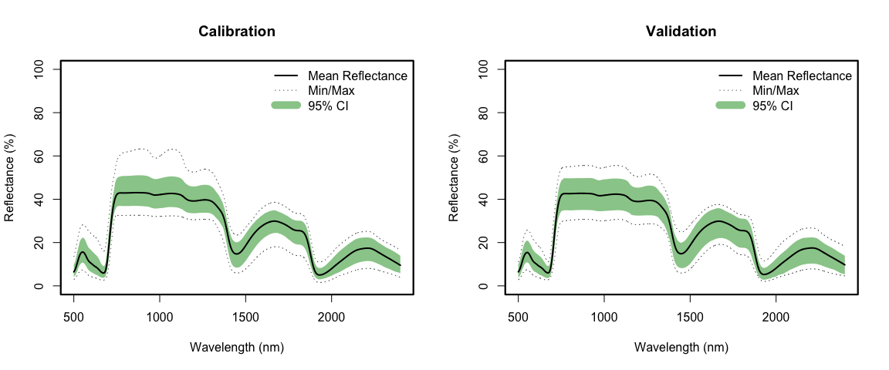

Spectra-trait PLSR example using leaf-level spectra and specific leaf
area (SLA) data from more than 40 species grassland species comprising
both herbs and graminoids
================
Shawn P. Serbin, Julien Lamour, & Jeremiah Anderson
2022-03-16

### Overview

This is an [R Markdown](http://rmarkdown.rstudio.com) Notebook to
illustrate how to retrieve a dataset from the EcoSIS spectral database,
choose the “optimal” number of plsr components, and fit a plsr model for
specific leaf area (SLA). In this example, the plants were cultivated in
an outdoor setting in the botanical garden of the KIT using 40x40 cm
pots with an standardized substrate. The data was measured on a weekly
basis (the timestamp is included in the dataset).

### Getting Started

### Load libraries

``` r
list.of.packages <- c("pls","dplyr","reshape2","here","plotrix","ggplot2","gridExtra",
                      "spectratrait")
invisible(lapply(list.of.packages, library, character.only = TRUE))
```

    ## 
    ## Attaching package: 'pls'

    ## The following object is masked from 'package:stats':
    ## 
    ##     loadings

    ## 
    ## Attaching package: 'dplyr'

    ## The following objects are masked from 'package:stats':
    ## 
    ##     filter, lag

    ## The following objects are masked from 'package:base':
    ## 
    ##     intersect, setdiff, setequal, union

    ## here() starts at /Users/sserbin/Data/GitHub/spectratrait

    ## 
    ## Attaching package: 'gridExtra'

    ## The following object is masked from 'package:dplyr':
    ## 
    ##     combine

### Setup other functions and options

``` r
### Setup options

# Script options
pls::pls.options(plsralg = "oscorespls")
pls::pls.options("plsralg")
```

    ## $plsralg
    ## [1] "oscorespls"

``` r
# Default par options
opar <- par(no.readonly = T)

# What is the target variable?
inVar <- "SLA_g_cm"

# What is the source dataset from EcoSIS?
ecosis_id <- "3cf6b27e-d80e-4bc7-b214-c95506e46daa"

# Specify output directory, output_dir 
# Options: 
# tempdir - use a OS-specified temporary directory 
# user defined PATH - e.g. "~/scratch/PLSR"
output_dir <- "tempdir"
```

### Set working directory (scratch space)

    ## [1] "Output directory: /private/var/folders/xp/h3k9vf3n2jx181ts786_yjrn9c2gjq/T/Rtmp83RkYg"

### Grab data from EcoSIS

``` r
print(paste0("Output directory: ",getwd()))  # check wd
```

    ## [1] "Output directory: /Users/sserbin/Data/GitHub/spectratrait/vignettes"

``` r
### Get source dataset from EcoSIS
dat_raw <- spectratrait::get_ecosis_data(ecosis_id = ecosis_id)
```

    ## [1] "**** Downloading Ecosis data ****"

    ## Downloading data...

    ## Rows: 739 Columns: 2114
    ## ── Column specification ────────────────────────────────────────────────────────
    ## Delimiter: ","
    ## chr    (3): growth form, species, timestamp
    ## dbl (2111): Anthocyanin concentration (mg/g), Anthocyanin content ( g/cm ), ...
    ## 
    ## ℹ Use `spec()` to retrieve the full column specification for this data.
    ## ℹ Specify the column types or set `show_col_types = FALSE` to quiet this message.
    ## Download complete!

``` r
head(dat_raw)
```

    ## # A tibble: 6 × 2,114
    ##   `Anthocyanin concentratio…` `Anthocyanin c…` `Carotenoid co…` `Carotenoid co…`
    ##                         <dbl>            <dbl>            <dbl>            <dbl>
    ## 1                     0.00106            0.997          0.00799             7.49
    ## 2                     0.00357            1.22           0.0221              7.53
    ## 3                     0.00252            1.14           0.0188              8.55
    ## 4                     0.00310            2.26           0.0158             11.5 
    ## 5                     0.00412            1.73           0.0216              9.08
    ## 6                     0.00397            1.02           0.0336              8.66
    ## # … with 2,110 more variables: `Chlorophyll concentration (mg/g)` <dbl>,
    ## #   `Chlorophyll content ( g/cm )` <dbl>, `LDMC (g/g)` <dbl>,
    ## #   `LFA (mg/cm )` <dbl>, `LWC (mg/cm )` <dbl>, `SLA (g/cm )` <dbl>,
    ## #   `growth form` <chr>, species <chr>, timestamp <chr>, `400` <dbl>,
    ## #   `401` <dbl>, `402` <dbl>, `403` <dbl>, `404` <dbl>, `405` <dbl>,
    ## #   `406` <dbl>, `407` <dbl>, `408` <dbl>, `409` <dbl>, `410` <dbl>,
    ## #   `411` <dbl>, `412` <dbl>, `413` <dbl>, `414` <dbl>, `415` <dbl>, …

``` r
names(dat_raw)[1:40]
```

    ##  [1] "Anthocyanin concentration (mg/g)" "Anthocyanin content ( g/cm )"    
    ##  [3] "Carotenoid concentration (mg/g)"  "Carotenoid content ( g/cm )"     
    ##  [5] "Chlorophyll concentration (mg/g)" "Chlorophyll content ( g/cm )"    
    ##  [7] "LDMC (g/g)"                       "LFA (mg/cm )"                    
    ##  [9] "LWC (mg/cm )"                     "SLA (g/cm )"                     
    ## [11] "growth form"                      "species"                         
    ## [13] "timestamp"                        "400"                             
    ## [15] "401"                              "402"                             
    ## [17] "403"                              "404"                             
    ## [19] "405"                              "406"                             
    ## [21] "407"                              "408"                             
    ## [23] "409"                              "410"                             
    ## [25] "411"                              "412"                             
    ## [27] "413"                              "414"                             
    ## [29] "415"                              "416"                             
    ## [31] "417"                              "418"                             
    ## [33] "419"                              "420"                             
    ## [35] "421"                              "422"                             
    ## [37] "423"                              "424"                             
    ## [39] "425"                              "426"

### Create full plsr dataset

``` r
### Create plsr dataset
Start.wave <- 500
End.wave <- 2400
wv <- seq(Start.wave,End.wave,1)
Spectra <- as.matrix(dat_raw[,names(dat_raw) %in% wv])
colnames(Spectra) <- c(paste0("Wave_",wv))
sample_info <- dat_raw[,names(dat_raw) %notin% seq(350,2500,1)]
head(sample_info)
```

    ## # A tibble: 6 × 13
    ##   `Anthocyanin concentratio…` `Anthocyanin c…` `Carotenoid co…` `Carotenoid co…`
    ##                         <dbl>            <dbl>            <dbl>            <dbl>
    ## 1                     0.00106            0.997          0.00799             7.49
    ## 2                     0.00357            1.22           0.0221              7.53
    ## 3                     0.00252            1.14           0.0188              8.55
    ## 4                     0.00310            2.26           0.0158             11.5 
    ## 5                     0.00412            1.73           0.0216              9.08
    ## 6                     0.00397            1.02           0.0336              8.66
    ## # … with 9 more variables: `Chlorophyll concentration (mg/g)` <dbl>,
    ## #   `Chlorophyll content ( g/cm )` <dbl>, `LDMC (g/g)` <dbl>,
    ## #   `LFA (mg/cm )` <dbl>, `LWC (mg/cm )` <dbl>, `SLA (g/cm )` <dbl>,
    ## #   `growth form` <chr>, species <chr>, timestamp <chr>

``` r
sample_info2 <- sample_info %>%
  select(Plant_Species=species,Growth_Form=`growth form`,timestamp,
         SLA_g_cm=`SLA (g/cm )`) %>%
  mutate(SLA_g_cm=as.numeric(SLA_g_cm)) # ensure SLA is numeric
head(sample_info2)
```

    ## # A tibble: 6 × 4
    ##   Plant_Species          Growth_Form timestamp       SLA_g_cm
    ##   <chr>                  <chr>       <chr>              <dbl>
    ## 1 Calamagrostis epigejos graminoid   5/25/2016 12:20     107.
    ## 2 Anthoxanthum odoratum  graminoid   5/27/2016 8:40      293.
    ## 3 Alopecurus pratensis   graminoid   5/27/2016 9:23      220.
    ## 4 Festuca ovina          graminoid   5/27/2016 9:23      137.
    ## 5 Agrostis capillaris    graminoid   5/27/2016 9:42      237.
    ## 6 Aegopodium podagraria  forb        5/25/2016 12:20     388.

``` r
plsr_data <- data.frame(sample_info2,Spectra)
rm(sample_info,sample_info2,Spectra)
```

### Example data cleaning

``` r
#### End user needs to do what's appropriate for their data.  This may be an iterative process.
# Keep only complete rows of inVar and spec data before fitting
plsr_data <- plsr_data[complete.cases(plsr_data[,names(plsr_data) %in% c(inVar,wv)]),]
# Remove suspect high values
plsr_data <- plsr_data[ plsr_data[,inVar] <= 500, ]
```

### Create cal/val datasets

``` r
### Create cal/val datasets
## Make a stratified random sampling in the strata USDA_Species_Code and Domain

method <- "base" #base/dplyr
# base R - a bit slow
# dplyr - much faster
split_data <- spectratrait::create_data_split(dataset=plsr_data, approach=method, split_seed=2356812, 
                                              prop=0.8, group_variables="Plant_Species")
```

    ## Calamagrostis epigejos   Cal: 80%

    ## Anthoxanthum odoratum   Cal: 80%

    ## Alopecurus pratensis   Cal: 80%

    ## Festuca ovina   Cal: 78.947%

    ## Agrostis capillaris   Cal: 82.353%

    ## Aegopodium podagraria   Cal: 80%

    ## Arrhenatherum elatius   Cal: 82.353%

    ## Arctium lappa   Cal: 83.333%

    ## Urtica dioica   Cal: 78.947%

    ## Cirsium arvense   Cal: 80%

    ## Geranium pratense   Cal: 81.25%

    ## Geum urbanum   Cal: 80%

    ## Digitalis purpurea   Cal: 81.25%

    ## Stellaria media   Cal: 77.778%

    ## Trisetum flavescens   Cal: 80%

    ## Trifolium pratense   Cal: 80.952%

    ## Geranium robertianum   Cal: 78.571%

    ## Plantago major   Cal: 85.714%

    ## Nardus stricta   Cal: 78.947%

    ## Lamium purpureum   Cal: 77.778%

    ## Clinopodium vulgare   Cal: 78.571%

    ## Poa annua   Cal: 75%

    ## Campanula rotundifolia   Cal: 78.571%

    ## Taraxacum spec.   Cal: 80%

    ## Digitaria sanguinalis   Cal: 85.714%

    ## Holcus lanatus   Cal: 82.353%

    ## Lapsana communis   Cal: 75%

    ## Apera spica-venti   Cal: 80%

    ## Alopecurus geniculatus   Cal: 75%

    ## Bromus hordeaceus   Cal: 80%

    ## Phalaris arundinaceae   Cal: 81.25%

    ## Thlaspi arvense Not enough observations

    ## Origanum vulgare   Cal: 77.778%

    ## Pulicaria dysenterica   Cal: 79.167%

    ## Deschampsia cespitosa   Cal: 80%

    ## Cirsium acaule   Cal: 80%

    ## Brachypodium sylvaticum   Cal: 80%

    ## Centaurium erythraea   Cal: 77.778%

    ## Luzula multiflora   Cal: 78.571%

    ## Filipendula ulmaria   Cal: 78.571%

    ## Anthyllis vulneraria   Cal: 75%

    ## Medicago lupulina   Cal: 75%

    ## Succisa pratensis   Cal: 83.333%

    ## Scirpus sylvaticus   Cal: 77.778%

    ## Molinia caerulea   Cal: 83.333%

``` r
names(split_data)
```

    ## [1] "cal_data" "val_data"

``` r
cal.plsr.data <- split_data$cal_data
val.plsr.data <- split_data$val_data
rm(split_data)

# Datasets:
print(paste("Cal observations: ",dim(cal.plsr.data)[1],sep=""))
```

    ## [1] "Cal observations: 490"

``` r
print(paste("Val observations: ",dim(val.plsr.data)[1],sep=""))
```

    ## [1] "Val observations: 124"

``` r
cal_hist_plot <- qplot(cal.plsr.data[,paste0(inVar)],geom="histogram",
                       main = paste0("Cal. Histogram for ",inVar),
                       xlab = paste0(inVar),ylab = "Count",fill=I("grey50"),
                       col=I("black"),alpha=I(.7))
val_hist_plot <- qplot(val.plsr.data[,paste0(inVar)],geom="histogram",
                       main = paste0("Val. Histogram for ",inVar),
                       xlab = paste0(inVar),ylab = "Count",fill=I("grey50"),
                       col=I("black"),alpha=I(.7))
histograms <- grid.arrange(cal_hist_plot, val_hist_plot, ncol=2)
```

    ## `stat_bin()` using `bins = 30`. Pick better value with `binwidth`.

    ## `stat_bin()` using `bins = 30`. Pick better value with `binwidth`.

<!-- -->

``` r
ggsave(filename = file.path(outdir,paste0(inVar,"_Cal_Val_Histograms.png")), 
       plot = histograms, device="png", width = 30, height = 12, units = "cm",
       dpi = 300)
# output cal/val data
write.csv(cal.plsr.data,file=file.path(outdir,paste0(inVar,'_Cal_PLSR_Dataset.csv')),
          row.names=FALSE)
write.csv(val.plsr.data,file=file.path(outdir,paste0(inVar,'_Val_PLSR_Dataset.csv')),
          row.names=FALSE)
```

### Create calibration and validation PLSR datasets

``` r
### Format PLSR data for model fitting 
cal_spec <- as.matrix(cal.plsr.data[, which(names(cal.plsr.data) %in% paste0("Wave_",wv))])
cal.plsr.data <- data.frame(cal.plsr.data[, which(names(cal.plsr.data) %notin% paste0("Wave_",wv))],
                            Spectra=I(cal_spec))
head(cal.plsr.data)[1:5]
```

    ##            Plant_Species Growth_Form       timestamp SLA_g_cm Spectra.Wave_500
    ## 1 Calamagrostis epigejos   graminoid 5/25/2016 12:20 106.6500       0.09180559
    ## 2  Anthoxanthum odoratum   graminoid  5/27/2016 8:40 293.3565       0.09022668
    ## 3   Alopecurus pratensis   graminoid  5/27/2016 9:23 220.2703       0.07998340
    ## 4          Festuca ovina   graminoid  5/27/2016 9:23 137.1220       0.05205080
    ## 5    Agrostis capillaris   graminoid  5/27/2016 9:42 237.4237       0.06695127
    ## 6  Aegopodium podagraria        forb 5/25/2016 12:20 388.2384       0.04091566
    ##   Spectra.Wave_501 Spectra.Wave_502 Spectra.Wave_503 Spectra.Wave_504
    ## 1       0.09293251       0.09417092       0.09552863       0.09700913
    ## 2       0.09125158       0.09237300       0.09359694       0.09492785
    ## 3       0.08109460       0.08231389       0.08365015       0.08510851
    ## 4       0.05256869       0.05314560       0.05378355       0.05448756
    ## 5       0.06766205       0.06845248       0.06932220       0.07028011
    ## 6       0.04169865       0.04257613       0.04355737       0.04464860
    ##   Spectra.Wave_505 Spectra.Wave_506 Spectra.Wave_507 Spectra.Wave_508
    ## 1       0.09861821       0.10036104       0.10223903       0.10425526
    ## 2       0.09636925       0.09792518       0.09959731       0.10139052
    ## 3       0.08669032       0.08840075       0.09024394       0.09222428
    ## 4       0.05526343       0.05611546       0.05704725       0.05806424
    ## 5       0.07133431       0.07248725       0.07374147       0.07510279
    ## 6       0.04585749       0.04719128       0.04865473       0.05025491
    ##   Spectra.Wave_509 Spectra.Wave_510 Spectra.Wave_511 Spectra.Wave_512
    ## 1       0.10640925       0.10870002       0.11112429       0.11367402
    ## 2       0.10330536       0.10533947       0.10749130       0.10975543
    ## 3       0.09434112       0.09659195       0.09897341       0.10147983
    ## 4       0.05917019       0.06036556       0.06164906       0.06301816
    ## 5       0.07657471       0.07815716       0.07984707       0.08163926
    ## 6       0.05199510       0.05387644       0.05589751       0.05805581
    ##   Spectra.Wave_513 Spectra.Wave_514 Spectra.Wave_515 Spectra.Wave_516
    ## 1       0.11634557       0.11912918       0.12201358       0.12498812
    ## 2       0.11212124       0.11458258       0.11713073       0.11975355
    ## 3       0.10410227       0.10683267       0.10966068       0.11257381
    ## 4       0.06447037       0.06600255       0.06761017       0.06928685
    ## 5       0.08353012       0.08551267       0.08757915       0.08971975
    ## 6       0.06034765       0.06276674       0.06530445       0.06794924
    ##   Spectra.Wave_517 Spectra.Wave_518 Spectra.Wave_519 Spectra.Wave_520
    ## 1       0.12803696       0.13114653       0.13430358       0.13749338
    ## 2       0.12244091       0.12517883       0.12795411       0.13075581
    ## 3       0.11555942       0.11860125       0.12168426       0.12479495
    ## 4       0.07102304       0.07281128       0.07464308       0.07650895
    ## 5       0.09192305       0.09417941       0.09647734       0.09880511
    ## 6       0.07068891       0.07351207       0.07640603       0.07935674
    ##   Spectra.Wave_521 Spectra.Wave_522 Spectra.Wave_523 Spectra.Wave_524
    ## 1       0.14070106       0.14391120       0.14710869       0.15027774
    ## 2       0.13356649       0.13637211       0.13916164       0.14192351
    ## 3       0.12791592       0.13103188       0.13412839       0.13718986
    ## 4       0.07839839       0.08030214       0.08221033       0.08411311
    ## 5       0.10114956       0.10349907       0.10584238       0.10816728
    ## 6       0.08234895       0.08536767       0.08839776       0.09142246
    ##   Spectra.Wave_525 Spectra.Wave_526 Spectra.Wave_527 Spectra.Wave_528
    ## 1       0.15340292       0.15646986       0.15946602       0.16237795
    ## 2       0.14464427       0.14731035       0.14990966       0.15243195
    ## 3       0.14020228       0.14315150       0.14602370       0.14880600
    ## 4       0.08600097       0.08786415       0.08969376       0.09148067
    ## 5       0.11046201       0.11271305       0.11490995       0.11704375
    ## 6       0.09442569       0.09739090       0.10030416       0.10315126
    ##   Spectra.Wave_529 Spectra.Wave_530 Spectra.Wave_531 Spectra.Wave_532
    ## 1       0.16519481       0.16790569       0.17050343       0.17298300
    ## 2       0.15486672       0.15720601       0.15944514       0.16157960
    ## 3       0.15148512       0.15405349       0.15650542       0.15883403
    ## 4       0.09321725       0.09489673       0.09651314       0.09806102
    ## 5       0.11910524       0.12108673       0.12298366       0.12478989
    ## 6       0.10591952       0.10859686       0.11117454       0.11364490
    ##   Spectra.Wave_533 Spectra.Wave_534 Spectra.Wave_535 Spectra.Wave_536
    ## 1       0.17533756       0.17756347       0.17965994       0.18162386
    ## 2       0.16360189       0.16550906       0.16730019       0.16897399
    ## 3       0.16103160       0.16309562       0.16502583       0.16682194
    ## 4       0.09953416       0.10092885       0.10224249       0.10347354
    ## 5       0.12649714       0.12810122       0.12960002       0.13099311
    ## 6       0.11599772       0.11822630       0.12032794       0.12230093
    ##   Spectra.Wave_537 Spectra.Wave_538 Spectra.Wave_539 Spectra.Wave_540
    ## 1       0.18345499       0.18515757       0.18673365       0.18818401
    ## 2       0.17053222       0.17197809       0.17331474       0.17454542
    ## 3       0.16848458       0.17001609       0.17141959       0.17269868
    ## 4       0.10462130       0.10568563       0.10666641       0.10756412
    ## 5       0.13228202       0.13346874       0.13455548       0.13554348
    ## 6       0.12414323       0.12585456       0.12743592       0.12888834
    ##   Spectra.Wave_541 Spectra.Wave_542 Spectra.Wave_543 Spectra.Wave_544
    ## 1       0.18951154       0.19071809       0.19180342       0.19276997
    ## 2       0.17567023       0.17668946       0.17760609       0.17842030
    ## 3       0.17385564       0.17489215       0.17581167       0.17661431
    ## 4       0.10838006       0.10911465       0.10976546       0.11033182
    ## 5       0.13643392       0.13722855       0.13792614       0.13852614
    ## 6       0.13021348       0.13141260       0.13248556       0.13343315
    ##   Spectra.Wave_545 Spectra.Wave_546 Spectra.Wave_547 Spectra.Wave_548
    ## 1       0.19361929       0.19435067       0.19496241       0.19545682
    ## 2       0.17913182       0.17974443       0.18025777       0.18067071
    ## 3       0.17730020       0.17787254       0.17833242       0.17868029
    ## 4       0.11081405       0.11121355       0.11153066       0.11176523
    ## 5       0.13903044       0.13944163       0.13975994       0.13998534
    ## 6       0.13425638       0.13495591       0.13553177       0.13598571
    ##   Spectra.Wave_549 Spectra.Wave_550 Spectra.Wave_551 Spectra.Wave_552
    ## 1       0.19583696       0.19610484       0.19626114       0.19630376
    ## 2       0.18098412       0.18120144       0.18132471       0.18135365
    ## 3       0.17891828       0.17904750       0.17906863       0.17898219
    ## 4       0.11191856       0.11199226       0.11198713       0.11190370
    ## 5       0.14011938       0.14016300       0.14011710       0.13998176
    ## 6       0.13632128       0.13654068       0.13664515       0.13663510
    ##   Spectra.Wave_553 Spectra.Wave_554 Spectra.Wave_555 Spectra.Wave_556
    ## 1       0.19623247       0.19604846       0.19574836       0.19532782
    ## 2       0.18128530       0.18111744       0.18084731       0.18047149
    ## 3       0.17878641       0.17847827       0.17805576       0.17751615
    ## 4       0.11174274       0.11150308       0.11118197       0.11077727
    ## 5       0.13975537       0.13943725       0.13902409       0.13851131
    ## 6       0.13651141       0.13627347       0.13591866       0.13544363
    ##   Spectra.Wave_557 Spectra.Wave_558 Spectra.Wave_559 Spectra.Wave_560
    ## 1       0.19478371       0.19411296       0.19331625       0.19239570
    ## 2       0.17998796       0.17939370       0.17868830       0.17787398
    ## 3       0.17685807       0.17607855       0.17517721       0.17415719
    ## 4       0.11028817       0.10971265       0.10905023       0.10830294
    ## 5       0.13789849       0.13718508       0.13637146       0.13546007
    ## 6       0.13484579       0.13412280       0.13327548       0.13230573
    ##   Spectra.Wave_561 Spectra.Wave_562 Spectra.Wave_563 Spectra.Wave_564
    ## 1       0.19135272       0.19019204       0.18891679       0.18753362
    ## 2       0.17695229       0.17592603       0.17479891       0.17357557
    ## 3       0.17301973       0.17176839       0.17040821       0.16894657
    ## 4       0.10747303       0.10656393       0.10557986       0.10452575
    ## 5       0.13445356       0.13335582       0.13217169       0.13090539
    ## 6       0.13121487       0.13000682       0.12868702       0.12726296
    ##   Spectra.Wave_565 Spectra.Wave_566 Spectra.Wave_567 Spectra.Wave_568
    ## 1       0.18605042       0.18447542       0.18282101       0.18109833
    ## 2       0.17226282       0.17087019       0.16940770       0.16788304
    ## 3       0.16739137       0.16575145       0.16403727       0.16225789
    ## 4       0.10340743       0.10223157       0.10100649       0.09974093
    ## 5       0.12956358       0.12815523       0.12668889       0.12517461
    ## 6       0.12574303       0.12413624       0.12245332       0.12070565
    ##   Spectra.Wave_569 Spectra.Wave_570 Spectra.Wave_571 Spectra.Wave_572
    ## 1       0.17931716       0.17748945       0.17562832       0.17374739
    ## 2       0.16630646       0.16469118       0.16304835       0.16138766
    ## 3       0.16042486       0.15855130       0.15664962       0.15473051
    ## 4       0.09844411       0.09712610       0.09579489       0.09445805
    ## 5       0.12362420       0.12204867       0.12045632       0.11885566
    ## 6       0.11890556       0.11706614       0.11520048       0.11332017
    ##   Spectra.Wave_573 Spectra.Wave_574 Spectra.Wave_575 Spectra.Wave_576
    ## 1       0.17185600       0.16996354       0.16807842       0.16620879
    ## 2       0.15971783       0.15804623       0.15637947       0.15472536
    ## 3       0.15280439       0.15088097       0.14896968       0.14708024
    ## 4       0.09312387       0.09179953       0.09049050       0.08920235
    ## 5       0.11725560       0.11566472       0.11408987       0.11253771
    ## 6       0.11143475       0.10955374       0.10768592       0.10584007
    ##   Spectra.Wave_577 Spectra.Wave_578 Spectra.Wave_579 Spectra.Wave_580
    ## 1       0.16436611       0.16256069       0.16079862       0.15908831
    ## 2       0.15309311       0.15149098       0.14992668       0.14840949
    ## 3       0.14522165       0.14340326       0.14163509       0.13992514
    ## 4       0.08794120       0.08671344       0.08552509       0.08438158
    ## 5       0.11101597       0.10953325       0.10809601       0.10671085
    ## 6       0.10402563       0.10225128       0.10052480       0.09885428
    ##   Spectra.Wave_581 Spectra.Wave_582 Spectra.Wave_583 Spectra.Wave_584
    ## 1       0.15743792       0.15585346       0.15434072       0.15290235
    ## 2       0.14694700       0.14554401       0.14420499       0.14293179
    ## 3       0.13828025       0.13670472       0.13520272       0.13377537
    ## 4       0.08328806       0.08224671       0.08125947       0.08032824
    ## 5       0.10538492       0.10412087       0.10291981       0.10178384
    ## 6       0.09724669       0.09570788       0.09424362       0.09285663
    ##   Spectra.Wave_585 Spectra.Wave_586 Spectra.Wave_587 Spectra.Wave_588
    ## 1       0.15153812       0.15024915       0.14903304       0.14788640
    ## 2       0.14172504       0.14058604       0.13951115       0.13849796
    ## 3       0.13242173       0.13114359       0.12993801       0.12880160
    ## 4       0.07945256       0.07863167       0.07786300       0.07714373
    ## 5       0.10071252       0.09970451       0.09875667       0.09786573
    ## 6       0.09154692       0.09031496       0.08915815       0.08807241
    ##   Spectra.Wave_589 Spectra.Wave_590 Spectra.Wave_591 Spectra.Wave_592
    ## 1       0.14680504       0.14578580       0.14482327       0.14390984
    ## 2       0.13754508       0.13665014       0.13580781       0.13501115
    ## 3       0.12773042       0.12672142       0.12576892       0.12486582
    ## 4       0.07647108       0.07584217       0.07525344       0.07470100
    ## 5       0.09702928       0.09624283       0.09550227       0.09480435
    ## 6       0.08705289       0.08609492       0.08519312       0.08434089
    ##   Spectra.Wave_593 Spectra.Wave_594 Spectra.Wave_595 Spectra.Wave_596
    ## 1       0.14303977       0.14220611       0.14140146       0.14061904
    ## 2       0.13425573       0.13353336       0.13283524       0.13215596
    ## 3       0.12400759       0.12318779       0.12239862       0.12163294
    ## 4       0.07418083       0.07368669       0.07321257       0.07275495
    ## 5       0.09414396       0.09351237       0.09290212       0.09230981
    ## 6       0.08353114       0.08275729       0.08201226       0.08128869
    ##   Spectra.Wave_597 Spectra.Wave_598 Spectra.Wave_599 Spectra.Wave_600
    ## 1       0.13985262       0.13909633       0.13834427       0.13759309
    ## 2       0.13149086       0.13083648       0.13018974       0.12954773
    ## 3       0.12088539       0.12015123       0.11942617       0.11870678
    ## 4       0.07230974       0.07187337       0.07144302       0.07101712
    ## 5       0.09173087       0.09116199       0.09060030       0.09004408
    ## 6       0.08058065       0.07988358       0.07919297       0.07850535
    ##   Spectra.Wave_601 Spectra.Wave_602 Spectra.Wave_603 Spectra.Wave_604
    ## 1       0.13684098       0.13608383       0.13531702       0.13454055
    ## 2       0.12890705       0.12826503       0.12762177       0.12697383
    ## 3       0.11798913       0.11727073       0.11655044       0.11582597
    ## 4       0.07059460       0.07017370       0.06975240       0.06932889
    ## 5       0.08949243       0.08894381       0.08839524       0.08784470
    ## 6       0.07781774       0.07712714       0.07643177       0.07573021
    ##   Spectra.Wave_605 Spectra.Wave_606 Spectra.Wave_607 Spectra.Wave_608
    ## 1       0.13375371       0.13295492       0.13214535       0.13132684
    ## 2       0.12631766       0.12565265       0.12497944       0.12429951
    ## 3       0.11509527       0.11435682       0.11361192       0.11286377
    ## 4       0.06890179       0.06846928       0.06803354       0.06759693
    ## 5       0.08729045       0.08672897       0.08616240       0.08559372
    ## 6       0.07502094       0.07430359       0.07357937       0.07284914
    ##   Spectra.Wave_609 Spectra.Wave_610 Spectra.Wave_611 Spectra.Wave_612
    ## 1       0.13050133       0.12967043       0.12883656       0.12800328
    ## 2       0.12361421       0.12292357       0.12222828       0.12153291
    ## 3       0.11211478       0.11136379       0.11061064       0.10985889
    ## 4       0.06715925       0.06672047       0.06628098       0.06584231
    ## 5       0.08502257       0.08444985       0.08387667       0.08330490
    ## 6       0.07211387       0.07137454       0.07063279       0.06989157
    ##   Spectra.Wave_613 Spectra.Wave_614 Spectra.Wave_615 Spectra.Wave_616
    ## 1       0.12717228       0.12634615       0.12552765       0.12472108
    ## 2       0.12083979       0.12015027       0.11946612       0.11879111
    ## 3       0.10911116       0.10836991       0.10763679       0.10691508
    ## 4       0.06540601       0.06497326       0.06454498       0.06412254
    ## 5       0.08273650       0.08217323       0.08161721       0.08106980
    ## 6       0.06915372       0.06842270       0.06770184       0.06699444
    ##   Spectra.Wave_617 Spectra.Wave_618 Spectra.Wave_619 Spectra.Wave_620
    ## 1       0.12393213       0.12316432       0.12242043       0.12170322
    ## 2       0.11812945       0.11748454       0.11686116       0.11626137
    ## 3       0.10620819       0.10551947       0.10485298       0.10421079
    ## 4       0.06370841       0.06330479       0.06291480       0.06254060
    ## 5       0.08053352       0.08001100       0.07950676       0.07902350
    ## 6       0.06630439       0.06563593       0.06499186       0.06437382
    ##   Spectra.Wave_621 Spectra.Wave_622 Spectra.Wave_623 Spectra.Wave_624
    ## 1       0.12101160       0.12034308       0.11969545       0.11906491
    ## 2       0.11568326       0.11512423       0.11458171       0.11404953
    ## 3       0.10359174       0.10299288       0.10241233       0.10184445
    ## 4       0.06218172       0.06183755       0.06150746       0.06118831
    ## 5       0.07855966       0.07811402       0.07768467       0.07726749
    ## 6       0.06378233       0.06321643       0.06267363       0.06214989
    ##   Spectra.Wave_625 Spectra.Wave_626 Spectra.Wave_627 Spectra.Wave_628
    ## 1       0.11844563       0.11783014       0.11721341       0.11659207
    ## 2       0.11352176       0.11299479       0.11246280       0.11191905
    ## 3       0.10128246       0.10072159       0.10015699       0.09958243
    ## 4       0.06087656       0.06056905       0.06026345       0.05995737
    ## 5       0.07685797       0.07645141       0.07604422       0.07563322
    ## 6       0.06164027       0.06113970       0.06064366       0.06014754
    ##   Spectra.Wave_629 Spectra.Wave_630 Spectra.Wave_631 Spectra.Wave_632
    ## 1       0.11595891       0.11530958       0.11464121       0.11394926
    ## 2       0.11136094       0.11078641       0.11019159       0.10957319
    ## 3       0.09899333       0.09838715       0.09776152       0.09711340
    ## 4       0.05964860       0.05933634       0.05902007       0.05869691
    ## 5       0.07521484       0.07478859       0.07435443       0.07390880
    ## 6       0.05964686       0.05913798       0.05861753       0.05808153
    ##   Spectra.Wave_633 Spectra.Wave_634 Spectra.Wave_635 Spectra.Wave_636
    ## 1       0.11322923       0.11248075       0.11170424       0.11089790
    ## 2       0.10892821       0.10825781       0.10756336       0.10684381
    ## 3       0.09643899       0.09573848       0.09501436       0.09426620
    ## 4       0.05836482       0.05802380       0.05767434       0.05731700
    ## 5       0.07344900       0.07297484       0.07248653       0.07198525
    ## 6       0.05752658       0.05695240       0.05635946       0.05574744
    ##   Spectra.Wave_637 Spectra.Wave_638 Spectra.Wave_639 Spectra.Wave_640
    ## 1       0.11006294       0.10920271       0.10831980       0.10741741
    ## 2       0.10610003       0.10533457       0.10455096       0.10375096
    ## 3       0.09349609       0.09270672       0.09190042       0.09107957
    ## 4       0.05695207       0.05658024       0.05620298       0.05582149
    ## 5       0.07147134       0.07094559       0.07041010       0.06986742
    ## 6       0.05511758       0.05447186       0.05381204       0.05314062
    ##   Spectra.Wave_641 Spectra.Wave_642 Spectra.Wave_643 Spectra.Wave_644
    ## 1       0.10649741       0.10555875       0.10460019       0.10362178
    ## 2       0.10293649       0.10210829       0.10126465       0.10040464
    ## 3       0.09024669       0.08940318       0.08854782       0.08767905
    ## 4       0.05543607       0.05504543       0.05464877       0.05424522
    ## 5       0.06931813       0.06876050       0.06819373       0.06761710
    ## 6       0.05245909       0.05176740       0.05106392       0.05034800
    ##   Spectra.Wave_645 Spectra.Wave_646 Spectra.Wave_647 Spectra.Wave_648
    ## 1       0.10262170       0.10159958       0.10055620       0.09949288
    ## 2       0.09952790       0.09863562       0.09772931       0.09681020
    ## 3       0.08679614       0.08590040       0.08499344       0.08407625
    ## 4       0.05383397       0.05341670       0.05299480       0.05256877
    ## 5       0.06702963       0.06643339       0.06583120       0.06522469
    ## 6       0.04961954       0.04887827       0.04812509       0.04736236
    ##   Spectra.Wave_649 Spectra.Wave_650 Spectra.Wave_651 Spectra.Wave_652
    ## 1       0.09841321       0.09732115       0.09622297       0.09512501
    ## 2       0.09588340       0.09495310       0.09402332       0.09310072
    ## 3       0.08315395       0.08223167       0.08131479       0.08040928
    ## 4       0.05214132       0.05171544       0.05129407       0.05087984
    ## 5       0.06461656       0.06401037       0.06341015       0.06281992
    ## 6       0.04659440       0.04582583       0.04506235       0.04430989
    ##   Spectra.Wave_653 Spectra.Wave_654 Spectra.Wave_655 Spectra.Wave_656
    ## 1       0.09403424       0.09295852       0.09190410       0.09087608
    ## 2       0.09219149       0.09130131       0.09043488       0.08959825
    ## 3       0.07952112       0.07865649       0.07782046       0.07701888
    ## 4       0.05047592       0.05008565       0.04971157       0.04935595
    ## 5       0.06224506       0.06169052       0.06115903       0.06065334
    ## 6       0.04357476       0.04286287       0.04217929       0.04152856
    ##   Spectra.Wave_657 Spectra.Wave_658 Spectra.Wave_659 Spectra.Wave_660
    ## 1       0.08988061       0.08892368       0.08800682       0.08713123
    ## 2       0.08879576       0.08803165       0.08730642       0.08662049
    ## 3       0.07625546       0.07553398       0.07485489       0.07421847
    ## 4       0.04902053       0.04870706       0.04841603       0.04814771
    ## 5       0.06017603       0.05973007       0.05931673       0.05893568
    ## 6       0.04091463       0.04034099       0.03980790       0.03931502
    ##   Spectra.Wave_661 Spectra.Wave_662 Spectra.Wave_663 Spectra.Wave_664
    ## 1       0.08629957       0.08551152       0.08476508       0.08405794
    ## 2       0.08597553       0.08537069       0.08480419       0.08427264
    ## 3       0.07362668       0.07307824       0.07257053       0.07210062
    ## 4       0.04790243       0.04768042       0.04748058       0.04730134
    ## 5       0.05858659       0.05827014       0.05798536       0.05772993
    ## 6       0.03886224       0.03844758       0.03806864       0.03772228
    ##   Spectra.Wave_665 Spectra.Wave_666 Spectra.Wave_667 Spectra.Wave_668
    ## 1       0.08338745       0.08275269       0.08215521       0.08159916
    ## 2       0.08377426       0.08330789       0.08287337       0.08247421
    ## 3       0.07166614       0.07126623       0.07090074       0.07057227
    ## 4       0.04714186       0.04700288       0.04688480       0.04678860
    ## 5       0.05750150       0.05730100       0.05712897       0.05698643
    ## 6       0.03740488       0.03711490       0.03685252       0.03661993
    ##   Spectra.Wave_669 Spectra.Wave_670 Spectra.Wave_671 Spectra.Wave_672
    ## 1       0.08108951       0.08063476       0.08024647       0.07993778
    ## 2       0.08211482       0.08180261       0.08154623       0.08135548
    ## 3       0.07028497       0.07004573       0.06986238       0.06974387
    ## 4       0.04671686       0.04667201       0.04665645       0.04667385
    ## 5       0.05687674       0.05680294       0.05676889       0.05677966
    ## 6       0.03641922       0.03625408       0.03613016       0.03605366
    ##   Spectra.Wave_673 Spectra.Wave_674 Spectra.Wave_675 Spectra.Wave_676
    ## 1       0.07972340       0.07962044       0.07965015       0.07983538
    ## 2       0.08124265       0.08122193       0.08131063       0.08152669
    ## 3       0.06970127       0.06974761       0.06989893       0.07017239
    ## 4       0.04672681       0.04681925       0.04695690       0.04714678
    ## 5       0.05683989       0.05695632       0.05713765       0.05739508
    ## 6       0.03603123       0.03607062       0.03618296       0.03638304
    ##   Spectra.Wave_677 Spectra.Wave_678 Spectra.Wave_679 Spectra.Wave_680
    ## 1       0.08020023       0.08077135       0.08157741       0.08264856
    ## 2       0.08189177       0.08243069       0.08316940       0.08413445
    ## 3       0.07058828       0.07117087       0.07194746       0.07294637
    ## 4       0.04739777       0.04772090       0.04812965       0.04864025
    ## 5       0.05774314       0.05819824       0.05877924       0.05950901
    ## 6       0.03668887       0.03712280       0.03771247       0.03848900
    ##   Spectra.Wave_681 Spectra.Wave_682 Spectra.Wave_683 Spectra.Wave_684
    ## 1       0.08401486       0.08570301       0.08773992       0.09014847
    ## 2       0.08535076       0.08684392       0.08864037       0.09076311
    ## 3       0.07419539       0.07572429       0.07756320       0.07973943
    ## 4       0.04927118       0.05004334       0.05098018       0.05210571
    ## 5       0.06041203       0.06151373       0.06284067       0.06441913
    ## 6       0.03948495       0.04073316       0.04226680       0.04411544
    ##   Spectra.Wave_685 Spectra.Wave_686 Spectra.Wave_687 Spectra.Wave_688
    ## 1       0.09294707       0.09615081       0.09977057       0.10381328
    ## 2       0.09323134       0.09606041       0.09926201       0.10284342
    ## 3       0.08227723       0.08519638       0.08851264       0.09223747
    ## 4       0.05344394       0.05501839       0.05685094       0.05896198
    ## 5       0.06627497       0.06843089       0.07090683       0.07372034
    ## 6       0.04630396       0.04885227       0.05177550       0.05508340
    ##   Spectra.Wave_689 Spectra.Wave_690 Spectra.Wave_691 Spectra.Wave_692
    ## 1       0.10828073       0.11316786       0.11846691       0.12416819
    ## 2       0.10680918       0.11115787       0.11588401       0.12097971
    ## 3       0.09637750       0.10093321       0.10590111       0.11127597
    ## 4       0.06136923       0.06408713       0.06712699       0.07049867
    ## 5       0.07688518       0.08041163       0.08430546       0.08857105
    ## 6       0.05878072       0.06286649       0.06733612       0.07218305
    ##   Spectra.Wave_693 Spectra.Wave_694 Spectra.Wave_695 Spectra.Wave_696
    ## 1       0.13025646       0.13671588       0.14352805       0.15067179
    ## 2       0.12643389       0.13223303       0.13835982       0.14479574
    ## 3       0.11704678       0.12320095       0.12972328       0.13659692
    ## 4       0.07420806       0.07825865       0.08265292       0.08739189
    ## 5       0.09320850       0.09821378       0.10358118       0.10930299
    ## 6       0.07739768       0.08296903       0.08888447       0.09513100
    ##   Spectra.Wave_697 Spectra.Wave_698 Spectra.Wave_699 Spectra.Wave_700
    ## 1       0.15812743       0.16587390       0.17388697       0.18213884
    ## 2       0.15152459       0.15852799       0.16578468       0.17327267
    ## 3       0.14380620       0.15133328       0.15915772       0.16725831
    ## 4       0.09247616       0.09790737       0.10368654       0.10981256
    ## 5       0.11537060       0.12177549       0.12850682       0.13555011
    ## 6       0.10169756       0.10857234       0.11574105       0.12318574
    ##   Spectra.Wave_701 Spectra.Wave_702 Spectra.Wave_703 Spectra.Wave_704
    ## 1       0.19059933       0.19923728       0.20801749       0.21689879
    ## 2       0.18096683       0.18883601       0.19684809       0.20496763
    ## 3       0.17560999       0.18418221       0.19294414       0.20185914
    ## 4       0.11628279       0.12309356       0.13023826       0.13770572
    ## 5       0.14288886       0.15050461       0.15837358       0.16646726
    ## 6       0.13088500       0.13881538       0.14694680       0.15524207
    ##   Spectra.Wave_705 Spectra.Wave_706 Spectra.Wave_707 Spectra.Wave_708
    ## 1       0.22583765       0.23479610       0.24373612       0.25261936
    ## 2       0.21315644       0.22137620       0.22959398       0.23777813
    ## 3       0.21088746       0.21999027       0.22912910       0.23826546
    ## 4       0.14548164       0.15355244       0.16190279       0.17051522
    ## 5       0.17475229       0.18319572       0.19176507       0.20042734
    ## 6       0.16365962       0.17215719       0.18069276       0.18922464
    ##   Spectra.Wave_709 Spectra.Wave_710 Spectra.Wave_711 Spectra.Wave_712
    ## 1       0.26141329       0.27008987       0.27862261       0.28698673
    ## 2       0.24589931       0.25392855       0.26183880       0.26960520
    ## 3       0.24736246       0.25638753       0.26531016       0.27410067
    ## 4       0.17937140       0.18845298       0.19773921       0.20720756
    ## 5       0.20914940       0.21789799       0.22663978       0.23534132
    ## 6       0.19771517       0.20613015       0.21443844       0.22261172
    ##   Spectra.Wave_713 Spectra.Wave_714 Spectra.Wave_715 Spectra.Wave_716
    ## 1       0.29515983       0.30312834       0.31088805       0.31843436
    ## 2       0.27720764       0.28463047       0.29186491       0.29890623
    ## 3       0.28273413       0.29119244       0.29946474       0.30754231
    ## 4       0.21683696       0.22660918       0.23650878       0.24652010
    ## 5       0.24397593       0.25251856       0.26094554       0.26923728
    ## 6       0.23062699       0.23846847       0.24612714       0.25359476
    ##   Spectra.Wave_717 Spectra.Wave_718 Spectra.Wave_719 Spectra.Wave_720
    ## 1       0.32576326       0.33287592       0.33977488       0.34646299
    ## 2       0.30575109       0.31239873       0.31885063       0.32511176
    ## 3       0.31541734       0.32308745       0.33055266       0.33781520
    ## 4       0.25662955       0.26682773       0.27710866       0.28746304
    ## 5       0.27737806       0.28535735       0.29316980       0.30080840
    ## 6       0.26086481       0.26793420       0.27480256       0.28147224
    ##   Spectra.Wave_721 Spectra.Wave_722 Spectra.Wave_723 Spectra.Wave_724
    ## 1       0.35294471       0.35922152       0.36529410       0.37116344
    ## 2       0.33118675       0.33707538       0.34277844       0.34829544
    ## 3       0.34487733       0.35173758       0.35839598       0.36485239
    ## 4       0.29788055       0.30834977       0.31885937       0.32939345
    ## 5       0.30826741       0.31554223       0.32262712       0.32951519
    ## 6       0.28794309       0.29420936       0.30027086       0.30612532
    ##   Spectra.Wave_725 Spectra.Wave_726 Spectra.Wave_727 Spectra.Wave_728
    ## 1       0.37683075       0.38229618       0.38755421       0.39260158
    ## 2       0.35362355       0.35876416       0.36371680       0.36847915
    ## 3       0.37110379       0.37714704       0.38298138       0.38860361
    ## 4       0.33993402       0.35046534       0.36096858       0.37142612
    ## 5       0.33620061       0.34268051       0.34894701       0.35499606
    ## 6       0.31176946       0.31720271       0.32241856       0.32741269
    ##   Spectra.Wave_729 Spectra.Wave_730 Spectra.Wave_731 Spectra.Wave_732
    ## 1       0.39744326       0.40208211       0.40651459       0.41073840
    ## 2       0.37305341       0.37744311       0.38164973       0.38566785
    ## 3       0.39401388       0.39921165       0.40419418       0.40895873
    ## 4       0.38182515       0.39214657       0.40236659       0.41246164
    ## 5       0.36083104       0.36645038       0.37185044       0.37702801
    ## 6       0.33218665       0.33674314       0.34108162       0.34519894
    ##   Spectra.Wave_733 Spectra.Wave_734 Spectra.Wave_735 Spectra.Wave_736
    ## 1       0.41475753       0.41857287       0.42218363       0.42559255
    ## 2       0.38949357       0.39312634       0.39656821       0.39981687
    ## 3       0.41350510       0.41783457       0.42194576       0.42583465
    ## 4       0.42241223       0.43219600       0.44178824       0.45116982
    ## 5       0.38198022       0.38670267       0.39119215       0.39545432
    ## 6       0.34909610       0.35277479       0.35623761       0.35948872
    ##   Spectra.Wave_737 Spectra.Wave_738 Spectra.Wave_739 Spectra.Wave_740
    ## 1       0.42880338       0.43182236       0.43465376       0.43729932
    ## 2       0.40287868       0.40576034       0.40846528       0.41099905
    ## 3       0.42950557       0.43296448       0.43621515       0.43926142
    ## 4       0.46032248       0.46922975       0.47787987       0.48625834
    ## 5       0.39949042       0.40329940       0.40689007       0.41026871
    ## 6       0.36253423       0.36538040       0.36803254       0.37049660
    ##   Spectra.Wave_741 Spectra.Wave_742 Spectra.Wave_743 Spectra.Wave_744
    ## 1       0.43976559       0.44206151       0.44419422       0.44616762
    ## 2       0.41336723       0.41557576       0.41762624       0.41952501
    ## 3       0.44211012       0.44477068       0.44724682       0.44954420
    ## 4       0.49435451       0.50216000       0.50966500       0.51685670
    ## 5       0.41344043       0.41641078       0.41918726       0.42177271
    ## 6       0.37278086       0.37489373       0.37684370       0.37863746
    ##   Spectra.Wave_745 Spectra.Wave_746 Spectra.Wave_747 Spectra.Wave_748
    ## 1       0.44798604       0.44965946       0.45119316       0.45259250
    ## 2       0.42127836       0.42288990       0.42435820       0.42568324
    ## 3       0.45166872       0.45362568       0.45541821       0.45704982
    ## 4       0.52372631       0.53026731       0.53646761       0.54231885
    ## 5       0.42417198       0.42638934       0.42842250       0.43027466
    ## 6       0.38027942       0.38177660       0.38313541       0.38435765
    ##   Spectra.Wave_749 Spectra.Wave_750 Spectra.Wave_751 Spectra.Wave_752
    ## 1       0.45386501       0.45501772       0.45605844       0.45699925
    ## 2       0.42687629       0.42795404       0.42892828       0.42981055
    ## 3       0.45853020       0.45987056       0.46108463       0.46218476
    ## 4       0.54782650       0.55300844       0.55788113       0.56246023
    ## 5       0.43195994       0.43349530       0.43489329       0.43616766
    ## 6       0.38545228       0.38643249       0.38730820       0.38809251
    ##   Spectra.Wave_753 Spectra.Wave_754 Spectra.Wave_755 Spectra.Wave_756
    ## 1       0.45785019       0.45861574       0.45930159       0.45991139
    ## 2       0.43061117       0.43133434       0.43198291       0.43256421
    ## 3       0.46317851       0.46407198       0.46487306       0.46559005
    ## 4       0.56675557       0.57077337       0.57452452       0.57801786
    ## 5       0.43732876       0.43838106       0.43933351       0.44019346
    ## 6       0.38879570       0.38942429       0.38998340       0.39047693
    ##   Spectra.Wave_757 Spectra.Wave_758 Spectra.Wave_759 Spectra.Wave_760
    ## 1       0.46045438       0.46093302       0.46134924       0.46170999
    ## 2       0.43308622       0.43355194       0.43396075       0.43431598
    ## 3       0.46622919       0.46679338       0.46728487       0.46770986
    ## 4       0.58126236       0.58426423       0.58703475       0.58958386
    ## 5       0.44096279       0.44164492       0.44225018       0.44278334
    ## 6       0.39091367       0.39129708       0.39162812       0.39191048
    ##   Spectra.Wave_761 Spectra.Wave_762 Spectra.Wave_763 Spectra.Wave_764
    ## 1       0.46201966       0.46228369       0.46250901       0.46270120
    ## 2       0.43462792       0.43489973       0.43513322       0.43533546
    ## 3       0.46807819       0.46839437       0.46866507       0.46889752
    ## 4       0.59192169       0.59406422       0.59602682       0.59782120
    ## 5       0.44324581       0.44364833       0.44399794       0.44429677
    ## 6       0.39214875       0.39234809       0.39251461       0.39265323
    ##   Spectra.Wave_765 Spectra.Wave_766 Spectra.Wave_767 Spectra.Wave_768
    ## 1       0.46286507       0.46300164       0.46311207       0.46319936
    ## 2       0.43550967       0.43565365       0.43577109       0.43587099
    ## 3       0.46909676       0.46926356       0.46939612       0.46950167
    ## 4       0.59946091       0.60095506       0.60231079       0.60354045
    ## 5       0.44455169       0.44476821       0.44495020       0.44509954
    ## 6       0.39276638       0.39285495       0.39292267       0.39297262
    ##   Spectra.Wave_769 Spectra.Wave_770 Spectra.Wave_771 Spectra.Wave_772
    ## 1       0.46326832       0.46332346       0.46336442       0.46339575
    ## 2       0.43595635       0.43602693       0.43608571       0.43614303
    ## 3       0.46958746       0.46965355       0.46970297       0.46974428
    ## 4       0.60466137       0.60568364       0.60661923       0.60748873
    ## 5       0.44522139       0.44531680       0.44539146       0.44545917
    ## 6       0.39300728       0.39302945       0.39304144       0.39304950
    ##   Spectra.Wave_773 Spectra.Wave_774 Spectra.Wave_775 Spectra.Wave_776
    ## 1       0.46342048       0.46343831       0.46344923       0.46345293
    ## 2       0.43620844       0.43627942       0.43634765       0.43640637
    ## 3       0.46978489       0.46982297       0.46985523       0.46987816
    ## 4       0.60830860       0.60908460       0.60981071       0.61047746
    ## 5       0.44552823       0.44559714       0.44566004       0.44570952
    ## 6       0.39306043       0.39307401       0.39308614       0.39309198
    ##   Spectra.Wave_777 Spectra.Wave_778 Spectra.Wave_779 Spectra.Wave_780
    ## 1       0.46344836       0.46343747       0.46342303       0.46340280
    ## 2       0.43645321       0.43648647       0.43650743       0.43651861
    ## 3       0.46989099       0.46989438       0.46988741       0.46987254
    ## 4       0.61108246       0.61162871       0.61211940       0.61255910
    ## 5       0.44574159       0.44575549       0.44575250       0.44573612
    ## 6       0.39308926       0.39307982       0.39306517       0.39304152
    ##   Spectra.Wave_781 Spectra.Wave_782 Spectra.Wave_783 Spectra.Wave_784
    ## 1       0.46338077       0.46335756       0.46333500       0.46331520
    ## 2       0.43652083       0.43651636       0.43650828       0.43650007
    ## 3       0.46985114       0.46982527       0.46979717       0.46976946
    ## 4       0.61295518       0.61331516       0.61364808       0.61395566
    ## 5       0.44570867       0.44567538       0.44564042       0.44560059
    ## 6       0.39301125       0.39297599       0.39293921       0.39290382
    ##   Spectra.Wave_785 Spectra.Wave_786 Spectra.Wave_787 Spectra.Wave_788
    ## 1       0.46329535       0.46327343       0.46325296       0.46323316
    ## 2       0.43649187       0.43648423       0.43647852       0.43647341
    ## 3       0.46974252       0.46971827       0.46969841       0.46967981
    ## 4       0.61424414       0.61451971       0.61478368       0.61503437
    ## 5       0.44555979       0.44552192       0.44548747       0.44545506
    ## 6       0.39286945       0.39283569       0.39280401       0.39277266
    ##   Spectra.Wave_789 Spectra.Wave_790 Spectra.Wave_791 Spectra.Wave_792
    ## 1       0.46321174       0.46319175       0.46317488       0.46316014
    ## 2       0.43646465       0.43645586       0.43645296       0.43645392
    ## 3       0.46965924       0.46963654       0.46961518       0.46959856
    ## 4       0.61526800       0.61548427       0.61568977       0.61589066
    ## 5       0.44541968       0.44538320       0.44534441       0.44530412
    ## 6       0.39273973       0.39270837       0.39268074       0.39265544
    ##   Spectra.Wave_793 Spectra.Wave_794 Spectra.Wave_795 Spectra.Wave_796
    ## 1       0.46314671       0.46313397       0.46312404       0.46311944
    ## 2       0.43645345       0.43645333       0.43645442       0.43645574
    ## 3       0.46958338       0.46956784       0.46955495       0.46954513
    ## 4       0.61608559       0.61627372       0.61645881       0.61663902
    ## 5       0.44526664       0.44523016       0.44519780       0.44516845
    ## 6       0.39263110       0.39260782       0.39258688       0.39256995
    ##   Spectra.Wave_797 Spectra.Wave_798 Spectra.Wave_799 Spectra.Wave_800
    ## 1       0.46311426       0.46310959       0.46310868       0.46311157
    ## 2       0.43645920       0.43646295       0.43646680       0.43647178
    ## 3       0.46953803       0.46953135       0.46952543       0.46952137
    ## 4       0.61681323       0.61698181       0.61714481       0.61730106
    ## 5       0.44513897       0.44511049       0.44508331       0.44505314
    ## 6       0.39255420       0.39253841       0.39252432       0.39251148
    ##   Spectra.Wave_801 Spectra.Wave_802 Spectra.Wave_803 Spectra.Wave_804
    ## 1       0.46311772       0.46312638       0.46313436       0.46313959
    ## 2       0.43647630       0.43647912       0.43648173       0.43648416
    ## 3       0.46951757       0.46951139       0.46950489       0.46950078
    ## 4       0.61745293       0.61759906       0.61773882       0.61787389
    ## 5       0.44502287       0.44499329       0.44496274       0.44493263
    ## 6       0.39250150       0.39249363       0.39248447       0.39247123
    ##   Spectra.Wave_805 Spectra.Wave_806 Spectra.Wave_807 Spectra.Wave_808
    ## 1       0.46314582       0.46315384       0.46316258       0.46317093
    ## 2       0.43648627       0.43648792       0.43649023       0.43649585
    ## 3       0.46949715       0.46949300       0.46949103       0.46949261
    ## 4       0.61800701       0.61814228       0.61828519       0.61842838
    ## 5       0.44490337       0.44487744       0.44485820       0.44484092
    ## 6       0.39245918       0.39245099       0.39244442       0.39243858
    ##   Spectra.Wave_809 Spectra.Wave_810 Spectra.Wave_811 Spectra.Wave_812
    ## 1       0.46318043       0.46319406       0.46321216       0.46323092
    ## 2       0.43650576       0.43651664       0.43652740       0.43653778
    ## 3       0.46949773       0.46950517       0.46951225       0.46951852
    ## 4       0.61857015       0.61871307       0.61885328       0.61899146
    ## 5       0.44482475       0.44481261       0.44480199       0.44479154
    ## 6       0.39243490       0.39243390       0.39243493       0.39243687
    ##   Spectra.Wave_813 Spectra.Wave_814 Spectra.Wave_815 Spectra.Wave_816
    ## 1       0.46325027       0.46327254       0.46329318       0.46331171
    ## 2       0.43655148       0.43657307       0.43659566       0.43661535
    ## 3       0.46952656       0.46954130       0.46955926       0.46957508
    ## 4       0.61913254       0.61927946       0.61943059       0.61958203
    ## 5       0.44478390       0.44478026       0.44477801       0.44478088
    ## 6       0.39244188       0.39245100       0.39245876       0.39246415
    ##   Spectra.Wave_817 Spectra.Wave_818 Spectra.Wave_819 Spectra.Wave_820
    ## 1       0.46333184       0.46335157       0.46337084       0.46338951
    ## 2       0.43663539       0.43665792       0.43667837       0.43669577
    ## 3       0.46958954       0.46960515       0.46962028       0.46963530
    ## 4       0.61973445       0.61988403       0.62002741       0.62017021
    ## 5       0.44479086       0.44479748       0.44480142       0.44481028
    ## 6       0.39247273       0.39248169       0.39249014       0.39249960
    ##   Spectra.Wave_821 Spectra.Wave_822 Spectra.Wave_823 Spectra.Wave_824
    ## 1       0.46340535       0.46342335       0.46344301       0.46346402
    ## 2       0.43671820       0.43674427       0.43677163       0.43680142
    ## 3       0.46965345       0.46967385       0.46969491       0.46971614
    ## 4       0.62031779       0.62047055       0.62062660       0.62078483
    ## 5       0.44482300       0.44483819       0.44485317       0.44486832
    ## 6       0.39250902       0.39252124       0.39253536       0.39255010
    ##   Spectra.Wave_825 Spectra.Wave_826 Spectra.Wave_827 Spectra.Wave_828
    ## 1       0.46348438       0.46350308       0.46352212       0.46354344
    ## 2       0.43683563       0.43687639       0.43692177       0.43697209
    ## 3       0.46974023       0.46977022       0.46980491       0.46984102
    ## 4       0.62095077       0.62112820       0.62131829       0.62152088
    ## 5       0.44489067       0.44492032       0.44495581       0.44499931
    ## 6       0.39256804       0.39258865       0.39261059       0.39263504
    ##   Spectra.Wave_829 Spectra.Wave_830 Spectra.Wave_831 Spectra.Wave_832
    ## 1       0.46356817       0.46359706       0.46362714       0.46365488
    ## 2       0.43702791       0.43708820       0.43715091       0.43721089
    ## 3       0.46988035       0.46992588       0.46997350       0.47001833
    ## 4       0.62173615       0.62196304       0.62219471       0.62242389
    ## 5       0.44504972       0.44510541       0.44516307       0.44521633
    ## 6       0.39266365       0.39269603       0.39272938       0.39276323
    ##   Spectra.Wave_833 Spectra.Wave_834 Spectra.Wave_835 Spectra.Wave_836
    ## 1       0.46367887       0.46370113       0.46372264       0.46374270
    ## 2       0.43726472       0.43731528       0.43736559       0.43741642
    ## 3       0.47005920       0.47009753       0.47013252       0.47016762
    ## 4       0.62265210       0.62287983       0.62310918       0.62334232
    ## 5       0.44526649       0.44531654       0.44536550       0.44541355
    ## 6       0.39279511       0.39282384       0.39285152       0.39287894
    ##   Spectra.Wave_837 Spectra.Wave_838 Spectra.Wave_839 Spectra.Wave_840
    ## 1       0.46375917       0.46377603       0.46379199       0.46380894
    ## 2       0.43746754       0.43751698       0.43756262       0.43760792
    ## 3       0.47020579       0.47024376       0.47027867       0.47031415
    ## 4       0.62357704       0.62381448       0.62405473       0.62429818
    ## 5       0.44545987       0.44550500       0.44555084       0.44559587
    ## 6       0.39290414       0.39292635       0.39294515       0.39296383
    ##   Spectra.Wave_841 Spectra.Wave_842 Spectra.Wave_843 Spectra.Wave_844
    ## 1       0.46383057       0.46385205       0.46387479       0.46389919
    ## 2       0.43765665       0.43770280       0.43774707       0.43779333
    ## 3       0.47035308       0.47039281       0.47043305       0.47047364
    ## 4       0.62454360       0.62479180       0.62504796       0.62531073
    ## 5       0.44563796       0.44567791       0.44572274       0.44577212
    ## 6       0.39298573       0.39300464       0.39302387       0.39304515
    ##   Spectra.Wave_845 Spectra.Wave_846 Spectra.Wave_847 Spectra.Wave_848
    ## 1       0.46392205       0.46394062       0.46395470       0.46396650
    ## 2       0.43784369       0.43788881       0.43792796       0.43796888
    ## 3       0.47051465       0.47055074       0.47058166       0.47061337
    ## 4       0.62557988       0.62584850       0.62611316       0.62637915
    ## 5       0.44582036       0.44586606       0.44590873       0.44595131
    ## 6       0.39306496       0.39308145       0.39309503       0.39310947
    ##   Spectra.Wave_849 Spectra.Wave_850 Spectra.Wave_851 Spectra.Wave_852
    ## 1       0.46397843       0.46399078       0.46399997       0.46401171
    ## 2       0.43801069       0.43804815       0.43807855       0.43810906
    ## 3       0.47064670       0.47067795       0.47070505       0.47073097
    ## 4       0.62664913       0.62691706       0.62717597       0.62742970
    ## 5       0.44599447       0.44603514       0.44607065       0.44610469
    ## 6       0.39312423       0.39313625       0.39314370       0.39315002
    ##   Spectra.Wave_853 Spectra.Wave_854 Spectra.Wave_855 Spectra.Wave_856
    ## 1       0.46402286       0.46402813       0.46402733       0.46402598
    ## 2       0.43813792       0.43816277       0.43818194       0.43819917
    ## 3       0.47075764       0.47078119       0.47079562       0.47080902
    ## 4       0.62767755       0.62791500       0.62813857       0.62835650
    ## 5       0.44613589       0.44616059       0.44617539       0.44618658
    ## 6       0.39315439       0.39315452       0.39314943       0.39314254
    ##   Spectra.Wave_857 Spectra.Wave_858 Spectra.Wave_859 Spectra.Wave_860
    ## 1       0.46402819       0.46403342       0.46403829       0.46403833
    ## 2       0.43821981       0.43824489       0.43826866       0.43829220
    ## 3       0.47082657       0.47084870       0.47086935       0.47088974
    ## 4       0.62857212       0.62878612       0.62900015       0.62920886
    ## 5       0.44619936       0.44621380       0.44622931       0.44624376
    ## 6       0.39313622       0.39313087       0.39312664       0.39312051
    ##   Spectra.Wave_861 Spectra.Wave_862 Spectra.Wave_863 Spectra.Wave_864
    ## 1       0.46403523       0.46403546       0.46403618       0.46403735
    ## 2       0.43831521       0.43833427       0.43835201       0.43836901
    ## 3       0.47090846       0.47092122       0.47093242       0.47094236
    ## 4       0.62941121       0.62960913       0.62980035       0.62998540
    ## 5       0.44625641       0.44626733       0.44627734       0.44628664
    ## 6       0.39311199       0.39310309       0.39309415       0.39308526
    ##   Spectra.Wave_865 Spectra.Wave_866 Spectra.Wave_867 Spectra.Wave_868
    ## 1       0.46403698       0.46402956       0.46401710       0.46400190
    ## 2       0.43838336       0.43839504       0.43840782       0.43842193
    ## 3       0.47094910       0.47095032       0.47095099       0.47095491
    ## 4       0.63016561       0.63034240       0.63051212       0.63067480
    ## 5       0.44629457       0.44630258       0.44630991       0.44631589
    ## 6       0.39307472       0.39306227       0.39304855       0.39303262
    ##   Spectra.Wave_869 Spectra.Wave_870 Spectra.Wave_871 Spectra.Wave_872
    ## 1       0.46398563       0.46397212       0.46396070       0.46394725
    ## 2       0.43843481       0.43844364       0.43845110       0.43845845
    ## 3       0.47095972       0.47096135       0.47096137       0.47096130
    ## 4       0.63083184       0.63097660       0.63111124       0.63123763
    ## 5       0.44631874       0.44631484       0.44630745       0.44630036
    ## 6       0.39301403       0.39299526       0.39297661       0.39295521
    ##   Spectra.Wave_873 Spectra.Wave_874 Spectra.Wave_875 Spectra.Wave_876
    ## 1       0.46393281       0.46391312       0.46389005       0.46386891
    ## 2       0.43846200       0.43846284       0.43846338       0.43846409
    ## 3       0.47095870       0.47095354       0.47094684       0.47094028
    ## 4       0.63135670       0.63146688       0.63157044       0.63167212
    ## 5       0.44629069       0.44627827       0.44626508       0.44625204
    ## 6       0.39293022       0.39290245       0.39287343       0.39284442
    ##   Spectra.Wave_877 Spectra.Wave_878 Spectra.Wave_879 Spectra.Wave_880
    ## 1       0.46384371       0.46381767       0.46379440       0.46377073
    ## 2       0.43846288       0.43845940       0.43845411       0.43845135
    ## 3       0.47093116       0.47091866       0.47090495       0.47089414
    ## 4       0.63176844       0.63185931       0.63194547       0.63202715
    ## 5       0.44623738       0.44622171       0.44620658       0.44619266
    ## 6       0.39281488       0.39278604       0.39275840       0.39273009
    ##   Spectra.Wave_881 Spectra.Wave_882 Spectra.Wave_883 Spectra.Wave_884
    ## 1       0.46374622       0.46372135       0.46369486       0.46366456
    ## 2       0.43844789       0.43843948       0.43842324       0.43840276
    ## 3       0.47088347       0.47086823       0.47084367       0.47081597
    ## 4       0.63210333       0.63217187       0.63222644       0.63226520
    ## 5       0.44617703       0.44615930       0.44613887       0.44611017
    ## 6       0.39270024       0.39266863       0.39263379       0.39259326
    ##   Spectra.Wave_885 Spectra.Wave_886 Spectra.Wave_887 Spectra.Wave_888
    ## 1       0.46363288       0.46360217       0.46356981       0.46353707
    ## 2       0.43837849       0.43835127       0.43832479       0.43829979
    ## 3       0.47078804       0.47076144       0.47073601       0.47071074
    ## 4       0.63229407       0.63232059       0.63234359       0.63236170
    ## 5       0.44607490       0.44603826       0.44600007       0.44596056
    ## 6       0.39254881       0.39250352       0.39245783       0.39241267
    ##   Spectra.Wave_889 Spectra.Wave_890 Spectra.Wave_891 Spectra.Wave_892
    ## 1       0.46350418       0.46346959       0.46343707       0.46340654
    ## 2       0.43827678       0.43825447       0.43822920       0.43820107
    ## 3       0.47068566       0.47066107       0.47063778       0.47061124
    ## 4       0.63237572       0.63238826       0.63239783       0.63240037
    ## 5       0.44592167       0.44588546       0.44585096       0.44581299
    ## 6       0.39236929       0.39232768       0.39228523       0.39224197
    ##   Spectra.Wave_893 Spectra.Wave_894 Spectra.Wave_895 Spectra.Wave_896
    ## 1       0.46337549       0.46334047       0.46330170       0.46326345
    ## 2       0.43817076       0.43813548       0.43809934       0.43806585
    ## 3       0.47057877       0.47054433       0.47050902       0.47047368
    ## 4       0.63239368       0.63238255       0.63237108       0.63236054
    ## 5       0.44576774       0.44571951       0.44567601       0.44563811
    ## 6       0.39219790       0.39215120       0.39210319       0.39205608
    ##   Spectra.Wave_897 Spectra.Wave_898 Spectra.Wave_899 Spectra.Wave_900
    ## 1       0.46322938       0.46319362       0.46315704       0.46312186
    ## 2       0.43803501       0.43800050       0.43796316       0.43792685
    ## 3       0.47043912       0.47040128       0.47036354       0.47032881
    ## 4       0.63234798       0.63232686       0.63230105       0.63227390
    ## 5       0.44560011       0.44556031       0.44552017       0.44548100
    ## 6       0.39201013       0.39196225       0.39191339       0.39186551
    ##   Spectra.Wave_901 Spectra.Wave_902 Spectra.Wave_903 Spectra.Wave_904
    ## 1       0.46308755       0.46305339       0.46301793       0.46297959
    ## 2       0.43789336       0.43786248       0.43783330       0.43780371
    ## 3       0.47029290       0.47025899       0.47022776       0.47019675
    ## 4       0.63224000       0.63220259       0.63216438       0.63212515
    ## 5       0.44543984       0.44539886       0.44535794       0.44531514
    ## 6       0.39181920       0.39177340       0.39172749       0.39168116
    ##   Spectra.Wave_905 Spectra.Wave_906 Spectra.Wave_907 Spectra.Wave_908
    ## 1       0.46293822       0.46289349       0.46284721       0.46280330
    ## 2       0.43776956       0.43773332       0.43770033       0.43767528
    ## 3       0.47016277       0.47012591       0.47008996       0.47006072
    ## 4       0.63208161       0.63203121       0.63197629       0.63192419
    ## 5       0.44527312       0.44523089       0.44518855       0.44514932
    ## 6       0.39163338       0.39158397       0.39153462       0.39148846
    ##   Spectra.Wave_909 Spectra.Wave_910 Spectra.Wave_911 Spectra.Wave_912
    ## 1       0.46276149       0.46271706       0.46266532       0.46260947
    ## 2       0.43765308       0.43762793       0.43759656       0.43756180
    ## 3       0.47003324       0.47000169       0.46996304       0.46992119
    ## 4       0.63187563       0.63182210       0.63175324       0.63167003
    ## 5       0.44511604       0.44508472       0.44504977       0.44501432
    ## 6       0.39144577       0.39140377       0.39135878       0.39130980
    ##   Spectra.Wave_913 Spectra.Wave_914 Spectra.Wave_915 Spectra.Wave_916
    ## 1       0.46255054       0.46248882       0.46242451       0.46235858
    ## 2       0.43752339       0.43748087       0.43743447       0.43738360
    ## 3       0.46987588       0.46982592       0.46977055       0.46971087
    ## 4       0.63157277       0.63145781       0.63131800       0.63115397
    ## 5       0.44497715       0.44493594       0.44488885       0.44483642
    ## 6       0.39125734       0.39120126       0.39114037       0.39107483
    ##   Spectra.Wave_917 Spectra.Wave_918 Spectra.Wave_919 Spectra.Wave_920
    ## 1       0.46228956       0.46221615       0.46213985       0.46205882
    ## 2       0.43732667       0.43726255       0.43719308       0.43712026
    ## 3       0.46964582       0.46957396       0.46949555       0.46941410
    ## 4       0.63096665       0.63075569       0.63051711       0.63024825
    ## 5       0.44477979       0.44471949       0.44465307       0.44457791
    ## 6       0.39100446       0.39092917       0.39084956       0.39076437
    ##   Spectra.Wave_921 Spectra.Wave_922 Spectra.Wave_923 Spectra.Wave_924
    ## 1       0.46197145       0.46187765       0.46177766       0.46167469
    ## 2       0.43704202       0.43695516       0.43686575       0.43677256
    ## 3       0.46933057       0.46924236       0.46914751       0.46904350
    ## 4       0.62995204       0.62963391       0.62928709       0.62891156
    ## 5       0.44449495       0.44440790       0.44431446       0.44421531
    ## 6       0.39067400       0.39058056       0.39048213       0.39037988
    ##   Spectra.Wave_925 Spectra.Wave_926 Spectra.Wave_927 Spectra.Wave_928
    ## 1       0.46156917       0.46145768       0.46134186       0.46122001
    ## 2       0.43667253       0.43656603       0.43645148       0.43633008
    ## 3       0.46893016       0.46881307       0.46868868       0.46855652
    ## 4       0.62850952       0.62808534       0.62763355       0.62715092
    ## 5       0.44411188       0.44400753       0.44390007       0.44378920
    ## 6       0.39027441       0.39016456       0.39004962       0.38992922
    ##   Spectra.Wave_929 Spectra.Wave_930 Spectra.Wave_931 Spectra.Wave_932
    ## 1       0.46109056       0.46095869       0.46082102       0.46067323
    ## 2       0.43620442       0.43607342       0.43593456       0.43578627
    ## 3       0.46841833       0.46827380       0.46812040       0.46795616
    ## 4       0.62663676       0.62608929       0.62550677       0.62488756
    ## 5       0.44367541       0.44355272       0.44342189       0.44328447
    ## 6       0.38980335       0.38967305       0.38953680       0.38939269
    ##   Spectra.Wave_933 Spectra.Wave_934 Spectra.Wave_935 Spectra.Wave_936
    ## 1       0.46051388       0.46034716       0.46017602       0.46000114
    ## 2       0.43562871       0.43546324       0.43529493       0.43512557
    ## 3       0.46778070       0.46759416       0.46740171       0.46720519
    ## 4       0.62423095       0.62353306       0.62279449       0.62201532
    ## 5       0.44314093       0.44299098       0.44283565       0.44267501
    ## 6       0.38924012       0.38908053       0.38891567       0.38874604
    ##   Spectra.Wave_937 Spectra.Wave_938 Spectra.Wave_939 Spectra.Wave_940
    ## 1       0.45981764       0.45962313       0.45941595       0.45919649
    ## 2       0.43494748       0.43475645       0.43455308       0.43434111
    ## 3       0.46699760       0.46677772       0.46654571       0.46630301
    ## 4       0.62118984       0.62031370       0.61938713       0.61841453
    ## 5       0.44250590       0.44232580       0.44213508       0.44193594
    ## 6       0.38857003       0.38838489       0.38819015       0.38798809
    ##   Spectra.Wave_941 Spectra.Wave_942 Spectra.Wave_943 Spectra.Wave_944
    ## 1       0.45896248       0.45871637       0.45846377       0.45820831
    ## 2       0.43412193       0.43389754       0.43366836       0.43343465
    ## 3       0.46605094       0.46579201       0.46552678       0.46525238
    ## 4       0.61739733       0.61633890       0.61524289       0.61411136
    ## 5       0.44172879       0.44151437       0.44129506       0.44107274
    ## 6       0.38777802       0.38756106       0.38733963       0.38711614
    ##   Spectra.Wave_945 Spectra.Wave_946 Spectra.Wave_947 Spectra.Wave_948
    ## 1       0.45794513       0.45767384       0.45739793       0.45712330
    ## 2       0.43319438       0.43294703       0.43269638       0.43244442
    ## 3       0.46496896       0.46467656       0.46437751       0.46407858
    ## 4       0.61294898       0.61175915       0.61054624       0.60932370
    ## 5       0.44084842       0.44061964       0.44038708       0.44015966
    ## 6       0.38688862       0.38665503       0.38641612       0.38617699
    ##   Spectra.Wave_949 Spectra.Wave_950 Spectra.Wave_951 Spectra.Wave_952
    ## 1       0.45684415       0.45655970       0.45627697       0.45599586
    ## 2       0.43219004       0.43193441       0.43168005       0.43142766
    ## 3       0.46377876       0.46347751       0.46317573       0.46287596
    ## 4       0.60809212       0.60685453       0.60561964       0.60439148
    ## 5       0.43993206       0.43970194       0.43947278       0.43924369
    ## 6       0.38593493       0.38568990       0.38544615       0.38520532
    ##   Spectra.Wave_953 Spectra.Wave_954 Spectra.Wave_955 Spectra.Wave_956
    ## 1       0.45571869       0.45544774       0.45518033       0.45492190
    ## 2       0.43117650       0.43092949       0.43069362       0.43046788
    ## 3       0.46257992       0.46228996       0.46201097       0.46174238
    ## 4       0.60317655       0.60198185       0.60081650       0.59968101
    ## 5       0.43901848       0.43880023       0.43859208       0.43839124
    ## 6       0.38496720       0.38473243       0.38450373       0.38428328
    ##   Spectra.Wave_957 Spectra.Wave_958 Spectra.Wave_959 Spectra.Wave_960
    ## 1       0.45467180       0.45442693       0.45418526       0.45395395
    ## 2       0.43025035       0.43003777       0.42983106       0.42963351
    ## 3       0.46148322       0.46123209       0.46099209       0.46076589
    ## 4       0.59857615       0.59750520       0.59647754       0.59550440
    ## 5       0.43819409       0.43800029       0.43781500       0.43764149
    ## 6       0.38407002       0.38386189       0.38365845       0.38346453
    ##   Spectra.Wave_961 Spectra.Wave_962 Spectra.Wave_963 Spectra.Wave_964
    ## 1       0.45373811       0.45353865       0.45335227       0.45317904
    ## 2       0.42944698       0.42927554       0.42912177       0.42898319
    ## 3       0.46055273       0.46035530       0.46017381       0.46001064
    ## 4       0.59459090       0.59374031       0.59295537       0.59224166
    ## 5       0.43748249       0.43733866       0.43720758       0.43709116
    ## 6       0.38328246       0.38311314       0.38295613       0.38281133
    ##   Spectra.Wave_965 Spectra.Wave_966 Spectra.Wave_967 Spectra.Wave_968
    ## 1       0.45302243       0.45288489       0.45276633       0.45266171
    ## 2       0.42885872       0.42875166       0.42866212       0.42858657
    ## 3       0.45986624       0.45973923       0.45963205       0.45954154
    ## 4       0.59160098       0.59103358       0.59054468       0.59013255
    ## 5       0.43698853       0.43689786       0.43682511       0.43676986
    ## 6       0.38267894       0.38256032       0.38245726       0.38236803
    ##   Spectra.Wave_969 Spectra.Wave_970 Spectra.Wave_971 Spectra.Wave_972
    ## 1       0.45256571       0.45248199       0.45241600       0.45236647
    ## 2       0.42852527       0.42847910       0.42844997       0.42843823
    ## 3       0.45946767       0.45941211       0.45937612       0.45936026
    ## 4       0.58979479       0.58952987       0.58933704       0.58921479
    ## 5       0.43672844       0.43669704       0.43667778       0.43667533
    ## 6       0.38228951       0.38222081       0.38216627       0.38212644
    ##   Spectra.Wave_973 Spectra.Wave_974 Spectra.Wave_975 Spectra.Wave_976
    ## 1       0.45233002       0.45230941       0.45230390       0.45230861
    ## 2       0.42844015       0.42845462       0.42848387       0.42852648
    ## 3       0.45936186       0.45937839       0.45940867       0.45945326
    ## 4       0.58915873       0.58916135       0.58921176       0.58930679
    ## 5       0.43668629       0.43670549       0.43673284       0.43676931
    ## 6       0.38209932       0.38208676       0.38208568       0.38209233
    ##   Spectra.Wave_977 Spectra.Wave_978 Spectra.Wave_979 Spectra.Wave_980
    ## 1       0.45231985       0.45233755       0.45236198       0.45239544
    ## 2       0.42857861       0.42863536       0.42869771       0.42876482
    ## 3       0.45951197       0.45957522       0.45964517       0.45972229
    ## 4       0.58944959       0.58963290       0.58985192       0.59010635
    ## 5       0.43681764       0.43687187       0.43692890       0.43699211
    ## 6       0.38210440       0.38212101       0.38214500       0.38217666
    ##   Spectra.Wave_981 Spectra.Wave_982 Spectra.Wave_983 Spectra.Wave_984
    ## 1       0.45243586       0.45247833       0.45252920       0.45259071
    ## 2       0.42883896       0.42891911       0.42900432       0.42909513
    ## 3       0.45980735       0.45989903       0.45999944       0.46010795
    ## 4       0.59039903       0.59072801       0.59108870       0.59147719
    ## 5       0.43706520       0.43714805       0.43723455       0.43732134
    ## 6       0.38221296       0.38225233       0.38229712       0.38234976
    ##   Spectra.Wave_985 Spectra.Wave_986 Spectra.Wave_987 Spectra.Wave_988
    ## 1       0.45265527       0.45272144       0.45278928       0.45286191
    ## 2       0.42918876       0.42928943       0.42939338       0.42949761
    ## 3       0.46021737       0.46033406       0.46045619       0.46058305
    ## 4       0.59188805       0.59232578       0.59278806       0.59327544
    ## 5       0.43741110       0.43750338       0.43759520       0.43769069
    ## 6       0.38240711       0.38246824       0.38253254       0.38260102
    ##   Spectra.Wave_989 Spectra.Wave_990 Spectra.Wave_991 Spectra.Wave_992
    ## 1       0.45294311       0.45300665       0.45307178       0.45313794
    ## 2       0.42960831       0.42969739       0.42978757       0.42987807
    ## 3       0.46072011       0.46082768       0.46093843       0.46104978
    ## 4       0.59379229       0.59419144       0.59461055       0.59504464
    ## 5       0.43779309       0.43787854       0.43796671       0.43805387
    ## 6       0.38267646       0.38273651       0.38279922       0.38286267
    ##   Spectra.Wave_993 Spectra.Wave_994 Spectra.Wave_995 Spectra.Wave_996
    ## 1       0.45320734       0.45328239       0.45336356       0.45344598
    ## 2       0.42997315       0.43007353       0.43017569       0.43027789
    ## 3       0.46116597       0.46128766       0.46141091       0.46153361
    ## 4       0.59549540       0.59596254       0.59644316       0.59693359
    ## 5       0.43814141       0.43823071       0.43832248       0.43841583
    ## 6       0.38292762       0.38299573       0.38306843       0.38314269
    ##   Spectra.Wave_997 Spectra.Wave_998 Spectra.Wave_999 Spectra.Wave_1000
    ## 1       0.45352824       0.45360978       0.45368973        0.45376755
    ## 2       0.43037885       0.43047843       0.43057900        0.43067745
    ## 3       0.46165384       0.46177139       0.46188982        0.46200883
    ## 4       0.59743016       0.59793123       0.59844090        0.59896290
    ## 5       0.43850543       0.43858931       0.43867476        0.43876092
    ## 6       0.38321711       0.38329046       0.38336174        0.38343233
    ##   Spectra.Wave_1001 Spectra.Wave_1002 Spectra.Wave_1003 Spectra.Wave_1004
    ## 1        0.45384454        0.45392304        0.45400280        0.45408392
    ## 2        0.43077293        0.43086849        0.43096851        0.43106925
    ## 3        0.46212501        0.46223803        0.46235543        0.46247198
    ## 4        0.59949258        0.60002516        0.60056201        0.60110282
    ## 5        0.43884422        0.43892332        0.43900032        0.43907638
    ## 6        0.38350294        0.38357465        0.38364860        0.38372178
    ##   Spectra.Wave_1005 Spectra.Wave_1006 Spectra.Wave_1007 Spectra.Wave_1008
    ## 1        0.45416389        0.45424006        0.45431964        0.45439974
    ## 2        0.43116819        0.43126433        0.43135900        0.43145425
    ## 3        0.46258480        0.46269483        0.46280412        0.46291100
    ## 4        0.60164554        0.60218655        0.60272689        0.60326970
    ## 5        0.43915001        0.43921749        0.43927948        0.43934249
    ## 6        0.38379298        0.38386284        0.38393358        0.38400512
    ##   Spectra.Wave_1009 Spectra.Wave_1010 Spectra.Wave_1011 Spectra.Wave_1012
    ## 1        0.45447901        0.45456050        0.45464350        0.45472789
    ## 2        0.43155153        0.43165078        0.43174707        0.43184494
    ## 3        0.46301667        0.46312427        0.46322798        0.46333259
    ## 4        0.60381620        0.60436490        0.60490986        0.60545599
    ## 5        0.43940784        0.43947147        0.43953249        0.43959392
    ## 6        0.38407652        0.38414730        0.38421765        0.38428882
    ##   Spectra.Wave_1013 Spectra.Wave_1014 Spectra.Wave_1015 Spectra.Wave_1016
    ## 1        0.45481223        0.45489375        0.45499667        0.45509928
    ## 2        0.43194559        0.43204372        0.43216637        0.43228871
    ## 3        0.46343767        0.46353487        0.46366300        0.46379046
    ## 4        0.60600295        0.60654199        0.60721857        0.60789522
    ## 5        0.43965549        0.43971245        0.43978798        0.43986299
    ## 6        0.38435980        0.38442775        0.38451440        0.38460114
    ##   Spectra.Wave_1017 Spectra.Wave_1018 Spectra.Wave_1019 Spectra.Wave_1020
    ## 1        0.45520117        0.45530263        0.45540332        0.45550379
    ## 2        0.43240996        0.43253002        0.43264915        0.43276705
    ## 3        0.46391635        0.46404048        0.46416321        0.46428405
    ## 4        0.60857066        0.60924338        0.60991373        0.61058083
    ## 5        0.43993638        0.44000764        0.44007710        0.44014486
    ## 6        0.38468744        0.38477342        0.38485892        0.38494400
    ##   Spectra.Wave_1021 Spectra.Wave_1022 Spectra.Wave_1023 Spectra.Wave_1024
    ## 1        0.45560362        0.45570241        0.45580158        0.45590048
    ## 2        0.43288356        0.43299866        0.43311340        0.43322724
    ## 3        0.46440251        0.46451868        0.46463372        0.46474735
    ## 4        0.61124409        0.61190327        0.61255916        0.61321037
    ## 5        0.44021121        0.44027664        0.44034250        0.44040804
    ## 6        0.38502846        0.38511227        0.38519632        0.38527975
    ##   Spectra.Wave_1025 Spectra.Wave_1026 Spectra.Wave_1027 Spectra.Wave_1028
    ## 1        0.45599824        0.45609566        0.45619183        0.45628662
    ## 2        0.43334006        0.43345218        0.43356326        0.43367396
    ## 3        0.46485946        0.46497026        0.46507934        0.46518701
    ## 4        0.61385558        0.61449489        0.61512748        0.61575334
    ## 5        0.44047216        0.44053545        0.44059769        0.44065870
    ## 6        0.38536217        0.38544411        0.38552500        0.38560507
    ##   Spectra.Wave_1029 Spectra.Wave_1030 Spectra.Wave_1031 Spectra.Wave_1032
    ## 1        0.45638005        0.45647114        0.45656138        0.45665072
    ## 2        0.43378449        0.43389375        0.43400189        0.43410911
    ## 3        0.46529365        0.46539848        0.46550210        0.46560471
    ## 4        0.61637257        0.61698391        0.61758785        0.61818419
    ## 5        0.44071926        0.44077896        0.44083816        0.44089736
    ## 6        0.38568443        0.38576220        0.38583914        0.38591557
    ##   Spectra.Wave_1033 Spectra.Wave_1034 Spectra.Wave_1035 Spectra.Wave_1036
    ## 1        0.45673840        0.45682423        0.45690710        0.45698565
    ## 2        0.43421491        0.43431926        0.43442157        0.43452159
    ## 3        0.46570582        0.46580516        0.46590215        0.46599622
    ## 4        0.61877159        0.61934956        0.61991688        0.62047246
    ## 5        0.44095562        0.44101277        0.44106846        0.44112176
    ## 6        0.38599074        0.38606432        0.38613587        0.38620464
    ##   Spectra.Wave_1037 Spectra.Wave_1038 Spectra.Wave_1039 Spectra.Wave_1040
    ## 1        0.45706083        0.45713379        0.45720431        0.45727297
    ## 2        0.43461863        0.43471333        0.43480611        0.43489714
    ## 3        0.46608695        0.46617525        0.46626160        0.46634650
    ## 4        0.62101561        0.62154720        0.62206718        0.62257538
    ## 5        0.44117293        0.44122319        0.44127233        0.44132056
    ## 6        0.38627119        0.38633675        0.38640090        0.38646382
    ##   Spectra.Wave_1041 Spectra.Wave_1042 Spectra.Wave_1043 Spectra.Wave_1044
    ## 1        0.45733962        0.45740394        0.45746555        0.45752493
    ## 2        0.43498658        0.43507483        0.43516138        0.43524617
    ## 3        0.46642986        0.46651202        0.46659232        0.46667063
    ## 4        0.62307170        0.62355595        0.62402787        0.62448704
    ## 5        0.44136789        0.44141424        0.44145943        0.44150348
    ## 6        0.38652562        0.38658607        0.38664462        0.38670163
    ##   Spectra.Wave_1045 Spectra.Wave_1046 Spectra.Wave_1047 Spectra.Wave_1048
    ## 1        0.45758132        0.45763453        0.45768515        0.45773211
    ## 2        0.43532888        0.43540922        0.43548759        0.43556355
    ## 3        0.46674698        0.46682154        0.46689439        0.46696505
    ## 4        0.62493341        0.62536673        0.62578655        0.62619266
    ## 5        0.44154648        0.44158803        0.44162786        0.44166574
    ## 6        0.38675680        0.38680969        0.38686063        0.38690936
    ##   Spectra.Wave_1049 Spectra.Wave_1050 Spectra.Wave_1051 Spectra.Wave_1052
    ## 1        0.45777506        0.45781440        0.45784971        0.45788195
    ## 2        0.43563684        0.43570690        0.43577349        0.43583681
    ## 3        0.46703342        0.46709882        0.46716108        0.46722065
    ## 4        0.62658498        0.62696318        0.62732688        0.62767570
    ## 5        0.44170140        0.44173539        0.44176765        0.44179741
    ## 6        0.38695589        0.38700012        0.38704173        0.38708119
    ##   Spectra.Wave_1053 Spectra.Wave_1054 Spectra.Wave_1055 Spectra.Wave_1056
    ## 1        0.45791177        0.45793835        0.45796299        0.45798429
    ## 2        0.43589684        0.43595374        0.43600883        0.43606130
    ## 3        0.46727720        0.46733071        0.46738277        0.46743216
    ## 4        0.62800928        0.62832798        0.62863346        0.62892441
    ## 5        0.44182486        0.44185019        0.44187393        0.44189560
    ## 6        0.38711846        0.38715341        0.38718739        0.38721931
    ##   Spectra.Wave_1057 Spectra.Wave_1058 Spectra.Wave_1059 Spectra.Wave_1060
    ## 1        0.45800085        0.45801387        0.45802365        0.45803000
    ## 2        0.43610978        0.43615487        0.43619633        0.43623422
    ## 3        0.46747770        0.46752008        0.46755910        0.46759487
    ## 4        0.62919973        0.62945986        0.62970423        0.62993312
    ## 5        0.44191470        0.44193151        0.44194573        0.44195725
    ## 6        0.38724810        0.38727450        0.38729861        0.38732015
    ##   Spectra.Wave_1061 Spectra.Wave_1062 Spectra.Wave_1063 Spectra.Wave_1064
    ## 1        0.45803367        0.45803421        0.45803123        0.45802476
    ## 2        0.43626898        0.43630045        0.43632876        0.43635345
    ## 3        0.46762803        0.46765826        0.46768567        0.46770966
    ## 4        0.63014730        0.63034647        0.63053058        0.63069954
    ## 5        0.44196659        0.44197339        0.44197725        0.44197811
    ## 6        0.38733965        0.38735658        0.38737036        0.38738112
    ##   Spectra.Wave_1065 Spectra.Wave_1066 Spectra.Wave_1067 Spectra.Wave_1068
    ## 1        0.45801479        0.45800108        0.45798399        0.45796360
    ## 2        0.43637401        0.43638980        0.43640101        0.43640757
    ## 3        0.46772967        0.46774514        0.46775622        0.46776294
    ## 4        0.63085316        0.63099085        0.63111291        0.63121906
    ## 5        0.44197605        0.44197055        0.44196180        0.44194954
    ## 6        0.38738896        0.38739338        0.38739470        0.38739307
    ##   Spectra.Wave_1069 Spectra.Wave_1070 Spectra.Wave_1071 Spectra.Wave_1072
    ## 1        0.45793963        0.45791210        0.45788130        0.45784700
    ## 2        0.43640949        0.43640722        0.43640067        0.43638909
    ## 3        0.46776512        0.46776321        0.46775708        0.46774609
    ## 4        0.63130878        0.63138219        0.63143911        0.63147932
    ## 5        0.44193356        0.44191387        0.44189054        0.44186376
    ## 6        0.38738800        0.38737957        0.38736791        0.38735274
    ##   Spectra.Wave_1073 Spectra.Wave_1074 Spectra.Wave_1075 Spectra.Wave_1076
    ## 1        0.45780932        0.45776886        0.45772590        0.45768050
    ## 2        0.43637302        0.43635312        0.43632955        0.43630242
    ## 3        0.46773072        0.46771142        0.46768840        0.46766199
    ## 4        0.63150327        0.63151145        0.63150430        0.63148224
    ## 5        0.44183333        0.44179996        0.44176326        0.44172266
    ## 6        0.38733395        0.38731188        0.38728663        0.38725804
    ##   Spectra.Wave_1077 Spectra.Wave_1078 Spectra.Wave_1079 Spectra.Wave_1080
    ## 1        0.45763162        0.45757849        0.45752192        0.45746117
    ## 2        0.43627083        0.43623433        0.43619307        0.43614622
    ## 3        0.46763110        0.46759533        0.46755473        0.46750832
    ## 4        0.63144422        0.63139007        0.63131962        0.63123179
    ## 5        0.44167802        0.44162903        0.44157585        0.44151823
    ## 6        0.38722560        0.38718901        0.38714842        0.38710329
    ##   Spectra.Wave_1081 Spectra.Wave_1082 Spectra.Wave_1083 Spectra.Wave_1084
    ## 1        0.45739699        0.45733053        0.45726163        0.45719045
    ## 2        0.43609450        0.43603846        0.43597797        0.43591326
    ## 3        0.46745669        0.46740041        0.46733930        0.46727337
    ## 4        0.63112723        0.63100621        0.63086907        0.63071609
    ## 5        0.44145634        0.44139046        0.44132036        0.44124581
    ## 6        0.38705404        0.38700104        0.38694428        0.38688394
    ##   Spectra.Wave_1085 Spectra.Wave_1086 Spectra.Wave_1087 Spectra.Wave_1088
    ## 1        0.45711657        0.45703989        0.45696053        0.45687801
    ## 2        0.43584395        0.43576957        0.43569076        0.43560695
    ## 3        0.46720240        0.46712621        0.46704518        0.46695860
    ## 4        0.63054717        0.63036231        0.63016215        0.62994575
    ## 5        0.44116694        0.44108345        0.44099582        0.44090402
    ## 6        0.38681963        0.38675104        0.38667857        0.38660172
    ##   Spectra.Wave_1089 Spectra.Wave_1090 Spectra.Wave_1091 Spectra.Wave_1092
    ## 1        0.45679245        0.45670436        0.45661436        0.45652197
    ## 2        0.43551884        0.43542704        0.43533230        0.43523396
    ## 3        0.46686722        0.46677173        0.46667267        0.46656956
    ## 4        0.62971403        0.62946745        0.62920650        0.62893043
    ## 5        0.44080867        0.44070967        0.44060751        0.44050153
    ## 6        0.38652060        0.38643548        0.38634694        0.38625452
    ##   Spectra.Wave_1093 Spectra.Wave_1094 Spectra.Wave_1095 Spectra.Wave_1096
    ## 1        0.45642690        0.45632960        0.45623030        0.45612845
    ## 2        0.43513188        0.43502616        0.43491662        0.43480339
    ## 3        0.46646244        0.46635147        0.46623635        0.46611710
    ## 4        0.62863922        0.62833306        0.62801186        0.62767516
    ## 5        0.44039132        0.44027760        0.44016010        0.44003893
    ## 6        0.38615784        0.38605758        0.38595399        0.38584670
    ##   Spectra.Wave_1097 Spectra.Wave_1098 Spectra.Wave_1099 Spectra.Wave_1100
    ## 1        0.45602408        0.45591704        0.45580717        0.45569391
    ## 2        0.43468698        0.43456676        0.43444237        0.43431387
    ## 3        0.46599430        0.46586700        0.46573449        0.46559700
    ## 4        0.62732378        0.62695573        0.62657003        0.62616567
    ## 5        0.43991476        0.43978675        0.43965431        0.43951759
    ## 6        0.38573604        0.38562164        0.38550309        0.38538031
    ##   Spectra.Wave_1101 Spectra.Wave_1102 Spectra.Wave_1103 Spectra.Wave_1104
    ## 1        0.45557703        0.45545652        0.45533210        0.45520323
    ## 2        0.43418119        0.43404424        0.43390318        0.43375737
    ## 3        0.46545425        0.46530637        0.46515383        0.46499568
    ## 4        0.62574176        0.62529723        0.62483178        0.62434289
    ## 5        0.43937628        0.43923064        0.43908111        0.43892685
    ## 6        0.38525334        0.38512200        0.38498609        0.38484529
    ##   Spectra.Wave_1105 Spectra.Wave_1106 Spectra.Wave_1107 Spectra.Wave_1108
    ## 1        0.45507009        0.45493185        0.45478809        0.45463756
    ## 2        0.43360634        0.43344998        0.43328844        0.43312063
    ## 3        0.46483156        0.46466110        0.46448401        0.46429946
    ## 4        0.62382935        0.62328910        0.62272134        0.62212220
    ## 5        0.43876760        0.43860317        0.43843329        0.43825734
    ## 6        0.38469951        0.38454850        0.38439231        0.38422996
    ##   Spectra.Wave_1109 Spectra.Wave_1110 Spectra.Wave_1111 Spectra.Wave_1112
    ## 1        0.45447885        0.45431260        0.45413800        0.45395445
    ## 2        0.43294587        0.43276428        0.43257487        0.43237658
    ## 3        0.46410690        0.46390619        0.46369613        0.46347595
    ## 4        0.62148915        0.62081999        0.62011094        0.61935880
    ## 5        0.43807512        0.43788625        0.43768990        0.43748535
    ## 6        0.38406064        0.38388462        0.38370123        0.38350980
    ##   Spectra.Wave_1113 Spectra.Wave_1114 Spectra.Wave_1115 Spectra.Wave_1116
    ## 1        0.45376105        0.45355715        0.45334169        0.45311305
    ## 2        0.43216890        0.43195046        0.43172108        0.43147989
    ## 3        0.46324468        0.46300079        0.46274395        0.46247328
    ## 4        0.61855988        0.61771025        0.61680744        0.61584782
    ## 5        0.43727148        0.43704716        0.43681242        0.43656639
    ## 6        0.38330978        0.38310040        0.38288114        0.38265097
    ##   Spectra.Wave_1117 Spectra.Wave_1118 Spectra.Wave_1119 Spectra.Wave_1120
    ## 1        0.45287116        0.45261605        0.45234604        0.45205979
    ## 2        0.43122631        0.43096028        0.43068033        0.43038513
    ## 3        0.46218784        0.46188719        0.46156999        0.46123472
    ## 4        0.61482859        0.61374739        0.61260086        0.61138511
    ## 5        0.43630891        0.43604030        0.43575907        0.43546419
    ## 6        0.38240972        0.38215754        0.38189285        0.38161446
    ##   Spectra.Wave_1121 Spectra.Wave_1122 Spectra.Wave_1123 Spectra.Wave_1124
    ## 1        0.45175703        0.45143659        0.45109845        0.45074230
    ## 2        0.43007435        0.42974697        0.42940296        0.42904201
    ## 3        0.46088106        0.46050798        0.46011555        0.45970349
    ## 4        0.61009824        0.60873648        0.60730024        0.60578745
    ## 5        0.43515511        0.43483062        0.43449115        0.43413650
    ## 6        0.38132219        0.38101499        0.38069302        0.38035621
    ##   Spectra.Wave_1125 Spectra.Wave_1126 Spectra.Wave_1127 Spectra.Wave_1128
    ## 1        0.45036774        0.44997392        0.44956125        0.44912918
    ## 2        0.42866349        0.42826628        0.42785126        0.42741786
    ## 3        0.45927119        0.45881780        0.45834388        0.45784854
    ## 4        0.60419775        0.60252901        0.60078352        0.59895961
    ## 5        0.43376623        0.43338002        0.43297794        0.43255905
    ## 6        0.38000416        0.37963622        0.37925270        0.37885310
    ##   Spectra.Wave_1129 Spectra.Wave_1130 Spectra.Wave_1131 Spectra.Wave_1132
    ## 1        0.44867837        0.44820901        0.44772175        0.44721689
    ## 2        0.42696686        0.42649889        0.42601447        0.42551377
    ## 3        0.45733286        0.45679738        0.45624284        0.45566960
    ## 4        0.59706048        0.59508710        0.59304353        0.59093066
    ## 5        0.43212424        0.43167378        0.43120834        0.43072814
    ## 6        0.37843800        0.37800761        0.37756240        0.37710252
    ##   Spectra.Wave_1133 Spectra.Wave_1134 Spectra.Wave_1135 Spectra.Wave_1136
    ## 1        0.44669502        0.44615731        0.44560370        0.44503624
    ## 2        0.42499756        0.42446659        0.42392140        0.42336365
    ## 3        0.45507852        0.45447038        0.45384550        0.45320618
    ## 4        0.58875370        0.58651738        0.58422489        0.58188404
    ## 5        0.43023408        0.42972719        0.42920753        0.42867702
    ## 6        0.37662864        0.37614144        0.37564099        0.37512924
    ##   Spectra.Wave_1137 Spectra.Wave_1138 Spectra.Wave_1139 Spectra.Wave_1140
    ## 1        0.44445573        0.44386443        0.44326386        0.44265567
    ## 2        0.42279386        0.42221440        0.42162687        0.42103275
    ## 3        0.45255312        0.45188912        0.45121627        0.45053608
    ## 4        0.57949919        0.57707897        0.57462985        0.57215924
    ## 5        0.42813650        0.42758802        0.42703316        0.42647306
    ## 6        0.37460700        0.37407603        0.37353777        0.37299352
    ##   Spectra.Wave_1141 Spectra.Wave_1142 Spectra.Wave_1143 Spectra.Wave_1144
    ## 1        0.44204173        0.44142323        0.44080069        0.44017742
    ## 2        0.42043361        0.41983113        0.41922640        0.41862189
    ## 3        0.44985015        0.44916081        0.44846958        0.44777911
    ## 4        0.56967350        0.56718124        0.56468920        0.56220619
    ## 5        0.42590892        0.42534271        0.42477559        0.42420964
    ## 6        0.37244457        0.37189234        0.37133786        0.37078320
    ##   Spectra.Wave_1145 Spectra.Wave_1146 Spectra.Wave_1147 Spectra.Wave_1148
    ## 1        0.43955533        0.43893644        0.43832349        0.43771783
    ## 2        0.41801936        0.41742083        0.41682856        0.41624399
    ## 3        0.44709158        0.44640930        0.44573469        0.44506954
    ## 4        0.55974017        0.55729900        0.55489125        0.55252317
    ## 5        0.42364686        0.42308874        0.42253668        0.42199261
    ## 6        0.37022963        0.36967911        0.36913364        0.36859454
    ##   Spectra.Wave_1149 Spectra.Wave_1150 Spectra.Wave_1151 Spectra.Wave_1152
    ## 1        0.43712100        0.43653484        0.43596168        0.43540240
    ## 2        0.41566874        0.41510476        0.41455436        0.41401815
    ## 3        0.44441611        0.44377621        0.44315214        0.44254491
    ## 4        0.55020256        0.54793546        0.54572975        0.54358893
    ## 5        0.42145853        0.42093579        0.42042648        0.41993126
    ## 6        0.36806343        0.36754174        0.36703126        0.36653282
    ##   Spectra.Wave_1153 Spectra.Wave_1154 Spectra.Wave_1155 Spectra.Wave_1156
    ## 1        0.43485870        0.43433128        0.43382097        0.43332906
    ## 2        0.41349801        0.41299445        0.41250824        0.41204010
    ## 3        0.44195658        0.44138789        0.44083987        0.44031349
    ## 4        0.54151993        0.53952518        0.53760889        0.53577361
    ## 5        0.41945158        0.41898802        0.41854128        0.41811250
    ## 6        0.36604804        0.36557742        0.36512168        0.36468171
    ##   Spectra.Wave_1157 Spectra.Wave_1158 Spectra.Wave_1159 Spectra.Wave_1160
    ## 1        0.43285657        0.43240454        0.43197295        0.43156295
    ## 2        0.41159105        0.41116210        0.41075331        0.41036554
    ## 3        0.43980989        0.43933010        0.43887410        0.43844286
    ## 4        0.53402274        0.53235832        0.53078036        0.52929145
    ## 5        0.41770242        0.41731199        0.41694086        0.41658985
    ## 6        0.36425844        0.36385251        0.36346411        0.36309428
    ##   Spectra.Wave_1161 Spectra.Wave_1162 Spectra.Wave_1163 Spectra.Wave_1164
    ## 1        0.43117376        0.43080535        0.43045757        0.43013081
    ## 2        0.40999836        0.40965214        0.40932631        0.40902092
    ## 3        0.43803575        0.43765299        0.43729407        0.43695922
    ## 4        0.52788895        0.52657326        0.52534231        0.52419592
    ## 5        0.41625816        0.41594548        0.41565187        0.41537757
    ## 6        0.36274217        0.36240774        0.36209093        0.36179185
    ##   Spectra.Wave_1165 Spectra.Wave_1166 Spectra.Wave_1167 Spectra.Wave_1168
    ## 1        0.42982394        0.42953639        0.42926808        0.42901917
    ## 2        0.40873516        0.40846868        0.40822089        0.40799151
    ## 3        0.43664724        0.43635765        0.43608980        0.43584328
    ## 4        0.52313023        0.52214388        0.52123344        0.52039675
    ## 5        0.41512161        0.41488376        0.41466336        0.41445994
    ## 6        0.36150978        0.36124462        0.36099581        0.36076292
    ##   Spectra.Wave_1169 Spectra.Wave_1170 Spectra.Wave_1171 Spectra.Wave_1172
    ## 1        0.42878785        0.42857367        0.42837557        0.42819222
    ## 2        0.40777943        0.40758422        0.40740475        0.40724017
    ## 3        0.43561681        0.43540999        0.43522135        0.43504983
    ## 4        0.51962913        0.51892806        0.51828909        0.51770824
    ## 5        0.41427247        0.41410042        0.41394299        0.41379968
    ## 6        0.36054516        0.36034227        0.36015330        0.35997758
    ##   Spectra.Wave_1173 Spectra.Wave_1174 Spectra.Wave_1175 Spectra.Wave_1176
    ## 1        0.42802256        0.42786582        0.42772118        0.42758702
    ## 2        0.40708930        0.40695103        0.40682462        0.40670886
    ## 3        0.43489390        0.43475208        0.43462358        0.43450682
    ## 4        0.51718108        0.51670348        0.51627216        0.51588245
    ## 5        0.41366889        0.41354933        0.41344061        0.41334136
    ## 6        0.35981398        0.35966155        0.35951975        0.35938740
    ##   Spectra.Wave_1177 Spectra.Wave_1178 Spectra.Wave_1179 Spectra.Wave_1180
    ## 1        0.42746305        0.42734909        0.42724419        0.42714766
    ## 2        0.40660327        0.40650731        0.40642013        0.40634122
    ## 3        0.43440136        0.43430675        0.43422196        0.43414605
    ## 4        0.51553177        0.51521701        0.51493570        0.51468491
    ## 5        0.41325120        0.41317014        0.41309714        0.41303143
    ## 6        0.35926424        0.35915006        0.35904405        0.35894566
    ##   Spectra.Wave_1181 Spectra.Wave_1182 Spectra.Wave_1183 Spectra.Wave_1184
    ## 1        0.42705859        0.42697578        0.42689880        0.42682788
    ## 2        0.40626974        0.40620450        0.40614506        0.40609133
    ## 3        0.43407800        0.43401673        0.43396153        0.43391253
    ## 4        0.51446134        0.51426274        0.51408673        0.51393268
    ## 5        0.41297188        0.41291768        0.41286816        0.41282384
    ## 6        0.35885421        0.35876879        0.35868921        0.35861546
    ##   Spectra.Wave_1185 Spectra.Wave_1186 Spectra.Wave_1187 Spectra.Wave_1188
    ## 1        0.42676248        0.42670253        0.42664847        0.42659920
    ## 2        0.40604238        0.40599872        0.40596080        0.40592773
    ## 3        0.43386918        0.43383134        0.43379913        0.43377173
    ## 4        0.51379832        0.51368330        0.51358690        0.51350804
    ## 5        0.41278428        0.41274952        0.41272006        0.41269495
    ## 6        0.35854708        0.35848413        0.35842682        0.35837453
    ##   Spectra.Wave_1189 Spectra.Wave_1190 Spectra.Wave_1191 Spectra.Wave_1192
    ## 1        0.42655366        0.42651241        0.42647535        0.42644230
    ## 2        0.40589912        0.40587492        0.40585459        0.40583838
    ## 3        0.43374834        0.43372921        0.43371402        0.43370280
    ## 4        0.51344511        0.51339836        0.51336715        0.51335148
    ## 5        0.41267336        0.41265570        0.41264196        0.41263191
    ## 6        0.35832683        0.35828372        0.35824490        0.35821041
    ##   Spectra.Wave_1193 Spectra.Wave_1194 Spectra.Wave_1195 Spectra.Wave_1196
    ## 1        0.42641295        0.42638786        0.42636705        0.42635071
    ## 2        0.40582615        0.40581815        0.40581450        0.40581523
    ## 3        0.43369530        0.43369187        0.43369270        0.43369770
    ## 4        0.51335071        0.51336546        0.51339584        0.51344211
    ## 5        0.41262528        0.41262234        0.41262304        0.41262749
    ## 6        0.35817997        0.35815392        0.35813249        0.35811561
    ##   Spectra.Wave_1197 Spectra.Wave_1198 Spectra.Wave_1199 Spectra.Wave_1200
    ## 1        0.42633961        0.42633333        0.42633146        0.42633425
    ## 2        0.40582052        0.40583034        0.40584461        0.40586333
    ## 3        0.43370700        0.43372073        0.43373885        0.43376127
    ## 4        0.51350458        0.51358346        0.51367909        0.51379122
    ## 5        0.41263588        0.41264836        0.41266515        0.41268590
    ## 6        0.35810352        0.35809610        0.35809321        0.35809477
    ##   Spectra.Wave_1201 Spectra.Wave_1202 Spectra.Wave_1203 Spectra.Wave_1204
    ## 1        0.42634183        0.42635435        0.42637155        0.42639385
    ## 2        0.40588651        0.40591432        0.40594631        0.40598306
    ## 3        0.43378812        0.43381950        0.43385483        0.43389452
    ## 4        0.51392003        0.51406572        0.51422756        0.51440566
    ## 5        0.41271062        0.41273935        0.41277166        0.41280776
    ## 6        0.35810079        0.35811129        0.35812581        0.35814480
    ##   Spectra.Wave_1205 Spectra.Wave_1206 Spectra.Wave_1207 Spectra.Wave_1208
    ## 1        0.42642140        0.42645387        0.42649128        0.42653326
    ## 2        0.40602461        0.40607066        0.40612146        0.40617646
    ## 3        0.43393902        0.43398813        0.43404160        0.43409896
    ## 4        0.51460055        0.51481223        0.51504041        0.51528419
    ## 5        0.41284804        0.41289262        0.41294152        0.41299406
    ## 6        0.35816826        0.35819598        0.35822799        0.35826384
    ##   Spectra.Wave_1209 Spectra.Wave_1210 Spectra.Wave_1211 Spectra.Wave_1212
    ## 1        0.42657978        0.42663046        0.42668520        0.42674380
    ## 2        0.40623533        0.40629820        0.40636464        0.40643430
    ## 3        0.43416006        0.43422466        0.43429268        0.43436421
    ## 4        0.51554276        0.51581548        0.51610218        0.51640266
    ## 5        0.41304968        0.41310839        0.41317011        0.41323455
    ## 6        0.35830350        0.35834668        0.35839318        0.35844280
    ##   Spectra.Wave_1213 Spectra.Wave_1214 Spectra.Wave_1215 Spectra.Wave_1216
    ## 1        0.42680661        0.42687376        0.42694466        0.42701924
    ## 2        0.40650726        0.40658343        0.40666233        0.40674357
    ## 3        0.43443904        0.43451699        0.43459763        0.43468060
    ## 4        0.51671651        0.51704370        0.51738283        0.51773306
    ## 5        0.41330191        0.41337253        0.41344560        0.41352061
    ## 6        0.35849562        0.35855154        0.35861018        0.35867140
    ##   Spectra.Wave_1217 Spectra.Wave_1218 Spectra.Wave_1219 Spectra.Wave_1220
    ## 1        0.42709754        0.42717940        0.42726442        0.42735287
    ## 2        0.40682742        0.40691387        0.40700265        0.40709409
    ## 3        0.43476615        0.43485430        0.43494460        0.43503722
    ## 4        0.51809395        0.51846479        0.51884475        0.51923349
    ## 5        0.41359771        0.41367661        0.41375721        0.41383985
    ## 6        0.35873517        0.35880141        0.35886975        0.35894017
    ##   Spectra.Wave_1221 Spectra.Wave_1222 Spectra.Wave_1223 Spectra.Wave_1224
    ## 1        0.42744407        0.42753686        0.42763165        0.42772859
    ## 2        0.40718744        0.40728190        0.40737756        0.40747427
    ## 3        0.43513157        0.43522684        0.43532312        0.43542038
    ## 4        0.51962988        0.52003273        0.52044129        0.52085460
    ## 5        0.41392379        0.41400843        0.41409364        0.41417883
    ## 6        0.35901229        0.35908540        0.35915966        0.35923511
    ##   Spectra.Wave_1225 Spectra.Wave_1226 Spectra.Wave_1227 Spectra.Wave_1228
    ## 1        0.42782732        0.42792796        0.42802966        0.42813208
    ## 2        0.40757187        0.40767067        0.40776947        0.40786811
    ## 3        0.43551849        0.43561766        0.43571684        0.43581576
    ## 4        0.52127230        0.52169401        0.52211831        0.52254471
    ## 5        0.41426427        0.41435013        0.41443597        0.41452172
    ## 6        0.35931161        0.35938935        0.35946758        0.35954595
    ##   Spectra.Wave_1229 Spectra.Wave_1230 Spectra.Wave_1231 Spectra.Wave_1232
    ## 1        0.42823473        0.42833681        0.42843875        0.42854107
    ## 2        0.40796644        0.40806348        0.40815960        0.40825519
    ## 3        0.43591426        0.43601147        0.43610749        0.43620292
    ## 4        0.52297259        0.52340026        0.52382699        0.52425262
    ## 5        0.41460696        0.41469065        0.41477271        0.41485327
    ## 6        0.35962418        0.35970176        0.35977889        0.35985600
    ##   Spectra.Wave_1233 Spectra.Wave_1234 Spectra.Wave_1235 Spectra.Wave_1236
    ## 1        0.42864332        0.42874502        0.42884616        0.42894642
    ## 2        0.40834971        0.40844318        0.40853566        0.40862673
    ## 3        0.43629736        0.43639002        0.43648095        0.43657010
    ## 4        0.52467641        0.52509766        0.52551602        0.52593069
    ## 5        0.41493232        0.41501001        0.41508615        0.41516053
    ## 6        0.35993276        0.36000847        0.36008320        0.36015686
    ##   Spectra.Wave_1237 Spectra.Wave_1238 Spectra.Wave_1239 Spectra.Wave_1240
    ## 1        0.42904524        0.42914233        0.42923748        0.42933089
    ## 2        0.40871589        0.40880316        0.40888842        0.40897161
    ## 3        0.43665673        0.43674093        0.43682290        0.43690240
    ## 4        0.52634049        0.52674446        0.52714142        0.52753155
    ## 5        0.41523267        0.41530225        0.41536869        0.41543259
    ## 6        0.36022899        0.36029945        0.36036819        0.36043520
    ##   Spectra.Wave_1241 Spectra.Wave_1242 Spectra.Wave_1243 Spectra.Wave_1244
    ## 1        0.42942237        0.42951152        0.42959871        0.42968313
    ## 2        0.40905249        0.40913107        0.40920765        0.40928140
    ## 3        0.43697908        0.43705279        0.43712381        0.43719146
    ## 4        0.52791429        0.52828886        0.52865536        0.52901235
    ## 5        0.41549397        0.41555265        0.41560926        0.41566281
    ## 6        0.36050028        0.36056322        0.36062428        0.36068293
    ##   Spectra.Wave_1245 Spectra.Wave_1246 Spectra.Wave_1247 Spectra.Wave_1248
    ## 1        0.42976337        0.42984034        0.42991463        0.42998552
    ## 2        0.40935156        0.40941866        0.40948244        0.40954308
    ## 3        0.43725482        0.43731452        0.43737059        0.43742305
    ## 4        0.52935808        0.52969284        0.53001639        0.53032801
    ## 5        0.41571208        0.41575790        0.41580036        0.41583938
    ## 6        0.36073828        0.36079097        0.36084143        0.36088910
    ##   Spectra.Wave_1249 Spectra.Wave_1250 Spectra.Wave_1251 Spectra.Wave_1252
    ## 1        0.43005320        0.43011697        0.43017575        0.43022993
    ## 2        0.40960139        0.40965648        0.40970736        0.40975487
    ## 3        0.43747253        0.43751825        0.43755946        0.43759668
    ## 4        0.53062764        0.53091411        0.53118625        0.53144375
    ## 5        0.41587541        0.41590805        0.41593670        0.41596158
    ## 6        0.36093410        0.36097600        0.36101404        0.36104851
    ##   Spectra.Wave_1253 Spectra.Wave_1254 Spectra.Wave_1255 Spectra.Wave_1256
    ## 1        0.43027948        0.43032429        0.43036450        0.43039964
    ## 2        0.40979883        0.40983908        0.40987596        0.40990901
    ## 3        0.43762978        0.43765865        0.43768349        0.43770393
    ## 4        0.53168609        0.53191265        0.53212318        0.53231706
    ## 5        0.41598272        0.41600055        0.41601500        0.41602591
    ## 6        0.36107956        0.36110703        0.36113082        0.36115066
    ##   Spectra.Wave_1257 Spectra.Wave_1258 Spectra.Wave_1259 Spectra.Wave_1260
    ## 1        0.43042945        0.43045400        0.43047305        0.43048642
    ## 2        0.40993766        0.40996211        0.40998250        0.40999831
    ## 3        0.43771952        0.43773049        0.43773742        0.43774009
    ## 4        0.53249371        0.53265294        0.53279434        0.53291691
    ## 5        0.41603364        0.41603809        0.41603918        0.41603675
    ## 6        0.36116647        0.36117832        0.36118651        0.36119081
    ##   Spectra.Wave_1261 Spectra.Wave_1262 Spectra.Wave_1263 Spectra.Wave_1264
    ## 1        0.43049382        0.43049490        0.43048982        0.43047869
    ## 2        0.41000933        0.41001548        0.41001658        0.41001272
    ## 3        0.43773789        0.43773067        0.43771834        0.43770061
    ## 4        0.53301967        0.53310218        0.53316404        0.53320495
    ## 5        0.41603005        0.41601925        0.41600454        0.41598598
    ## 6        0.36119065        0.36118591        0.36117665        0.36116291
    ##   Spectra.Wave_1265 Spectra.Wave_1266 Spectra.Wave_1267 Spectra.Wave_1268
    ## 1        0.43046076        0.43043575        0.43040373        0.43036420
    ## 2        0.41000381        0.40998982        0.40997001        0.40994358
    ## 3        0.43767742        0.43764913        0.43761502        0.43757434
    ## 4        0.53322441        0.53322205        0.53319692        0.53314794
    ## 5        0.41596323        0.41593627        0.41590479        0.41586812
    ## 6        0.36114455        0.36112143        0.36109341        0.36106007
    ##   Spectra.Wave_1269 Spectra.Wave_1270 Spectra.Wave_1271 Spectra.Wave_1272
    ## 1        0.43031723        0.43026354        0.43020193        0.43013133
    ## 2        0.40991092        0.40987222        0.40982666        0.40977420
    ## 3        0.43752734        0.43747443        0.43741447        0.43734695
    ## 4        0.53307495        0.53297774        0.53285487        0.53270544
    ## 5        0.41582683        0.41578152        0.41573116        0.41567542
    ## 6        0.36102144        0.36097800        0.36092886        0.36087326
    ##   Spectra.Wave_1273 Spectra.Wave_1274 Spectra.Wave_1275 Spectra.Wave_1276
    ## 1        0.43005233        0.42996479        0.42986837        0.42976321
    ## 2        0.40971430        0.40964602        0.40956944        0.40948449
    ## 3        0.43727161        0.43718759        0.43709485        0.43699343
    ## 4        0.53252912        0.53232527        0.53209266        0.53183037
    ## 5        0.41561426        0.41554737        0.41547410        0.41539425
    ## 6        0.36081148        0.36074338        0.36066842        0.36058640
    ##   Spectra.Wave_1277 Spectra.Wave_1278 Spectra.Wave_1279 Spectra.Wave_1280
    ## 1        0.42964918        0.42952591        0.42939327        0.42925172
    ## 2        0.40939095        0.40928881        0.40917715        0.40905603
    ## 3        0.43688298        0.43676319        0.43663359        0.43649429
    ## 4        0.53153821        0.53121559        0.53086120        0.53047512
    ## 5        0.41530770        0.41521401        0.41511245        0.41500366
    ## 6        0.36049736        0.36040104        0.36029702        0.36018563
    ##   Spectra.Wave_1281 Spectra.Wave_1282 Spectra.Wave_1283 Spectra.Wave_1284
    ## 1        0.42910046        0.42893879        0.42876647        0.42858319
    ## 2        0.40892507        0.40878372        0.40863147        0.40846765
    ## 3        0.43634467        0.43618414        0.43601225        0.43582803
    ## 4        0.53005606        0.52960244        0.52911352        0.52858835
    ## 5        0.41488692        0.41476110        0.41462609        0.41448138
    ## 6        0.36006634        0.35993830        0.35980110        0.35965441
    ##   Spectra.Wave_1285 Spectra.Wave_1286 Spectra.Wave_1287 Spectra.Wave_1288
    ## 1        0.42838906        0.42818419        0.42796780        0.42773924
    ## 2        0.40829248        0.40810614        0.40790762        0.40769662
    ## 3        0.43563137        0.43542262        0.43520068        0.43496485
    ## 4        0.52802692        0.52742887        0.52679149        0.52611386
    ## 5        0.41432706        0.41416350        0.41398928        0.41380371
    ## 6        0.35949818        0.35933247        0.35915655        0.35896995
    ##   Spectra.Wave_1289 Spectra.Wave_1290 Spectra.Wave_1291 Spectra.Wave_1292
    ## 1        0.42749831        0.42724497        0.42697876        0.42669916
    ## 2        0.40747269        0.40723497        0.40698340        0.40671795
    ## 3        0.43471483        0.43444993        0.43416965        0.43387375
    ## 4        0.52539532        0.52463428        0.52383036        0.52298268
    ## 5        0.41360672        0.41339753        0.41317578        0.41294145
    ## 6        0.35877223        0.35856292        0.35834163        0.35810784
    ##   Spectra.Wave_1293 Spectra.Wave_1294 Spectra.Wave_1295 Spectra.Wave_1296
    ## 1        0.42640581        0.42609816        0.42577554        0.42543817
    ## 2        0.40643808        0.40614310        0.40583251        0.40550622
    ## 3        0.43356175        0.43323304        0.43288672        0.43252306
    ## 4        0.52209002        0.52115174        0.52016604        0.51913266
    ## 5        0.41269401        0.41243277        0.41215717        0.41186707
    ## 6        0.35786133        0.35760176        0.35732847        0.35704141
    ##   Spectra.Wave_1297 Spectra.Wave_1298 Spectra.Wave_1299 Spectra.Wave_1300
    ## 1        0.42508593        0.42471841        0.42433546        0.42393665
    ## 2        0.40516367        0.40480475        0.40442965        0.40403776
    ## 3        0.43214181        0.43174239        0.43132486        0.43088859
    ## 4        0.51805104        0.51692003        0.51573952        0.51450905
    ## 5        0.41156193        0.41124125        0.41090471        0.41055234
    ## 6        0.35674019        0.35642432        0.35609360        0.35574795
    ##   Spectra.Wave_1301 Spectra.Wave_1302 Spectra.Wave_1303 Spectra.Wave_1304
    ## 1        0.42352165        0.42309010        0.42264159        0.42217585
    ## 2        0.40362880        0.40320241        0.40275802        0.40229551
    ## 3        0.43043318        0.42995805        0.42946271        0.42894685
    ## 4        0.51322831        0.51189661        0.51051333        0.50907816
    ## 5        0.41018404        0.40979932        0.40939815        0.40897999
    ## 6        0.35538729        0.35501121        0.35461957        0.35421200
    ##   Spectra.Wave_1305 Spectra.Wave_1306 Spectra.Wave_1307 Spectra.Wave_1308
    ## 1        0.42169261        0.42119162        0.42067262        0.42013550
    ## 2        0.40181472        0.40131543        0.40079721        0.40026050
    ## 3        0.42840986        0.42785181        0.42727252        0.42667192
    ## 4        0.50759034        0.50605040        0.50445831        0.50281438
    ## 5        0.40854413        0.40809068        0.40761941        0.40713029
    ## 6        0.35378812        0.35334776        0.35289057        0.35241665
    ##   Spectra.Wave_1309 Spectra.Wave_1310 Spectra.Wave_1311 Spectra.Wave_1312
    ## 1        0.41957988        0.41900551        0.41841220        0.41780020
    ## 2        0.39970535        0.39913120        0.39853762        0.39792532
    ## 3        0.42605008        0.42540678        0.42474154        0.42405484
    ## 4        0.50111878        0.49937199        0.49757409        0.49572710
    ## 5        0.40662328        0.40609790        0.40555379        0.40499173
    ## 6        0.35192575        0.35141777        0.35089268        0.35035072
    ##   Spectra.Wave_1313 Spectra.Wave_1314 Spectra.Wave_1315 Spectra.Wave_1316
    ## 1        0.41716949        0.41652012        0.41585236        0.41516726
    ## 2        0.39729445        0.39664485        0.39597682        0.39529143
    ## 3        0.42334680        0.42261769        0.42186773        0.42109793
    ## 4        0.49383197        0.49188950        0.48990077        0.48786855
    ## 5        0.40441182        0.40381391        0.40319832        0.40256587
    ## 6        0.34979184        0.34921625        0.34862414        0.34801640
    ##   Spectra.Wave_1317 Spectra.Wave_1318 Spectra.Wave_1319 Spectra.Wave_1320
    ## 1        0.41446475        0.41374469        0.41300793        0.41225434
    ## 2        0.39458815        0.39386702        0.39312946        0.39237532
    ## 3        0.42030810        0.41949813        0.41866926        0.41782160
    ## 4        0.48579369        0.48367760        0.48152318        0.47933147
    ## 5        0.40191602        0.40124895        0.40056567        0.39986616
    ## 6        0.34739304        0.34675398        0.34609999        0.34543116
    ##   Spectra.Wave_1321 Spectra.Wave_1322 Spectra.Wave_1323 Spectra.Wave_1324
    ## 1        0.41148455        0.41069978        0.40989982        0.40908495
    ## 2        0.39160506        0.39081987        0.39001965        0.38920497
    ## 3        0.41695571        0.41607258        0.41517221        0.41425544
    ## 4        0.47710497        0.47484680        0.47255852        0.47024285
    ## 5        0.39915103        0.39842103        0.39767631        0.39691768
    ## 6        0.34474803        0.34405161        0.34334193        0.34261944
    ##   Spectra.Wave_1325 Spectra.Wave_1326 Spectra.Wave_1327 Spectra.Wave_1328
    ## 1        0.40825646        0.40741507        0.40656131        0.40569554
    ## 2        0.38837705        0.38753678        0.38668505        0.38582177
    ## 3        0.41332337        0.41237679        0.41141703        0.41044417
    ## 4        0.46790305        0.46554155        0.46316143        0.46076380
    ## 5        0.39614594        0.39536162        0.39456542        0.39375696
    ## 6        0.34188536        0.34114030        0.34038465        0.33961853
    ##   Spectra.Wave_1329 Spectra.Wave_1330 Spectra.Wave_1331 Spectra.Wave_1332
    ## 1        0.40481842        0.40393038        0.40303251        0.40212630
    ## 2        0.38494805        0.38406473        0.38317224        0.38227212
    ## 3        0.40945915        0.40846311        0.40745644        0.40644045
    ## 4        0.45835207        0.45592953        0.45349779        0.45106055
    ## 5        0.39293724        0.39210745        0.39126785        0.39041950
    ## 6        0.33884296        0.33805865        0.33726650        0.33646788
    ##   Spectra.Wave_1333 Spectra.Wave_1334 Spectra.Wave_1335 Spectra.Wave_1336
    ## 1        0.40121217        0.40029122        0.39936355        0.39842971
    ## 2        0.38136481        0.38045117        0.37953134        0.37860609
    ## 3        0.40541585        0.40438389        0.40334448        0.40229823
    ## 4        0.44861948        0.44617703        0.44373451        0.44129412
    ## 5        0.38956290        0.38869870        0.38782710        0.38694881
    ## 6        0.33566309        0.33485285        0.33403739        0.33321732
    ##   Spectra.Wave_1337 Spectra.Wave_1338 Spectra.Wave_1339 Spectra.Wave_1340
    ## 1        0.39748983        0.39654442        0.39559336        0.39463711
    ## 2        0.37767545        0.37673960        0.37579868        0.37485378
    ## 3        0.40124535        0.40018611        0.39912050        0.39804968
    ## 4        0.43885686        0.43642421        0.43399701        0.43157755
    ## 5        0.38606389        0.38517251        0.38427482        0.38337171
    ## 6        0.33239280        0.33156419        0.33073145        0.32989512
    ##   Spectra.Wave_1341 Spectra.Wave_1342 Spectra.Wave_1343 Spectra.Wave_1344
    ## 1        0.39367441        0.39270538        0.39173004        0.39074807
    ## 2        0.37390327        0.37294736        0.37198604        0.37101841
    ## 3        0.39697211        0.39588794        0.39479692        0.39369818
    ## 4        0.42916333        0.42675560        0.42435400        0.42195702
    ## 5        0.38246181        0.38154540        0.38062225        0.37969167
    ## 6        0.32905419        0.32820897        0.32735920        0.32650436
    ##   Spectra.Wave_1345 Spectra.Wave_1346 Spectra.Wave_1347 Spectra.Wave_1348
    ## 1        0.38975845        0.38876016        0.38775189        0.38673172
    ## 2        0.37004383        0.36906152        0.36807049        0.36706907
    ## 3        0.39259072        0.39147344        0.39034548        0.38920513
    ## 4        0.41956426        0.41717381        0.41478371        0.41239173
    ## 5        0.37875254        0.37780389        0.37684492        0.37587384
    ## 6        0.32564371        0.32477631        0.32390127        0.32301724
    ##   Spectra.Wave_1349 Spectra.Wave_1350 Spectra.Wave_1351 Spectra.Wave_1352
    ## 1        0.38569802        0.38464891        0.38358244        0.38249628
    ## 2        0.36605515        0.36502661        0.36398144        0.36291757
    ## 3        0.38804989        0.38687737        0.38568551        0.38447186
    ## 4        0.40999430        0.40758768        0.40516863        0.40273314
    ## 5        0.37488890        0.37388814        0.37286955        0.37183117
    ## 6        0.32212258        0.32121518        0.32029333        0.31935532
    ##   Spectra.Wave_1353 Spectra.Wave_1354 Spectra.Wave_1355 Spectra.Wave_1356
    ## 1        0.38138724        0.38025260        0.37908893        0.37789242
    ## 2        0.36183227        0.36072269        0.35958530        0.35841636
    ## 3        0.38323329        0.38196665        0.38066794        0.37933310
    ## 4        0.40027660        0.39779445        0.39528086        0.39273004
    ## 5        0.37077027        0.36968424        0.36856961        0.36742288
    ## 6        0.31839824        0.31741929        0.31641538        0.31538302
    ##   Spectra.Wave_1357 Spectra.Wave_1358 Spectra.Wave_1359 Spectra.Wave_1360
    ## 1        0.37665984        0.37538679        0.37406901        0.37270321
    ## 2        0.35721279        0.35597041        0.35468490        0.35335321
    ## 3        0.37795880        0.37654041        0.37507316        0.37355357
    ## 4        0.39013710        0.38749571        0.38480027        0.38204592
    ## 5        0.36624129        0.36502069        0.36375722        0.36244778
    ## 6        0.31431925        0.31322026        0.31208244        0.31090244
    ##   Spectra.Wave_1361 Spectra.Wave_1362 Spectra.Wave_1363 Spectra.Wave_1364
    ## 1        0.37128289        0.36980378        0.36826121        0.36664999
    ## 2        0.35196903        0.35052798        0.34902588        0.34745773
    ## 3        0.37197451        0.37033145        0.36862004        0.36683441
    ## 4        0.37922269        0.37632536        0.37334816        0.37028388
    ## 5        0.36108615        0.35966832        0.35819009        0.35664625
    ## 6        0.30967436        0.30839440        0.30705834        0.30566143
    ##   Spectra.Wave_1365 Spectra.Wave_1366 Spectra.Wave_1367 Spectra.Wave_1368
    ## 1        0.36496714        0.36320762        0.36136648        0.35944028
    ## 2        0.34582010        0.34410816        0.34231706        0.34044351
    ## 3        0.36497085        0.36302410        0.36098873        0.35886146
    ## 4        0.36712916        0.36387832        0.36052504        0.35706675
    ## 5        0.35503353        0.35334728        0.35158265        0.34973643
    ## 6        0.30420064        0.30267127        0.30106872        0.29938999
    ##   Spectra.Wave_1369 Spectra.Wave_1370 Spectra.Wave_1371 Spectra.Wave_1372
    ## 1        0.35742146        0.35530743        0.35309590        0.35078327
    ## 2        0.33848049        0.33642523        0.33427556        0.33202820
    ## 3        0.35663473        0.35430585        0.35187258        0.34933141
    ## 4        0.35349496        0.34980823        0.34600570        0.34208453
    ## 5        0.34780160        0.34577546        0.34365566        0.34143879
    ## 6        0.29762845        0.29578142        0.29384664        0.29182073
    ##   Spectra.Wave_1373 Spectra.Wave_1374 Spectra.Wave_1375 Spectra.Wave_1376
    ## 1        0.34836728        0.34584587        0.34321634        0.34047951
    ## 2        0.32968094        0.32723179        0.32467848        0.32202174
    ## 3        0.34668008        0.34391675        0.34103905        0.33804813
    ## 4        0.33804361        0.33388269        0.32960109        0.32520313
    ## 5        0.33912263        0.33670505        0.33418353        0.33155892
    ## 6        0.28970142        0.28748667        0.28517411        0.28276419
    ##   Spectra.Wave_1377 Spectra.Wave_1378 Spectra.Wave_1379 Spectra.Wave_1380
    ## 1        0.33763359        0.33468038        0.33161998        0.32845581
    ## 2        0.31925941        0.31639328        0.31342373        0.31035400
    ## 3        0.33494191        0.33172287        0.32839181        0.32495248
    ## 4        0.32068862        0.31606359        0.31133108        0.30649806
    ## 5        0.32882927        0.32599605        0.32305919        0.32002190
    ## 6        0.28025491        0.27764756        0.27494232        0.27214189
    ##   Spectra.Wave_1381 Spectra.Wave_1382 Spectra.Wave_1383 Spectra.Wave_1384
    ## 1        0.32518946        0.32182515        0.31836674        0.31482096
    ## 2        0.30718597        0.30392353        0.30057009        0.29713233
    ## 3        0.32140718        0.31776058        0.31401658        0.31018297
    ## 4        0.30157005        0.29655480        0.29146005        0.28629668
    ## 5        0.31688596        0.31365495        0.31033222        0.30692408
    ## 6        0.26924753        0.26626284        0.26319088        0.26003740
    ##   Spectra.Wave_1385 Spectra.Wave_1386 Spectra.Wave_1387 Spectra.Wave_1388
    ## 1        0.31119294        0.30748800        0.30371445        0.29988068
    ## 2        0.29361523        0.29002405        0.28636691        0.28265153
    ## 3        0.30626584        0.30227121        0.29820826        0.29408589
    ## 4        0.28107364        0.27580093        0.27049096        0.26515584
    ## 5        0.30343533        0.29987064        0.29623785        0.29254485
    ## 6        0.25680708        0.25350437        0.25013631        0.24671029
    ##   Spectra.Wave_1389 Spectra.Wave_1390 Spectra.Wave_1391 Spectra.Wave_1392
    ## 1        0.29599416        0.29206389        0.28809950        0.28411032
    ## 2        0.27888494        0.27507627        0.27123485        0.26736993
    ## 3        0.28991234        0.28569779        0.28145279        0.27718763
    ## 4        0.25980709        0.25445668        0.24911775        0.24380304
    ## 5        0.28879866        0.28500822        0.28118270        0.27733122
    ## 6        0.24323283        0.23971214        0.23615663        0.23257458
    ##   Spectra.Wave_1393 Spectra.Wave_1394 Spectra.Wave_1395 Spectra.Wave_1396
    ## 1        0.28010571        0.27609593        0.27209144        0.26810187
    ## 2        0.26349093        0.25960733        0.25572912        0.25186581
    ## 3        0.27291267        0.26863862        0.26437643        0.26013676
    ## 4        0.23852428        0.23329465        0.22812657        0.22303107
    ## 5        0.27346300        0.26958751        0.26571515        0.26185595
    ## 6        0.22897436        0.22536464        0.22175490        0.21815405
    ##   Spectra.Wave_1397 Spectra.Wave_1398 Spectra.Wave_1399 Spectra.Wave_1400
    ## 1        0.26413627        0.26020637        0.25632046        0.25248837
    ## 2        0.24802579        0.24421994        0.24045667        0.23674542
    ## 3        0.25592887        0.25176458        0.24765313        0.24360501
    ## 4        0.21801780        0.21309976        0.20828562        0.20358580
    ## 5        0.25801843        0.25421387        0.25045076        0.24673860
    ## 6        0.21456984        0.21101260        0.20749007        0.20401096
    ##   Spectra.Wave_1401 Spectra.Wave_1402 Spectra.Wave_1403 Spectra.Wave_1404
    ## 1        0.24871825        0.24501799        0.24139565        0.23785998
    ## 2        0.23309382        0.22950961        0.22600046        0.22257457
    ## 3        0.23962812        0.23573095        0.23192160        0.22820856
    ## 4        0.19900716        0.19455769        0.19024398        0.18607343
    ## 5        0.24308532        0.23949897        0.23598772        0.23256019
    ## 6        0.20058256        0.19721213        0.19390700        0.19067494
    ##   Spectra.Wave_1405 Spectra.Wave_1406 Spectra.Wave_1407 Spectra.Wave_1408
    ## 1        0.23441494        0.23106853        0.22782429        0.22468782
    ## 2        0.21923606        0.21599274        0.21284807        0.20980754
    ## 3        0.22459631        0.22109333        0.21770303        0.21443129
    ## 4        0.18204838        0.17817566        0.17445636        0.17089415
    ## 5        0.22922062        0.22597704        0.22283334        0.21979540
    ## 6        0.18751983        0.18444917        0.18146626        0.17857628
    ##   Spectra.Wave_1409 Spectra.Wave_1410 Spectra.Wave_1411 Spectra.Wave_1412
    ## 1        0.22166141        0.21874670        0.21594932        0.21327039
    ## 2        0.20687319        0.20404667        0.20133337        0.19873420
    ## 3        0.21127993        0.20825028        0.20534818        0.20257430
    ## 4        0.16748832        0.16423773        0.16114642        0.15821246
    ## 5        0.21686587        0.21404674        0.21134407        0.20875934
    ## 6        0.17578166        0.17308402        0.17048868        0.16799692
    ##   Spectra.Wave_1413 Spectra.Wave_1414 Spectra.Wave_1415 Spectra.Wave_1416
    ## 1        0.21070983        0.20827001        0.20594812        0.20374369
    ## 2        0.19624923        0.19388098        0.19162667        0.18948578
    ## 3        0.19992823        0.19741221        0.19502279        0.19275920
    ## 4        0.15543256        0.15280656        0.15032844        0.14799503
    ## 5        0.20629270        0.20394670        0.20171898        0.19960936
    ## 6        0.16560873        0.16332650        0.16114805        0.15907315
    ##   Spectra.Wave_1417 Spectra.Wave_1418 Spectra.Wave_1419 Spectra.Wave_1420
    ## 1        0.20165584        0.19968237        0.19782357        0.19607663
    ## 2        0.18745742        0.18553926        0.18373156        0.18203159
    ## 3        0.19062015        0.18860279        0.18670711        0.18492994
    ## 4        0.14580283        0.14374708        0.14182595        0.14003392
    ## 5        0.19761703        0.19574004        0.19397878        0.19233041
    ## 6        0.15710119        0.15523035        0.15346127        0.15179153
    ##   Spectra.Wave_1421 Spectra.Wave_1422 Spectra.Wave_1423 Spectra.Wave_1424
    ## 1        0.19443709        0.19290307        0.19146952        0.19013404
    ## 2        0.18043490        0.17893973        0.17754131        0.17623710
    ## 3        0.18326592        0.18171284        0.18026539        0.17892040
    ## 4        0.13836395        0.13681247        0.13537248        0.13403963
    ## 5        0.19079030        0.18935680        0.18802511        0.18679269
    ## 6        0.15021719        0.14873696        0.14734657        0.14604375
    ##   Spectra.Wave_1425 Spectra.Wave_1426 Spectra.Wave_1427 Spectra.Wave_1428
    ## 1        0.18889301        0.18774189        0.18667816        0.18569752
    ## 2        0.17502375        0.17389683        0.17285392        0.17189120
    ## 3        0.17767407        0.17652159        0.17546008        0.17448519
    ## 4        0.13280900        0.13167452        0.13063229        0.12967710
    ## 5        0.18565605        0.18461070        0.18365379        0.18278116
    ## 6        0.14482570        0.14368861        0.14263027        0.14164714
    ##   Spectra.Wave_1429 Spectra.Wave_1430 Spectra.Wave_1431 Spectra.Wave_1432
    ## 1        0.18479522        0.18396859        0.18321322        0.18252583
    ## 2        0.17100393        0.17018929        0.16944312        0.16876227
    ## 3        0.17359178        0.17277666        0.17203501        0.17136325
    ## 4        0.12880310        0.12800665        0.12728246        0.12662646
    ## 5        0.18198807        0.18127154        0.18062689        0.18005075
    ## 6        0.14073524        0.13989223        0.13911414        0.13839826
    ##   Spectra.Wave_1433 Spectra.Wave_1434 Spectra.Wave_1435 Spectra.Wave_1436
    ## 1        0.18190254        0.18133960        0.18083497        0.18038535
    ## 2        0.16814309        0.16758217        0.16707742        0.16662566
    ## 3        0.17075731        0.17021344        0.16972925        0.16930120
    ## 4        0.12603439        0.12550218        0.12502736        0.12460618
    ## 5        0.17953917        0.17908821        0.17869567        0.17835819
    ## 6        0.13774138        0.13714013        0.13659278        0.13609668
    ##   Spectra.Wave_1437 Spectra.Wave_1438 Spectra.Wave_1439 Spectra.Wave_1440
    ## 1        0.17998746        0.17963929        0.17933775        0.17908077
    ## 2        0.16622386        0.16586995        0.16556089        0.16529468
    ## 3        0.16892599        0.16860143        0.16832428        0.16809243
    ## 4        0.12423507        0.12391173        0.12363297        0.12339659
    ## 5        0.17807212        0.17783516        0.17764431        0.17749712
    ## 6        0.13564898        0.13524805        0.13489119        0.13457642
    ##   Spectra.Wave_1441 Spectra.Wave_1442 Spectra.Wave_1443 Spectra.Wave_1444
    ## 1        0.17886651        0.17869316        0.17855898        0.17846283
    ## 2        0.16506966        0.16488403        0.16473603        0.16462489
    ## 3        0.16790385        0.16775668        0.16764917        0.16758033
    ## 4        0.12320062        0.12304312        0.12292213        0.12283672
    ## 5        0.17739162        0.17732600        0.17729826        0.17730733
    ## 6        0.13430221        0.13406709        0.13386959        0.13370882
    ##   Spectra.Wave_1445 Spectra.Wave_1446 Spectra.Wave_1447 Spectra.Wave_1448
    ## 1        0.17840282        0.17837831        0.17838781        0.17843088
    ## 2        0.16454886        0.16450728        0.16449895        0.16452338
    ## 3        0.16754814        0.16755193        0.16759037        0.16766313
    ## 4        0.12278500        0.12276623        0.12277900        0.12282280
    ## 5        0.17735134        0.17742958        0.17754055        0.17768372
    ## 6        0.13358319        0.13349208        0.13343425        0.13340939
    ##   Spectra.Wave_1449 Spectra.Wave_1450 Spectra.Wave_1451 Spectra.Wave_1452
    ## 1        0.17850637        0.17861390        0.17875333        0.17892451
    ## 2        0.16457937        0.16466662        0.16478496        0.16493421
    ## 3        0.16776917        0.16790817        0.16807991        0.16828413
    ## 4        0.12289653        0.12299992        0.12313274        0.12329484
    ## 5        0.17785782        0.17806255        0.17829775        0.17856328
    ## 6        0.13341660        0.13345551        0.13352585        0.13362746
    ##   Spectra.Wave_1453 Spectra.Wave_1454 Spectra.Wave_1455 Spectra.Wave_1456
    ## 1        0.17912681        0.17936055        0.17962531        0.17992131
    ## 2        0.16511379        0.16532398        0.16556439        0.16583533
    ## 3        0.16852022        0.16878858        0.16908877        0.16942117
    ## 4        0.12348566        0.12370546        0.12395384        0.12423123
    ## 5        0.17885851        0.17918375        0.17953865        0.17992381
    ## 6        0.13375989        0.13392336        0.13411744        0.13434239
    ##   Spectra.Wave_1457 Spectra.Wave_1458 Spectra.Wave_1459 Spectra.Wave_1460
    ## 1        0.18024824        0.18060618        0.18099580        0.18141728
    ## 2        0.16613653        0.16646793        0.16683011        0.16722323
    ## 3        0.16978565        0.17018223        0.17061160        0.17107399
    ## 4        0.12453751        0.12487259        0.12523712        0.12563134
    ## 5        0.18033898        0.18078398        0.18125969        0.18176623
    ## 6        0.13459790        0.13488389        0.13520098        0.13554926
    ##   Spectra.Wave_1461 Spectra.Wave_1462 Spectra.Wave_1463 Spectra.Wave_1464
    ## 1        0.18187065        0.18235637        0.18287356        0.18342221
    ## 2        0.16764745        0.16810310        0.16858945        0.16910668
    ## 3        0.17156963        0.17209877        0.17266066        0.17325561
    ## 4        0.12605538        0.12650965        0.12699373        0.12750787
    ## 5        0.18230364        0.18287254        0.18347226        0.18410288
    ## 6        0.13592861        0.13633936        0.13678073        0.13725273
    ##   Spectra.Wave_1465 Spectra.Wave_1466 Spectra.Wave_1467 Spectra.Wave_1468
    ## 1        0.18400274        0.18461470        0.18525843        0.18593360
    ## 2        0.16965489        0.17023362        0.17084362        0.17148451
    ## 3        0.17388374        0.17454460        0.17523907        0.17596663
    ## 4        0.12805219        0.12862647        0.12923155        0.12986702
    ## 5        0.18476459        0.18545683        0.18618023        0.18693426
    ## 6        0.13775576        0.13828928        0.13885357        0.13944824
    ##   Spectra.Wave_1469 Spectra.Wave_1470 Spectra.Wave_1471 Spectra.Wave_1472
    ## 1        0.18663961        0.18737611        0.18814238        0.18893850
    ## 2        0.17215549        0.17285647        0.17358675        0.17434613
    ## 3        0.17672641        0.17751847        0.17834219        0.17919740
    ## 4        0.13053233        0.13122772        0.13195258        0.13270704
    ## 5        0.18771827        0.18853223        0.18937524        0.19024732
    ## 6        0.14007257        0.14072640        0.14140895        0.14212000
    ##   Spectra.Wave_1473 Spectra.Wave_1474 Spectra.Wave_1475 Spectra.Wave_1476
    ## 1        0.18976356        0.19061649        0.19149760        0.19240547
    ## 2        0.17513400        0.17594950        0.17679261        0.17766211
    ## 3        0.18008331        0.18099885        0.18194405        0.18291759
    ## 4        0.13349062        0.13430233        0.13514244        0.13600997
    ## 5        0.19114759        0.19207488        0.19302936        0.19400955
    ## 6        0.14285883        0.14362445        0.14441686        0.14523485
    ##   Spectra.Wave_1477 Spectra.Wave_1478 Spectra.Wave_1479 Spectra.Wave_1480
    ## 1        0.19333930        0.19429823        0.19528131        0.19628758
    ## 2        0.17855714        0.17947674        0.18042016        0.18138657
    ## 3        0.18391868        0.18494634        0.18599972        0.18707801
    ## 4        0.13690438        0.13782499        0.13877113        0.13974222
    ## 5        0.19501452        0.19604331        0.19709490        0.19816838
    ## 6        0.14607781        0.14694461        0.14783423        0.14874597
    ##   Spectra.Wave_1481 Spectra.Wave_1482 Spectra.Wave_1483 Spectra.Wave_1484
    ## 1        0.19731582        0.19836502        0.19943479        0.20052336
    ## 2        0.18237474        0.18338353        0.18441244        0.18546000
    ## 3        0.18817997        0.18930440        0.19045065        0.19161713
    ## 4        0.14073733        0.14175546        0.14279629        0.14385855
    ## 5        0.19926246        0.20037576        0.20150773        0.20265660
    ## 6        0.14967871        0.15063136        0.15160348        0.15259354
    ##   Spectra.Wave_1485 Spectra.Wave_1486 Spectra.Wave_1487 Spectra.Wave_1488
    ## 1        0.20162951        0.20275219        0.20389004        0.20504271
    ## 2        0.18652527        0.18760698        0.18870397        0.18981578
    ## 3        0.19280285        0.19400640        0.19522642        0.19646246
    ## 4        0.14494132        0.14604355        0.14716419        0.14830290
    ## 5        0.20382108        0.20499990        0.20619162        0.20739580
    ## 6        0.15360046        0.15462316        0.15566044        0.15671191
    ##   Spectra.Wave_1489 Spectra.Wave_1490 Spectra.Wave_1491 Spectra.Wave_1492
    ## 1        0.20620932        0.20738819        0.20857866        0.20977967
    ## 2        0.19094107        0.19207885        0.19322885        0.19438935
    ## 3        0.19771301        0.19897696        0.20025414        0.20154262
    ## 4        0.14945856        0.15063027        0.15181796        0.15301996
    ## 5        0.20861110        0.20983633        0.21107135        0.21231419
    ## 6        0.15777644        0.15885268        0.15994037        0.16103816
    ##   Spectra.Wave_1493 Spectra.Wave_1494 Spectra.Wave_1495 Spectra.Wave_1496
    ## 1        0.21099036        0.21220991        0.21343757        0.21467258
    ## 2        0.19555959        0.19673891        0.19792605        0.19912058
    ## 3        0.20284147        0.20415016        0.20546736        0.20679253
    ## 4        0.15423553        0.15546430        0.15670522        0.15795792
    ## 5        0.21356383        0.21481986        0.21608112        0.21734692
    ## 6        0.16214517        0.16326078        0.16438398        0.16551419
    ##   Spectra.Wave_1497 Spectra.Wave_1498 Spectra.Wave_1499 Spectra.Wave_1500
    ## 1        0.21591370        0.21716029        0.21841218        0.21966802
    ## 2        0.20032179        0.20152857        0.20274057        0.20395676
    ## 3        0.20812497        0.20946343        0.21080745        0.21215597
    ## 4        0.15922181        0.16049580        0.16177957        0.16307228
    ## 5        0.21861641        0.21988864        0.22116315        0.22243883
    ## 6        0.16665054        0.16779214        0.16893867        0.17008905
    ##   Spectra.Wave_1501 Spectra.Wave_1502 Spectra.Wave_1503 Spectra.Wave_1504
    ## 1        0.22092736        0.22218940        0.22345372        0.22471938
    ## 2        0.20517638        0.20639895        0.20762420        0.20885125
    ## 3        0.21350829        0.21486374        0.21622194        0.21758207
    ## 4        0.16437351        0.16568246        0.16699877        0.16832177
    ## 5        0.22371541        0.22499205        0.22626812        0.22754317
    ## 6        0.17124274        0.17239897        0.17355747        0.17471764
    ##   Spectra.Wave_1505 Spectra.Wave_1506 Spectra.Wave_1507 Spectra.Wave_1508
    ## 1        0.22598592        0.22725280        0.22851970        0.22978611
    ## 2        0.21007978        0.21130906        0.21253895        0.21376887
    ## 3        0.21894370        0.22030595        0.22166871        0.22303140
    ## 4        0.16965095        0.17098552        0.17232547        0.17367040
    ## 5        0.22881688        0.23008817        0.23135700        0.23262325
    ## 6        0.17587899        0.17704076        0.17820270        0.17936437
    ##   Spectra.Wave_1509 Spectra.Wave_1510 Spectra.Wave_1511 Spectra.Wave_1512
    ## 1        0.23105188        0.23231626        0.23357885        0.23483904
    ## 2        0.21499814        0.21622605        0.21745232        0.21867638
    ## 3        0.22439326        0.22575360        0.22711226        0.22846869
    ## 4        0.17501977        0.17637288        0.17772959        0.17908931
    ## 5        0.23388639        0.23514581        0.23640152        0.23765279
    ## 6        0.18052536        0.18168500        0.18284308        0.18399899
    ##   Spectra.Wave_1513 Spectra.Wave_1514 Spectra.Wave_1515 Spectra.Wave_1516
    ## 1        0.23609610        0.23734968        0.23859958        0.23984608
    ## 2        0.21989784        0.22111651        0.22233177        0.22354358
    ## 3        0.22982238        0.23117311        0.23252022        0.23386356
    ## 4        0.18045137        0.18181560        0.18318138        0.18454868
    ## 5        0.23889888        0.24013988        0.24137534        0.24260517
    ## 6        0.18515216        0.18630232        0.18744907        0.18859239
    ##   Spectra.Wave_1517 Spectra.Wave_1518 Spectra.Wave_1519 Spectra.Wave_1520
    ## 1        0.24108813        0.24232517        0.24355739        0.24478379
    ## 2        0.22475134        0.22595438        0.22715287        0.22834625
    ## 3        0.23520240        0.23653620        0.23786510        0.23918838
    ## 4        0.18591688        0.18728545        0.18865434        0.19002257
    ## 5        0.24382884        0.24504614        0.24625698        0.24746043
    ## 6        0.18973162        0.19086626        0.19199644        0.19312130
    ##   Spectra.Wave_1521 Spectra.Wave_1522 Spectra.Wave_1523 Spectra.Wave_1524
    ## 1        0.24600458        0.24721936        0.24842749        0.24962937
    ## 2        0.22953446        0.23071679        0.23189289        0.23306334
    ## 3        0.24050606        0.24181727        0.24312163        0.24441992
    ## 4        0.19139031        0.19275669        0.19412123        0.19548484
    ## 5        0.24865690        0.24984575        0.25102635        0.25219962
    ## 6        0.19424093        0.19535490        0.19646289        0.19756546
    ##   Spectra.Wave_1525 Spectra.Wave_1526 Spectra.Wave_1527 Spectra.Wave_1528
    ## 1        0.25082446        0.25201242        0.25319314        0.25436559
    ## 2        0.23422743        0.23538499        0.23653600        0.23767935
    ## 3        0.24571133        0.24699556        0.24827266        0.24954160
    ## 4        0.19684651        0.19820558        0.19956232        0.20091561
    ## 5        0.25336474        0.25452110        0.25566917        0.25680830
    ## 6        0.19866197        0.19975203        0.20083557        0.20191165
    ##   Spectra.Wave_1529 Spectra.Wave_1530 Spectra.Wave_1531 Spectra.Wave_1532
    ## 1        0.25553018        0.25668675        0.25783498        0.25897575
    ## 2        0.23881511        0.23994317        0.24106345        0.24217635
    ## 3        0.25080247        0.25205494        0.25329885        0.25453473
    ## 4        0.20226536        0.20361131        0.20495321        0.20629166
    ## 5        0.25793819        0.25905861        0.26016972        0.26127215
    ## 6        0.20298044        0.20404180        0.20509548        0.20614212
    ##   Spectra.Wave_1533 Spectra.Wave_1534 Spectra.Wave_1535 Spectra.Wave_1536
    ## 1        0.26010814        0.26123125        0.26234569        0.26345099
    ## 2        0.24328143        0.24437828        0.24546712        0.24654758
    ## 3        0.25576192        0.25698008        0.25818960        0.25938988
    ## 4        0.20762581        0.20895503        0.21027978        0.21159925
    ## 5        0.26236516        0.26344825        0.26452168        0.26558486
    ## 6        0.20718111        0.20821175        0.20923447        0.21024888
    ##   Spectra.Wave_1537 Spectra.Wave_1538 Spectra.Wave_1539 Spectra.Wave_1540
    ## 1        0.26454749        0.26563546        0.26671425        0.26778438
    ## 2        0.24761971        0.24868350        0.24973877        0.25078608
    ## 3        0.26058092        0.26176278        0.26293532        0.26409903
    ## 4        0.21291356        0.21422284        0.21552652        0.21682535
    ## 5        0.26663823        0.26768212        0.26871600        0.26974043
    ## 6        0.21125514        0.21225342        0.21324348        0.21422568
    ##   Spectra.Wave_1541 Spectra.Wave_1542 Spectra.Wave_1543 Spectra.Wave_1544
    ## 1        0.26884460        0.26989502        0.27093645        0.27196806
    ## 2        0.25182425        0.25285337        0.25387379        0.25488483
    ## 3        0.26525268        0.26639641        0.26753070        0.26865468
    ## 4        0.21811785        0.21940390        0.22068409        0.22195746
    ## 5        0.27075433        0.27175761        0.27275066        0.27373286
    ## 6        0.21519884        0.21616305        0.21711884        0.21806553
    ##   Spectra.Wave_1545 Spectra.Wave_1546 Spectra.Wave_1547 Spectra.Wave_1548
    ## 1        0.27299008        0.27400203        0.27500368        0.27599611
    ## 2        0.25588719        0.25688027        0.25786378        0.25883870
    ## 3        0.26976893        0.27087294        0.27196639        0.27305018
    ## 4        0.22322446        0.22448446        0.22573713        0.22698346
    ## 5        0.27470473        0.27566587        0.27661632        0.27755699
    ## 6        0.21900363        0.21993273        0.22085253        0.22176392
    ##   Spectra.Wave_1549 Spectra.Wave_1550 Spectra.Wave_1551 Spectra.Wave_1552
    ## 1        0.27697869        0.27795126        0.27891394        0.27986627
    ## 2        0.25980420        0.26076027        0.26170730        0.26264469
    ## 3        0.27412335        0.27518594        0.27623838        0.27728000
    ## 4        0.22822208        0.22945300        0.23067659        0.23189194
    ## 5        0.27848683        0.27940596        0.28031470        0.28121239
    ## 6        0.22266592        0.22355839        0.22444169        0.22531543
    ##   Spectra.Wave_1553 Spectra.Wave_1554 Spectra.Wave_1555 Spectra.Wave_1556
    ## 1        0.28080914        0.28174202        0.28266501        0.28357903
    ## 2        0.26357282        0.26449152        0.26540096        0.26630175
    ## 3        0.27831139        0.27933221        0.28034242        0.28134299
    ## 4        0.23309992        0.23430017        0.23549245        0.23667786
    ## 5        0.28209984        0.28297686        0.28384341        0.28470037
    ## 6        0.22618036        0.22703609        0.22788250        0.22872036
    ##   Spectra.Wave_1557 Spectra.Wave_1558 Spectra.Wave_1559 Spectra.Wave_1560
    ## 1        0.28448236        0.28537490        0.28625744        0.28712927
    ## 2        0.26719271        0.26807376        0.26894512        0.26980629
    ## 3        0.28233259        0.28331105        0.28427882        0.28523505
    ## 4        0.23785486        0.23902319        0.24018349        0.24133472
    ## 5        0.28554669        0.28638215        0.28720751        0.28802250
    ## 6        0.22954851        0.23036694        0.23117628        0.23197595
    ##   Spectra.Wave_1561 Spectra.Wave_1562 Spectra.Wave_1563 Spectra.Wave_1564
    ## 1        0.28799083        0.28884229        0.28968384        0.29051597
    ## 2        0.27065812        0.27150068        0.27233401        0.27315849
    ## 3        0.28618050        0.28711546        0.28803972        0.28895362
    ## 4        0.24247758        0.24361216        0.24473812        0.24585615
    ## 5        0.28882747        0.28962242        0.29040750        0.29118318
    ## 6        0.23276635        0.23354760        0.23431962        0.23508282
    ##   Spectra.Wave_1565 Spectra.Wave_1566 Spectra.Wave_1567 Spectra.Wave_1568
    ## 1        0.29133806        0.29215075        0.29295438        0.29374781
    ## 2        0.27397335        0.27477885        0.27557532        0.27636236
    ## 3        0.28985656        0.29074885        0.29163096        0.29250231
    ## 4        0.24696507        0.24806510        0.24915708        0.25024010
    ## 5        0.29194837        0.29270352        0.29344963        0.29418584
    ## 6        0.23583670        0.23658165        0.23731803        0.23804521
    ##   Spectra.Wave_1569 Spectra.Wave_1570 Spectra.Wave_1571 Spectra.Wave_1572
    ## 1        0.29453173        0.29530668        0.29607244        0.29682975
    ## 2        0.27714046        0.27790960        0.27866977        0.27942168
    ## 3        0.29336339        0.29421426        0.29505490        0.29588608
    ## 4        0.25131489        0.25238171        0.25344011        0.25449104
    ## 5        0.29491296        0.29563163        0.29634109        0.29704179
    ## 6        0.23876357        0.23947326        0.24017431        0.24086725
    ##   Spectra.Wave_1573 Spectra.Wave_1574 Spectra.Wave_1575 Spectra.Wave_1576
    ## 1        0.29757819        0.29831751        0.29904815        0.29977006
    ## 2        0.28016471        0.28089881        0.28162450        0.28234128
    ## 3        0.29670725        0.29751848        0.29832013        0.29911159
    ## 4        0.25553419        0.25656942        0.25759709        0.25861666
    ## 5        0.29773397        0.29841750        0.29909248        0.29975895
    ## 6        0.24155150        0.24222711        0.24289459        0.24355372
    ##   Spectra.Wave_1577 Spectra.Wave_1578 Spectra.Wave_1579 Spectra.Wave_1580
    ## 1        0.30048391        0.30118969        0.30188751        0.30257766
    ## 2        0.28304944        0.28374942        0.28444118        0.28512484
    ## 3        0.29989350        0.30066601        0.30142902        0.30218323
    ## 4        0.25962874        0.26063328        0.26163027        0.26262061
    ## 5        0.30041729        0.30106741        0.30170961        0.30234437
    ## 6        0.24420480        0.24484771        0.24548253        0.24610966
    ##   Spectra.Wave_1581 Spectra.Wave_1582 Spectra.Wave_1583 Spectra.Wave_1584
    ## 1        0.30325944        0.30393349        0.30460056        0.30526036
    ## 2        0.28580015        0.28646738        0.28712675        0.28777830
    ## 3        0.30292821        0.30366422        0.30439162        0.30511010
    ## 4        0.26360337        0.26457885        0.26554787        0.26650976
    ## 5        0.30297094        0.30358969        0.30420138        0.30480548
    ## 6        0.24672868        0.24733995        0.24794366        0.24853945
    ##   Spectra.Wave_1585 Spectra.Wave_1586 Spectra.Wave_1587 Spectra.Wave_1588
    ## 1        0.30591343        0.30655994        0.30719934        0.30783201
    ## 2        0.28842283        0.28906004        0.28968960        0.29031215
    ## 3        0.30582052        0.30652282        0.30721678        0.30790327
    ## 4        0.26746541        0.26841477        0.26935746        0.27029449
    ## 5        0.30540254        0.30599284        0.30657608        0.30715284
    ## 6        0.24912797        0.24970924        0.25028289        0.25084952
    ##   Spectra.Wave_1589 Spectra.Wave_1590 Spectra.Wave_1591 Spectra.Wave_1592
    ## 1        0.30845786        0.30907668        0.30968866        0.31029374
    ## 2        0.29092725        0.29153483        0.29213561        0.29272944
    ## 3        0.30858179        0.30925214        0.30991505        0.31057029
    ## 4        0.27122501        0.27214899        0.27306709        0.27397849
    ## 5        0.30772285        0.30828622        0.30884306        0.30939290
    ## 6        0.25140873        0.25196037        0.25250497        0.25304221
    ##   Spectra.Wave_1593 Spectra.Wave_1594 Spectra.Wave_1595 Spectra.Wave_1596
    ## 1        0.31089249        0.31148491        0.31207060        0.31265005
    ## 2        0.29331641        0.29389655        0.29446966        0.29503596
    ## 3        0.31121804        0.31185838        0.31249095        0.31311601
    ## 4        0.27488376        0.27578282        0.27667482        0.27756045
    ## 5        0.30993651        0.31047365        0.31100364        0.31152735
    ## 6        0.25357234        0.25409553        0.25461148        0.25512046
    ##   Spectra.Wave_1597 Spectra.Wave_1598 Spectra.Wave_1599 Spectra.Wave_1600
    ## 1        0.31322334        0.31379028        0.31435074        0.31490464
    ## 2        0.29559539        0.29614840        0.29669500        0.29723460
    ## 3        0.31373358        0.31434415        0.31494771        0.31554374
    ## 4        0.27843929        0.27931116        0.28017653        0.28103488
    ## 5        0.31204447        0.31255459        0.31305844        0.31355600
    ## 6        0.25562257        0.25611786        0.25660620        0.25708750
    ##   Spectra.Wave_1601 Spectra.Wave_1602 Spectra.Wave_1603 Spectra.Wave_1604
    ## 1        0.31545207        0.31599279        0.31652723        0.31705583
    ## 2        0.29776765        0.29829421        0.29881409        0.29932795
    ## 3        0.31613264        0.31671424        0.31728870        0.31785672
    ## 4        0.28188644        0.28273104        0.28356843        0.28439929
    ## 5        0.31404727        0.31453249        0.31501178        0.31548530
    ## 6        0.25756200        0.25802962        0.25849092        0.25894630
    ##   Spectra.Wave_1605 Spectra.Wave_1606 Spectra.Wave_1607 Spectra.Wave_1608
    ## 1        0.31757803        0.31809371        0.31860294        0.31910536
    ## 2        0.29983529        0.30033559        0.30082927        0.30131655
    ## 3        0.31841754        0.31897067        0.31951638        0.32005476
    ## 4        0.28522259        0.28603785        0.28684540        0.28764455
    ## 5        0.31595251        0.31641318        0.31686731        0.31731462
    ## 6        0.25939495        0.25983683        0.26027209        0.26070070
    ##   Spectra.Wave_1609 Spectra.Wave_1610 Spectra.Wave_1611 Spectra.Wave_1612
    ## 1        0.31960134        0.32009072        0.32057295        0.32104860
    ## 2        0.30179788        0.30227282        0.30274075        0.30320217
    ## 3        0.32058654        0.32111144        0.32162890        0.32213929
    ## 4        0.28843587        0.28921915        0.28999365        0.29075981
    ## 5        0.31775558        0.31819012        0.31861779        0.31903877
    ## 6        0.26112350        0.26154016        0.26195018        0.26235409
    ##   Spectra.Wave_1613 Spectra.Wave_1614 Spectra.Wave_1615 Spectra.Wave_1616
    ## 1        0.32151703        0.32197796        0.32243253        0.32288025
    ## 2        0.30365638        0.30410349        0.30454486        0.30497957
    ## 3        0.32264187        0.32313666        0.32362463        0.32410515
    ## 4        0.29151671        0.29226434        0.29300344        0.29373339
    ## 5        0.31945265        0.31985952        0.32026027        0.32065463
    ## 6        0.26275133        0.26314193        0.26352684        0.26390557
    ##   Spectra.Wave_1617 Spectra.Wave_1618 Spectra.Wave_1619 Spectra.Wave_1620
    ## 1        0.32332107        0.32375493        0.32418144        0.32460095
    ## 2        0.30540749        0.30582889        0.30624336        0.30665121
    ## 3        0.32457816        0.32504386        0.32550216        0.32595340
    ## 4        0.29445433        0.29516609        0.29586837        0.29656172
    ## 5        0.32104253        0.32142409        0.32179926        0.32216823
    ## 6        0.26427822        0.26464496        0.26500557        0.26536032
    ##   Spectra.Wave_1621 Spectra.Wave_1622 Spectra.Wave_1623 Spectra.Wave_1624
    ## 1        0.32501360        0.32541876        0.32581633        0.32620658
    ## 2        0.30705264        0.30744738        0.30783527        0.30821616
    ## 3        0.32639755        0.32683435        0.32726366        0.32768537
    ## 4        0.29724594        0.29792050        0.29858526        0.29923977
    ## 5        0.32253110        0.32288776        0.32323815        0.32358186
    ## 6        0.26570922        0.26605207        0.26638905        0.26672025
    ##   Spectra.Wave_1625 Spectra.Wave_1626 Spectra.Wave_1627 Spectra.Wave_1628
    ## 1        0.32658919        0.32696436        0.32733257        0.32769311
    ## 2        0.30859027        0.30895749        0.30931766        0.30967098
    ## 3        0.32809990        0.32850718        0.32890706        0.32929947
    ## 4        0.29988398        0.30051802        0.30114206        0.30175585
    ## 5        0.32391890        0.32424949        0.32457347        0.32489073
    ## 6        0.26704556        0.26736510        0.26767906        0.26798703
    ##   Spectra.Wave_1629 Spectra.Wave_1630 Spectra.Wave_1631 Spectra.Wave_1632
    ## 1        0.32804524        0.32838955        0.32872610        0.32905485
    ## 2        0.31001681        0.31035556        0.31068791        0.31101342
    ## 3        0.32968371        0.33006037        0.33042999        0.33079240
    ## 4        0.30235848        0.30295027        0.30353148        0.30410167
    ## 5        0.32520102        0.32550467        0.32580220        0.32609341
    ## 6        0.26828867        0.26858462        0.26887487        0.26915942
    ##   Spectra.Wave_1633 Spectra.Wave_1634 Spectra.Wave_1635 Spectra.Wave_1636
    ## 1        0.32937643        0.32969012        0.32999557        0.33029331
    ## 2        0.31133235        0.31164393        0.31194765        0.31224419
    ## 3        0.33114813        0.33149617        0.33183588        0.33216802
    ## 4        0.30466154        0.30521001        0.30574619        0.30627069
    ## 5        0.32637853        0.32665688        0.32692770        0.32719146
    ## 6        0.26943876        0.26971191        0.26997863        0.27023940
    ##   Spectra.Wave_1637 Spectra.Wave_1638 Spectra.Wave_1639 Spectra.Wave_1640
    ## 1        0.33058261        0.33086397        0.33113837        0.33140418
    ## 2        0.31253297        0.31281438        0.31308901        0.31335540
    ## 3        0.33249207        0.33280821        0.33311721        0.33341797
    ## 4        0.30678256        0.30728197        0.30776966        0.30824447
    ## 5        0.32744790        0.32769711        0.32793963        0.32817454
    ## 6        0.27049351        0.27074142        0.27098381        0.27121955
    ##   Spectra.Wave_1641 Spectra.Wave_1642 Spectra.Wave_1643 Spectra.Wave_1644
    ## 1        0.33166113        0.33190948        0.33214863        0.33237920
    ## 2        0.31361367        0.31386412        0.31410649        0.31434112
    ## 3        0.33371017        0.33399406        0.33426939        0.33453631
    ## 4        0.30870592        0.30915401        0.30958825        0.31000867
    ## 5        0.32840179        0.32862136        0.32883254        0.32903540
    ## 6        0.27144852        0.27167086        0.27188611        0.27209457
    ##   Spectra.Wave_1645 Spectra.Wave_1646 Spectra.Wave_1647 Spectra.Wave_1648
    ## 1        0.33260186        0.33281535        0.33301916        0.33321380
    ## 2        0.31456806        0.31478662        0.31499631        0.31519756
    ## 3        0.33479497        0.33504480        0.33528531        0.33551680
    ## 4        0.31041536        0.31080744        0.31118443        0.31154659
    ## 5        0.32923013        0.32941610        0.32959317        0.32976160
    ## 6        0.27229659        0.27249161        0.27267916        0.27285933
    ##   Spectra.Wave_1649 Spectra.Wave_1650 Spectra.Wave_1651 Spectra.Wave_1652
    ## 1        0.33339918        0.33357537        0.33374238        0.33389950
    ## 2        0.31539098        0.31557630        0.31575362        0.31592289
    ## 3        0.33573954        0.33595309        0.33615766        0.33635315
    ## 4        0.31189387        0.31222623        0.31254354        0.31284510
    ## 5        0.32992132        0.33007243        0.33021481        0.33034828
    ## 6        0.27303226        0.27319789        0.27335613        0.27350660
    ##   Spectra.Wave_1653 Spectra.Wave_1654 Spectra.Wave_1655 Spectra.Wave_1656
    ## 1        0.33404614        0.33418323        0.33431099        0.33442909
    ## 2        0.31608316        0.31623519        0.31637925        0.31651444
    ## 3        0.33653861        0.33671473        0.33688158        0.33703846
    ## 4        0.31313032        0.31339952        0.31365271        0.31388923
    ## 5        0.33047253        0.33058777        0.33069414        0.33079073
    ## 6        0.27364866        0.27378278        0.27390908        0.27402736
    ##   Spectra.Wave_1657 Spectra.Wave_1658 Spectra.Wave_1659 Spectra.Wave_1660
    ## 1        0.33453761        0.33463586        0.33472392        0.33480219
    ## 2        0.31664097        0.31675829        0.31686633        0.31696588
    ## 3        0.33718549        0.33732198        0.33744816        0.33756457
    ## 4        0.31410873        0.31431063        0.31449516        0.31466279
    ## 5        0.33087749        0.33095411        0.33102067        0.33107770
    ## 6        0.27413764        0.27423940        0.27433289        0.27441832
    ##   Spectra.Wave_1661 Spectra.Wave_1662 Spectra.Wave_1663 Spectra.Wave_1664
    ## 1        0.33487036        0.33492887        0.33497739        0.33501499
    ## 2        0.31705668        0.31713923        0.31721350        0.31727859
    ## 3        0.33767051        0.33776640        0.33785232        0.33792745
    ## 4        0.31481310        0.31494641        0.31506230        0.31515998
    ## 5        0.33112481        0.33116223        0.33118959        0.33120613
    ## 6        0.27449551        0.27456483        0.27462578        0.27467775
    ##   Spectra.Wave_1665 Spectra.Wave_1666 Spectra.Wave_1667 Spectra.Wave_1668
    ## 1        0.33504255        0.33506032        0.33506769        0.33506551
    ## 2        0.31733490        0.31738270        0.31742144        0.31745170
    ## 3        0.33799229        0.33804724        0.33809176        0.33812624
    ## 4        0.31523998        0.31530241        0.31534672        0.31537344
    ## 5        0.33121240        0.33120824        0.33119321        0.33116825
    ## 6        0.27472137        0.27475665        0.27478316        0.27480151
    ##   Spectra.Wave_1669 Spectra.Wave_1670 Spectra.Wave_1671 Spectra.Wave_1672
    ## 1        0.33505342        0.33503045        0.33499768        0.33495568
    ## 2        0.31747390        0.31748718        0.31749180        0.31748832
    ## 3        0.33815087        0.33816483        0.33816830        0.33816163
    ## 4        0.31538249        0.31537324        0.31534611        0.31530150
    ## 5        0.33113327        0.33108795        0.33103277        0.33096772
    ## 6        0.27481147        0.27481235        0.27480460        0.27478859
    ##   Spectra.Wave_1673 Spectra.Wave_1674 Spectra.Wave_1675 Spectra.Wave_1676
    ## 1        0.33490380        0.33484225        0.33477116        0.33469038
    ## 2        0.31747578        0.31745412        0.31742392        0.31738515
    ## 3        0.33814400        0.33811551        0.33807657        0.33802716
    ## 4        0.31523869        0.31515803        0.31505971        0.31494382
    ## 5        0.33089236        0.33080682        0.33071096        0.33060512
    ## 6        0.27476385        0.27473045        0.27468864        0.27463829
    ##   Spectra.Wave_1677 Spectra.Wave_1678 Spectra.Wave_1679 Spectra.Wave_1680
    ## 1        0.33460028        0.33450172        0.33439397        0.33427675
    ## 2        0.31733831        0.31728378        0.31722075        0.31714895
    ## 3        0.33796776        0.33789861        0.33781881        0.33772858
    ## 4        0.31481094        0.31466163        0.31449556        0.31431298
    ## 5        0.33048955        0.33036452        0.33023001        0.33008576
    ## 6        0.27457962        0.27451339        0.27443919        0.27435677
    ##   Spectra.Wave_1681 Spectra.Wave_1682 Spectra.Wave_1683 Spectra.Wave_1684
    ## 1        0.33415050        0.33401518        0.33387109        0.33371892
    ## 2        0.31706888        0.31698050        0.31688419        0.31678052
    ## 3        0.33762822        0.33751779        0.33739797        0.33726871
    ## 4        0.31411459        0.31390100        0.31367266        0.31342985
    ## 5        0.32993227        0.32977025        0.32959990        0.32942197
    ## 6        0.27426629        0.27416786        0.27406160        0.27394786
    ##   Spectra.Wave_1685 Spectra.Wave_1686 Spectra.Wave_1687 Spectra.Wave_1688
    ## 1        0.33355886        0.33339093        0.33321532        0.33303146
    ## 2        0.31666897        0.31655016        0.31642435        0.31629097
    ## 3        0.33712959        0.33698162        0.33682484        0.33665915
    ## 4        0.31317263        0.31290166        0.31261719        0.31231954
    ## 5        0.32923693        0.32904464        0.32884527        0.32863870
    ## 6        0.27382693        0.27369884        0.27356368        0.27342137
    ##   Spectra.Wave_1689 Spectra.Wave_1690 Spectra.Wave_1691 Spectra.Wave_1692
    ## 1        0.33283953        0.33263991        0.33243324        0.33222006
    ## 2        0.31615047        0.31600311        0.31584908        0.31568911
    ## 3        0.33648472        0.33630178        0.33611057        0.33591110
    ## 4        0.31200929        0.31168696        0.31135319        0.31100831
    ## 5        0.32842533        0.32820599        0.32798146        0.32775175
    ## 6        0.27327212        0.27311625        0.27295403        0.27278600
    ##   Spectra.Wave_1693 Spectra.Wave_1694 Spectra.Wave_1695 Spectra.Wave_1696
    ## 1        0.33199997        0.33177257        0.33153823        0.33129701
    ## 2        0.31552256        0.31534873        0.31516829        0.31498132
    ## 3        0.33570341        0.33548698        0.33526260        0.33503103
    ## 4        0.31065255        0.31028565        0.30990840        0.30952165
    ## 5        0.32751668        0.32727564        0.32702930        0.32677840
    ## 6        0.27261192        0.27243139        0.27224499        0.27205318
    ##   Spectra.Wave_1697 Spectra.Wave_1698 Spectra.Wave_1699 Spectra.Wave_1700
    ## 1        0.33104927        0.33079556        0.33053570        0.33026970
    ## 2        0.31478797        0.31458897        0.31438364        0.31417164
    ## 3        0.33479222        0.33454664        0.33429384        0.33403354
    ## 4        0.30912568        0.30872115        0.30830787        0.30788590
    ## 5        0.32652298        0.32626333        0.32599945        0.32573135
    ## 6        0.27185589        0.27165356        0.27144595        0.27123278
    ##   Spectra.Wave_1701 Spectra.Wave_1702 Spectra.Wave_1703 Spectra.Wave_1704
    ## 1        0.32999764        0.32971957        0.32943544        0.32914548
    ## 2        0.31395290        0.31372678        0.31349401        0.31325512
    ## 3        0.33376594        0.33349072        0.33320854        0.33292007
    ## 4        0.30745553        0.30701686        0.30657014        0.30611600
    ## 5        0.32545900        0.32518250        0.32490193        0.32461747
    ## 6        0.27101423        0.27079030        0.27056104        0.27032665
    ##   Spectra.Wave_1705 Spectra.Wave_1706 Spectra.Wave_1707 Spectra.Wave_1708
    ## 1        0.32884934        0.32854656        0.32823755        0.32792241
    ## 2        0.31300960        0.31275778        0.31249931        0.31223348
    ## 3        0.33262467        0.33232247        0.33201322        0.33169610
    ## 4        0.30565399        0.30518404        0.30470606        0.30421960
    ## 5        0.32432894        0.32403649        0.32373964        0.32343785
    ## 6        0.27008695        0.26984205        0.26959163        0.26933531
    ##   Spectra.Wave_1709 Spectra.Wave_1710 Spectra.Wave_1711 Spectra.Wave_1712
    ## 1        0.32760104        0.32727377        0.32694042        0.32660042
    ## 2        0.31196064        0.31168121        0.31139440        0.31109982
    ## 3        0.33137195        0.33104150        0.33070368        0.33035827
    ## 4        0.30372536        0.30322376        0.30271443        0.30219745
    ## 5        0.32313127        0.32281976        0.32250350        0.32218248
    ## 6        0.26907326        0.26880549        0.26853192        0.26825251
    ##   Spectra.Wave_1713 Spectra.Wave_1714 Spectra.Wave_1715 Spectra.Wave_1716
    ## 1        0.32625486        0.32590395        0.32554744        0.32518529
    ## 2        0.31079773        0.31048788        0.31017003        0.30984389
    ## 3        0.33000519        0.32964414        0.32927521        0.32889846
    ## 4        0.30167311        0.30114135        0.30060187        0.30005476
    ## 5        0.32185714        0.32152730        0.32119220        0.32085157
    ## 6        0.26796756        0.26767688        0.26738009        0.26707732
    ##   Spectra.Wave_1717 Spectra.Wave_1718 Spectra.Wave_1719 Spectra.Wave_1720
    ## 1        0.32481742        0.32444399        0.32406556        0.32368214
    ## 2        0.30950932        0.30916645        0.30881558        0.30845696
    ## 3        0.32851421        0.32812226        0.32772265        0.32731527
    ## 4        0.29950022        0.29893783        0.29836796        0.29779038
    ## 5        0.32050606        0.32015528        0.31979992        0.31943981
    ## 6        0.26676819        0.26645249        0.26613085        0.26580295
    ##   Spectra.Wave_1721 Spectra.Wave_1722 Spectra.Wave_1723 Spectra.Wave_1724
    ## 1        0.32329357        0.32289970        0.32250014        0.32209507
    ## 2        0.30809022        0.30771497        0.30733086        0.30693803
    ## 3        0.32689924        0.32647439        0.32604075        0.32559832
    ## 4        0.29720453        0.29661035        0.29600783        0.29539718
    ## 5        0.31907386        0.31870223        0.31832499        0.31794212
    ## 6        0.26546857        0.26512818        0.26478113        0.26442752
    ##   Spectra.Wave_1725 Spectra.Wave_1726 Spectra.Wave_1727 Spectra.Wave_1728
    ## 1        0.32168464        0.32126876        0.32084711        0.32041980
    ## 2        0.30653691        0.30612741        0.30570995        0.30528432
    ## 3        0.32514750        0.32468800        0.32421991        0.32374317
    ## 4        0.29477843        0.29415110        0.29351500        0.29287008
    ## 5        0.31755386        0.31715980        0.31675969        0.31635343
    ## 6        0.26406750        0.26370049        0.26332697        0.26294694
    ##   Spectra.Wave_1729 Spectra.Wave_1730 Spectra.Wave_1731 Spectra.Wave_1732
    ## 1        0.31998659        0.31954734        0.31910299        0.31865302
    ## 2        0.30485006        0.30440724        0.30395568        0.30349588
    ## 3        0.32325738        0.32276252        0.32225853        0.32174578
    ## 4        0.29221602        0.29155291        0.29088108        0.29020046
    ## 5        0.31594078        0.31552183        0.31509684        0.31466592
    ## 6        0.26256013        0.26216686        0.26176700        0.26136066
    ##   Spectra.Wave_1733 Spectra.Wave_1734 Spectra.Wave_1735 Spectra.Wave_1736
    ## 1        0.31819748        0.31773602        0.31726800        0.31679384
    ## 2        0.30302861        0.30255323        0.30206968        0.30157821
    ## 3        0.32122495        0.32069514        0.32015619        0.31960842
    ## 4        0.28951147        0.28881316        0.28810531        0.28738792
    ## 5        0.31422956        0.31378699        0.31333776        0.31288187
    ## 6        0.26094859        0.26053016        0.26010547        0.25967486
    ##   Spectra.Wave_1737 Spectra.Wave_1738 Spectra.Wave_1739 Spectra.Wave_1740
    ## 1        0.31631360        0.31582706        0.31533404        0.31483429
    ## 2        0.30107901        0.30057260        0.30005888        0.29953811
    ## 3        0.31905182        0.31848709        0.31791440        0.31733359
    ## 4        0.28666083        0.28592456        0.28517883        0.28442410
    ## 5        0.31241948        0.31195102        0.31147648        0.31099619
    ## 6        0.25923798        0.25879542        0.25834730        0.25789362
    ##   Spectra.Wave_1741 Spectra.Wave_1742 Spectra.Wave_1743 Spectra.Wave_1744
    ## 1        0.31432774        0.31381404        0.31329335        0.31276569
    ## 2        0.29901032        0.29847503        0.29793318        0.29738478
    ## 3        0.31674456        0.31614706        0.31554168        0.31492879
    ## 4        0.28366055        0.28288753        0.28210585        0.28131599
    ## 5        0.31050989        0.31001700        0.30951819        0.30901355
    ## 6        0.25743452        0.25696992        0.25650009        0.25602525
    ##   Spectra.Wave_1745 Spectra.Wave_1746 Spectra.Wave_1747 Spectra.Wave_1748
    ## 1        0.31223065        0.31168889        0.31114062        0.31058639
    ## 2        0.29682964        0.29626841        0.29570120        0.29512883
    ## 3        0.31430849        0.31368138        0.31304782        0.31240839
    ## 4        0.28051816        0.27971287        0.27890046        0.27808164
    ## 5        0.30850310        0.30798717        0.30746579        0.30693953
    ## 6        0.25554572        0.25506156        0.25457272        0.25407986
    ##   Spectra.Wave_1749 Spectra.Wave_1750 Spectra.Wave_1751 Spectra.Wave_1752
    ## 1        0.31002650        0.30946153        0.30889197        0.30831866
    ## 2        0.29455178        0.29397049        0.29338573        0.29279812
    ## 3        0.31176336        0.31111338        0.31045919        0.30980148
    ## 4        0.27725654        0.27642621        0.27559156        0.27475370
    ## 5        0.30640841        0.30587317        0.30533464        0.30479317
    ## 6        0.25358292        0.25308284        0.25258044        0.25207611
    ##   Spectra.Wave_1753 Spectra.Wave_1754 Spectra.Wave_1755 Spectra.Wave_1756
    ## 1        0.30774245        0.30716354        0.30658208        0.30599921
    ## 2        0.29220811        0.29161647        0.29102362        0.29043089
    ## 3        0.30914094        0.30847826        0.30781378        0.30714897
    ## 4        0.27391372        0.27307216        0.27222957        0.27138738
    ## 5        0.30424947        0.30370353        0.30315509        0.30260543
    ## 6        0.25157076        0.25106446        0.25055714        0.25005010
    ##   Spectra.Wave_1757 Spectra.Wave_1758 Spectra.Wave_1759 Spectra.Wave_1760
    ## 1        0.30541576        0.30483232        0.30425051        0.30367078
    ## 2        0.28983908        0.28924857        0.28866093        0.28807641
    ## 3        0.30648469        0.30582120        0.30516023        0.30450220
    ## 4        0.27054651        0.26970793        0.26887387        0.26804519
    ## 5        0.30205524        0.30150514        0.30095684        0.30041086
    ## 6        0.24954395        0.24903891        0.24853636        0.24803639
    ##   Spectra.Wave_1761 Spectra.Wave_1762 Spectra.Wave_1763 Spectra.Wave_1764
    ## 1        0.30309336        0.30251987        0.30195118        0.30138802
    ## 2        0.28749505        0.28691831        0.28634699        0.28578199
    ## 3        0.30384719        0.30319720        0.30255322        0.30191610
    ## 4        0.26722249        0.26640778        0.26560205        0.26480640
    ## 5        0.29986741        0.29932753        0.29879189        0.29826063
    ## 6        0.24753888        0.24704574        0.24655758        0.24607503
    ##   Spectra.Wave_1765 Spectra.Wave_1766 Spectra.Wave_1767 Spectra.Wave_1768
    ## 1        0.30083104        0.30028129        0.29973960        0.29920664
    ## 2        0.28522384        0.28467330        0.28413130        0.28359819
    ## 3        0.30128640        0.30066471        0.30005186        0.29944844
    ## 4        0.26402133        0.26324761        0.26248717        0.26174068
    ## 5        0.29773411        0.29721319        0.29669895        0.29619179
    ## 6        0.24559858        0.24512870        0.24466608        0.24421157
    ##   Spectra.Wave_1769 Spectra.Wave_1770 Spectra.Wave_1771 Spectra.Wave_1772
    ## 1        0.29868397        0.29817206        0.29767114        0.29718284
    ## 2        0.28307567        0.28256442        0.28206507        0.28157921
    ## 3        0.29885630        0.29827601        0.29770823        0.29715449
    ## 4        0.26100999        0.26029597        0.25959905        0.25892095
    ## 5        0.29569334        0.29520379        0.29472363        0.29425459
    ## 6        0.24376614        0.24333003        0.24290376        0.24248829
    ##   Spectra.Wave_1773 Spectra.Wave_1774 Spectra.Wave_1775 Spectra.Wave_1776
    ## 1        0.29670693        0.29624392        0.29579478        0.29535931
    ## 2        0.28110649        0.28064757        0.28020305        0.27977302
    ## 3        0.29661469        0.29608975        0.29558043        0.29508696
    ## 4        0.25826174        0.25762226        0.25700353        0.25640590
    ## 5        0.29379626        0.29334919        0.29291440        0.29249195
    ## 6        0.24208401        0.24169170        0.24131163        0.24094416
    ##   Spectra.Wave_1777 Spectra.Wave_1778 Spectra.Wave_1779 Spectra.Wave_1780
    ## 1        0.29493791        0.29453147        0.29414030        0.29376541
    ## 2        0.27935783        0.27895793        0.27857314        0.27820344
    ## 3        0.29460956        0.29414895        0.29370496        0.29327790
    ## 4        0.25582945        0.25527515        0.25474301        0.25423339
    ## 5        0.29208215        0.29168579        0.29130307        0.29093444
    ## 6        0.24058922        0.24024732        0.23991866        0.23960360
    ##   Spectra.Wave_1781 Spectra.Wave_1782 Spectra.Wave_1783 Spectra.Wave_1784
    ## 1        0.29340617        0.29306269        0.29273492        0.29242259
    ## 2        0.27784875        0.27750905        0.27718474        0.27687594
    ## 3        0.29286745        0.29247346        0.29209642        0.29173630
    ## 4        0.25374599        0.25328089        0.25283829        0.25241808
    ## 5        0.29057948        0.29023846        0.28991130        0.28959743
    ## 6        0.23930201        0.23901400        0.23873987        0.23847981
    ##   Spectra.Wave_1785 Spectra.Wave_1786 Spectra.Wave_1787 Spectra.Wave_1788
    ## 1        0.29212584        0.29184491        0.29157921        0.29132851
    ## 2        0.27658272        0.27630586        0.27604411        0.27579683
    ## 3        0.29139333        0.29106858        0.29076045        0.29046820
    ## 4        0.25202019        0.25164540        0.25129221        0.25095965
    ## 5        0.28929739        0.28901223        0.28874056        0.28848162
    ## 6        0.23823373        0.23800219        0.23778407        0.23757879
    ##   Spectra.Wave_1789 Spectra.Wave_1790 Spectra.Wave_1791 Spectra.Wave_1792
    ## 1        0.29109225        0.29088477        0.29069118        0.29051140
    ## 2        0.27556393        0.27535576        0.27516377        0.27498749
    ## 3        0.29019162        0.28994380        0.28971461        0.28950372
    ## 4        0.25064762        0.25036974        0.25011344        0.24987779
    ## 5        0.28823590        0.28801645        0.28781311        0.28762571
    ## 6        0.23738597        0.23721360        0.23705441        0.23690824
    ##   Spectra.Wave_1793 Spectra.Wave_1794 Spectra.Wave_1795 Spectra.Wave_1796
    ## 1        0.29034504        0.29019074        0.29004832        0.28991735
    ## 2        0.27482604        0.27467785        0.27454243        0.27441934
    ## 3        0.28931023        0.28913250        0.28896991        0.28882210
    ## 4        0.24966199        0.24946405        0.24928298        0.24911848
    ## 5        0.28745379        0.28729571        0.28715111        0.28702004
    ## 6        0.23677466        0.23665255        0.23654123        0.23644031
    ##   Spectra.Wave_1797 Spectra.Wave_1798 Spectra.Wave_1799 Spectra.Wave_1800
    ## 1        0.28979587        0.28968330        0.28957913        0.28948228
    ## 2        0.27430728        0.27420579        0.27411380        0.27403018
    ## 3        0.28868778        0.28856617        0.28845631        0.28835689
    ## 4        0.24896871        0.24883249        0.24870890        0.24859632
    ## 5        0.28690062        0.28679232        0.28669491        0.28660680
    ## 6        0.23634856        0.23626501        0.23618928        0.23612066
    ##   Spectra.Wave_1801 Spectra.Wave_1802 Spectra.Wave_1803 Spectra.Wave_1804
    ## 1        0.28939190        0.28930695        0.28922558        0.28914731
    ## 2        0.27395392        0.27388383        0.27381901        0.27375891
    ## 3        0.28826671        0.28818462        0.28810930        0.28804019
    ## 4        0.24849334        0.24839880        0.24831072        0.24822840
    ## 5        0.28652715        0.28645544        0.28639046        0.28633167
    ## 6        0.23605800        0.23600038        0.23594633        0.23589553
    ##   Spectra.Wave_1805 Spectra.Wave_1806 Spectra.Wave_1807 Spectra.Wave_1808
    ## 1        0.28907077        0.28899488        0.28891878        0.28884100
    ## 2        0.27370274        0.27364903        0.27359639        0.27354328
    ## 3        0.28797612        0.28791578        0.28785782        0.28780037
    ## 4        0.24815027        0.24807484        0.24800074        0.24792583
    ## 5        0.28627824        0.28622885        0.28618217        0.28613696
    ## 6        0.23584689        0.23579937        0.23575214        0.23570363
    ##   Spectra.Wave_1809 Spectra.Wave_1810 Spectra.Wave_1811 Spectra.Wave_1812
    ## 1        0.28875994        0.28867463        0.28858436        0.28848735
    ## 2        0.27348801        0.27342944        0.27336634        0.27329728
    ## 3        0.28774185        0.28768058        0.28761484        0.28754310
    ## 4        0.24784816        0.24776606        0.24767768        0.24758130
    ## 5        0.28609208        0.28604599        0.28599737        0.28594494
    ## 6        0.23565229        0.23559717        0.23553725        0.23547117
    ##   Spectra.Wave_1813 Spectra.Wave_1814 Spectra.Wave_1815 Spectra.Wave_1816
    ## 1        0.28838232        0.28826792        0.28812821        0.28797586
    ## 2        0.27322125        0.27313636        0.27303036        0.27291074
    ## 3        0.28746402        0.28737550        0.28726253        0.28713405
    ## 4        0.24747565        0.24735820        0.24721300        0.24705057
    ## 5        0.28588772        0.28582380        0.28573800        0.28563895
    ## 6        0.23539782        0.23531590        0.23521607        0.23510434
    ##   Spectra.Wave_1817 Spectra.Wave_1818 Spectra.Wave_1819 Spectra.Wave_1820
    ## 1        0.28780898        0.28762637        0.28742619        0.28720733
    ## 2        0.27277605        0.27262490        0.27245570        0.27226726
    ## 3        0.28698814        0.28682332        0.28663764        0.28642984
    ## 4        0.24686899        0.24666647        0.24644084        0.24619062
    ## 5        0.28552489        0.28539420        0.28524513        0.28507642
    ## 6        0.23497906        0.23483887        0.23468223        0.23450828
    ##   Spectra.Wave_1821 Spectra.Wave_1822 Spectra.Wave_1823 Spectra.Wave_1824
    ## 1        0.28696757        0.28670591        0.28642074        0.28610980
    ## 2        0.27205727        0.27182428        0.27156630        0.27128168
    ## 3        0.28619727        0.28593822        0.28565090        0.28533321
    ## 4        0.24591313        0.24560687        0.24526969        0.24489911
    ## 5        0.28488559        0.28467168        0.28443289        0.28416672
    ## 6        0.23431515        0.23410192        0.23386709        0.23360867
    ##   Spectra.Wave_1825 Spectra.Wave_1826 Spectra.Wave_1827 Spectra.Wave_1828
    ## 1        0.28577023        0.28540071        0.28499993        0.28456499
    ## 2        0.27096831        0.27062458        0.27024941        0.26983997
    ## 3        0.28498264        0.28459747        0.28417637        0.28371621
    ## 4        0.24449246        0.24404740        0.24356229        0.24303401
    ## 5        0.28387076        0.28354307        0.28318228        0.28278545
    ## 6        0.23332421        0.23301233        0.23267192        0.23230037
    ##   Spectra.Wave_1829 Spectra.Wave_1830 Spectra.Wave_1831 Spectra.Wave_1832
    ## 1        0.28409362        0.28358354        0.28303251        0.28243627
    ## 2        0.26939402        0.26890945        0.26838424        0.26781493
    ## 3        0.28321442        0.28266873        0.28207681        0.28143493
    ## 4        0.24245994        0.24183788        0.24116548        0.24043877
    ## 5        0.28235051        0.28187527        0.28135765        0.28079371
    ## 6        0.23189572        0.23145611        0.23097954        0.23046245
    ##   Spectra.Wave_1833 Spectra.Wave_1834 Spectra.Wave_1835 Spectra.Wave_1836
    ## 1        0.28179326        0.28110118        0.28035672        0.27955737
    ## 2        0.26719972        0.26653609        0.26582088        0.26505222
    ## 3        0.28074107        0.27999249        0.27918613        0.27832007
    ## 4        0.23965564        0.23881342        0.23790903        0.23694069
    ## 5        0.28018145        0.27951852        0.27880170        0.27802871
    ## 6        0.22990340        0.22930009        0.22864965        0.22795025
    ##   Spectra.Wave_1837 Spectra.Wave_1838 Spectra.Wave_1839 Spectra.Wave_1840
    ## 1        0.27869983        0.27778057        0.27679787        0.27574746
    ## 2        0.26422704        0.26334178        0.26239532        0.26138376
    ## 3        0.27739088        0.27639484        0.27533066        0.27419384
    ## 4        0.23590545        0.23479966        0.23362222        0.23236912
    ## 5        0.27719669        0.27630170        0.27534201        0.27431389
    ## 6        0.22719902        0.22639277        0.22552974        0.22460617
    ##   Spectra.Wave_1841 Spectra.Wave_1842 Spectra.Wave_1843 Spectra.Wave_1844
    ## 1        0.27462612        0.27343125        0.27215972        0.27080765
    ## 2        0.26030344        0.25915195        0.25792659        0.25662348
    ## 3        0.27298048        0.27168815        0.27031389        0.26885356
    ## 4        0.23103721        0.22962423        0.22812812        0.22654567
    ## 5        0.27321343        0.27203780        0.27078421        0.26944882
    ## 6        0.22361867        0.22256490        0.22144221        0.22024720
    ##   Spectra.Wave_1845 Spectra.Wave_1846 Spectra.Wave_1847 Spectra.Wave_1848
    ## 1        0.26937279        0.26785162        0.26624065        0.26453873
    ## 2        0.25524030        0.25377378        0.25222095        0.25058075
    ## 3        0.26730485        0.26566410        0.26392810        0.26209560
    ## 4        0.22487538        0.22311444        0.22126033        0.21931296
    ## 5        0.26802876        0.26652023        0.26491983        0.26322576
    ## 6        0.21897782        0.21763056        0.21620220        0.21469157
    ##   Spectra.Wave_1849 Spectra.Wave_1850 Spectra.Wave_1851 Spectra.Wave_1852
    ## 1        0.26274148        0.26084657        0.25885211        0.25675508
    ## 2        0.24884871        0.24702267        0.24510077        0.24307995
    ## 3        0.26016177        0.25812436        0.25598147        0.25373001
    ## 4        0.21726881        0.21512670        0.21288665        0.21054687
    ## 5        0.26143330        0.25954004        0.25754364        0.25544042
    ## 6        0.21309455        0.21140898        0.20963323        0.20776450
    ##   Spectra.Wave_1853 Spectra.Wave_1854 Spectra.Wave_1855 Spectra.Wave_1856
    ## 1        0.25455338        0.25224789        0.24983708        0.24731959
    ## 2        0.24095794        0.23873595        0.23641221        0.23398547
    ## 3        0.25136748        0.24889551        0.24631232        0.24361668
    ## 4        0.20810645        0.20556823        0.20293179        0.20019722
    ## 5        0.25322749        0.25090556        0.24847228        0.24592580
    ## 6        0.20580050        0.20374197        0.20158730        0.19933498
    ##   Spectra.Wave_1857 Spectra.Wave_1858 Spectra.Wave_1859 Spectra.Wave_1860
    ## 1        0.24469777        0.24196783        0.23912990        0.23618695
    ## 2        0.23145813        0.22882648        0.22609074        0.22325412
    ## 3        0.24081136        0.23789266        0.23486102        0.23171991
    ## 4        0.19736861        0.19444394        0.19142522        0.18831739
    ## 5        0.24326827        0.24049524        0.23760650        0.23460477
    ## 6        0.19698684        0.19453921        0.19199225        0.18934876
    ##   Spectra.Wave_1861 Spectra.Wave_1862 Spectra.Wave_1863 Spectra.Wave_1864
    ## 1        0.23314060        0.22999219        0.22674699        0.22340636
    ## 2        0.22031796        0.21728348        0.21415614        0.21093684
    ## 3        0.22847099        0.22511575        0.22166036        0.21810640
    ## 4        0.18512309        0.18184501        0.17849022        0.17506172
    ## 5        0.23149095        0.22826560        0.22493454        0.22149864
    ## 6        0.18660980        0.18377630        0.18085313        0.17784138
    ##   Spectra.Wave_1865 Spectra.Wave_1866 Spectra.Wave_1867 Spectra.Wave_1868
    ## 1        0.21997435        0.21645648        0.21285446        0.20917425
    ## 2        0.20762931        0.20423903        0.20076768        0.19722089
    ## 3        0.21445831        0.21072234        0.20690066        0.20299947
    ## 4        0.17156490        0.16800649        0.16439005        0.16072206
    ## 5        0.21796098        0.21432749        0.21059994        0.20678345
    ## 6        0.17474429        0.17156701        0.16831128        0.16498226
    ##   Spectra.Wave_1869 Spectra.Wave_1870 Spectra.Wave_1871 Spectra.Wave_1872
    ## 1        0.20542394        0.20160707        0.19773296        0.19380909
    ## 2        0.19360675        0.18992872        0.18619586        0.18241505
    ## 3        0.19902790        0.19499005        0.19089605        0.18675366
    ## 4        0.15701161        0.15326344        0.14948722        0.14569070
    ## 5        0.20288594        0.19891173        0.19487016        0.19076821
    ## 6        0.16158687        0.15812858        0.15461606        0.15105592
    ##   Spectra.Wave_1873 Spectra.Wave_1874 Spectra.Wave_1875 Spectra.Wave_1876
    ## 1        0.18984077        0.18583750        0.18180919        0.17776090
    ## 2        0.17859174        0.17473531        0.17085476        0.16695501
    ## 3        0.18256902        0.17835251        0.17411413        0.16985956
    ## 4        0.14188008        0.13806530        0.13425540        0.13045540
    ## 5        0.18661212        0.18241215        0.17817784        0.17391456
    ## 6        0.14745333        0.14381726        0.14015639        0.13647535
    ##   Spectra.Wave_1877 Spectra.Wave_1878 Spectra.Wave_1879 Spectra.Wave_1880
    ## 1        0.17370199        0.16964283        0.16558847        0.16155063
    ## 2        0.16304547        0.15913615        0.15523170        0.15134370
    ## 3        0.16559907        0.16134367        0.15709837        0.15287581
    ## 4        0.12667449        0.12292191        0.11920174        0.11552472
    ## 5        0.16963267        0.16534292        0.16105048        0.15676865
    ## 6        0.13278308        0.12908927        0.12539865        0.12172228
    ##   Spectra.Wave_1881 Spectra.Wave_1882 Spectra.Wave_1883 Spectra.Wave_1884
    ## 1        0.15753842        0.15355901        0.14962492        0.14574355
    ## 2        0.14748047        0.14364863        0.13986018        0.13612232
    ## 3        0.14868519        0.14453358        0.14043427        0.13639476
    ## 4        0.11189831        0.10832791        0.10482474        0.10139412
    ## 5        0.15250671        0.14827233        0.14407903        0.13993480
    ## 6        0.11806839        0.11444384        0.11086024        0.10732459
    ##   Spectra.Wave_1885 Spectra.Wave_1886 Spectra.Wave_1887 Spectra.Wave_1888
    ## 1        0.14191983        0.13816158        0.13447865        0.13087445
    ## 2        0.13243959        0.12881954        0.12527162        0.12179905
    ## 3        0.13241976        0.12851724        0.12469740        0.12096347
    ## 4        0.09803906        0.09476535        0.09158071        0.08848663
    ## 5        0.13584477        0.13181781        0.12786492        0.12398997
    ## 6        0.10384148        0.10041852        0.09706491        0.09378419
    ##   Spectra.Wave_1889 Spectra.Wave_1890 Spectra.Wave_1891 Spectra.Wave_1892
    ## 1        0.12735800        0.12393622        0.12061255        0.11739564
    ## 2        0.11841057        0.11511293        0.11190921        0.10880745
    ## 3        0.11732443        0.11378755        0.11035596        0.10703796
    ## 4        0.08548919        0.08259335        0.07980046        0.07711597
    ## 5        0.12020302        0.11651233        0.11292195        0.10944103
    ## 6        0.09058473        0.08747314        0.08445274        0.08153116
    ##   Spectra.Wave_1893 Spectra.Wave_1894 Spectra.Wave_1895 Spectra.Wave_1896
    ## 1        0.11428785        0.11129126        0.10841062        0.10564757
    ## 2        0.10581023        0.10291973        0.10014027        0.09747340
    ## 3        0.10383616        0.10075239        0.09779100        0.09495341
    ## 4        0.07454057        0.07207444        0.06971969        0.06747612
    ## 5        0.10607332        0.10282158        0.09969110        0.09668430
    ## 6        0.07871097        0.07599447        0.07338571        0.07088605
    ##   Spectra.Wave_1897 Spectra.Wave_1898 Spectra.Wave_1899 Spectra.Wave_1900
    ## 1        0.10300302        0.10047946        0.09807786        0.09579653
    ## 2        0.09492025        0.09248318        0.09016280        0.08795794
    ## 3        0.09224054        0.08965462        0.08719626        0.08486367
    ## 4        0.06534300        0.06332064        0.06140812        0.05960285
    ## 5        0.09380311        0.09105075        0.08842830        0.08593494
    ## 6        0.06849650        0.06621925        0.06405486        0.06200207
    ##   Spectra.Wave_1901 Spectra.Wave_1902 Spectra.Wave_1903 Spectra.Wave_1904
    ## 1        0.09363790        0.09159991        0.08968094        0.08787986
    ## 2        0.08587137        0.08390049        0.08204355        0.08029966
    ## 3        0.08265916        0.08057997        0.07862423        0.07679068
    ## 4        0.05790554        0.05631263        0.05482161        0.05343036
    ## 5        0.08357396        0.08134302        0.07924091        0.07726711
    ## 6        0.06006310        0.05823539        0.05651713        0.05490710
    ##   Spectra.Wave_1905 Spectra.Wave_1906 Spectra.Wave_1907 Spectra.Wave_1908
    ## 1        0.08619252        0.08461579        0.08314728        0.08178274
    ## 2        0.07866493        0.07713649        0.07571198        0.07438779
    ## 3        0.07507484        0.07347336        0.07198357        0.07060100
    ## 4        0.05213403        0.05092930        0.04981336        0.04878176
    ## 5        0.07541735        0.07368880        0.07207923        0.07058477
    ## 6        0.05340120        0.05199651        0.05069051        0.04947924
    ##   Spectra.Wave_1909 Spectra.Wave_1910 Spectra.Wave_1911 Spectra.Wave_1912
    ## 1        0.08051955        0.07935565        0.07828597        0.07730559
    ## 2        0.07316132        0.07203068        0.07099090        0.07003709
    ## 3        0.06932305        0.06814768        0.06706941        0.06608288
    ## 4        0.04783175        0.04696107        0.04616496        0.04543856
    ## 5        0.06920264        0.06793112        0.06676502        0.06569892
    ## 6        0.04835987        0.04733025        0.04638525        0.04552000
    ##   Spectra.Wave_1913 Spectra.Wave_1914 Spectra.Wave_1915 Spectra.Wave_1916
    ## 1        0.07641127        0.07559762        0.07486012        0.07419567
    ## 2        0.06916602        0.06837227        0.06765179        0.06700182
    ## 3        0.06518451        0.06436851        0.06363038        0.06296709
    ## 4        0.04477872        0.04418066        0.04364051        0.04315552
    ## 5        0.06472932        0.06385040        0.06305747        0.06234718
    ## 6        0.04473097        0.04401288        0.04336161        0.04277403
    ##   Spectra.Wave_1917 Spectra.Wave_1918 Spectra.Wave_1919 Spectra.Wave_1920
    ## 1        0.07359907        0.07306736        0.07259700        0.07218425
    ## 2        0.06641741        0.06589550        0.06543230        0.06502428
    ## 3        0.06237330        0.06184572        0.06138045        0.06097371
    ## 4        0.04272154        0.04233600        0.04199558        0.04169726
    ## 5        0.06171402        0.06115471        0.06066523        0.06024130
    ## 6        0.04224533        0.04177255        0.04135206        0.04098034
    ##   Spectra.Wave_1921 Spectra.Wave_1922 Spectra.Wave_1923 Spectra.Wave_1924
    ## 1        0.07182460        0.07151558        0.07125366        0.07103553
    ## 2        0.06466728        0.06435887        0.06409542        0.06387399
    ## 3        0.06062081        0.06031905        0.06006462        0.05985433
    ## 4        0.04143740        0.04121396        0.04102401        0.04086511
    ## 5        0.05987807        0.05957253        0.05932052        0.05911853
    ## 6        0.04065328        0.04036836        0.04012204        0.03991155
    ##   Spectra.Wave_1925 Spectra.Wave_1926 Spectra.Wave_1927 Spectra.Wave_1928
    ## 1        0.07085877        0.07072049        0.07061869        0.07055079
    ## 2        0.06369200        0.06354643        0.06343559        0.06335727
    ## 3        0.05968565        0.05955555        0.05946219        0.05940289
    ## 4        0.04073530        0.04063230        0.04055476        0.04050076
    ## 5        0.05896376        0.05885280        0.05878358        0.05875328
    ## 6        0.03973451        0.03958829        0.03947136        0.03938148
    ##   Spectra.Wave_1929 Spectra.Wave_1930 Spectra.Wave_1931 Spectra.Wave_1932
    ## 1        0.07051553        0.07051038        0.07053405        0.07058461
    ## 2        0.06331010        0.06329148        0.06330030        0.06333475
    ## 3        0.05937619        0.05937941        0.05941132        0.05947008
    ## 4        0.04046930        0.04045850        0.04046735        0.04049440
    ## 5        0.05876011        0.05880114        0.05887500        0.05897949
    ## 6        0.03931736        0.03927681        0.03925883        0.03926168
    ##   Spectra.Wave_1933 Spectra.Wave_1934 Spectra.Wave_1935 Spectra.Wave_1936
    ## 1        0.07066044        0.07076034        0.07088309        0.07102776
    ## 2        0.06339320        0.06347444        0.06357731        0.06370083
    ## 3        0.05955404        0.05966190        0.05979236        0.05994466
    ## 4        0.04053858        0.04059912        0.04067501        0.04076564
    ## 5        0.05911256        0.05927292        0.05945916        0.05967004
    ## 6        0.03928399        0.03932478        0.03938311        0.03945832
    ##   Spectra.Wave_1937 Spectra.Wave_1938 Spectra.Wave_1939 Spectra.Wave_1940
    ## 1        0.07119333        0.07137926        0.07158407        0.07180748
    ## 2        0.06384425        0.06400708        0.06418814        0.06438701
    ## 3        0.06011788        0.06031147        0.06052415        0.06075545
    ## 4        0.04087041        0.04098880        0.04111998        0.04126378
    ## 5        0.05990454        0.06016210        0.06044111        0.06074088
    ## 6        0.03954970        0.03965691        0.03977893        0.03991538
    ##   Spectra.Wave_1941 Spectra.Wave_1942 Spectra.Wave_1943 Spectra.Wave_1944
    ## 1        0.07204841        0.07230621        0.07258023        0.07287006
    ## 2        0.06460244        0.06483397        0.06508094        0.06534311
    ## 3        0.06100396        0.06126919        0.06155067        0.06184803
    ## 4        0.04141931        0.04158617        0.04176390        0.04195238
    ## 5        0.06106017        0.06139837        0.06175475        0.06212894
    ## 6        0.04006542        0.04022873        0.04040478        0.04059328
    ##   Spectra.Wave_1945 Spectra.Wave_1946 Spectra.Wave_1947 Spectra.Wave_1948
    ## 1        0.07317490        0.07349456        0.07382838        0.07417572
    ## 2        0.06561988        0.06591098        0.06621570        0.06653354
    ## 3        0.06216049        0.06248811        0.06283026        0.06318626
    ## 4        0.04215115        0.04236015        0.04257906        0.04280746
    ## 5        0.06252015        0.06292812        0.06335212        0.06379141
    ## 6        0.04079383        0.04100637        0.04123058        0.04146611
    ##   Spectra.Wave_1949 Spectra.Wave_1950 Spectra.Wave_1951 Spectra.Wave_1952
    ## 1        0.07453635        0.07490988        0.07529609        0.07569467
    ## 2        0.06686426        0.06720750        0.06756294        0.06793039
    ## 3        0.06355593        0.06393880        0.06433454        0.06474277
    ## 4        0.04304519        0.04329195        0.04354755        0.04381181
    ## 5        0.06424574        0.06471447        0.06519726        0.06569377
    ## 6        0.04171289        0.04197045        0.04223851        0.04251698
    ##   Spectra.Wave_1953 Spectra.Wave_1954 Spectra.Wave_1955 Spectra.Wave_1956
    ## 1        0.07610506        0.07652690        0.07696029        0.07740466
    ## 2        0.06830931        0.06869920        0.06910020        0.06951186
    ## 3        0.06516299        0.06559495        0.06603873        0.06649395
    ## 4        0.04408437        0.04436502        0.04465392        0.04495089
    ## 5        0.06620337        0.06672572        0.06726089        0.06780837
    ## 6        0.04280550        0.04310396        0.04341254        0.04373088
    ##   Spectra.Wave_1957 Spectra.Wave_1958 Spectra.Wave_1959 Spectra.Wave_1960
    ## 1        0.07785974        0.07832586        0.07880231        0.07928859
    ## 2        0.06993393        0.07036660        0.07080931        0.07126175
    ## 3        0.06696038        0.06743817        0.06792665        0.06842546
    ## 4        0.04525572        0.04556847        0.04588876        0.04621633
    ## 5        0.06836785        0.06893963        0.06952291        0.07011719
    ## 6        0.04405889        0.04439683        0.04474418        0.04510053
    ##   Spectra.Wave_1961 Spectra.Wave_1962 Spectra.Wave_1963 Spectra.Wave_1964
    ## 1        0.07978473        0.08029027        0.08080500        0.08132942
    ## 2        0.07172391        0.07219518        0.07267539        0.07316507
    ## 3        0.06893458        0.06945345        0.06998190        0.07052046
    ## 4        0.04655123        0.04689331        0.04724252        0.04759907
    ## 5        0.07072247        0.07133806        0.07196373        0.07260023
    ## 6        0.04546603        0.04584033        0.04622329        0.04661546
    ##   Spectra.Wave_1965 Spectra.Wave_1966 Spectra.Wave_1967 Spectra.Wave_1968
    ## 1        0.08186284        0.08240515        0.08295655        0.08351644
    ## 2        0.07366345        0.07417043        0.07468624        0.07521035
    ## 3        0.07106847        0.07162591        0.07219305        0.07276905
    ## 4        0.04796247        0.04833276        0.04871018        0.04909430
    ## 5        0.07324679        0.07390313        0.07456946        0.07524486
    ## 6        0.04701635        0.04742583        0.04784397        0.04827040
    ##   Spectra.Wave_1969 Spectra.Wave_1970 Spectra.Wave_1971 Spectra.Wave_1972
    ## 1        0.08408457        0.08466085        0.08524485        0.08583661
    ## 2        0.07574242        0.07628246        0.07683018        0.07738547
    ## 3        0.07335364        0.07394697        0.07454854        0.07515834
    ## 4        0.04948497        0.04988226        0.05028576        0.05069550
    ## 5        0.07592897        0.07662183        0.07732295        0.07803252
    ## 6        0.04870503        0.04914789        0.04959870        0.05005735
    ##   Spectra.Wave_1973 Spectra.Wave_1974 Spectra.Wave_1975 Spectra.Wave_1976
    ## 1        0.08643619        0.08704334        0.08765811        0.08828004
    ## 2        0.07794837        0.07851866        0.07909643        0.07968124
    ## 3        0.07577662        0.07640291        0.07703714        0.07767899
    ## 4        0.05111170        0.05153412        0.05196287        0.05239766
    ## 5        0.07875075        0.07947705        0.08021147        0.08095361
    ## 6        0.05052396        0.05099824        0.05148049        0.05197039
    ##   Spectra.Wave_1977 Spectra.Wave_1978 Spectra.Wave_1979 Spectra.Wave_1980
    ## 1        0.08890875        0.08954433        0.09018647        0.09083461
    ## 2        0.08027274        0.08087098        0.08147572        0.08208633
    ## 3        0.07832822        0.07898486        0.07964850        0.08031855
    ## 4        0.05283825        0.05328478        0.05373703        0.05419459
    ## 5        0.08170295        0.08245955        0.08322306        0.08399281
    ## 6        0.05246752        0.05297200        0.05348347        0.05400134
    ##   Spectra.Wave_1981 Spectra.Wave_1982 Spectra.Wave_1983 Spectra.Wave_1984
    ## 1        0.09148925        0.09215003        0.09281650        0.09348916
    ## 2        0.08270324        0.08332619        0.08395471        0.08458925
    ## 3        0.08099549        0.08167885        0.08236829        0.08306430
    ## 4        0.05465774        0.05512638        0.05560019        0.05607948
    ## 5        0.08476924        0.08555183        0.08634010        0.08713461
    ## 6        0.05452617        0.05505774        0.05559561        0.05614006
    ##   Spectra.Wave_1985 Spectra.Wave_1986 Spectra.Wave_1987 Spectra.Wave_1988
    ## 1        0.09416755        0.09485090        0.09553947        0.09623251
    ## 2        0.08522927        0.08587423        0.08652443        0.08717908
    ## 3        0.08376635        0.08447369        0.08518673        0.08590479
    ## 4        0.05656392        0.05705289        0.05754660        0.05804475
    ## 5        0.08793470        0.08873943        0.08954929        0.09036348
    ## 6        0.05669088        0.05724742        0.05780986        0.05837762
    ##   Spectra.Wave_1989 Spectra.Wave_1990 Spectra.Wave_1991 Spectra.Wave_1992
    ## 1        0.09692971        0.09763199        0.09833865        0.09904911
    ## 2        0.08783789        0.08850174        0.08917004        0.08984218
    ## 3        0.08662754        0.08735578        0.08808888        0.08882634
    ## 4        0.05854712        0.05905432        0.05956586        0.06008131
    ## 5        0.09118139        0.09200392        0.09283049        0.09366043
    ## 6        0.05895043        0.05952909        0.06011296        0.06070156
    ##   Spectra.Wave_1993 Spectra.Wave_1994 Spectra.Wave_1995 Spectra.Wave_1996
    ## 1        0.09976372        0.10048184        0.10120298        0.10192723
    ## 2        0.09051858        0.09119858        0.09188152        0.09256748
    ## 3        0.08956864        0.09031500        0.09106461        0.09181766
    ## 4        0.06060086        0.06112409        0.06165066        0.06218066
    ## 5        0.09449417        0.09533099        0.09617017        0.09701185
    ## 6        0.06129530        0.06189356        0.06249566        0.06310175
    ##   Spectra.Wave_1997 Spectra.Wave_1998 Spectra.Wave_1999 Spectra.Wave_2000
    ## 1        0.10265419        0.10338369        0.10411595        0.10485022
    ## 2        0.09325627        0.09394766        0.09464182        0.09533811
    ## 3        0.09257362        0.09333234        0.09409443        0.09485917
    ## 4        0.06271374        0.06324959        0.06378845        0.06432981
    ## 5        0.09785546        0.09870048        0.09954754        0.10039571
    ## 6        0.06371175        0.06432533        0.06494263        0.06556292
    ##   Spectra.Wave_2001 Spectra.Wave_2002 Spectra.Wave_2003 Spectra.Wave_2004
    ## 1        0.10558675        0.10632530        0.10706525        0.10780639
    ## 2        0.09603667        0.09673733        0.09743966        0.09814346
    ## 3        0.09562662        0.09639646        0.09716813        0.09794160
    ## 4        0.06487377        0.06542014        0.06596853        0.06651876
    ## 5        0.10124487        0.10209498        0.10294555        0.10379620
    ## 6        0.06618641        0.06681300        0.06744225        0.06807397
    ##   Spectra.Wave_2005 Spectra.Wave_2006 Spectra.Wave_2007 Spectra.Wave_2008
    ## 1        0.10854867        0.10929116        0.11003414        0.11077772
    ## 2        0.09884872        0.09955471        0.10026151        0.10096916
    ## 3        0.09871694        0.09949316        0.10027053        0.10104911
    ## 4        0.06707077        0.06762392        0.06817830        0.06873390
    ## 5        0.10464681        0.10549643        0.10634525        0.10719320
    ## 6        0.06870819        0.06934391        0.06998129        0.07062037
    ##   Spectra.Wave_2009 Spectra.Wave_2010 Spectra.Wave_2011 Spectra.Wave_2012
    ## 1        0.11152094        0.11226433        0.11300762        0.11374976
    ## 2        0.10167692        0.10238524        0.10309381        0.10380172
    ## 3        0.10182807        0.10260802        0.10338860        0.10416873
    ## 4        0.06929024        0.06984777        0.07040620        0.07096471
    ## 5        0.10803944        0.10888472        0.10972868        0.11057010
    ## 6        0.07126072        0.07190282        0.07254620        0.07318998
    ##   Spectra.Wave_2013 Spectra.Wave_2014 Spectra.Wave_2015 Spectra.Wave_2016
    ## 1        0.11449127        0.11523158        0.11596996        0.11670727
    ## 2        0.10450953        0.10521656        0.10592222        0.10662749
    ## 3        0.10494884        0.10572818        0.10650625        0.10728403
    ## 4        0.07152348        0.07208197        0.07263975        0.07319761
    ## 5        0.11140930        0.11224552        0.11307824        0.11390839
    ## 6        0.07383457        0.07447931        0.07512367        0.07576861
    ##   Spectra.Wave_2017 Spectra.Wave_2018 Spectra.Wave_2019 Spectra.Wave_2020
    ## 1        0.11744308        0.11817704        0.11890908        0.11963915
    ## 2        0.10733194        0.10803509        0.10873701        0.10943778
    ## 3        0.10806099        0.10883679        0.10961155        0.11038533
    ## 4        0.07375511        0.07431188        0.07486792        0.07542317
    ## 5        0.11473538        0.11555881        0.11637873        0.11719508
    ## 6        0.07641374        0.07705853        0.07770303        0.07834734
    ##   Spectra.Wave_2021 Spectra.Wave_2022 Spectra.Wave_2023 Spectra.Wave_2024
    ## 1        0.12036632        0.12109111        0.12181328        0.12253233
    ## 2        0.11013644        0.11083337        0.11152845        0.11222132
    ## 3        0.11115711        0.11192756        0.11269624        0.11346244
    ## 4        0.07597698        0.07652960        0.07708091        0.07763056
    ## 5        0.11800678        0.11881435        0.11961750        0.12041567
    ## 6        0.07899055        0.07963286        0.08027417        0.08091418
    ##   Spectra.Wave_2025 Spectra.Wave_2026 Spectra.Wave_2027 Spectra.Wave_2028
    ## 1        0.12324874        0.12396192        0.12467186        0.12537872
    ## 2        0.11291246        0.11360138        0.11428800        0.11497237
    ## 3        0.11422687        0.11498898        0.11574859        0.11650605
    ## 4        0.07817888        0.07872540        0.07927002        0.07981292
    ## 5        0.12120961        0.12199888        0.12278309        0.12356246
    ## 6        0.08155342        0.08219139        0.08282795        0.08346322
    ##   Spectra.Wave_2029 Spectra.Wave_2030 Spectra.Wave_2031 Spectra.Wave_2032
    ## 1        0.12608228        0.12678253        0.12747924        0.12817236
    ## 2        0.11565426        0.11633372        0.11701056        0.11768482
    ## 3        0.11726111        0.11801365        0.11876356        0.11951077
    ## 4        0.08035400        0.08089318        0.08143032        0.08196548
    ## 5        0.12433686        0.12510630        0.12587063        0.12663000
    ## 6        0.08409706        0.08472946        0.08536045        0.08598995
    ##   Spectra.Wave_2033 Spectra.Wave_2034 Spectra.Wave_2035 Spectra.Wave_2036
    ## 1        0.12886181        0.12954798        0.13023070        0.13091072
    ## 2        0.11835651        0.11902580        0.11969254        0.12035747
    ## 3        0.12025522        0.12099707        0.12173602        0.12247292
    ## 4        0.08249860        0.08302970        0.08355860        0.08408613
    ## 5        0.12738445        0.12813412        0.12887880        0.12961970
    ## 6        0.08661801        0.08724467        0.08786953        0.08849340
    ##   Spectra.Wave_2037 Spectra.Wave_2038 Spectra.Wave_2039 Spectra.Wave_2040
    ## 1        0.13158810        0.13226201        0.13293287        0.13360027
    ## 2        0.12102061        0.12168115        0.12233959        0.12299543
    ## 3        0.12320781        0.12393979        0.12466953        0.12539651
    ## 4        0.08461217        0.08513606        0.08565836        0.08617872
    ## 5        0.13035672        0.13108896        0.13181732        0.13254130
    ## 6        0.08911641        0.08973776        0.09035807        0.09097704
    ##   Spectra.Wave_2041 Spectra.Wave_2042 Spectra.Wave_2043 Spectra.Wave_2044
    ## 1        0.13426425        0.13492596        0.13558500        0.13624164
    ## 2        0.12364851        0.12429991        0.12494934        0.12559704
    ## 3        0.12612047        0.12684256        0.12756233        0.12828000
    ## 4        0.08669690        0.08721375        0.08772925        0.08824355
    ## 5        0.13326082        0.13397723        0.13469022        0.13540005
    ## 6        0.09159439        0.09221111        0.09282695        0.09344200
    ##   Spectra.Wave_2045 Spectra.Wave_2046 Spectra.Wave_2047 Spectra.Wave_2048
    ## 1        0.13689613        0.13754848        0.13819864        0.13884676
    ## 2        0.12624322        0.12688807        0.12753133        0.12817311
    ## 3        0.12899584        0.12971012        0.13042246        0.13113293
    ## 4        0.08875680        0.08926911        0.08978048        0.09029100
    ## 5        0.13610713        0.13681169        0.13751367        0.13821332
    ## 6        0.09405651        0.09467061        0.09528418        0.09589734
    ##   Spectra.Wave_2049 Spectra.Wave_2050 Spectra.Wave_2051 Spectra.Wave_2052
    ## 1        0.13949317        0.14013770        0.14078098        0.14142324
    ## 2        0.12881345        0.12945224        0.13009005        0.13072702
    ## 3        0.13184165        0.13254855        0.13325426        0.13395897
    ## 4        0.09080083        0.09130993        0.09181888        0.09232790
    ## 5        0.13891090        0.13960629        0.14030043        0.14099365
    ## 6        0.09651024        0.09712263        0.09773505        0.09834770
    ##   Spectra.Wave_2053 Spectra.Wave_2054 Spectra.Wave_2055 Spectra.Wave_2056
    ## 1        0.14206469        0.14270536        0.14334531        0.14398506
    ## 2        0.13136342        0.13199924        0.13263426        0.13326901
    ## 3        0.13466282        0.13536570        0.13606734        0.13676836
    ## 4        0.09283698        0.09334619        0.09385563        0.09436565
    ## 5        0.14168601        0.14237771        0.14306879        0.14375969
    ## 6        0.09896073        0.09957411        0.10018780        0.10080198
    ##   Spectra.Wave_2057 Spectra.Wave_2058 Spectra.Wave_2059 Spectra.Wave_2060
    ## 1        0.14462405        0.14526248        0.14590076        0.14653885
    ## 2        0.13390308        0.13453662        0.13517020        0.13580357
    ## 3        0.13746850        0.13816781        0.13886668        0.13956511
    ## 4        0.09487594        0.09538667        0.09589820        0.09641046
    ## 5        0.14444996        0.14513983        0.14582967        0.14651940
    ## 6        0.10141605        0.10203031        0.10264519        0.10326056
    ##   Spectra.Wave_2061 Spectra.Wave_2062 Spectra.Wave_2063 Spectra.Wave_2064
    ## 1        0.14717646        0.14781462        0.14845313        0.14909127
    ## 2        0.13643652        0.13706977        0.13770327        0.13833629
    ## 3        0.14026291        0.14096087        0.14165898        0.14235646
    ## 4        0.09692324        0.09743721        0.09795242        0.09846831
    ## 5        0.14720877        0.14789878        0.14858941        0.14927970
    ## 6        0.10387630        0.10449301        0.10511054        0.10572803
    ##   Spectra.Wave_2065 Spectra.Wave_2066 Spectra.Wave_2067 Spectra.Wave_2068
    ## 1        0.14972977        0.15036791        0.15100550        0.15164367
    ## 2        0.13896960        0.13960276        0.14023545        0.14086854
    ## 3        0.14305401        0.14375105        0.14444738        0.14514416
    ## 4        0.09898537        0.09950318        0.10002172        0.10054172
    ## 5        0.14997038        0.15066077        0.15135048        0.15204065
    ## 6        0.10634589        0.10696359        0.10758104        0.10819916
    ##   Spectra.Wave_2069 Spectra.Wave_2070 Spectra.Wave_2071 Spectra.Wave_2072
    ## 1        0.15228195        0.15292030        0.15355927        0.15419817
    ## 2        0.14150160        0.14213451        0.14276759        0.14340041
    ## 3        0.14584092        0.14653746        0.14723411        0.14793053
    ## 4        0.10106277        0.10158487        0.10210823        0.10263229
    ## 5        0.15273073        0.15342050        0.15411021        0.15479911
    ## 6        0.10881746        0.10943585        0.11005448        0.11067266
    ##   Spectra.Wave_2073 Spectra.Wave_2074 Spectra.Wave_2075 Spectra.Wave_2076
    ## 1        0.15483701        0.15547574        0.15611429        0.15675236
    ## 2        0.14403304        0.14466538        0.14529745        0.14592925
    ## 3        0.14862669        0.14932241        0.15001778        0.15071288
    ## 4        0.10315720        0.10368292        0.10420945        0.10473691
    ## 5        0.15548724        0.15617433        0.15686033        0.15754529
    ## 6        0.11129044        0.11190767        0.11252434        0.11314038
    ##   Spectra.Wave_2077 Spectra.Wave_2078 Spectra.Wave_2079 Spectra.Wave_2080
    ## 1        0.15739018        0.15802773        0.15866545        0.15930275
    ## 2        0.14656078        0.14719188        0.14782304        0.14845390
    ## 3        0.15140773        0.15210217        0.15279676        0.15349133
    ## 4        0.10526518        0.10579414        0.10632385        0.10685420
    ## 5        0.15822903        0.15891132        0.15959227        0.16027155
    ## 6        0.11375569        0.11437007        0.11498383        0.11559660
    ##   Spectra.Wave_2081 Spectra.Wave_2082 Spectra.Wave_2083 Spectra.Wave_2084
    ## 1        0.15993937        0.16057569        0.16121083        0.16184483
    ## 2        0.14908385        0.14971340        0.15034210        0.15096959
    ## 3        0.15418522        0.15487860        0.15557112        0.15626262
    ## 4        0.10738495        0.10791621        0.10844767        0.10897923
    ## 5        0.16094870        0.16162401        0.16229694        0.16296743
    ## 6        0.11620811        0.11681879        0.11742794        0.11803538
    ##   Spectra.Wave_2085 Spectra.Wave_2086 Spectra.Wave_2087 Spectra.Wave_2088
    ## 1        0.16247831        0.16311080        0.16374179        0.16437170
    ## 2        0.15159643        0.15222229        0.15284688        0.15347041
    ## 3        0.15695333        0.15764296        0.15833138        0.15901878
    ## 4        0.10951102        0.11004281        0.11057467        0.11110660
    ## 5        0.16363576        0.16430135        0.16496394        0.16562381
    ## 6        0.11864154        0.11924598        0.11984847        0.12044927
    ##   Spectra.Wave_2089 Spectra.Wave_2090 Spectra.Wave_2091 Spectra.Wave_2092
    ## 1        0.16500046        0.16562795        0.16625432        0.16687922
    ## 2        0.15409302        0.15471441        0.15533442        0.15595298
    ## 3        0.15970513        0.16039016        0.16107386        0.16175601
    ## 4        0.11163839        0.11217000        0.11270157        0.11323277
    ## 5        0.16628086        0.16693482        0.16758581        0.16823347
    ## 6        0.12104838        0.12164561        0.12224103        0.12283434
    ##   Spectra.Wave_2093 Spectra.Wave_2094 Spectra.Wave_2095 Spectra.Wave_2096
    ## 1        0.16750209        0.16812379        0.16874396        0.16936247
    ## 2        0.15656967        0.15718527        0.15779959        0.15841260
    ## 3        0.16243603        0.16311485        0.16379210        0.16446769
    ## 4        0.11376311        0.11429325        0.11482292        0.11535209
    ## 5        0.16887712        0.16951753        0.17015457        0.17078822
    ## 6        0.12342501        0.12401384        0.12460044        0.12518484
    ##   Spectra.Wave_2097 Spectra.Wave_2098 Spectra.Wave_2099 Spectra.Wave_2100
    ## 1        0.16997947        0.17059452        0.17120762        0.17181876
    ## 2        0.15902430        0.15963438        0.16024285        0.16084932
    ## 3        0.16514163        0.16581348        0.16648359        0.16715174
    ## 4        0.11588095        0.11640911        0.11693662        0.11746328
    ## 5        0.17141875        0.17204584        0.17266944        0.17328918
    ## 6        0.12576728        0.12634735        0.12692491        0.12749979
    ##   Spectra.Wave_2101 Spectra.Wave_2102 Spectra.Wave_2103 Spectra.Wave_2104
    ## 1        0.17242786        0.17303467        0.17363904        0.17424082
    ## 2        0.16145361        0.16205585        0.16265580        0.16325326
    ## 3        0.16781739        0.16848060        0.16914116        0.16979864
    ## 4        0.11798867        0.11851309        0.11903641        0.11955859
    ## 5        0.17390466        0.17451614        0.17512344        0.17572645
    ## 6        0.12807184        0.12864106        0.12920729        0.12977039
    ##   Spectra.Wave_2105 Spectra.Wave_2106 Spectra.Wave_2107 Spectra.Wave_2108
    ## 1        0.17484003        0.17543637        0.17602981        0.17662039
    ## 2        0.16384828        0.16444080        0.16503047        0.16561701
    ## 3        0.17045316        0.17110468        0.17175304        0.17239794
    ## 4        0.12007937        0.12059854        0.12111613        0.12163196
    ## 5        0.17632514        0.17691949        0.17750919        0.17809406
    ## 6        0.13033040        0.13088722        0.13144060        0.13199031
    ##   Spectra.Wave_2109 Spectra.Wave_2110 Spectra.Wave_2111 Spectra.Wave_2112
    ## 1        0.17720771        0.17779124        0.17837170        0.17894855
    ## 2        0.16620033        0.16678004        0.16735664        0.16792953
    ## 3        0.17303936        0.17367710        0.17431164        0.17494219
    ## 4        0.12214587        0.12265777        0.12316799        0.12367576
    ## 5        0.17867387        0.17924822        0.17981750        0.18038115
    ## 6        0.13253626        0.13307810        0.13361617        0.13414993
    ##   Spectra.Wave_2113 Spectra.Wave_2114 Spectra.Wave_2115 Spectra.Wave_2116
    ## 1        0.17952184        0.18009152        0.18065677        0.18121770
    ## 2        0.16849878        0.16906415        0.16962487        0.17018112
    ## 3        0.17556901        0.17619186        0.17680988        0.17742327
    ## 4        0.12418131        0.12468470        0.12518520        0.12568280
    ## 5        0.18093941        0.18149219        0.18203858        0.18257871
    ## 6        0.13467970        0.13520530        0.13572583        0.13624162
    ##   Spectra.Wave_2117 Spectra.Wave_2118 Spectra.Wave_2119 Spectra.Wave_2120
    ## 1        0.18177396        0.18232516        0.18287097        0.18341131
    ## 2        0.17073249        0.17127869        0.17181935        0.17235439
    ## 3        0.17803151        0.17863427        0.17923115        0.17982218
    ## 4        0.12617720        0.12666825        0.12715574        0.12763946
    ## 5        0.18311233        0.18363912        0.18415892        0.18467140
    ## 6        0.13675246        0.13725795        0.13775777        0.13825183
    ##   Spectra.Wave_2121 Spectra.Wave_2122 Spectra.Wave_2123 Spectra.Wave_2124
    ## 1        0.18394586        0.18447429        0.18499610        0.18551133
    ## 2        0.17288366        0.17340677        0.17392314        0.17443291
    ## 3        0.18040726        0.18098589        0.18155757        0.18212228
    ## 4        0.12811929        0.12859490        0.12906582        0.12953199
    ## 5        0.18517631        0.18567315        0.18616118        0.18664063
    ## 6        0.13873984        0.13922154        0.13969649        0.14016487
    ##   Spectra.Wave_2125 Spectra.Wave_2126 Spectra.Wave_2127 Spectra.Wave_2128
    ## 1        0.18601988        0.18652132        0.18701537        0.18750204
    ## 2        0.17493610        0.17543220        0.17592092        0.17640244
    ## 3        0.18267977        0.18322974        0.18377197        0.18430664
    ## 4        0.12999331        0.13044949        0.13090019        0.13134551
    ## 5        0.18711145        0.18757318        0.18802555        0.18846879
    ## 6        0.14062674        0.14108165        0.14152939        0.14197005
    ##   Spectra.Wave_2129 Spectra.Wave_2130 Spectra.Wave_2131 Spectra.Wave_2132
    ## 1        0.18798055        0.18845077        0.18891311        0.18936745
    ## 2        0.17687608        0.17734170        0.17779968        0.17824983
    ## 3        0.18483315        0.18535116        0.18586089        0.18636213
    ## 4        0.13178494        0.13221843        0.13264608        0.13306749
    ## 5        0.18890228        0.18932575        0.18973954        0.19014370
    ## 6        0.14240318        0.14282865        0.14324659        0.14365708
    ##   Spectra.Wave_2133 Spectra.Wave_2134 Spectra.Wave_2135 Spectra.Wave_2136
    ## 1        0.18981347        0.19025036        0.19067829        0.19109677
    ## 2        0.17869203        0.17912566        0.17955083        0.17996731
    ## 3        0.18685477        0.18733806        0.18781193        0.18827598
    ## 4        0.13348262        0.13389096        0.13429252        0.13468701
    ## 5        0.19053787        0.19092138        0.19129445        0.19165682
    ## 6        0.14405998        0.14445448        0.14484079        0.14521877
    ##   Spectra.Wave_2137 Spectra.Wave_2138 Spectra.Wave_2139 Spectra.Wave_2140
    ## 1        0.19150594        0.19190591        0.19229674        0.19267836
    ## 2        0.18037510        0.18077406        0.18116439        0.18154607
    ## 3        0.18873029        0.18917454        0.18960904        0.19003394
    ## 4        0.13507444        0.13545473        0.13582790        0.13619375
    ## 5        0.19200856        0.19234954        0.19268014        0.19300042
    ## 6        0.14558849        0.14594973        0.14630281        0.14664799
    ##   Spectra.Wave_2141 Spectra.Wave_2142 Spectra.Wave_2143 Spectra.Wave_2144
    ## 1        0.19305051        0.19341309        0.19376630        0.19411000
    ## 2        0.18191894        0.18228302        0.18263839        0.18298507
    ## 3        0.19044893        0.19085386        0.19124889        0.19163412
    ## 4        0.13655229        0.13690367        0.13724771        0.13758427
    ## 5        0.19331025        0.19360976        0.19389908        0.19417811
    ## 6        0.14698491        0.14731345        0.14763381        0.14794586
    ##   Spectra.Wave_2145 Spectra.Wave_2146 Spectra.Wave_2147 Spectra.Wave_2148
    ## 1        0.19444426        0.19476920        0.19508506        0.19539238
    ## 2        0.18332294        0.18365181        0.18397203        0.18428420
    ## 3        0.19200933        0.19237426        0.19272924        0.19307505
    ## 4        0.13791344        0.13823513        0.13854938        0.13885667
    ## 5        0.19444701        0.19470585        0.19495491        0.19519502
    ## 6        0.14824979        0.14854575        0.14883399        0.14911485
    ##   Spectra.Wave_2149 Spectra.Wave_2150 Spectra.Wave_2151 Spectra.Wave_2152
    ## 1        0.19569063        0.19597971        0.19625999        0.19653191
    ## 2        0.18458773        0.18488267        0.18516927        0.18544789
    ## 3        0.19341099        0.19373693        0.19405316        0.19436013
    ## 4        0.13915668        0.13944939        0.13973489        0.14001346
    ## 5        0.19542568        0.19564711        0.19585963        0.19606369
    ## 6        0.14938777        0.14965303        0.14991105        0.15016195
    ##   Spectra.Wave_2153 Spectra.Wave_2154 Spectra.Wave_2155 Spectra.Wave_2156
    ## 1        0.19679545        0.19705081        0.19729866        0.19753896
    ## 2        0.18571834        0.18598093        0.18623636        0.18648450
    ## 3        0.19465757        0.19494581        0.19522571        0.19549706
    ## 4        0.14028513        0.14055003        0.14080847        0.14106060
    ## 5        0.19625922        0.19644672        0.19662699        0.19680001
    ## 6        0.15040588        0.15064294        0.15087329        0.15109722
    ##   Spectra.Wave_2157 Spectra.Wave_2158 Spectra.Wave_2159 Spectra.Wave_2160
    ## 1        0.19777125        0.19799630        0.19821497        0.19842709
    ## 2        0.18672503        0.18695842        0.18718512        0.18740527
    ## 3        0.19575932        0.19601313        0.19625902        0.19649721
    ## 4        0.14130627        0.14154587        0.14177993        0.14200835
    ## 5        0.19696551        0.19712436        0.19727736        0.19742456
    ## 6        0.15131468        0.15152616        0.15173224        0.15193285
    ##   Spectra.Wave_2161 Spectra.Wave_2162 Spectra.Wave_2163 Spectra.Wave_2164
    ## 1        0.19863271        0.19883223        0.19902596        0.19921415
    ## 2        0.18761888        0.18782643        0.18802853        0.18822516
    ## 3        0.19672794        0.19695140        0.19716805        0.19737800
    ## 4        0.14223107        0.14244850        0.14266094        0.14286858
    ## 5        0.19756629        0.19770298        0.19783498        0.19796263
    ## 6        0.15212806        0.15231826        0.15250389        0.15268491
    ##   Spectra.Wave_2165 Spectra.Wave_2166 Spectra.Wave_2167 Spectra.Wave_2168
    ## 1        0.19939725        0.19957520        0.19974866        0.19991781
    ## 2        0.18841670        0.18860280        0.18878417        0.18896104
    ## 3        0.19758148        0.19777821        0.19796910        0.19815435
    ## 4        0.14307190        0.14327070        0.14346528        0.14365584
    ## 5        0.19808656        0.19820680        0.19832359        0.19843724
    ## 6        0.15286161        0.15303386        0.15320211        0.15336643
    ##   Spectra.Wave_2169 Spectra.Wave_2170 Spectra.Wave_2171 Spectra.Wave_2172
    ## 1        0.20008256        0.20024324        0.20040039        0.20055439
    ## 2        0.18913317        0.18930105        0.18946522        0.18962597
    ## 3        0.19833353        0.19850708        0.19867572        0.19883982
    ## 4        0.14384241        0.14402537        0.14420510        0.14438211
    ## 5        0.19854792        0.19865600        0.19876220        0.19886733
    ## 6        0.15352691        0.15368385        0.15383763        0.15398848
    ##   Spectra.Wave_2173 Spectra.Wave_2174 Spectra.Wave_2175 Spectra.Wave_2176
    ## 1        0.20070505        0.20085297        0.20099796        0.20113960
    ## 2        0.18978327        0.18993785        0.19008949        0.19023778
    ## 3        0.19899931        0.19915503        0.19930675        0.19945405
    ## 4        0.14455608        0.14472726        0.14489563        0.14506094
    ## 5        0.19897101        0.19907370        0.19917533        0.19927557
    ## 6        0.15413640        0.15428195        0.15442479        0.15456454
    ##   Spectra.Wave_2177 Spectra.Wave_2178 Spectra.Wave_2179 Spectra.Wave_2180
    ## 1        0.20127820        0.20141412        0.20154746        0.20167836
    ## 2        0.19038297        0.19052542        0.19066518        0.19080212
    ## 3        0.19959717        0.19973651        0.19987211        0.20000376
    ## 4        0.14522333        0.14538295        0.14553998        0.14569452
    ## 5        0.19937471        0.19947329        0.19957102        0.19966770
    ## 6        0.15470155        0.15483602        0.15496801        0.15509765
    ##   Spectra.Wave_2181 Spectra.Wave_2182 Spectra.Wave_2183 Spectra.Wave_2184
    ## 1        0.20180664        0.20193239        0.20205565        0.20217651
    ## 2        0.19093642        0.19106842        0.19119807        0.19132556
    ## 3        0.20013172        0.20025643        0.20037775        0.20049586
    ## 4        0.14584642        0.14599579        0.14614257        0.14628666
    ## 5        0.19976342        0.19985819        0.19995203        0.20004522
    ## 6        0.15522481        0.15534952        0.15547178        0.15559171
    ##   Spectra.Wave_2185 Spectra.Wave_2186 Spectra.Wave_2187 Spectra.Wave_2188
    ## 1        0.20229456        0.20240971        0.20252201        0.20263088
    ## 2        0.19145052        0.19157276        0.19169238        0.19180889
    ## 3        0.20061040        0.20072107        0.20082821        0.20093137
    ## 4        0.14642782        0.14656594        0.14670105        0.14683283
    ## 5        0.20013732        0.20022806        0.20031738        0.20040515
    ## 6        0.15570902        0.15582351        0.15593518        0.15604368
    ##   Spectra.Wave_2189 Spectra.Wave_2190 Spectra.Wave_2191 Spectra.Wave_2192
    ## 1        0.20273609        0.20283767        0.20293577        0.20302989
    ## 2        0.19192240        0.19203310        0.19214144        0.19224664
    ## 3        0.20103044        0.20112579        0.20121792        0.20130608
    ## 4        0.14696110        0.14708584        0.14720719        0.14732461
    ## 5        0.20049118        0.20057532        0.20065767        0.20073776
    ## 6        0.15614923        0.15625173        0.15635137        0.15644774
    ##   Spectra.Wave_2193 Spectra.Wave_2194 Spectra.Wave_2195 Spectra.Wave_2196
    ## 1        0.20311966        0.20320511        0.20328637        0.20336257
    ## 2        0.19234842        0.19244680        0.19254147        0.19263214
    ## 3        0.20139006        0.20146995        0.20154555        0.20161661
    ## 4        0.14743772        0.14754653        0.14765096        0.14775050
    ## 5        0.20081510        0.20088971        0.20096169        0.20103028
    ## 6        0.15654054        0.15662985        0.15671569        0.15679765
    ##   Spectra.Wave_2197 Spectra.Wave_2198 Spectra.Wave_2199 Spectra.Wave_2200
    ## 1        0.20343301        0.20349806        0.20355746        0.20361091
    ## 2        0.19271851        0.19280082        0.19287900        0.19295265
    ## 3        0.20168308        0.20174491        0.20180179        0.20185361
    ## 4        0.14784473        0.14793376        0.14801742        0.14809527
    ## 5        0.20109477        0.20115543        0.20121210        0.20126431
    ## 6        0.15687549        0.15694928        0.15701886        0.15708400
    ##   Spectra.Wave_2201 Spectra.Wave_2202 Spectra.Wave_2203 Spectra.Wave_2204
    ## 1        0.20365889        0.20370049        0.20373474        0.20376167
    ## 2        0.19302199        0.19308654        0.19314557        0.19319905
    ## 3        0.20190070        0.20194237        0.20197779        0.20200726
    ## 4        0.14816745        0.14823328        0.14829192        0.14834332
    ## 5        0.20131217        0.20135507        0.20139218        0.20142350
    ## 6        0.15714485        0.15720102        0.15725200        0.15729775
    ##   Spectra.Wave_2205 Spectra.Wave_2206 Spectra.Wave_2207 Spectra.Wave_2208
    ## 1        0.20378110        0.20379268        0.20379611        0.20379104
    ## 2        0.19324699        0.19328906        0.19332502        0.19335443
    ## 3        0.20203106        0.20204846        0.20205911        0.20206290
    ## 4        0.14838732        0.14842356        0.14845187        0.14847165
    ## 5        0.20144903        0.20146825        0.20148097        0.20148656
    ## 6        0.15733815        0.15737303        0.15740227        0.15742555
    ##   Spectra.Wave_2209 Spectra.Wave_2210 Spectra.Wave_2211 Spectra.Wave_2212
    ## 1        0.20377698        0.20375396        0.20372136        0.20367882
    ## 2        0.19337691        0.19339231        0.19340030        0.19340022
    ## 3        0.20205946        0.20204839        0.20202939        0.20200218
    ## 4        0.14848228        0.14848359        0.14847513        0.14845648
    ## 5        0.20148433        0.20147412        0.20145530        0.20142790
    ## 6        0.15744265        0.15745343        0.15745758        0.15745494
    ##   Spectra.Wave_2213 Spectra.Wave_2214 Spectra.Wave_2215 Spectra.Wave_2216
    ## 1        0.20362636        0.20356370        0.20349069        0.20340742
    ## 2        0.19339227        0.19337636        0.19335220        0.19331973
    ## 3        0.20196677        0.20192271        0.20186978        0.20180817
    ## 4        0.14842741        0.14838771        0.14833714        0.14827543
    ## 5        0.20139152        0.20134590        0.20129084        0.20122605
    ## 6        0.15744527        0.15742834        0.15740421        0.15737280
    ##   Spectra.Wave_2217 Spectra.Wave_2218 Spectra.Wave_2219 Spectra.Wave_2220
    ## 1        0.20331329        0.20320807        0.20309115        0.20296169
    ## 2        0.19327844        0.19322789        0.19316804        0.19309858
    ## 3        0.20173717        0.20165601        0.20156472        0.20146321
    ## 4        0.14820216        0.14811719        0.14801991        0.14790955
    ## 5        0.20115121        0.20106626        0.20097047        0.20086309
    ## 6        0.15733376        0.15728715        0.15723245        0.15716908
    ##   Spectra.Wave_2221 Spectra.Wave_2222 Spectra.Wave_2223 Spectra.Wave_2224
    ## 1        0.20282024        0.20266685        0.20250101        0.20232252
    ## 2        0.19301937        0.19293060        0.19283139        0.19272086
    ## 3        0.20135110        0.20122802        0.20109370        0.20094766
    ## 4        0.14778636        0.14765006        0.14750065        0.14733806
    ## 5        0.20074428        0.20061370        0.20047116        0.20031657
    ## 6        0.15709717        0.15701657        0.15692711        0.15682874
    ##   Spectra.Wave_2225 Spectra.Wave_2226 Spectra.Wave_2227 Spectra.Wave_2228
    ## 1        0.20213160        0.20192803        0.20171149        0.20148194
    ## 2        0.19259943        0.19246697        0.19232309        0.19216781
    ## 3        0.20079005        0.20062080        0.20043965        0.20024679
    ## 4        0.14716229        0.14697328        0.14677093        0.14655527
    ## 5        0.20014977        0.19997057        0.19977864        0.19957352
    ## 6        0.15672114        0.15660408        0.15647739        0.15634078
    ##   Spectra.Wave_2229 Spectra.Wave_2230 Spectra.Wave_2231 Spectra.Wave_2232
    ## 1        0.20123969        0.20098429        0.20071598        0.20043512
    ## 2        0.19200104        0.19182231        0.19163150        0.19142848
    ## 3        0.20004165        0.19982329        0.19959226        0.19934863
    ## 4        0.14632624        0.14608338        0.14582727        0.14555804
    ## 5        0.19935556        0.19912463        0.19888066        0.19862366
    ## 6        0.15619422        0.15603757        0.15587073        0.15569342
    ##   Spectra.Wave_2233 Spectra.Wave_2234 Spectra.Wave_2235 Spectra.Wave_2236
    ## 1        0.20014211        0.19983706        0.19952000        0.19919181
    ## 2        0.19121345        0.19098623        0.19074689        0.19049584
    ## 3        0.19909234        0.19882353        0.19854229        0.19824866
    ## 4        0.14527608        0.14498189        0.14467564        0.14435755
    ## 5        0.19835400        0.19807172        0.19777678        0.19746960
    ## 6        0.15550589        0.15530833        0.15510053        0.15488269
    ##   Spectra.Wave_2237 Spectra.Wave_2238 Spectra.Wave_2239 Spectra.Wave_2240
    ## 1        0.19885286        0.19850269        0.19814163        0.19777045
    ## 2        0.19023315        0.18995828        0.18967134        0.18937260
    ## 3        0.19794266        0.19762448        0.19729418        0.19695175
    ## 4        0.14402801        0.14368720        0.14333554        0.14297359
    ## 5        0.19715019        0.19681826        0.19647394        0.19611794
    ## 6        0.15465460        0.15441601        0.15416720        0.15390835
    ##   Spectra.Wave_2241 Spectra.Wave_2242 Spectra.Wave_2243 Spectra.Wave_2244
    ## 1        0.19738891        0.19699806        0.19659876        0.19619106
    ## 2        0.18906171        0.18873944        0.18840648        0.18806241
    ## 3        0.19659699        0.19623087        0.19585426        0.19546662
    ## 4        0.14260137        0.14221975        0.14182951        0.14143060
    ## 5        0.19574991        0.19537069        0.19498092        0.19458041
    ## 6        0.15363918        0.15336013        0.15307148        0.15277304
    ##   Spectra.Wave_2245 Spectra.Wave_2246 Spectra.Wave_2247 Spectra.Wave_2248
    ## 1        0.19577551        0.19535224        0.19492101        0.19448326
    ## 2        0.18770737        0.18734157        0.18696434        0.18657733
    ## 3        0.19506799        0.19465898        0.19423931        0.19380999
    ## 4        0.14102329        0.14060836        0.14018603        0.13975715
    ## 5        0.19416923        0.19374821        0.19331745        0.19287772
    ## 6        0.15246496        0.15214724        0.15181948        0.15148250
    ##   Spectra.Wave_2249 Spectra.Wave_2250 Spectra.Wave_2251 Spectra.Wave_2252
    ## 1        0.19403994        0.19359122        0.19313776        0.19268031
    ## 2        0.18618159        0.18577711        0.18536462        0.18494454
    ## 3        0.19337189        0.19292548        0.19247139        0.19200973
    ## 4        0.13932260        0.13888282        0.13843835        0.13798970
    ## 5        0.19242986        0.19197426        0.19151129        0.19104153
    ## 6        0.15113658        0.15078221        0.15042006        0.15005009
    ##   Spectra.Wave_2253 Spectra.Wave_2254 Spectra.Wave_2255 Spectra.Wave_2256
    ## 1        0.19221938        0.19175528        0.19128860        0.19082011
    ## 2        0.18451690        0.18408241        0.18364166        0.18319545
    ## 3        0.19154084        0.19106553        0.19058401        0.19009716
    ## 4        0.13753750        0.13708229        0.13662462        0.13616496
    ## 5        0.19056584        0.19008427        0.18959683        0.18910443
    ## 6        0.14967236        0.14928745        0.14889553        0.14849722
    ##   Spectra.Wave_2257 Spectra.Wave_2258 Spectra.Wave_2259 Spectra.Wave_2260
    ## 1        0.19035034        0.18987953        0.18940884        0.18893790
    ## 2        0.18274436        0.18228889        0.18183004        0.18136791
    ## 3        0.18960605        0.18911103        0.18861272        0.18811132
    ## 4        0.13570393        0.13524193        0.13477953        0.13431682
    ## 5        0.18860759        0.18810685        0.18760319        0.18709661
    ## 6        0.14809324        0.14768374        0.14726918        0.14684965
    ##   Spectra.Wave_2261 Spectra.Wave_2262 Spectra.Wave_2263 Spectra.Wave_2264
    ## 1        0.18846616        0.18799430        0.18752312        0.18705312
    ## 2        0.18090234        0.18043443        0.17996479        0.17949399
    ## 3        0.18760721        0.18710102        0.18659260        0.18608326
    ## 4        0.13385403        0.13339176        0.13293033        0.13247021
    ## 5        0.18658725        0.18607566        0.18556222        0.18504779
    ## 6        0.14642505        0.14599626        0.14556361        0.14512749
    ##   Spectra.Wave_2265 Spectra.Wave_2266 Spectra.Wave_2267 Spectra.Wave_2268
    ## 1        0.18658437        0.18611721        0.18565144        0.18518664
    ## 2        0.17902253        0.17855104        0.17807998        0.17760932
    ## 3        0.18557386        0.18506438        0.18455507        0.18404610
    ## 4        0.13201184        0.13155542        0.13110097        0.13064841
    ## 5        0.18453300        0.18401813        0.18350313        0.18298792
    ## 6        0.14468841        0.14424683        0.14380289        0.14335675
    ##   Spectra.Wave_2269 Spectra.Wave_2270 Spectra.Wave_2271 Spectra.Wave_2272
    ## 1        0.18472343        0.18426276        0.18380438        0.18334855
    ## 2        0.17713964        0.17667160        0.17620509        0.17574081
    ## 3        0.18353804        0.18303154        0.18252632        0.18202295
    ## 4        0.13019840        0.12975179        0.12930786        0.12886693
    ## 5        0.18247349        0.18196055        0.18144811        0.18093718
    ## 6        0.14290891        0.14246003        0.14201033        0.14156033
    ##   Spectra.Wave_2273 Spectra.Wave_2274 Spectra.Wave_2275 Spectra.Wave_2276
    ## 1        0.18289472        0.18244233        0.18199139        0.18154146
    ## 2        0.17527822        0.17481716        0.17435825        0.17390114
    ## 3        0.18152107        0.18102060        0.18052183        0.18002425
    ## 4        0.12842875        0.12799264        0.12755895        0.12712751
    ## 5        0.18042782        0.17991906        0.17941160        0.17890561
    ## 6        0.14110983        0.14065892        0.14020775        0.13975608
    ##   Spectra.Wave_2277 Spectra.Wave_2278 Spectra.Wave_2279 Spectra.Wave_2280
    ## 1        0.18109243        0.18064426        0.18019604        0.17974793
    ## 2        0.17344570        0.17299238        0.17254059        0.17209027
    ## 3        0.17952804        0.17903348        0.17854000        0.17804788
    ## 4        0.12669800        0.12627046        0.12584429        0.12541945
    ## 5        0.17840046        0.17789612        0.17739261        0.17689011
    ## 6        0.13930426        0.13885296        0.13840187        0.13795119
    ##   Spectra.Wave_2281 Spectra.Wave_2282 Spectra.Wave_2283 Spectra.Wave_2284
    ## 1        0.17929997        0.17885120        0.17840145        0.17795011
    ## 2        0.17164152        0.17119401        0.17074733        0.17030094
    ## 3        0.17755684        0.17706620        0.17657576        0.17608518
    ## 4        0.12499578        0.12457272        0.12414998        0.12372714
    ## 5        0.17638860        0.17588787        0.17538749        0.17488707
    ## 6        0.13750092        0.13705083        0.13660085        0.13615071
    ##   Spectra.Wave_2285 Spectra.Wave_2286 Spectra.Wave_2287 Spectra.Wave_2288
    ## 1        0.17749732        0.17704296        0.17658692        0.17612925
    ## 2        0.16985483        0.16940875        0.16896269        0.16851666
    ## 3        0.17559433        0.17510281        0.17461076        0.17411839
    ## 4        0.12330414        0.12288071        0.12245666        0.12203199
    ## 5        0.17438682        0.17388651        0.17338625        0.17288654
    ## 6        0.13570065        0.13525074        0.13480118        0.13435243
    ##   Spectra.Wave_2289 Spectra.Wave_2290 Spectra.Wave_2291 Spectra.Wave_2292
    ## 1        0.17566965        0.17520771        0.17474339        0.17427640
    ## 2        0.16807016        0.16762293        0.16717468        0.16672497
    ## 3        0.17362512        0.17313057        0.17263444        0.17213614
    ## 4        0.12160636        0.12117934        0.12075069        0.12032022
    ## 5        0.17238679        0.17188631        0.17138533        0.17088385
    ## 6        0.13390417        0.13345625        0.13300858        0.13256093
    ##   Spectra.Wave_2293 Spectra.Wave_2294 Spectra.Wave_2295 Spectra.Wave_2296
    ## 1        0.17380693        0.17333526        0.17286088        0.17238372
    ## 2        0.16627368        0.16582101        0.16536670        0.16491044
    ## 3        0.17163577        0.17113352        0.17062938        0.17012324
    ## 4        0.11988780        0.11945322        0.11901660        0.11857808
    ## 5        0.17038177        0.16987895        0.16937557        0.16887169
    ## 6        0.13211345        0.13166668        0.13122014        0.13077339
    ##   Spectra.Wave_2297 Spectra.Wave_2298 Spectra.Wave_2299 Spectra.Wave_2300
    ## 1        0.17190480        0.17142410        0.17094167        0.17045802
    ## 2        0.16445284        0.16399387        0.16353330        0.16307135
    ## 3        0.16961555        0.16910632        0.16859516        0.16808211
    ## 4        0.11813791        0.11769595        0.11725250        0.11680781
    ## 5        0.16836749        0.16786306        0.16735869        0.16685463
    ## 6        0.13032717        0.12988126        0.12943573        0.12899131
    ##   Spectra.Wave_2301 Spectra.Wave_2302 Spectra.Wave_2303 Spectra.Wave_2304
    ## 1        0.16997335        0.16948779        0.16900205        0.16851700
    ## 2        0.16260802        0.16214337        0.16167775        0.16121152
    ## 3        0.16756727        0.16705055        0.16653229        0.16601288
    ## 4        0.11636181        0.11591493        0.11546729        0.11501896
    ## 5        0.16635069        0.16584730        0.16534459        0.16484242
    ## 6        0.12854768        0.12810461        0.12766228        0.12722088
    ##   Spectra.Wave_2305 Spectra.Wave_2306 Spectra.Wave_2307 Spectra.Wave_2308
    ## 1        0.16803247        0.16754829        0.16706552        0.16658431
    ## 2        0.16074473        0.16027696        0.15980881        0.15934102
    ## 3        0.16549269        0.16497152        0.16445006        0.16392900
    ## 4        0.11457061        0.11412240        0.11367460        0.11322773
    ## 5        0.16434140        0.16384156        0.16334310        0.16284649
    ## 6        0.12678055        0.12634129        0.12590307        0.12546585
    ##   Spectra.Wave_2309 Spectra.Wave_2310 Spectra.Wave_2311 Spectra.Wave_2312
    ## 1        0.16610437        0.16562656        0.16515159        0.16467896
    ## 2        0.15887341        0.15840617        0.15793984        0.15747406
    ## 3        0.16340768        0.16288653        0.16236622        0.16184612
    ## 4        0.11278177        0.11233696        0.11189391        0.11145249
    ## 5        0.16235131        0.16185766        0.16136624        0.16087678
    ## 6        0.12502953        0.12459446        0.12416091        0.12372820
    ##   Spectra.Wave_2313 Spectra.Wave_2314 Spectra.Wave_2315 Spectra.Wave_2316
    ## 1        0.16420830        0.16373994        0.16327402        0.16281040
    ## 2        0.15700839        0.15654308        0.15607839        0.15561439
    ## 3        0.16132605        0.16080691        0.16028823        0.15977004
    ## 4        0.11101263        0.11057439        0.11013777        0.10970326
    ## 5        0.16038878        0.15990245        0.15941741        0.15893347
    ## 6        0.12329585        0.12286430        0.12243282        0.12200145
    ##   Spectra.Wave_2317 Spectra.Wave_2318 Spectra.Wave_2319 Spectra.Wave_2320
    ## 1        0.16234929        0.16189054        0.16143383        0.16097910
    ## 2        0.15515099        0.15468790        0.15422528        0.15376348
    ## 3        0.15925287        0.15873600        0.15821973        0.15770420
    ## 4        0.10927102        0.10884068        0.10841274        0.10798708
    ## 5        0.15845084        0.15796922        0.15748843        0.15700845
    ## 6        0.12157074        0.12113962        0.12070761        0.12027547
    ##   Spectra.Wave_2321 Spectra.Wave_2322 Spectra.Wave_2323 Spectra.Wave_2324
    ## 1        0.16052668        0.16007615        0.15962693        0.15917870
    ## 2        0.15330244        0.15284150        0.15238043        0.15191910
    ## 3        0.15718900        0.15667386        0.15615844        0.15564290
    ## 4        0.10756332        0.10714134        0.10672109        0.10630232
    ## 5        0.15652939        0.15605017        0.15557006        0.15508916
    ## 6        0.11984309        0.11940972        0.11897544        0.11853999
    ##   Spectra.Wave_2325 Spectra.Wave_2326 Spectra.Wave_2327 Spectra.Wave_2328
    ## 1        0.15873082        0.15828265        0.15783467        0.15738670
    ## 2        0.15145693        0.15099379        0.15053012        0.15006565
    ## 3        0.15512706        0.15461083        0.15409481        0.15357831
    ## 4        0.10588464        0.10546791        0.10505233        0.10463789
    ## 5        0.15460653        0.15412164        0.15363527        0.15314762
    ## 6        0.11810256        0.11766330        0.11722264        0.11677987
    ##   Spectra.Wave_2329 Spectra.Wave_2330 Spectra.Wave_2331 Spectra.Wave_2332
    ## 1        0.15693792        0.15648865        0.15603860        0.15558723
    ## 2        0.14959990        0.14913300        0.14866499        0.14819558
    ## 3        0.15306073        0.15254247        0.15202318        0.15150241
    ## 4        0.10422463        0.10381219        0.10340026        0.10298893
    ## 5        0.15265810        0.15216668        0.15167291        0.15117689
    ## 6        0.11633477        0.11588775        0.11543828        0.11498640
    ##   Spectra.Wave_2333 Spectra.Wave_2334 Spectra.Wave_2335 Spectra.Wave_2336
    ## 1        0.15513416        0.15467921        0.15422308        0.15376526
    ## 2        0.14772427        0.14725109        0.14677630        0.14629966
    ## 3        0.15097991        0.15045578        0.14993028        0.14940343
    ## 4        0.10257785        0.10216702        0.10175682        0.10134696
    ## 5        0.15067868        0.15017769        0.14967453        0.14916924
    ## 6        0.11453223        0.11407551        0.11361646        0.11315520
    ##   Spectra.Wave_2337 Spectra.Wave_2338 Spectra.Wave_2339 Spectra.Wave_2340
    ## 1        0.15330495        0.15284375        0.15238151        0.15191748
    ## 2        0.14582062        0.14533984        0.14485730        0.14437265
    ## 3        0.14887497        0.14834536        0.14781385        0.14728040
    ## 4        0.10093709        0.10052792        0.10011931        0.09971080
    ## 5        0.14866104        0.14815089        0.14763849        0.14712364
    ## 6        0.11269117        0.11222530        0.11175748        0.11128779
    ##   Spectra.Wave_2341 Spectra.Wave_2342 Spectra.Wave_2343 Spectra.Wave_2344
    ## 1        0.15145241        0.15098597        0.15051768        0.15004853
    ## 2        0.14388593        0.14339723        0.14290719        0.14241556
    ## 3        0.14674542        0.14620895        0.14567150        0.14513266
    ## 4        0.09930264        0.09889485        0.09848764        0.09808097
    ## 5        0.14660685        0.14608765        0.14556642        0.14504370
    ## 6        0.11081663        0.11034366        0.10986961        0.10939461
    ##   Spectra.Wave_2345 Spectra.Wave_2346 Spectra.Wave_2347 Spectra.Wave_2348
    ## 1        0.14957885        0.14910815        0.14863636        0.14816426
    ## 2        0.14192195        0.14142757        0.14093251        0.14043660
    ## 3        0.14459261        0.14405240        0.14351157        0.14297029
    ## 4        0.09767475        0.09726952        0.09686505        0.09646138
    ## 5        0.14451918        0.14399339        0.14346709        0.14294069
    ## 6        0.10891845        0.10844189        0.10796474        0.10748734
    ##   Spectra.Wave_2349 Spectra.Wave_2350 Spectra.Wave_2351 Spectra.Wave_2352
    ## 1        0.14769220        0.14722014        0.14674854        0.14627645
    ## 2        0.13994021        0.13944293        0.13894487        0.13844567
    ## 3        0.14242872        0.14188635        0.14134391        0.14080094
    ## 4        0.09605853        0.09565610        0.09525458        0.09485387
    ## 5        0.14241367        0.14188579        0.14135843        0.14083095
    ## 6        0.10700983        0.10653153        0.10605305        0.10557420
    ##   Spectra.Wave_2353 Spectra.Wave_2354 Spectra.Wave_2355 Spectra.Wave_2356
    ## 1        0.14580362        0.14533141        0.14485930        0.14438740
    ## 2        0.13794550        0.13744550        0.13694508        0.13644428
    ## 3        0.14025735        0.13971430        0.13917134        0.13862886
    ## 4        0.09445403        0.09405565        0.09365815        0.09326150
    ## 5        0.14030291        0.13977553        0.13924805        0.13872066
    ## 6        0.10509518        0.10461714        0.10413914        0.10366122
    ##   Spectra.Wave_2357 Spectra.Wave_2358 Spectra.Wave_2359 Spectra.Wave_2360
    ## 1        0.14391582        0.14344384        0.14297188        0.14249948
    ## 2        0.13594330        0.13544130        0.13493893        0.13443633
    ## 3        0.13808670        0.13754350        0.13699988        0.13645621
    ## 4        0.09286573        0.09247011        0.09207485        0.09168007
    ## 5        0.13819317        0.13766457        0.13713578        0.13660619
    ## 6        0.10318399        0.10270685        0.10223017        0.10175354
    ##   Spectra.Wave_2361 Spectra.Wave_2362 Spectra.Wave_2363 Spectra.Wave_2364
    ## 1        0.14202715        0.14155579        0.14108394        0.14061106
    ## 2        0.13393346        0.13343091        0.13292809        0.13242506
    ## 3        0.13591236        0.13536873        0.13482465        0.13427990
    ## 4        0.09128588        0.09089241        0.09049894        0.09010563
    ## 5        0.13607602        0.13554655        0.13501617        0.13448450
    ## 6        0.10127684        0.10080103        0.10032531        0.09984986
    ##   Spectra.Wave_2365 Spectra.Wave_2366 Spectra.Wave_2367 Spectra.Wave_2368
    ## 1        0.14013761        0.13966315        0.13918831        0.13871345
    ## 2        0.13192195        0.13141802        0.13091351        0.13040836
    ## 3        0.13373539        0.13319129        0.13264747        0.13210370
    ## 4        0.08971261        0.08931909        0.08892558        0.08853219
    ## 5        0.13395202        0.13341795        0.13288314        0.13234783
    ## 6        0.09937503        0.09889967        0.09842396        0.09794830
    ##   Spectra.Wave_2369 Spectra.Wave_2370 Spectra.Wave_2371 Spectra.Wave_2372
    ## 1        0.13823718        0.13775913        0.13727991        0.13680004
    ## 2        0.12990221        0.12939535        0.12888709        0.12837753
    ## 3        0.13155957        0.13101480        0.13046902        0.12992267
    ## 4        0.08813833        0.08774416        0.08734955        0.08695457
    ## 5        0.13181066        0.13127153        0.13073067        0.13018813
    ## 6        0.09747216        0.09699533        0.09651774        0.09603980
    ##   Spectra.Wave_2373 Spectra.Wave_2374 Spectra.Wave_2375 Spectra.Wave_2376
    ## 1        0.13631927        0.13583691        0.13535286        0.13486725
    ## 2        0.12786752        0.12735691        0.12684606        0.12633515
    ## 3        0.12937618        0.12882910        0.12828165        0.12773375
    ## 4        0.08655936        0.08616379        0.08576818        0.08537202
    ## 5        0.12964403        0.12909857        0.12855187        0.12800306
    ## 6        0.09556165        0.09508316        0.09460485        0.09412647
    ##   Spectra.Wave_2377 Spectra.Wave_2378 Spectra.Wave_2379 Spectra.Wave_2380
    ## 1        0.13438051        0.13389296        0.13340422        0.13291453
    ## 2        0.12582350        0.12531090        0.12479733        0.12428340
    ## 3        0.12718523        0.12663659        0.12608751        0.12553786
    ## 4        0.08497514        0.08457811        0.08418059        0.08378281
    ## 5        0.12745233        0.12690065        0.12634744        0.12579263
    ## 6        0.09364757        0.09316834        0.09268840        0.09220826
    ##   Spectra.Wave_2381 Spectra.Wave_2382 Spectra.Wave_2383 Spectra.Wave_2384
    ## 1        0.13242436        0.13193353        0.13144221        0.13095035
    ## 2        0.12376930        0.12325480        0.12274033        0.12222520
    ## 3        0.12498768        0.12443675        0.12388609        0.12333600
    ## 4        0.08338471        0.08298580        0.08258681        0.08218785
    ## 5        0.12523582        0.12467645        0.12411558        0.12355343
    ## 6        0.09172810        0.09124727        0.09076621        0.09028432
    ##   Spectra.Wave_2385 Spectra.Wave_2386 Spectra.Wave_2387 Spectra.Wave_2388
    ## 1        0.13045756        0.12996356        0.12946851        0.12897321
    ## 2        0.12170912        0.12119245        0.12067529        0.12015841
    ## 3        0.12278586        0.12223547        0.12168439        0.12113350
    ## 4        0.08178879        0.08138954        0.08098978        0.08059032
    ## 5        0.12299017        0.12242587        0.12185931        0.12129121
    ## 6        0.08980157        0.08931889        0.08883608        0.08835336
    ##   Spectra.Wave_2389 Spectra.Wave_2390 Spectra.Wave_2391 Spectra.Wave_2392
    ## 1        0.12847771        0.12798151        0.12748462        0.12698643
    ## 2        0.11964137        0.11912368        0.11860646        0.11808964
    ## 3        0.12058345        0.12003295        0.11948212        0.11893108
    ## 4        0.08019087        0.07979091        0.07939104        0.07899098
    ## 5        0.12072260        0.12015305        0.11958244        0.11901059
    ## 6        0.08787023        0.08738610        0.08690197        0.08641734
    ##   Spectra.Wave_2393 Spectra.Wave_2394 Spectra.Wave_2395 Spectra.Wave_2396
    ## 1        0.12648692        0.12598720        0.12548757        0.12498844
    ## 2        0.11757248        0.11705551        0.11653885        0.11602248
    ## 3        0.11837892        0.11782621        0.11727377        0.11672158
    ## 4        0.07859056        0.07819029        0.07779042        0.07739085
    ## 5        0.11843751        0.11786380        0.11729006        0.11671648
    ## 6        0.08593207        0.08544768        0.08496382        0.08448035
    ##   Spectra.Wave_2397 Spectra.Wave_2398 Spectra.Wave_2399 Spectra.Wave_2400
    ## 1        0.12448899        0.12398828        0.12348733        0.12298600
    ## 2        0.11550673        0.11499081        0.11447461        0.11395834
    ## 3        0.11616950        0.11561769        0.11506655        0.11451529
    ## 4        0.07699118        0.07659143        0.07619199        0.07579252
    ## 5        0.11614195        0.11556556        0.11498792        0.11440957
    ## 6        0.08399769        0.08351459        0.08303082        0.08254692

``` r
val_spec <- as.matrix(val.plsr.data[, which(names(val.plsr.data) %in% paste0("Wave_",wv))])
val.plsr.data <- data.frame(val.plsr.data[, which(names(val.plsr.data) %notin% paste0("Wave_",wv))],
                            Spectra=I(val_spec))
head(val.plsr.data)[1:5]
```

    ##            Plant_Species Growth_Form       timestamp SLA_g_cm Spectra.Wave_500
    ## 9          Urtica dioica        forb 5/25/2016 12:37 284.6788       0.04716736
    ## 15       Stellaria media        forb 5/25/2016 13:21 418.4284       0.05694278
    ## 23  Alopecurus pratensis   graminoid  6/1/2016 11:32 218.2117       0.08135086
    ## 44  Alopecurus pratensis   graminoid   6/8/2016 8:37 216.7568       0.10062342
    ## 46   Agrostis capillaris   graminoid   6/8/2016 9:05 231.5292       0.08099724
    ## 47 Aegopodium podagraria        forb   6/7/2016 9:05 311.4018       0.03778815
    ##    Spectra.Wave_501 Spectra.Wave_502 Spectra.Wave_503 Spectra.Wave_504
    ## 9        0.04781633       0.04854276       0.04935320       0.05025206
    ## 15       0.05811729       0.05940497       0.06080936       0.06233682
    ## 23       0.08249180       0.08373915       0.08509719       0.08657036
    ## 44       0.10190706       0.10330054       0.10480538       0.10642651
    ## 46       0.08178586       0.08265099       0.08360108       0.08464158
    ## 47       0.03845043       0.03919155       0.04001581       0.04093237
    ##    Spectra.Wave_505 Spectra.Wave_506 Spectra.Wave_507 Spectra.Wave_508
    ## 9        0.05124648       0.05234243       0.05354569       0.05486459
    ## 15       0.06399374       0.06578329       0.06770879       0.06977359
    ## 23       0.08816244       0.08987616       0.09171385       0.09367735
    ## 44       0.10816730       0.11002881       0.11201280       0.11412045
    ## 46       0.08577247       0.08699437       0.08830970       0.08972233
    ## 47       0.04194805       0.04306737       0.04429656       0.04564141
    ##    Spectra.Wave_509 Spectra.Wave_510 Spectra.Wave_511 Spectra.Wave_512
    ## 9        0.05630169       0.05785844       0.05953369       0.06132722
    ## 15       0.07197640       0.07431724       0.07679528       0.07940384
    ## 23       0.09576413       0.09797074       0.10029421       0.10272770
    ## 44       0.11634944       0.11869542       0.12115448       0.12372066
    ## 46       0.09123399       0.09284379       0.09454678       0.09633817
    ## 47       0.04710499       0.04868924       0.05039361       0.05221597
    ##    Spectra.Wave_513 Spectra.Wave_514 Spectra.Wave_515 Spectra.Wave_516
    ## 9        0.06323585       0.06525486       0.06737756       0.06959464
    ## 15       0.08213380       0.08497686       0.08792421       0.09096513
    ## 23       0.10526205       0.10789013       0.11060175       0.11338166
    ## 44       0.12638453       0.12913578       0.13196212       0.13485125
    ## 46       0.09821300       0.10016516       0.10218607       0.10426692
    ## 47       0.05415136       0.05619328       0.05833427       0.06056624
    ##    Spectra.Wave_517 Spectra.Wave_518 Spectra.Wave_519 Spectra.Wave_520
    ## 9        0.07189831       0.07428036       0.07672987       0.07923633
    ## 15       0.09408438       0.09726693       0.10049541       0.10375515
    ## 23       0.11621644       0.11909385       0.12200022       0.12492183
    ## 44       0.13778941       0.14076362       0.14376035       0.14676454
    ## 46       0.10639725       0.10856602       0.11076344       0.11297975
    ## 47       0.06287884       0.06526253       0.06770586       0.07019549
    ##    Spectra.Wave_521 Spectra.Wave_522 Spectra.Wave_523 Spectra.Wave_524
    ## 9        0.08178664       0.08436859       0.08697120       0.08958274
    ## 15       0.10703280       0.11031071       0.11357114       0.11680010
    ## 23       0.12784264       0.13074672       0.13362238       0.13645639
    ## 44       0.14976233       0.15273880       0.15568073       0.15857380
    ## 46       0.11520433       0.11742469       0.11963067       0.12181093
    ## 47       0.07271762       0.07525965       0.07780856       0.08035163
    ##    Spectra.Wave_525 Spectra.Wave_526 Spectra.Wave_527 Spectra.Wave_528
    ## 9        0.09219041       0.09478057       0.09734113       0.09986098
    ## 15       0.11998157       0.12310074       0.12614308       0.12909435
    ## 23       0.13923306       0.14193984       0.14456595       0.14709936
    ## 44       0.16140323       0.16415631       0.16682310       0.16939374
    ## 46       0.12395324       0.12604938       0.12808994       0.13006329
    ## 47       0.08287506       0.08536489       0.08780895       0.09019536
    ##    Spectra.Wave_529 Spectra.Wave_530 Spectra.Wave_531 Spectra.Wave_532
    ## 9        0.10233065       0.10473936       0.10707941       0.10934508
    ## 15       0.13194314       0.13467985       0.13729666       0.13978725
    ## 23       0.14953066       0.15185325       0.15406236       0.15615259
    ## 44       0.17185825       0.17420901       0.17644075       0.17854836
    ## 46       0.13195977       0.13377601       0.13550849       0.13715355
    ## 47       0.09251220       0.09475100       0.09690443       0.09896528
    ##    Spectra.Wave_533 Spectra.Wave_534 Spectra.Wave_535 Spectra.Wave_536
    ## 9        0.11152625       0.11361580       0.11561096       0.11751096
    ## 15       0.14214401       0.14436312       0.14644310       0.14838148
    ## 23       0.15811809       0.15995729       0.16167001       0.16325581
    ## 44       0.18052745       0.18237776       0.18409951       0.18569321
    ## 46       0.13870611       0.14016207       0.14152080       0.14278501
    ## 47       0.10092582       0.10277963       0.10452225       0.10615239
    ##    Spectra.Wave_537 Spectra.Wave_538 Spectra.Wave_539 Spectra.Wave_540
    ## 9        0.11931256       0.12101283       0.12261112       0.12410694
    ## 15       0.15017923       0.15183887       0.15336223       0.15475117
    ## 23       0.16471763       0.16605825       0.16728032       0.16838748
    ## 44       0.18716091       0.18850474       0.18972842       0.19083789
    ## 46       0.14395646       0.14503454       0.14602105       0.14692059
    ## 47       0.10767015       0.10907551       0.11036986       0.11155503
    ##    Spectra.Wave_541 Spectra.Wave_542 Spectra.Wave_543 Spectra.Wave_544
    ## 9        0.12549903       0.12678494       0.12796128       0.12902654
    ## 15       0.15600880       0.15713723       0.15813611       0.15900820
    ## 23       0.16938307       0.17027116       0.17105386       0.17173341
    ## 44       0.19183796       0.19273152       0.19351976       0.19420412
    ## 46       0.14773510       0.14846584       0.14911477       0.14968296
    ## 47       0.11263179       0.11360068       0.11446082       0.11521290
    ##    Spectra.Wave_545 Spectra.Wave_546 Spectra.Wave_547 Spectra.Wave_548
    ## 9        0.12998038       0.13082345       0.13155516       0.13217610
    ## 15       0.15975470       0.16037443       0.16087049       0.16124546
    ## 23       0.17231063       0.17278720       0.17316561       0.17344698
    ## 44       0.19478736       0.19527064       0.19565608       0.19594497
    ## 46       0.15017082       0.15057744       0.15090303       0.15114765
    ## 47       0.11585819       0.11639825       0.11683363       0.11716578
    ##    Spectra.Wave_549 Spectra.Wave_550 Spectra.Wave_551 Spectra.Wave_552
    ## 9        0.13268855       0.13309535       0.13339708       0.13359510
    ## 15       0.16150098       0.16164215       0.16167075       0.16158803
    ## 23       0.17363102       0.17371970       0.17371327       0.17361071
    ## 44       0.19613877       0.19623981       0.19624805       0.19616191
    ## 46       0.15131163       0.15139746       0.15140460       0.15133223
    ## 47       0.11739634       0.11752792       0.11756189       0.11749999
    ##    Spectra.Wave_553 Spectra.Wave_554 Spectra.Wave_555 Spectra.Wave_556
    ## 9        0.13369061       0.13368115       0.13356361       0.13333491
    ## 15       0.16139537       0.16109116       0.16067156       0.16013386
    ## 23       0.17341239       0.17311591       0.17271696       0.17221191
    ## 44       0.19597998       0.19570306       0.19532720       0.19484795
    ## 46       0.15118102       0.15094880       0.15063212       0.15022869
    ## 47       0.11734267       0.11708861       0.11673504       0.11627908
    ##    Spectra.Wave_557 Spectra.Wave_558 Spectra.Wave_559 Spectra.Wave_560
    ## 9        0.13299190       0.13253045       0.13195024       0.13125241
    ## 15       0.15947663       0.15869799       0.15779717       0.15677410
    ## 23       0.17160044       0.17088185       0.17005602       0.16912449
    ## 44       0.19426455       0.19357654       0.19278319       0.19188579
    ## 46       0.14973698       0.14915557       0.14848511       0.14772622
    ## 47       0.11571891       0.11505269       0.11428068       0.11340510
    ##    Spectra.Wave_561 Spectra.Wave_562 Spectra.Wave_563 Spectra.Wave_564
    ## 9        0.13043814       0.12951048       0.12847478       0.12733793
    ## 15       0.15562896       0.15436613       0.15299160       0.15151093
    ## 23       0.16808995       0.16695541       0.16572534       0.16440591
    ## 44       0.19088601       0.18978707       0.18859411       0.18731240
    ## 46       0.14688088       0.14595095       0.14494117       0.14385635
    ## 47       0.11242813       0.11135295       0.11018504       0.10893004
    ##    Spectra.Wave_565 Spectra.Wave_566 Spectra.Wave_567 Spectra.Wave_568
    ## 9        0.12610812       0.12479448       0.12340675       0.12195724
    ## 15       0.14993172       0.14826293       0.14651582       0.14470238
    ## 23       0.16300325       0.16152531       0.15998054       0.15837813
    ## 44       0.18594673       0.18450367       0.18299280       0.18142407
    ## 46       0.14270134       0.14148316       0.14020858       0.13888590
    ## 47       0.10759401       0.10618525       0.10471366       0.10318918
    ##    Spectra.Wave_569 Spectra.Wave_570 Spectra.Wave_571 Spectra.Wave_572
    ## 9        0.12045839       0.11892207       0.11735932       0.11577969
    ## 15       0.14283415       0.14092516       0.13898863       0.13703523
    ## 23       0.15672796       0.15504205       0.15333146       0.15160551
    ## 44       0.17980889       0.17815809       0.17648051       0.17478456
    ## 46       0.13752416       0.13613209       0.13471897       0.13329351
    ## 47       0.10162231       0.10002447       0.09840736       0.09678078
    ##    Spectra.Wave_573 Spectra.Wave_574 Spectra.Wave_575 Spectra.Wave_576
    ## 9        0.11419081       0.11259912       0.11101119       0.10943541
    ## 15       0.13507479       0.13311729       0.13117048       0.12924394
    ## 23       0.14987328       0.14814431       0.14642706       0.14472972
    ## 44       0.17307928       0.17137428       0.16967714       0.16799625
    ## 46       0.13186397       0.13043901       0.12902523       0.12763035
    ## 47       0.09515192       0.09352882       0.09191828       0.09032810
    ##    Spectra.Wave_577 Spectra.Wave_578 Spectra.Wave_579 Spectra.Wave_580
    ## 9        0.10787837       0.10634808       0.10485445       0.10340526
    ## 15       0.12734632       0.12548532       0.12366929       0.12190795
    ## 23       0.14305991       0.14142507       0.13983276       0.13829055
    ## 44       0.16634108       0.16471972       0.16313669       0.16160000
    ## 46       0.12626139       0.12492452       0.12362618       0.12237196
    ## 47       0.08876582       0.08723903       0.08575530       0.08432202
    ##    Spectra.Wave_581 Spectra.Wave_582 Spectra.Wave_583 Spectra.Wave_584
    ## 9        0.10200893       0.10067309       0.09940608       0.09821079
    ## 15       0.12020847       0.11857609       0.11701615       0.11553195
    ## 23       0.13680440       0.13537781       0.13401446       0.13271722
    ## 44       0.16011816       0.15869539       0.15733384       0.15603645
    ## 46       0.12116565       0.12000940       0.11890581       0.11785556
    ## 47       0.08294633       0.08163190       0.08038068       0.07919573
    ##    Spectra.Wave_585 Spectra.Wave_586 Spectra.Wave_587 Spectra.Wave_588
    ## 9        0.09708750       0.09603639       0.09505452       0.09413714
    ## 15       0.11412539       0.11279865       0.11154930       0.11037300
    ## 23       0.13148711       0.13032354       0.12922484       0.12818760
    ## 44       0.15480383       0.15363566       0.15253031       0.15148562
    ## 46       0.11685954       0.11591724       0.11502567       0.11418543
    ## 47       0.07807801       0.07702733       0.07604048       0.07511392
    ##    Spectra.Wave_589 Spectra.Wave_590 Spectra.Wave_591 Spectra.Wave_592
    ## 9        0.09327874       0.09247413       0.09171732       0.09100373
    ## 15       0.10926625       0.10822386       0.10723939       0.10630627
    ## 23       0.12720724       0.12628167       0.12540649       0.12457660
    ## 44       0.15049891       0.14956781       0.14868825       0.14785442
    ## 46       0.11339581       0.11265231       0.11195003       0.11128510
    ## 47       0.07424410       0.07342730       0.07265868       0.07193239
    ##    Spectra.Wave_593 Spectra.Wave_594 Spectra.Wave_595 Spectra.Wave_596
    ## 9        0.09032787       0.08968207       0.08906008       0.08845643
    ## 15       0.10541783       0.10456610       0.10374358       0.10294391
    ## 23       0.12378639       0.12302725       0.12229193       0.12157571
    ## 44       0.14706064       0.14629852       0.14556037       0.14484190
    ## 46       0.11065300       0.11004705       0.10946233       0.10889477
    ## 47       0.07124307       0.07058445       0.06995071       0.06933618
    ##    Spectra.Wave_597 Spectra.Wave_598 Spectra.Wave_599 Spectra.Wave_600
    ## 9        0.08786493       0.08728105       0.08670074       0.08611871
    ## 15       0.10216106       0.10139085       0.10062803       0.09986900
    ## 23       0.12087568       0.12018854       0.11950985       0.11883610
    ## 44       0.14414005       0.14345097       0.14276972       0.14209480
    ## 46       0.10834124       0.10779846       0.10726225       0.10673207
    ## 47       0.06873654       0.06814837       0.06756700       0.06698981
    ##    Spectra.Wave_601 Spectra.Wave_602 Spectra.Wave_603 Spectra.Wave_604
    ## 9        0.08553030       0.08493217       0.08432084       0.08369097
    ## 15       0.09911045       0.09834941       0.09758445       0.09681395
    ## 23       0.11816652       0.11750017       0.11683441       0.11616695
    ## 44       0.14142452       0.14075592       0.14008639       0.13941487
    ## 46       0.10620585       0.10568162       0.10515957       0.10463874
    ## 47       0.06641517       0.06584116       0.06526526       0.06468540
    ##    Spectra.Wave_605 Spectra.Wave_606 Spectra.Wave_607 Spectra.Wave_608
    ## 9        0.08304069       0.08236964       0.08167938       0.08097228
    ## 15       0.09603520       0.09524748       0.09445232       0.09365111
    ## 23       0.11549465       0.11481485       0.11412901       0.11343907
    ## 44       0.13873995       0.13805899       0.13737334       0.13668500
    ## 46       0.10411837       0.10359849       0.10307949       0.10256163
    ## 47       0.06410042       0.06350941       0.06291377       0.06231589
    ##    Spectra.Wave_609 Spectra.Wave_610 Spectra.Wave_611 Spectra.Wave_612
    ## 9        0.08025316       0.07952430       0.07878857       0.07805087
    ## 15       0.09284518       0.09203436       0.09121983       0.09040466
    ## 23       0.11274590       0.11204877       0.11134901       0.11064931
    ## 44       0.13599321       0.13529755       0.13460036       0.13390445
    ## 46       0.10204597       0.10153140       0.10101695       0.10050498
    ## 47       0.06171503       0.06111112       0.06050541       0.05990095
    ##    Spectra.Wave_613 Spectra.Wave_614 Spectra.Wave_615 Spectra.Wave_616
    ## 9        0.07731665       0.07659157       0.07587982       0.07518540
    ## 15       0.08959178       0.08878471       0.08798730       0.08720366
    ## 23       0.10995348       0.10926429       0.10858249       0.10791124
    ## 44       0.13321163       0.13252345       0.13184173       0.13116972
    ## 46       0.09999492       0.09948548       0.09897916       0.09847958
    ## 47       0.05929976       0.05870498       0.05811944       0.05754548
    ##    Spectra.Wave_617 Spectra.Wave_618 Spectra.Wave_619 Spectra.Wave_620
    ## 9        0.07451083       0.07385796       0.07323025       0.07262774
    ## 15       0.08643867       0.08569612       0.08497932       0.08428995
    ## 23       0.10725506       0.10661687       0.10600066       0.10540840
    ## 44       0.13051125       0.12986978       0.12924959       0.12865204
    ## 46       0.09798975       0.09751175       0.09704940       0.09660499
    ## 47       0.05698575       0.05644305       0.05592067       0.05541960
    ##    Spectra.Wave_621 Spectra.Wave_622 Spectra.Wave_623 Spectra.Wave_624
    ## 9        0.07205037       0.07149894       0.07097170       0.07046571
    ## 15       0.08362709       0.08298935       0.08237336       0.08177382
    ## 23       0.10483858       0.10428714       0.10374979       0.10322130
    ## 44       0.12807490       0.12751423       0.12696674       0.12642688
    ## 46       0.09617733       0.09576373       0.09536166       0.09496781
    ## 47       0.05493944       0.05447914       0.05403703       0.05360951
    ##    Spectra.Wave_625 Spectra.Wave_626 Spectra.Wave_627 Spectra.Wave_628
    ## 9        0.06997873       0.06950800       0.06905012       0.06860054
    ## 15       0.08118467       0.08060038       0.08001550       0.07942459
    ## 23       0.10269660       0.10216927       0.10163264       0.10108311
    ## 44       0.12588743       0.12534307       0.12478770       0.12421667
    ## 46       0.09457600       0.09418151       0.09378122       0.09337031
    ## 47       0.05319223       0.05278104       0.05237214       0.05196223
    ##    Spectra.Wave_629 Spectra.Wave_630 Spectra.Wave_631 Spectra.Wave_632
    ## 9        0.06815731       0.06771767       0.06727630       0.06682621
    ## 15       0.07882287       0.07820635       0.07757211       0.07691632
    ## 23       0.10051804       0.09993527       0.09933467       0.09871351
    ## 44       0.12362574       0.12301221       0.12237506       0.12171146
    ## 46       0.09294556       0.09250497       0.09204772       0.09157332
    ## 47       0.05154802       0.05112638       0.05069403       0.05024794
    ##    Spectra.Wave_633 Spectra.Wave_634 Spectra.Wave_635 Spectra.Wave_636
    ## 9        0.06636060       0.06587497       0.06536754       0.06483574
    ## 15       0.07623514       0.07552841       0.07479772       0.07404261
    ## 23       0.09806774       0.09739704       0.09670354       0.09598686
    ## 44       0.12101877       0.12029817       0.11955225       0.11878068
    ## 46       0.09108106       0.09057211       0.09004870       0.08951210
    ## 47       0.04978569       0.04930797       0.04881572       0.04830871
    ##    Spectra.Wave_637 Spectra.Wave_638 Spectra.Wave_639 Spectra.Wave_640
    ## 9        0.06427910       0.06369819       0.06309383       0.06246854
    ## 15       0.07326474       0.07246676       0.07165109       0.07081981
    ## 23       0.09524845       0.09449027       0.09371491       0.09292552
    ## 44       0.11798449       0.11716642       0.11633010       0.11547890
    ## 46       0.08896332       0.08840355       0.08783564       0.08726272
    ## 47       0.04778736       0.04725414       0.04671139       0.04616001
    ##    Spectra.Wave_641 Spectra.Wave_642 Spectra.Wave_643 Spectra.Wave_644
    ## 9        0.06182412       0.06116118       0.06047806       0.05977380
    ## 15       0.06997428       0.06911401       0.06823827       0.06734589
    ## 23       0.09212398       0.09130959       0.09048119       0.08963870
    ## 44       0.11461477       0.11373817       0.11284842       0.11194509
    ## 46       0.08668556       0.08610359       0.08551583       0.08492198
    ## 47       0.04560168       0.04503706       0.04446422       0.04388210
    ##    Spectra.Wave_645 Spectra.Wave_646 Spectra.Wave_647 Spectra.Wave_648
    ## 9        0.05904975       0.05830617       0.05754322       0.05676282
    ## 15       0.06643536       0.06550703       0.06456156       0.06360058
    ## 23       0.08878167       0.08791020       0.08702577       0.08613044
    ## 44       0.11102819       0.11009914       0.10915895       0.10820891
    ## 46       0.08432137       0.08371445       0.08310315       0.08248929
    ## 47       0.04329124       0.04269265       0.04208823       0.04147980
    ##    Spectra.Wave_649 Spectra.Wave_650 Spectra.Wave_651 Spectra.Wave_652
    ## 9        0.05596860       0.05516479       0.05435660       0.05354985
    ## 15       0.06262789       0.06164957       0.06067202       0.05970187
    ## 23       0.08522747       0.08432167       0.08341794       0.08252269
    ## 44       0.10725318       0.10629672       0.10534393       0.10440135
    ## 46       0.08187455       0.08126246       0.08065801       0.08006473
    ## 47       0.04087027       0.04026411       0.03966604       0.03908106
    ##    Spectra.Wave_653 Spectra.Wave_654 Spectra.Wave_655 Spectra.Wave_656
    ## 9        0.05275073       0.05196492       0.05119746       0.05045430
    ## 15       0.05874704       0.05781501       0.05691298       0.05604676
    ## 23       0.08164228       0.08078233       0.07994905       0.07914671
    ## 44       0.10347669       0.10257584       0.10170423       0.10086709
    ## 46       0.07948658       0.07892788       0.07839250       0.07788347
    ## 47       0.03851378       0.03796931       0.03745196       0.03696446
    ##    Spectra.Wave_657 Spectra.Wave_658 Spectra.Wave_659 Spectra.Wave_660
    ## 9        0.04973991       0.04905768       0.04840914       0.04779605
    ## 15       0.05522144       0.05444209       0.05371053       0.05302805
    ## 23       0.07837879       0.07764973       0.07696055       0.07631215
    ## 44       0.10006854       0.09931299       0.09860167       0.09793564
    ## 46       0.07740323       0.07695423       0.07653696       0.07615176
    ## 47       0.03650998       0.03609158       0.03570902       0.03536206
    ##    Spectra.Wave_661 Spectra.Wave_662 Spectra.Wave_663 Spectra.Wave_664
    ## 9        0.04721991       0.04667968       0.04617455       0.04570236
    ## 15       0.05239635       0.05181401       0.05127836       0.05078721
    ## 23       0.07570574       0.07513962       0.07461152       0.07411947
    ## 44       0.09731656       0.09674390       0.09621602       0.09572994
    ## 46       0.07579888       0.07547786       0.07518820       0.07492790
    ## 47       0.03505062       0.03477354       0.03452835       0.03431153
    ##    Spectra.Wave_665 Spectra.Wave_666 Spectra.Wave_667 Spectra.Wave_668
    ## 9        0.04525952       0.04484460       0.04445801       0.04410247
    ## 15       0.05033932       0.04993454       0.04957386       0.04926020
    ## 23       0.07366114       0.07323522       0.07284275       0.07248710
    ## 44       0.09528282       0.09487396       0.09450437       0.09417757
    ## 46       0.07469413       0.07448674       0.07430666       0.07415624
    ## 47       0.03412152       0.03395682       0.03381738       0.03370579
    ##    Spectra.Wave_669 Spectra.Wave_670 Spectra.Wave_671 Spectra.Wave_672
    ## 9        0.04378106       0.04349772       0.04325826       0.04307037
    ## 15       0.04899909       0.04879725       0.04866195       0.04860217
    ## 23       0.07217213       0.07190432       0.07169192       0.07154403
    ## 44       0.09389849       0.09367428       0.09351379       0.09342862
    ## 46       0.07403836       0.07395684       0.07391690       0.07392406
    ## 47       0.03362397       0.03357404       0.03355906       0.03358242
    ##    Spectra.Wave_673 Spectra.Wave_674 Spectra.Wave_675 Spectra.Wave_676
    ## 9        0.04294246       0.04288369       0.04290586       0.04302454
    ## 15       0.04862802       0.04875165       0.04898663       0.04934950
    ## 23       0.07147276       0.07149242       0.07161812       0.07186703
    ## 44       0.09343180       0.09353833       0.09376513       0.09413144
    ## 46       0.07398536       0.07411034       0.07430983       0.07459606
    ## 47       0.03364826       0.03376276       0.03393325       0.03417006
    ##    Spectra.Wave_677 Spectra.Wave_678 Spectra.Wave_679 Spectra.Wave_680
    ## 9        0.04325754       0.04362591       0.04415476       0.04487143
    ## 15       0.04986145       0.05054566       0.05142799       0.05253664
    ## 23       0.07226031       0.07282077       0.07357212       0.07453989
    ## 44       0.09465973       0.09537308       0.09629687       0.09745777
    ## 46       0.07498401       0.07549130       0.07613821       0.07694783
    ## 47       0.03448727       0.03490344       0.03544057       0.03612404
    ##    Spectra.Wave_681 Spectra.Wave_682 Spectra.Wave_683 Spectra.Wave_684
    ## 9        0.04580328       0.04697910       0.04842938       0.05018196
    ## 15       0.05390110       0.05555049       0.05751236       0.05981042
    ## 23       0.07574967       0.07722628       0.07899507       0.08107868
    ## 44       0.09888164       0.10059390       0.10261876       0.10497699
    ## 46       0.07794363       0.07914875       0.08058700       0.08228113
    ## 47       0.03698215       0.03804317       0.03933608       0.04088776
    ##    Spectra.Wave_685 Spectra.Wave_686 Spectra.Wave_687 Spectra.Wave_688
    ## 9        0.05226069       0.05468598       0.05747503       0.06063965
    ## 15       0.06246430       0.06548970       0.06889856       0.07269897
    ## 23       0.08349608       0.08626223       0.08939008       0.09288875
    ## 44       0.10768510       0.11075448       0.11419410       0.11800803
    ## 46       0.08425135       0.08651356       0.08908116       0.09196357
    ## 47       0.04272096       0.04485393       0.04730107       0.05007227
    ##    Spectra.Wave_689 Spectra.Wave_690 Spectra.Wave_691 Spectra.Wave_692
    ## 9        0.06418790       0.06812382       0.07244714       0.07715405
    ## 15       0.07689463       0.08148500       0.08646651       0.09183302
    ## 23       0.09676219       0.10100994       0.10562818       0.11060918
    ## 44       0.12219491       0.12675002       0.13166410       0.13692446
    ## 46       0.09516764       0.09869530       0.10254469       0.10671250
    ## 47       0.05317334       0.05660551       0.06036724       0.06445395
    ##    Spectra.Wave_693 Spectra.Wave_694 Spectra.Wave_695 Spectra.Wave_696
    ## 9        0.08223731       0.08768746       0.09349316       0.09964098
    ## 15       0.09757479       0.10368053       0.11013777       0.11693261
    ## 23       0.11594279       0.12161667       0.12761504       0.13392203
    ## 44       0.14251604       0.14842231       0.15462433       0.16110183
    ## 46       0.11119239       0.11597545       0.12105110       0.12640893
    ## 47       0.06885809       0.07357184       0.07858676       0.08389291
    ##    Spectra.Wave_697 Spectra.Wave_698 Spectra.Wave_699 Spectra.Wave_700
    ## 9        0.10611787       0.11290949       0.11999930       0.12736858
    ## 15       0.12405214       0.13148219       0.13920543       0.14719987
    ## 23       0.14052161       0.14739496       0.15452100       0.16187658
    ## 44       0.16783576       0.17480610       0.18199010       0.18936395
    ## 46       0.13203889       0.13792882       0.14406255       0.15042419
    ## 47       0.08948172       0.09534453       0.10147072       0.10784796
    ##    Spectra.Wave_701 Spectra.Wave_702 Spectra.Wave_703 Spectra.Wave_704
    ## 9        0.13499363       0.14284792       0.15090165       0.15911876
    ## 15       0.15544108       0.16390120       0.17254747       0.18134062
    ## 23       0.16943637       0.17717152       0.18505050       0.19303822
    ## 44       0.19690127       0.20457184       0.21234359       0.22018081
    ## 46       0.15699637       0.16375898       0.17068954       0.17776039
    ## 47       0.11445991       0.12128595       0.12830146       0.13547477
    ##    Spectra.Wave_705 Spectra.Wave_706 Spectra.Wave_707 Spectra.Wave_708
    ## 9        0.16745902       0.17588143       0.18434633       0.19281415
    ## 15       0.19023717       0.19919498       0.20817193       0.21712725
    ## 23       0.20109688       0.20919160       0.21728642       0.22534508
    ## 44       0.22804555       0.23590224       0.24371346       0.25144332
    ## 46       0.18493983       0.19219818       0.19950458       0.20682690
    ## 47       0.14276949       0.15014868       0.15757771       0.16502359
    ##    Spectra.Wave_709 Spectra.Wave_710 Spectra.Wave_711 Spectra.Wave_712
    ## 9        0.20124889       0.20961613       0.21788270       0.22601650
    ## 15       0.22602321       0.23482582       0.24350427       0.25203091
    ## 23       0.23333563       0.24122941       0.24900085       0.25662499
    ## 44       0.25906198       0.26654329       0.27386583       0.28100941
    ## 46       0.21413398       0.22139731       0.22859302       0.23569959
    ## 47       0.17245714       0.17984620       0.18716099       0.19437507
    ##    Spectra.Wave_713 Spectra.Wave_714 Spectra.Wave_715 Spectra.Wave_716
    ## 9        0.23399075       0.24178593       0.24938794       0.25678266
    ## 15       0.26038347       0.26854335       0.27649539       0.28422592
    ## 23       0.26407940       0.27134940       0.27842604       0.28530039
    ## 44       0.28795622       0.29469639       0.30122473       0.30753788
    ## 46       0.24269874       0.24957360       0.25631144       0.26290377
    ## 47       0.20146530       0.20841566       0.21521681       0.22186096
    ##    Spectra.Wave_717 Spectra.Wave_718 Spectra.Wave_719 Spectra.Wave_720
    ## 9        0.26396160       0.27092035       0.27765620       0.28416995
    ## 15       0.29172710       0.29899572       0.30602959       0.31282637
    ## 23       0.29196838       0.29842880       0.30468270       0.31073303
    ## 44       0.31363804       0.31952970       0.32521672       0.33070742
    ## 46       0.26934375       0.27562726       0.28175266       0.28771968
    ## 47       0.22834130       0.23465448       0.24080002       0.24677784
    ##    Spectra.Wave_721 Spectra.Wave_722 Spectra.Wave_723 Spectra.Wave_724
    ## 9        0.29046136       0.29652615       0.30236630       0.30798157
    ## 15       0.31938458       0.32570118       0.33177457       0.33760174
    ## 23       0.31658183       0.32223009       0.32768061       0.33293453
    ## 44       0.33600872       0.34112211       0.34604893       0.35079213
    ## 46       0.29352738       0.29917354       0.30465690       0.30997700
    ## 47       0.25258777       0.25822629       0.26368988       0.26897448
    ##    Spectra.Wave_725 Spectra.Wave_726 Spectra.Wave_727 Spectra.Wave_728
    ## 9        0.31336916       0.31852950       0.32346052       0.32816106
    ## 15       0.34318060       0.34851180       0.35359335       0.35842405
    ## 23       0.33799198       0.34285624       0.34752564       0.35199940
    ## 44       0.35535356       0.35973400       0.36393223       0.36794863
    ## 46       0.31513087       0.32011853       0.32493536       0.32957644
    ## 47       0.27407521       0.27899094       0.28371790       0.28825280
    ##    Spectra.Wave_729 Spectra.Wave_730 Spectra.Wave_731 Spectra.Wave_732
    ## 9        0.33263660       0.33689210       0.34092968       0.34474835
    ## 15       0.36300647       0.36734662       0.37144521       0.37530038
    ## 23       0.35628407       0.36038007       0.36428459       0.36799875
    ## 44       0.37179165       0.37546183       0.37895590       0.38227475
    ## 46       0.33404293       0.33833164       0.34243809       0.34636222
    ## 47       0.29259861       0.29675683       0.30072738       0.30450787
    ##    Spectra.Wave_733 Spectra.Wave_734 Spectra.Wave_735 Spectra.Wave_736
    ## 9        0.34835229       0.35174391       0.35492612       0.35790496
    ## 15       0.37891833       0.38230472       0.38546403       0.38840266
    ## 23       0.37152679       0.37486985       0.37802814       0.38100579
    ## 44       0.38542350       0.38840189       0.39120888       0.39384970
    ## 46       0.35010398       0.35366418       0.35704319       0.36024063
    ## 47       0.30809635       0.31148846       0.31468504       0.31768919
    ##    Spectra.Wave_737 Spectra.Wave_738 Spectra.Wave_739 Spectra.Wave_740
    ## 9        0.36068928       0.36328736       0.36570562       0.36795076
    ## 15       0.39112781       0.39364642       0.39596762       0.39810077
    ## 23       0.38380557       0.38643290       0.38889501       0.39119484
    ## 44       0.39632622       0.39864239       0.40080331       0.40281522
    ## 46       0.36325807       0.36609748       0.36876223       0.37125670
    ## 47       0.32050614       0.32314359       0.32560836       0.32790354
    ##    Spectra.Wave_741 Spectra.Wave_742 Spectra.Wave_743 Spectra.Wave_744
    ## 9        0.37003404       0.37196473       0.37374978       0.37539493
    ## 15       0.40005794       0.40184916       0.40348134       0.40496078
    ## 23       0.39333915       0.39533424       0.39718672       0.39890066
    ## 44       0.40468628       0.40642119       0.40802064       0.40948948
    ## 46       0.37358584       0.37575705       0.37777624       0.37964600
    ## 47       0.33003429       0.33200807       0.33383098       0.33550770
    ##    Spectra.Wave_745 Spectra.Wave_746 Spectra.Wave_747 Spectra.Wave_748
    ## 9        0.37690313       0.37827991       0.37952528       0.38063555
    ## 15       0.40629527       0.40749477       0.40856603       0.40951495
    ## 23       0.40047981       0.40193336       0.40326535       0.40447806
    ## 44       0.41083207       0.41205830       0.41317415       0.41418477
    ## 46       0.38136953       0.38295771       0.38441546       0.38574707
    ## 47       0.33704099       0.33842748       0.33965828       0.34072971
    ##    Spectra.Wave_749 Spectra.Wave_750 Spectra.Wave_751 Spectra.Wave_752
    ## 9        0.38161899       0.38249618       0.38328455       0.38400034
    ## 15       0.41035197       0.41108974       0.41173613       0.41229822
    ## 23       0.40557859       0.40657656       0.40747784       0.40829145
    ## 44       0.41509672       0.41591601       0.41664974       0.41730664
    ## 46       0.38696027       0.38806413       0.38906302       0.38996384
    ## 47       0.34165357       0.34246015       0.34317375       0.34381293
    ##    Spectra.Wave_753 Spectra.Wave_754 Spectra.Wave_755 Spectra.Wave_756
    ## 9        0.38465397       0.38525095       0.38579649       0.38629355
    ## 15       0.41278500       0.41320348       0.41355740       0.41385206
    ## 23       0.40902492       0.40967876       0.41025947       0.41077470
    ## 44       0.41789234       0.41840389       0.41884641       0.41922812
    ## 46       0.39077294       0.39149320       0.39213301       0.39269909
    ## 47       0.34438716       0.34490516       0.34537631       0.34580053
    ##    Spectra.Wave_757 Spectra.Wave_758 Spectra.Wave_759 Spectra.Wave_760
    ## 9        0.38674966       0.38716489       0.38753811       0.38787105
    ## 15       0.41409756       0.41429653       0.41445245       0.41456963
    ## 23       0.41123148       0.41163238       0.41197954       0.41227972
    ## 44       0.41955631       0.41983392       0.42006650       0.42026119
    ## 46       0.39319753       0.39363479       0.39401513       0.39434206
    ## 47       0.34617829       0.34650800       0.34679023       0.34702866
    ##    Spectra.Wave_761 Spectra.Wave_762 Spectra.Wave_763 Spectra.Wave_764
    ## 9        0.38816664       0.38842925       0.38866440       0.38887671
    ## 15       0.41465232       0.41470612       0.41473704       0.41474842
    ## 23       0.41253524       0.41275083       0.41293481       0.41308728
    ## 44       0.42041805       0.42054113       0.42063705       0.42071079
    ## 46       0.39462061       0.39485538       0.39505305       0.39521779
    ## 47       0.34722811       0.34739309       0.34752744       0.34763446
    ##    Spectra.Wave_765 Spectra.Wave_766 Spectra.Wave_767 Spectra.Wave_768
    ## 9        0.38906817       0.38923755       0.38938601       0.38951730
    ## 15       0.41474314       0.41472217       0.41468728       0.41464211
    ## 23       0.41321050       0.41330847       0.41338468       0.41344132
    ## 44       0.42076418       0.42079629       0.42080793       0.42080621
    ## 46       0.39535292       0.39546067       0.39554093       0.39559756
    ## 47       0.34771849       0.34778042       0.34782263       0.34784845
    ##    Spectra.Wave_769 Spectra.Wave_770 Spectra.Wave_771 Spectra.Wave_772
    ## 9        0.38963650       0.38974675       0.38984998       0.38995698
    ## 15       0.41459035       0.41453508       0.41447651       0.41441790
    ## 23       0.41348233       0.41351059       0.41352400       0.41352697
    ## 44       0.42079800       0.42078344       0.42075720       0.42072171
    ## 46       0.39563941       0.39566907       0.39568156       0.39568013
    ## 47       0.34785993       0.34786254       0.34786656       0.34788855
    ##    Spectra.Wave_773 Spectra.Wave_774 Spectra.Wave_775 Spectra.Wave_776
    ## 9        0.39007988       0.39021994       0.39036601       0.39050471
    ## 15       0.41436415       0.41431527       0.41426752       0.41421681
    ## 23       0.41352702       0.41352496       0.41351854       0.41350587
    ## 44       0.42068547       0.42064832       0.42060801       0.42056247
    ## 46       0.39567399       0.39566359       0.39564573       0.39561844
    ## 47       0.34794323       0.34802956       0.34812608       0.34821178
    ##    Spectra.Wave_777 Spectra.Wave_778 Spectra.Wave_779 Spectra.Wave_780
    ## 9        0.39063134       0.39074522       0.39084454       0.39092736
    ## 15       0.41416599       0.41411490       0.41406302       0.41401174
    ## 23       0.41348635       0.41346069       0.41343168       0.41339975
    ## 44       0.42051389       0.42046406       0.42041504       0.42036779
    ## 46       0.39558456       0.39554716       0.39550829       0.39547022
    ## 47       0.34827769       0.34832297       0.34834310       0.34833545
    ##    Spectra.Wave_781 Spectra.Wave_782 Spectra.Wave_783 Spectra.Wave_784
    ## 9        0.39099680       0.39105459       0.39110752       0.39115788
    ## 15       0.41396412       0.41392136       0.41388497       0.41385263
    ## 23       0.41336608       0.41333124       0.41329709       0.41326458
    ## 44       0.42032225       0.42027917       0.42024168       0.42020738
    ## 46       0.39543313       0.39539457       0.39535484       0.39531342
    ## 47       0.34830715       0.34826455       0.34821469       0.34816258
    ##    Spectra.Wave_785 Spectra.Wave_786 Spectra.Wave_787 Spectra.Wave_788
    ## 9        0.39120704       0.39125802       0.39131223       0.39136732
    ## 15       0.41382420       0.41380236       0.41378662       0.41377483
    ## 23       0.41323242       0.41320381       0.41317950       0.41315479
    ## 44       0.42017317       0.42014028       0.42011417       0.42009292
    ## 46       0.39527207       0.39523443       0.39520043       0.39516659
    ## 47       0.34811056       0.34805968       0.34801203       0.34796616
    ##    Spectra.Wave_789 Spectra.Wave_790 Spectra.Wave_791 Spectra.Wave_792
    ## 9        0.39142000       0.39146975       0.39152073       0.39157452
    ## 15       0.41376576       0.41375999       0.41376023       0.41376651
    ## 23       0.41312926       0.41310558       0.41308445       0.41306558
    ## 44       0.42007080       0.42004803       0.42003013       0.42001958
    ## 46       0.39513269       0.39510236       0.39507751       0.39505851
    ## 47       0.34791812       0.34786826       0.34782013       0.34777434
    ##    Spectra.Wave_793 Spectra.Wave_794 Spectra.Wave_795 Spectra.Wave_796
    ## 9        0.39162997       0.39168455       0.39174009       0.39180013
    ## 15       0.41377607       0.41378889       0.41380481       0.41382393
    ## 23       0.41304812       0.41303165       0.41301771       0.41300822
    ## 44       0.42001021       0.41999896       0.41998810       0.41998119
    ## 46       0.39504038       0.39501952       0.39499823       0.39497868
    ## 47       0.34772998       0.34768677       0.34764385       0.34760276
    ##    Spectra.Wave_797 Spectra.Wave_798 Spectra.Wave_799 Spectra.Wave_800
    ## 9        0.39186358       0.39192751       0.39199073       0.39205174
    ## 15       0.41384660       0.41387002       0.41389350       0.41391988
    ## 23       0.41300245       0.41299702       0.41299192       0.41298679
    ## 44       0.41997786       0.41997374       0.41996996       0.41996732
    ## 46       0.39496265       0.39494491       0.39492514       0.39490422
    ## 47       0.34756311       0.34752178       0.34747687       0.34742721
    ##    Spectra.Wave_801 Spectra.Wave_802 Spectra.Wave_803 Spectra.Wave_804
    ## 9        0.39211474       0.39217726       0.39223489       0.39228663
    ## 15       0.41395282       0.41398855       0.41402298       0.41405866
    ## 23       0.41298269       0.41297984       0.41297683       0.41297340
    ## 44       0.41996902       0.41997294       0.41997586       0.41997844
    ## 46       0.39488635       0.39487108       0.39485557       0.39484022
    ## 47       0.34737497       0.34731787       0.34725316       0.34718327
    ##    Spectra.Wave_805 Spectra.Wave_806 Spectra.Wave_807 Spectra.Wave_808
    ## 9        0.39233674       0.39239051       0.39245022       0.39251070
    ## 15       0.41409726       0.41413885       0.41418139       0.41422202
    ## 23       0.41297235       0.41297439       0.41297873       0.41298318
    ## 44       0.41998232       0.41998823       0.41999707       0.42000428
    ## 46       0.39482413       0.39480871       0.39479828       0.39478922
    ## 47       0.34711146       0.34704166       0.34698025       0.34692302
    ##    Spectra.Wave_809 Spectra.Wave_810 Spectra.Wave_811 Spectra.Wave_812
    ## 9        0.39257290       0.39263789       0.39270367       0.39276932
    ## 15       0.41426296       0.41430581       0.41434638       0.41438546
    ## 23       0.41298933       0.41299878       0.41300754       0.41301648
    ## 44       0.42001085       0.42001887       0.42002607       0.42002990
    ## 46       0.39478061       0.39477300       0.39476246       0.39475031
    ## 47       0.34686524       0.34680571       0.34674718       0.34669093
    ##    Spectra.Wave_813 Spectra.Wave_814 Spectra.Wave_815 Spectra.Wave_816
    ## 9        0.39283690       0.39290960       0.39298424       0.39305746
    ## 15       0.41442586       0.41446622       0.41450563       0.41454277
    ## 23       0.41302821       0.41304302       0.41305875       0.41307405
    ## 44       0.42003476       0.42004391       0.42005390       0.42005973
    ## 46       0.39474042       0.39473361       0.39472418       0.39470872
    ## 47       0.34663972       0.34659390       0.34655084       0.34650842
    ##    Spectra.Wave_817 Spectra.Wave_818 Spectra.Wave_819 Spectra.Wave_820
    ## 9        0.39313343       0.39320913       0.39328483       0.39336268
    ## 15       0.41457777       0.41461119       0.41464121       0.41466760
    ## 23       0.41308991       0.41310590       0.41312206       0.41313812
    ## 44       0.42006213       0.42006622       0.42007191       0.42007811
    ## 46       0.39469162       0.39467855       0.39466913       0.39466064
    ## 47       0.34646617       0.34642332       0.34638123       0.34634273
    ##    Spectra.Wave_821 Spectra.Wave_822 Spectra.Wave_823 Spectra.Wave_824
    ## 9        0.39344205       0.39352474       0.39360976       0.39369551
    ## 15       0.41469412       0.41472021       0.41474527       0.41477166
    ## 23       0.41315327       0.41316811       0.41318234       0.41319509
    ## 44       0.42008429       0.42009107       0.42009668       0.42010033
    ## 46       0.39465153       0.39463975       0.39462567       0.39461160
    ## 47       0.34630794       0.34627758       0.34625123       0.34623020
    ##    Spectra.Wave_825 Spectra.Wave_826 Spectra.Wave_827 Spectra.Wave_828
    ## 9        0.39378516       0.39387894       0.39397789       0.39408233
    ## 15       0.41479708       0.41481993       0.41484136       0.41486451
    ## 23       0.41321116       0.41323218       0.41325705       0.41328425
    ## 44       0.42010547       0.42011136       0.42011639       0.42012243
    ## 46       0.39460141       0.39459401       0.39458776       0.39458278
    ## 47       0.34621842       0.34621752       0.34622803       0.34624980
    ##    Spectra.Wave_829 Spectra.Wave_830 Spectra.Wave_831 Spectra.Wave_832
    ## 9        0.39419409       0.39431253       0.39443145       0.39454814
    ## 15       0.41488856       0.41491265       0.41493494       0.41495420
    ## 23       0.41331373       0.41334607       0.41337921       0.41340995
    ## 44       0.42013055       0.42014139       0.42015129       0.42015764
    ## 46       0.39457857       0.39457647       0.39457742       0.39457501
    ## 47       0.34628077       0.34631922       0.34636115       0.34639666
    ##    Spectra.Wave_833 Spectra.Wave_834 Spectra.Wave_835 Spectra.Wave_836
    ## 9        0.39466241       0.39477319       0.39488105       0.39498666
    ## 15       0.41497146       0.41498995       0.41500760       0.41502635
    ## 23       0.41343841       0.41346715       0.41349473       0.41352284
    ## 44       0.42016241       0.42016858       0.42017495       0.42018446
    ## 46       0.39456903       0.39456223       0.39455713       0.39455578
    ## 47       0.34642675       0.34645717       0.34648882       0.34651960
    ##    Spectra.Wave_837 Spectra.Wave_838 Spectra.Wave_839 Spectra.Wave_840
    ## 9        0.39508927       0.39518616       0.39527649       0.39536520
    ## 15       0.41504611       0.41506216       0.41507771       0.41509442
    ## 23       0.41355180       0.41357985       0.41360736       0.41363554
    ## 44       0.42019762       0.42020933       0.42021916       0.42022903
    ## 46       0.39455532       0.39455017       0.39454266       0.39453856
    ## 47       0.34654697       0.34656761       0.34658362       0.34659649
    ##    Spectra.Wave_841 Spectra.Wave_842 Spectra.Wave_843 Spectra.Wave_844
    ## 9        0.39545555       0.39554268       0.39562993       0.39571832
    ## 15       0.41511106       0.41512549       0.41513905       0.41515388
    ## 23       0.41366527       0.41369407       0.41372339       0.41375509
    ## 44       0.42024068       0.42025072       0.42025975       0.42026970
    ## 46       0.39453928       0.39454006       0.39453864       0.39453606
    ## 47       0.34660638       0.34661531       0.34662705       0.34664172
    ##    Spectra.Wave_845 Spectra.Wave_846 Spectra.Wave_847 Spectra.Wave_848
    ## 9        0.39580645       0.39589138       0.39597287       0.39605525
    ## 15       0.41517024       0.41518338       0.41519375       0.41520535
    ## 23       0.41378729       0.41381871       0.41384886       0.41387849
    ## 44       0.42028080       0.42028871       0.42029279       0.42029817
    ## 46       0.39453518       0.39453525       0.39453584       0.39453928
    ## 47       0.34665393       0.34666292       0.34667078       0.34667996
    ##    Spectra.Wave_849 Spectra.Wave_850 Spectra.Wave_851 Spectra.Wave_852
    ## 9        0.39613850       0.39621929       0.39629435       0.39636354
    ## 15       0.41521651       0.41522678       0.41523551       0.41524447
    ## 23       0.41390910       0.41393689       0.41395941       0.41398072
    ## 44       0.42030605       0.42031378       0.42031981       0.42032837
    ## 46       0.39454708       0.39455458       0.39455565       0.39455213
    ## 47       0.34668916       0.34669406       0.34669124       0.34668216
    ##    Spectra.Wave_853 Spectra.Wave_854 Spectra.Wave_855 Spectra.Wave_856
    ## 9        0.39642879       0.39648852       0.39654065       0.39659007
    ## 15       0.41525207       0.41525599       0.41525613       0.41525442
    ## 23       0.41400207       0.41402108       0.41403576       0.41404683
    ## 44       0.42033933       0.42034905       0.42035305       0.42035641
    ## 46       0.39454771       0.39454315       0.39453561       0.39452367
    ## 47       0.34666940       0.34665357       0.34663480       0.34661315
    ##    Spectra.Wave_857 Spectra.Wave_858 Spectra.Wave_859 Spectra.Wave_860
    ## 9        0.39663823       0.39668583       0.39673395       0.39678117
    ## 15       0.41525408       0.41525521       0.41525078       0.41524398
    ## 23       0.41405834       0.41407283       0.41408635       0.41409649
    ## 44       0.42036095       0.42036585       0.42037041       0.42037471
    ## 46       0.39451118       0.39450188       0.39449701       0.39448996
    ## 47       0.34659239       0.34657490       0.34655689       0.34653731
    ##    Spectra.Wave_861 Spectra.Wave_862 Spectra.Wave_863 Spectra.Wave_864
    ## 9        0.39682680       0.39687213       0.39691983       0.39696854
    ## 15       0.41523687       0.41522781       0.41521997       0.41521156
    ## 23       0.41410263       0.41410796       0.41411259       0.41411614
    ## 44       0.42037623       0.42037295       0.42036825       0.42036465
    ## 46       0.39447780       0.39446531       0.39445829       0.39445455
    ## 47       0.34651625       0.34649600       0.34647632       0.34645713
    ##    Spectra.Wave_865 Spectra.Wave_866 Spectra.Wave_867 Spectra.Wave_868
    ## 9        0.39701568       0.39706434       0.39711277       0.39715809
    ## 15       0.41520023       0.41518759       0.41517430       0.41516042
    ## 23       0.41411825       0.41411918       0.41411953       0.41411843
    ## 44       0.42036298       0.42036017       0.42035829       0.42035775
    ## 46       0.39444960       0.39444179       0.39443248       0.39442285
    ## 47       0.34644015       0.34642570       0.34641088       0.34639301
    ##    Spectra.Wave_869 Spectra.Wave_870 Spectra.Wave_871 Spectra.Wave_872
    ## 9        0.39719839       0.39723231       0.39726224       0.39728936
    ## 15       0.41514691       0.41513237       0.41511755       0.41510272
    ## 23       0.41411520       0.41410936       0.41410125       0.41409241
    ## 44       0.42035624       0.42035216       0.42034821       0.42034592
    ## 46       0.39441277       0.39439959       0.39438471       0.39436997
    ## 47       0.34637129       0.34634721       0.34632021       0.34628927
    ##    Spectra.Wave_873 Spectra.Wave_874 Spectra.Wave_875 Spectra.Wave_876
    ## 9        0.39731102       0.39733033       0.39735017       0.39737086
    ## 15       0.41508545       0.41506472       0.41504126       0.41501681
    ## 23       0.41408522       0.41407784       0.41406922       0.41406046
    ## 44       0.42034319       0.42033870       0.42033260       0.42032606
    ## 46       0.39435412       0.39433451       0.39431292       0.39429344
    ## 47       0.34625465       0.34621707       0.34617828       0.34614040
    ##    Spectra.Wave_877 Spectra.Wave_878 Spectra.Wave_879 Spectra.Wave_880
    ## 9        0.39739230       0.39741483       0.39743829       0.39746126
    ## 15       0.41499151       0.41496672       0.41494250       0.41491726
    ## 23       0.41404862       0.41403466       0.41402018       0.41400462
    ## 44       0.42031672       0.42030494       0.42029299       0.42028375
    ## 46       0.39427691       0.39426195       0.39424657       0.39422942
    ## 47       0.34610395       0.34606836       0.34603137       0.34598919
    ##    Spectra.Wave_881 Spectra.Wave_882 Spectra.Wave_883 Spectra.Wave_884
    ## 9        0.39748232       0.39749970       0.39751033       0.39751392
    ## 15       0.41489176       0.41486514       0.41483469       0.41480566
    ## 23       0.41398944       0.41397389       0.41395509       0.41393269
    ## 44       0.42027550       0.42026746       0.42025984       0.42024844
    ## 46       0.39421247       0.39419674       0.39418022       0.39415980
    ## 47       0.34594171       0.34588757       0.34582389       0.34575088
    ##    Spectra.Wave_885 Spectra.Wave_886 Spectra.Wave_887 Spectra.Wave_888
    ## 9        0.39751225       0.39750767       0.39750174       0.39749447
    ## 15       0.41477756       0.41474910       0.41472192       0.41469470
    ## 23       0.41390963       0.41388797       0.41386446       0.41384013
    ## 44       0.42023417       0.42022037       0.42020854       0.42019838
    ## 46       0.39413789       0.39411678       0.39409526       0.39407134
    ## 47       0.34567152       0.34558899       0.34550268       0.34541791
    ##    Spectra.Wave_889 Spectra.Wave_890 Spectra.Wave_891 Spectra.Wave_892
    ## 9        0.39748758       0.39748303       0.39747666       0.39746831
    ## 15       0.41466661       0.41463738       0.41460618       0.41457443
    ## 23       0.41381596       0.41379200       0.41376845       0.41374408
    ## 44       0.42018789       0.42017448       0.42016001       0.42014427
    ## 46       0.39404531       0.39401933       0.39399481       0.39397086
    ## 47       0.34533667       0.34525687       0.34517765       0.34509650
    ##    Spectra.Wave_893 Spectra.Wave_894 Spectra.Wave_895 Spectra.Wave_896
    ## 9        0.39745918       0.39745069       0.39744432       0.39743853
    ## 15       0.41454241       0.41450648       0.41447031       0.41443580
    ## 23       0.41371693       0.41368662       0.41365633       0.41362741
    ## 44       0.42012696       0.42010869       0.42009143       0.42007555
    ## 46       0.39394603       0.39391946       0.39389395       0.39387038
    ## 47       0.34501138       0.34492385       0.34483605       0.34474865
    ##    Spectra.Wave_897 Spectra.Wave_898 Spectra.Wave_899 Spectra.Wave_900
    ## 9        0.39742951       0.39741871       0.39740661       0.39739372
    ## 15       0.41440158       0.41436570       0.41432992       0.41429560
    ## 23       0.41359844       0.41356570       0.41353082       0.41349607
    ## 44       0.42005946       0.42004197       0.42002442       0.42000709
    ## 46       0.39384696       0.39381971       0.39378986       0.39375983
    ## 47       0.34466040       0.34456910       0.34447574       0.34438181
    ##    Spectra.Wave_901 Spectra.Wave_902 Spectra.Wave_903 Spectra.Wave_904
    ## 9        0.39738088       0.39736793       0.39735524       0.39734333
    ## 15       0.41426006       0.41422300       0.41418573       0.41414910
    ## 23       0.41346134       0.41342671       0.41339223       0.41335814
    ## 44       0.41998689       0.41996596       0.41994500       0.41992226
    ## 46       0.39372920       0.39369820       0.39366806       0.39363941
    ## 47       0.34428713       0.34419305       0.34410189       0.34401571
    ##    Spectra.Wave_905 Spectra.Wave_906 Spectra.Wave_907 Spectra.Wave_908
    ## 9        0.39733144       0.39731859       0.39730592       0.39729703
    ## 15       0.41410939       0.41406593       0.41402132       0.41397996
    ## 23       0.41332515       0.41329125       0.41325628       0.41322386
    ## 44       0.41989485       0.41986357       0.41983100       0.41979989
    ## 46       0.39360793       0.39357531       0.39354415       0.39351422
    ## 47       0.34393425       0.34385817       0.34378934       0.34373023
    ##    Spectra.Wave_909 Spectra.Wave_910 Spectra.Wave_911 Spectra.Wave_912
    ## 9        0.39729337       0.39729276       0.39729158       0.39728854
    ## 15       0.41393794       0.41389048       0.41383455       0.41377170
    ## 23       0.41319379       0.41316158       0.41312287       0.41308109
    ## 44       0.41977048       0.41973994       0.41970495       0.41966589
    ## 46       0.39348412       0.39345270       0.39341896       0.39338101
    ## 47       0.34367872       0.34363151       0.34358490       0.34353505
    ##    Spectra.Wave_913 Spectra.Wave_914 Spectra.Wave_915 Spectra.Wave_916
    ## 9        0.39728462       0.39727881       0.39726692       0.39724534
    ## 15       0.41370425       0.41363423       0.41356213       0.41348484
    ## 23       0.41303777       0.41299294       0.41294510       0.41289132
    ## 44       0.41962495       0.41958382       0.41954257       0.41949940
    ## 46       0.39334092       0.39330037       0.39325924       0.39321776
    ## 47       0.34347867       0.34341312       0.34333651       0.34324693
    ##    Spectra.Wave_917 Spectra.Wave_918 Spectra.Wave_919 Spectra.Wave_920
    ## 9        0.39721390       0.39717417       0.39712699       0.39707241
    ## 15       0.41339939       0.41330503       0.41320548       0.41309875
    ## 23       0.41283169       0.41276792       0.41270068       0.41262912
    ## 44       0.41945150       0.41939711       0.41933763       0.41927385
    ## 46       0.39317393       0.39312602       0.39307520       0.39302004
    ## 47       0.34314675       0.34303864       0.34292058       0.34279253
    ##    Spectra.Wave_921 Spectra.Wave_922 Spectra.Wave_923 Spectra.Wave_924
    ## 9        0.39701308       0.39695334       0.39689133       0.39682615
    ## 15       0.41298356       0.41286061       0.41272995       0.41259265
    ## 23       0.41255424       0.41247774       0.41239541       0.41230941
    ## 44       0.41920695       0.41913812       0.41906517       0.41898650
    ## 46       0.39296160       0.39290235       0.39283993       0.39277384
    ## 47       0.34265612       0.34251435       0.34236984       0.34222469
    ##    Spectra.Wave_925 Spectra.Wave_926 Spectra.Wave_927 Spectra.Wave_928
    ## 9        0.39675755       0.39668595       0.39661085       0.39653205
    ## 15       0.41244855       0.41229686       0.41213701       0.41196781
    ## 23       0.41222125       0.41212844       0.41202890       0.41192322
    ## 44       0.41890206       0.41881436       0.41872047       0.41862066
    ## 46       0.39270393       0.39263111       0.39255317       0.39246869
    ## 47       0.34207909       0.34193144       0.34177947       0.34162123
    ##    Spectra.Wave_929 Spectra.Wave_930 Spectra.Wave_931 Spectra.Wave_932
    ## 9        0.39644883       0.39635906       0.39626449       0.39616584
    ## 15       0.41178796       0.41159780       0.41139596       0.41118044
    ## 23       0.41181246       0.41169462       0.41156950       0.41143773
    ## 44       0.41851801       0.41841531       0.41830964       0.41819665
    ## 46       0.39237796       0.39228589       0.39219067       0.39208892
    ## 47       0.34145603       0.34128598       0.34110973       0.34092571
    ##    Spectra.Wave_933 Spectra.Wave_934 Spectra.Wave_935 Spectra.Wave_936
    ## 9        0.39606225       0.39595283       0.39583827       0.39571912
    ## 15       0.41095028       0.41070750       0.41045615       0.41019627
    ## 23       0.41129890       0.41115287       0.41100146       0.41084524
    ## 44       0.41807326       0.41794254       0.41780672       0.41766553
    ## 46       0.39198095       0.39187012       0.39175610       0.39163796
    ## 47       0.34073341       0.34053465       0.34033031       0.34012016
    ##    Spectra.Wave_937 Spectra.Wave_938 Spectra.Wave_939 Spectra.Wave_940
    ## 9        0.39559290       0.39545721       0.39531276       0.39516363
    ## 15       0.40991950       0.40962491       0.40931161       0.40897956
    ## 23       0.41067898       0.41050180       0.41031395       0.41011661
    ## 44       0.41751516       0.41735095       0.41717351       0.41698711
    ## 46       0.39151634       0.39138581       0.39124441       0.39109320
    ## 47       0.33990540       0.33968577       0.33946268       0.33923928
    ##    Spectra.Wave_941 Spectra.Wave_942 Spectra.Wave_943 Spectra.Wave_944
    ## 9        0.39501276       0.39486213       0.39471231       0.39456302
    ## 15       0.40863231       0.40827285       0.40790296       0.40752226
    ## 23       0.40991056       0.40969838       0.40948205       0.40926156
    ## 44       0.41679231       0.41658985       0.41638198       0.41617037
    ## 46       0.39093004       0.39075793       0.39058124       0.39040163
    ## 47       0.33901845       0.33880061       0.33858524       0.33837272
    ##    Spectra.Wave_945 Spectra.Wave_946 Spectra.Wave_947 Spectra.Wave_948
    ## 9        0.39441217       0.39425882       0.39410263       0.39394364
    ## 15       0.40713069       0.40672924       0.40631970       0.40590520
    ## 23       0.40903596       0.40880277       0.40856163       0.40832112
    ## 44       0.41595251       0.41572677       0.41549449       0.41526064
    ## 46       0.39021883       0.39003129       0.38983825       0.38964657
    ## 47       0.33816265       0.33795467       0.33774869       0.33754443
    ##    Spectra.Wave_949 Spectra.Wave_950 Spectra.Wave_951 Spectra.Wave_952
    ## 9        0.39378107       0.39361674       0.39345414       0.39329477
    ## 15       0.40548471       0.40506050       0.40463913       0.40422088
    ## 23       0.40807674       0.40782736       0.40757840       0.40733484
    ## 44       0.41502519       0.41478986       0.41455739       0.41432843
    ## 46       0.38945388       0.38925819       0.38906191       0.38887038
    ## 47       0.33733944       0.33713409       0.33693269       0.33673738
    ##    Spectra.Wave_953 Spectra.Wave_954 Spectra.Wave_955 Spectra.Wave_956
    ## 9        0.39313824       0.39298445       0.39283721       0.39269722
    ## 15       0.40380667       0.40339885       0.40300239       0.40261921
    ## 23       0.40709437       0.40685564       0.40662284       0.40639809
    ## 44       0.41410190       0.41387541       0.41364894       0.41342793
    ## 46       0.38868080       0.38849183       0.38830729       0.38812751
    ## 47       0.33654805       0.33636434       0.33618643       0.33601491
    ##    Spectra.Wave_957 Spectra.Wave_958 Spectra.Wave_959 Spectra.Wave_960
    ## 9        0.39256306       0.39243405       0.39231027       0.39219739
    ## 15       0.40224904       0.40189091       0.40154526       0.40121385
    ## 23       0.40617894       0.40596218       0.40575122       0.40555200
    ## 44       0.41321505       0.41300991       0.41281105       0.41262292
    ## 46       0.38795135       0.38777816       0.38760632       0.38744267
    ## 47       0.33584937       0.33568842       0.33553286       0.33538695
    ##    Spectra.Wave_961 Spectra.Wave_962 Spectra.Wave_963 Spectra.Wave_964
    ## 9        0.39209490       0.39200010       0.39191341       0.39183800
    ## 15       0.40090158       0.40061546       0.40035109       0.40011022
    ## 23       0.40536719       0.40519707       0.40503983       0.40489686
    ## 44       0.41244797       0.41228686       0.41213901       0.41200471
    ## 46       0.38728858       0.38714140       0.38700516       0.38688180
    ## 47       0.33525334       0.33513332       0.33502637       0.33493251
    ##    Spectra.Wave_965 Spectra.Wave_966 Spectra.Wave_967 Spectra.Wave_968
    ## 9        0.39177361       0.39171886       0.39167673       0.39164689
    ## 15       0.39989425       0.39970260       0.39953742       0.39939557
    ## 23       0.40476930       0.40465772       0.40456190       0.40447908
    ## 44       0.41188111       0.41176887       0.41167504       0.41159734
    ## 46       0.38676998       0.38667083       0.38658575       0.38651098
    ## 47       0.33485006       0.33477824       0.33472059       0.33467677
    ##    Spectra.Wave_969 Spectra.Wave_970 Spectra.Wave_971 Spectra.Wave_972
    ## 9        0.39162748       0.39161740       0.39162012       0.39163697
    ## 15       0.39927403       0.39917345       0.39909775       0.39904631
    ## 23       0.40440726       0.40434760       0.40430381       0.40427472
    ## 44       0.41152951       0.41147055       0.41142528       0.41139475
    ## 46       0.38644201       0.38637933       0.38632558       0.38628481
    ## 47       0.33464470       0.33462229       0.33461314       0.33461758
    ##    Spectra.Wave_973 Spectra.Wave_974 Spectra.Wave_975 Spectra.Wave_976
    ## 9        0.39166714       0.39170739       0.39175531       0.39180989
    ## 15       0.39901632       0.39900550       0.39901428       0.39904021
    ## 23       0.40425683       0.40425414       0.40426354       0.40428318
    ## 44       0.41137602       0.41136904       0.41137219       0.41138391
    ## 46       0.38625638       0.38623647       0.38622485       0.38622081
    ## 47       0.33463346       0.33465812       0.33469011       0.33472864
    ##    Spectra.Wave_977 Spectra.Wave_978 Spectra.Wave_979 Spectra.Wave_980
    ## 9        0.39187055       0.39193349       0.39199994       0.39207201
    ## 15       0.39908063       0.39913224       0.39919622       0.39927154
    ## 23       0.40431171       0.40434725       0.40438976       0.40443834
    ## 44       0.41140439       0.41143247       0.41146760       0.41151070
    ## 46       0.38621976       0.38622163       0.38622615       0.38623467
    ## 47       0.33477196       0.33481720       0.33486525       0.33491718
    ##    Spectra.Wave_981 Spectra.Wave_982 Spectra.Wave_983 Spectra.Wave_984
    ## 9        0.39214822       0.39222811       0.39231035       0.39239650
    ## 15       0.39935502       0.39944779       0.39954994       0.39966162
    ## 23       0.40449328       0.40455548       0.40462573       0.40470121
    ## 44       0.41155908       0.41160995       0.41166308       0.41172066
    ## 46       0.38624901       0.38626492       0.38628493       0.38631049
    ## 47       0.33497337       0.33503337       0.33509817       0.33516834
    ##    Spectra.Wave_985 Spectra.Wave_986 Spectra.Wave_987 Spectra.Wave_988
    ## 9        0.39248568       0.39257942       0.39267841       0.39278244
    ## 15       0.39978090       0.39990621       0.40003537       0.40017259
    ## 23       0.40477658       0.40485702       0.40493995       0.40502462
    ## 44       0.41178101       0.41184289       0.41190779       0.41197841
    ## 46       0.38633618       0.38636485       0.38639844       0.38643523
    ## 47       0.33524000       0.33531483       0.33539063       0.33546812
    ##    Spectra.Wave_989 Spectra.Wave_990 Spectra.Wave_991 Spectra.Wave_992
    ## 9        0.39289290       0.39298211       0.39307420       0.39316594
    ## 15       0.40032031       0.40043494       0.40055513       0.40067844
    ## 23       0.40511495       0.40518686       0.40526060       0.40533537
    ## 44       0.41205366       0.41211321       0.41217733       0.41224100
    ## 46       0.38647447       0.38650144       0.38653027       0.38655962
    ## 47       0.33555041       0.33561689       0.33568638       0.33575541
    ##    Spectra.Wave_993 Spectra.Wave_994 Spectra.Wave_995 Spectra.Wave_996
    ## 9        0.39325745       0.39335038       0.39344651       0.39354228
    ## 15       0.40080699       0.40094210       0.40108293       0.40122492
    ## 23       0.40541220       0.40549213       0.40557497       0.40565818
    ## 44       0.41230588       0.41237430       0.41244791       0.41252299
    ## 46       0.38659125       0.38662723       0.38666819       0.38671215
    ## 47       0.33582465       0.33589595       0.33597040       0.33604329
    ##    Spectra.Wave_997 Spectra.Wave_998 Spectra.Wave_999 Spectra.Wave_1000
    ## 9        0.39363489       0.39372424       0.39381417        0.39390485
    ## 15       0.40136695       0.40151023       0.40165650        0.40180215
    ## 23       0.40574178       0.40582539       0.40590731        0.40598991
    ## 44       0.41259735       0.41267019       0.41274301        0.41281620
    ## 46       0.38675342       0.38678982       0.38682680        0.38686515
    ## 47       0.33611296       0.33617992       0.33624676        0.33631366
    ##    Spectra.Wave_1001 Spectra.Wave_1002 Spectra.Wave_1003 Spectra.Wave_1004
    ## 9         0.39399383        0.39408035        0.39416780        0.39425562
    ## 15        0.40194616        0.40209037        0.40223649        0.40238218
    ## 23        0.40607120        0.40614974        0.40622888        0.40630820
    ## 44        0.41288891        0.41296063        0.41303164        0.41310299
    ## 46        0.38690413        0.38694383        0.38698618        0.38703222
    ## 47        0.33637901        0.33644241        0.33650631        0.33656989
    ##    Spectra.Wave_1005 Spectra.Wave_1006 Spectra.Wave_1007 Spectra.Wave_1008
    ## 9         0.39434263        0.39442735        0.39451016        0.39459397
    ## 15        0.40252799        0.40267553        0.40282278        0.40297030
    ## 23        0.40638664        0.40646307        0.40653791        0.40661158
    ## 44        0.41317526        0.41324763        0.41332137        0.41339735
    ## 46        0.38707873        0.38712163        0.38716606        0.38721142
    ## 47        0.33663235        0.33669330        0.33675383        0.33681441
    ##    Spectra.Wave_1009 Spectra.Wave_1010 Spectra.Wave_1011 Spectra.Wave_1012
    ## 9         0.39467845        0.39476050        0.39484067        0.39492202
    ## 15        0.40311886        0.40326866        0.40341891        0.40357115
    ## 23        0.40668626        0.40676377        0.40683856        0.40691494
    ## 44        0.41347468        0.41355173        0.41362960        0.41370871
    ## 46        0.38725745        0.38730525        0.38735286        0.38740041
    ## 47        0.33687622        0.33694001        0.33700220        0.33706504
    ##    Spectra.Wave_1013 Spectra.Wave_1014 Spectra.Wave_1015 Spectra.Wave_1016
    ## 9         0.39500377        0.39508105        0.39518104        0.39528173
    ## 15        0.40372371        0.40387211        0.40405867        0.40424534
    ## 23        0.40699364        0.40706864        0.40716305        0.40725693
    ## 44        0.41378747        0.41386477        0.41396089        0.41405685
    ## 46        0.38744714        0.38749167        0.38754890        0.38760634
    ## 47        0.33712813        0.33718757        0.33726436        0.33734060
    ##    Spectra.Wave_1017 Spectra.Wave_1018 Spectra.Wave_1019 Spectra.Wave_1020
    ## 9         0.39538252        0.39548330        0.39558380        0.39568408
    ## 15        0.40443135        0.40461643        0.40480085        0.40498397
    ## 23        0.40734936        0.40744054        0.40753038        0.40761886
    ## 44        0.41415173        0.41424550        0.41433843        0.41443041
    ## 46        0.38766315        0.38771944        0.38777459        0.38782886
    ## 47        0.33741610        0.33749078        0.33756440        0.33763723
    ##    Spectra.Wave_1021 Spectra.Wave_1022 Spectra.Wave_1023 Spectra.Wave_1024
    ## 9         0.39578372        0.39588330        0.39598404        0.39608465
    ## 15        0.40516562        0.40534625        0.40552615        0.40570453
    ## 23        0.40770597        0.40779169        0.40787691        0.40796105
    ## 44        0.41452139        0.41461125        0.41470100        0.41478990
    ## 46        0.38788226        0.38793503        0.38798825        0.38804146
    ## 47        0.33770948        0.33778081        0.33785184        0.33792189
    ##    Spectra.Wave_1025 Spectra.Wave_1026 Spectra.Wave_1027 Spectra.Wave_1028
    ## 9         0.39618458        0.39628424        0.39638315        0.39648190
    ## 15        0.40588124        0.40605640        0.40622912        0.40639951
    ## 23        0.40804338        0.40812459        0.40820434        0.40828272
    ## 44        0.41487737        0.41496371        0.41504846        0.41513203
    ## 46        0.38809410        0.38814619        0.38819704        0.38824675
    ## 47        0.33799039        0.33805789        0.33812403        0.33818902
    ##    Spectra.Wave_1029 Spectra.Wave_1030 Spectra.Wave_1031 Spectra.Wave_1032
    ## 9         0.39658082        0.39667880        0.39677619        0.39687318
    ## 15        0.40656791        0.40673340        0.40689652        0.40705754
    ## 23        0.40836052        0.40843694        0.40851198        0.40858582
    ## 44        0.41521475        0.41529523        0.41537394        0.41545127
    ## 46        0.38829554        0.38834294        0.38838945        0.38843501
    ## 47        0.33825337        0.33831628        0.33837809        0.33843913
    ##    Spectra.Wave_1033 Spectra.Wave_1034 Spectra.Wave_1035 Spectra.Wave_1036
    ## 9         0.39696900        0.39706321        0.39715536        0.39724480
    ## 15        0.40721571        0.40737018        0.40752095        0.40766757
    ## 23        0.40865805        0.40872824        0.40879618        0.40886150
    ## 44        0.41552661        0.41559971        0.41567063        0.41573849
    ## 46        0.38847886        0.38852081        0.38856088        0.38859842
    ## 47        0.33849872        0.33855612        0.33861133        0.33866392
    ##    Spectra.Wave_1037 Spectra.Wave_1038 Spectra.Wave_1039 Spectra.Wave_1040
    ## 9         0.39733177        0.39741740        0.39750121        0.39758339
    ## 15        0.40780956        0.40794790        0.40808252        0.40821357
    ## 23        0.40892374        0.40898375        0.40904169        0.40909752
    ## 44        0.41580324        0.41586648        0.41592791        0.41598777
    ## 46        0.38863337        0.38866660        0.38869818        0.38872805
    ## 47        0.33871384        0.33876203        0.33880857        0.33885364
    ##    Spectra.Wave_1041 Spectra.Wave_1042 Spectra.Wave_1043 Spectra.Wave_1044
    ## 9         0.39766378        0.39774200        0.39781744        0.39789051
    ## 15        0.40834079        0.40846437        0.40858390        0.40869911
    ## 23        0.40915179        0.40920488        0.40925644        0.40930669
    ## 44        0.41604621        0.41610325        0.41615810        0.41621118
    ## 46        0.38875700        0.38878535        0.38881256        0.38883910
    ## 47        0.33889752        0.33894036        0.33898161        0.33902136
    ##    Spectra.Wave_1045 Spectra.Wave_1046 Spectra.Wave_1047 Spectra.Wave_1048
    ## 9         0.39796111        0.39802890        0.39809386        0.39815580
    ## 15        0.40881020        0.40891666        0.40901844        0.40911546
    ## 23        0.40935538        0.40940222        0.40944724        0.40948988
    ## 44        0.41626230        0.41631118        0.41635816        0.41640293
    ## 46        0.38886396        0.38888661        0.38890742        0.38892581
    ## 47        0.33905926        0.33909480        0.33912821        0.33915938
    ##    Spectra.Wave_1049 Spectra.Wave_1050 Spectra.Wave_1051 Spectra.Wave_1052
    ## 9         0.39821488        0.39827111        0.39832417        0.39837433
    ## 15        0.40920757        0.40929497        0.40937774        0.40945603
    ## 23        0.40953041        0.40956886        0.40960490        0.40963890
    ## 44        0.41644557        0.41648597        0.41652388        0.41655966
    ## 46        0.38894188        0.38895608        0.38896839        0.38897902
    ## 47        0.33918824        0.33921495        0.33923937        0.33926177
    ##    Spectra.Wave_1053 Spectra.Wave_1054 Spectra.Wave_1055 Spectra.Wave_1056
    ## 9         0.39842116        0.39846464        0.39850627        0.39854547
    ## 15        0.40952957        0.40959818        0.40966243        0.40972160
    ## 23        0.40967053        0.40969962        0.40972738        0.40975322
    ## 44        0.41659324        0.41662466        0.41665530        0.41668451
    ## 46        0.38898847        0.38899639        0.38900347        0.38900895
    ## 47        0.33928221        0.33930040        0.33931750        0.33933278
    ##    Spectra.Wave_1057 Spectra.Wave_1058 Spectra.Wave_1059 Spectra.Wave_1060
    ## 9         0.39858154        0.39861463        0.39864466        0.39867151
    ## 15        0.40977555        0.40982462        0.40986917        0.40990857
    ## 23        0.40977671        0.40979800        0.40981704        0.40983363
    ## 44        0.41671168        0.41673733        0.41676184        0.41678452
    ## 46        0.38901197        0.38901309        0.38901224        0.38900964
    ## 47        0.33934562        0.33935626        0.33936469        0.33937082
    ##    Spectra.Wave_1061 Spectra.Wave_1062 Spectra.Wave_1063 Spectra.Wave_1064
    ## 9         0.39869537        0.39871603        0.39873320        0.39874713
    ## 15        0.40994277        0.40997183        0.40999544        0.41001387
    ## 23        0.40984768        0.40985957        0.40986950        0.40987718
    ## 44        0.41680561        0.41682474        0.41684122        0.41685529
    ## 46        0.38900566        0.38900049        0.38899461        0.38898754
    ## 47        0.33937484        0.33937669        0.33937641        0.33937377
    ##    Spectra.Wave_1065 Spectra.Wave_1066 Spectra.Wave_1067 Spectra.Wave_1068
    ## 9         0.39875794        0.39876516        0.39876945        0.39877113
    ## 15        0.41002732        0.41003531        0.41003791        0.41003535
    ## 23        0.40988296        0.40988595        0.40988625        0.40988409
    ## 44        0.41686705        0.41687591        0.41688234        0.41688638
    ## 46        0.38897903        0.38896826        0.38895497        0.38893905
    ## 47        0.33936881        0.33936074        0.33934946        0.33933533
    ##    Spectra.Wave_1069 Spectra.Wave_1070 Spectra.Wave_1071 Spectra.Wave_1072
    ## 9         0.39876931        0.39876387        0.39875500        0.39874208
    ## 15        0.41002718        0.41001349        0.40999478        0.40997072
    ## 23        0.40987887        0.40987080        0.40985964        0.40984483
    ## 44        0.41688782        0.41688700        0.41688367        0.41687772
    ## 46        0.38892070        0.38890071        0.38887904        0.38885523
    ## 47        0.33931817        0.33929794        0.33927484        0.33924876
    ##    Spectra.Wave_1073 Spectra.Wave_1074 Spectra.Wave_1075 Spectra.Wave_1076
    ## 9         0.39872548        0.39870614        0.39868382        0.39865846
    ## 15        0.40994146        0.40990761        0.40986891        0.40982523
    ## 23        0.40982698        0.40980659        0.40978384        0.40975895
    ## 44        0.41686931        0.41685867        0.41684585        0.41683081
    ## 46        0.38882987        0.38880327        0.38877517        0.38874560
    ## 47        0.33921963        0.33918801        0.33915392        0.33911715
    ##    Spectra.Wave_1077 Spectra.Wave_1078 Spectra.Wave_1079 Spectra.Wave_1080
    ## 9         0.39862963        0.39859694        0.39856055        0.39852022
    ## 15        0.40977667        0.40972346        0.40966555        0.40960286
    ## 23        0.40973112        0.40969992        0.40966548        0.40962730
    ## 44        0.41681298        0.41679191        0.41676778        0.41674022
    ## 46        0.38871391        0.38867909        0.38864201        0.38860262
    ## 47        0.33907705        0.33903311        0.33898542        0.33893327
    ##    Spectra.Wave_1081 Spectra.Wave_1082 Spectra.Wave_1083 Spectra.Wave_1084
    ## 9         0.39847605        0.39842808        0.39837666        0.39832204
    ## 15        0.40953556        0.40946363        0.40938743        0.40930738
    ## 23        0.40958561        0.40954065        0.40949248        0.40944096
    ## 44        0.41670943        0.41667581        0.41663894        0.41659845
    ## 46        0.38856120        0.38851829        0.38847378        0.38842784
    ## 47        0.33887724        0.33881765        0.33875454        0.33868817
    ##    Spectra.Wave_1085 Spectra.Wave_1086 Spectra.Wave_1087 Spectra.Wave_1088
    ## 9         0.39826391        0.39820236        0.39813756        0.39806878
    ## 15        0.40922316        0.40913456        0.40904220        0.40894575
    ## 23        0.40938611        0.40932809        0.40926693        0.40920202
    ## 44        0.41655450        0.41650678        0.41645566        0.41640123
    ## 46        0.38838004        0.38833015        0.38827854        0.38822414
    ## 47        0.33861813        0.33854424        0.33846646        0.33838431
    ##    Spectra.Wave_1089 Spectra.Wave_1090 Spectra.Wave_1091 Spectra.Wave_1092
    ## 9         0.39799634        0.39792034        0.39784105        0.39775803
    ## 15        0.40884518        0.40874117        0.40863442        0.40852426
    ## 23        0.40913393        0.40906280        0.40898929        0.40891283
    ## 44        0.41634378        0.41628360        0.41622135        0.41615647
    ## 46        0.38816723        0.38810858        0.38804823        0.38798622
    ## 47        0.33829824        0.33820822        0.33811484        0.33801774
    ##    Spectra.Wave_1093 Spectra.Wave_1094 Spectra.Wave_1095 Spectra.Wave_1096
    ## 9         0.39767097        0.39758082        0.39748778        0.39739162
    ## 15        0.40841061        0.40829419        0.40817497        0.40805260
    ## 23        0.40883296        0.40875017        0.40866426        0.40857545
    ## 44        0.41608897        0.41601862        0.41594493        0.41586822
    ## 46        0.38792270        0.38785748        0.38779046        0.38772178
    ## 47        0.33791647        0.33781159        0.33770310        0.33759095
    ##    Spectra.Wave_1097 Spectra.Wave_1098 Spectra.Wave_1099 Spectra.Wave_1100
    ## 9         0.39729308        0.39719125        0.39708524        0.39697553
    ## 15        0.40792771        0.40779921        0.40766612        0.40752859
    ## 23        0.40848463        0.40839067        0.40829285        0.40819137
    ## 44        0.41578878        0.41570605        0.41561983        0.41553016
    ## 46        0.38765194        0.38758004        0.38750571        0.38742892
    ## 47        0.33747555        0.33735636        0.33723296        0.33710545
    ##    Spectra.Wave_1101 Spectra.Wave_1102 Spectra.Wave_1103 Spectra.Wave_1104
    ## 9         0.39686224        0.39674511        0.39662423        0.39649917
    ## 15        0.40738675        0.40723980        0.40708754        0.40692914
    ## 23        0.40808591        0.40797656        0.40786375        0.40774666
    ## 44        0.41543686        0.41533979        0.41523922        0.41513440
    ## 46        0.38734917        0.38726673        0.38718201        0.38709423
    ## 47        0.33697361        0.33683770        0.33669806        0.33655409
    ##    Spectra.Wave_1105 Spectra.Wave_1106 Spectra.Wave_1107 Spectra.Wave_1108
    ## 9         0.39636939        0.39623513        0.39609676        0.39595342
    ## 15        0.40676388        0.40659111        0.40641069        0.40622119
    ## 23        0.40762476        0.40749792        0.40736607        0.40722839
    ## 44        0.41502466        0.41490999        0.41479032        0.41466513
    ## 46        0.38700299        0.38690821        0.38680965        0.38670689
    ## 47        0.33640562        0.33625249        0.33609443        0.33593115
    ##    Spectra.Wave_1109 Spectra.Wave_1110 Spectra.Wave_1111 Spectra.Wave_1112
    ## 9         0.39580464        0.39565054        0.39549028        0.39532332
    ## 15        0.40602149        0.40581121        0.40558922        0.40535421
    ## 23        0.40708442        0.40693394        0.40677631        0.40661065
    ## 44        0.41453409        0.41439707        0.41425359        0.41410281
    ## 46        0.38659975        0.38648818        0.38637132        0.38624815
    ## 47        0.33576246        0.33558844        0.33540858        0.33522220
    ##    Spectra.Wave_1113 Spectra.Wave_1114 Spectra.Wave_1115 Spectra.Wave_1116
    ## 9         0.39514931        0.39496723        0.39477695        0.39457779
    ## 15        0.40510498        0.40484010        0.40455829        0.40425796
    ## 23        0.40643618        0.40625186        0.40605717        0.40585097
    ## 44        0.41394369        0.41377533        0.41359719        0.41340810
    ## 46        0.38611834        0.38598114        0.38583625        0.38568322
    ## 47        0.33502884        0.33482763        0.33461854        0.33440104
    ##    Spectra.Wave_1117 Spectra.Wave_1118 Spectra.Wave_1119 Spectra.Wave_1120
    ## 9         0.39436943        0.39415198        0.39392422        0.39368527
    ## 15        0.40393825        0.40359837        0.40323658        0.40285137
    ## 23        0.40563313        0.40540367        0.40516115        0.40490450
    ## 44        0.41320795        0.41299671        0.41277316        0.41253645
    ## 46        0.38552163        0.38535121        0.38517104        0.38498050
    ## 47        0.33417478        0.33393982        0.33369508        0.33343970
    ##    Spectra.Wave_1121 Spectra.Wave_1122 Spectra.Wave_1123 Spectra.Wave_1124
    ## 9         0.39343473        0.39317167        0.39289622        0.39260813
    ## 15        0.40244180        0.40200588        0.40154402        0.40105573
    ## 23        0.40463327        0.40434612        0.40404349        0.40372540
    ## 44        0.41228595        0.41202049        0.41174032        0.41144502
    ## 46        0.38477904        0.38456559        0.38434051        0.38410350
    ## 47        0.33317334        0.33289513        0.33260524        0.33230342
    ##    Spectra.Wave_1125 Spectra.Wave_1126 Spectra.Wave_1127 Spectra.Wave_1128
    ## 9         0.39230710        0.39199262        0.39166493        0.39132358
    ## 15        0.40054031        0.39999667        0.39942562        0.39882625
    ## 23        0.40339120        0.40304024        0.40267288        0.40228832
    ## 44        0.41113440        0.41080794        0.41046607        0.41010842
    ## 46        0.38385439        0.38359289        0.38331920        0.38303295
    ## 47        0.33198941        0.33166280        0.33132380        0.33097186
    ##    Spectra.Wave_1129 Spectra.Wave_1130 Spectra.Wave_1131 Spectra.Wave_1132
    ## 9         0.39096899        0.39060139        0.39022099        0.38982765
    ## 15        0.39819964        0.39754628        0.39686715        0.39616249
    ## 23        0.40188737        0.40147049        0.40103807        0.40059011
    ## 44        0.40973549        0.40934767        0.40894529        0.40852826
    ## 46        0.38273455        0.38242425        0.38210240        0.38176919
    ## 47        0.33060762        0.33023142        0.32984356        0.32944420
    ##    Spectra.Wave_1133 Spectra.Wave_1134 Spectra.Wave_1135 Spectra.Wave_1136
    ## 9         0.38942201        0.38900470        0.38857570        0.38813663
    ## 15        0.39543354        0.39468149        0.39390732        0.39311366
    ## 23        0.40012743        0.39965097        0.39916115        0.39865966
    ## 44        0.40809739        0.40765339        0.40719649        0.40672849
    ## 46        0.38142490        0.38107004        0.38070470        0.38033051
    ## 47        0.32903394        0.32861315        0.32818204        0.32774224
    ##    Spectra.Wave_1137 Spectra.Wave_1138 Spectra.Wave_1139 Spectra.Wave_1140
    ## 9         0.38768815        0.38723185        0.38676889        0.38630041
    ## 15        0.39230162        0.39147448        0.39063456        0.38978433
    ## 23        0.39814745        0.39762628        0.39709734        0.39656228
    ## 44        0.40625009        0.40576331        0.40526966        0.40477031
    ## 46        0.37994798        0.37955866        0.37916393        0.37876453
    ## 47        0.32729441        0.32684004        0.32638051        0.32591656
    ##    Spectra.Wave_1141 Spectra.Wave_1142 Spectra.Wave_1143 Spectra.Wave_1144
    ## 9         0.38582764        0.38535165        0.38487333        0.38439419
    ## 15        0.38892613        0.38806254        0.38719547        0.38632850
    ## 23        0.39602265        0.39547984        0.39493494        0.39439011
    ## 44        0.40426670        0.40376004        0.40325099        0.40274202
    ## 46        0.37836144        0.37795560        0.37754751        0.37713913
    ## 47        0.32544896        0.32497931        0.32450854        0.32403835
    ##    Spectra.Wave_1145 Spectra.Wave_1146 Spectra.Wave_1147 Spectra.Wave_1148
    ## 9         0.38391499        0.38343781        0.38296430        0.38249576
    ## 15        0.38546420        0.38460569        0.38375655        0.38291877
    ## 23        0.39384664        0.39330681        0.39277290        0.39224622
    ## 44        0.40223471        0.40173085        0.40123259        0.40074117
    ## 46        0.37673136        0.37632609        0.37592534        0.37552991
    ## 47        0.32357013        0.32310542        0.32264571        0.32219236
    ##    Spectra.Wave_1149 Spectra.Wave_1150 Spectra.Wave_1151 Spectra.Wave_1152
    ## 9         0.38203417        0.38158030        0.38113528        0.38070010
    ## 15        0.38209488        0.38128737        0.38049915        0.37973163
    ## 23        0.39172876        0.39122173        0.39072665        0.39024463
    ## 44        0.40025833        0.39978517        0.39932320        0.39887342
    ## 46        0.37514136        0.37476035        0.37438795        0.37402489
    ## 47        0.32174709        0.32131082        0.32088497        0.32047023
    ##    Spectra.Wave_1153 Spectra.Wave_1154 Spectra.Wave_1155 Spectra.Wave_1156
    ## 9         0.38027611        0.37986379        0.37946394        0.37907733
    ## 15        0.37898741        0.37826755        0.37757376        0.37690694
    ## 23        0.38977739        0.38932546        0.38888985        0.38847130
    ## 44        0.39843723        0.39801521        0.39760840        0.39721747
    ## 46        0.37367218        0.37333037        0.37300033        0.37268256
    ## 47        0.32006771        0.31967800        0.31930202        0.31894021
    ##    Spectra.Wave_1157 Spectra.Wave_1158 Spectra.Wave_1159 Spectra.Wave_1160
    ## 9         0.37870474        0.37834678        0.37800364        0.37767633
    ## 15        0.37626837        0.37565926        0.37507972        0.37453077
    ## 23        0.38807062        0.38768842        0.38732487        0.38698088
    ## 44        0.39684318        0.39648610        0.39614656        0.39582558
    ## 46        0.37237748        0.37208572        0.37180738        0.37154298
    ## 47        0.31859316        0.31826152        0.31794541        0.31764545
    ##    Spectra.Wave_1161 Spectra.Wave_1162 Spectra.Wave_1163 Spectra.Wave_1164
    ## 9         0.37736400        0.37706649        0.37678392        0.37651633
    ## 15        0.37401176        0.37352326        0.37306433        0.37263490
    ## 23        0.38665581        0.38634972        0.38606250        0.38579439
    ## 44        0.39552235        0.39523700        0.39496917        0.39471881
    ## 46        0.37129225        0.37105551        0.37083230        0.37062256
    ## 47        0.31736112        0.31709260        0.31683948        0.31660158
    ##    Spectra.Wave_1165 Spectra.Wave_1166 Spectra.Wave_1167 Spectra.Wave_1168
    ## 9         0.37626333        0.37602505        0.37580095        0.37559073
    ## 15        0.37223386        0.37186068        0.37151457        0.37119537
    ## 23        0.38554453        0.38531283        0.38509859        0.38490137
    ## 44        0.39448523        0.39426817        0.39406721        0.39388213
    ## 46        0.37042586        0.37024188        0.37007048        0.36991184
    ## 47        0.31637850        0.31617018        0.31597600        0.31579577
    ##    Spectra.Wave_1169 Spectra.Wave_1170 Spectra.Wave_1171 Spectra.Wave_1172
    ## 9         0.37539383        0.37521021        0.37503888        0.37487939
    ## 15        0.37090097        0.37063035        0.37038214        0.37015481
    ## 23        0.38472022        0.38455487        0.38440411        0.38426719
    ## 44        0.39371186        0.39355624        0.39341403        0.39328432
    ## 46        0.36976477        0.36962891        0.36950345        0.36938763
    ## 47        0.31562845        0.31547354        0.31533022        0.31519779
    ##    Spectra.Wave_1173 Spectra.Wave_1174 Spectra.Wave_1175 Spectra.Wave_1176
    ## 9         0.37473065        0.37459136        0.37446155        0.37434061
    ## 15        0.36994695        0.36975744        0.36958494        0.36942762
    ## 23        0.38414277        0.38402931        0.38392665        0.38383385
    ## 44        0.39316604        0.39305792        0.39295967        0.39287053
    ## 46        0.36928060        0.36918147        0.36909002        0.36900538
    ## 47        0.31507532        0.31496188        0.31485705        0.31475992
    ##    Spectra.Wave_1177 Spectra.Wave_1178 Spectra.Wave_1179 Spectra.Wave_1180
    ## 9         0.37422809        0.37412395        0.37402743        0.37393791
    ## 15        0.36928467        0.36915514        0.36903806        0.36893219
    ## 23        0.38375030        0.38367571        0.38360945        0.38355032
    ## 44        0.39278978        0.39271691        0.39265152        0.39259286
    ## 46        0.36892730        0.36885576        0.36879010        0.36872975
    ## 47        0.31467016        0.31458755        0.31451143        0.31444137
    ##    Spectra.Wave_1181 Spectra.Wave_1182 Spectra.Wave_1183 Spectra.Wave_1184
    ## 9         0.37385483        0.37377757        0.37370598        0.37364001
    ## 15        0.36883658        0.36875040        0.36867265        0.36860303
    ## 23        0.38349756        0.38345056        0.38340912        0.38337298
    ## 44        0.39253999        0.39249227        0.39244964        0.39241170
    ## 46        0.36867412        0.36862266        0.36857509        0.36853131
    ## 47        0.31437678        0.31431673        0.31426102        0.31420962
    ##    Spectra.Wave_1185 Spectra.Wave_1186 Spectra.Wave_1187 Spectra.Wave_1188
    ## 9         0.37357908        0.37352364        0.37347405        0.37342973
    ## 15        0.36854073        0.36848557        0.36843705        0.36839507
    ## 23        0.38334164        0.38331506        0.38329313        0.38327547
    ## 44        0.39237770        0.39234778        0.39232197        0.39229976
    ## 46        0.36849095        0.36845387        0.36841990        0.36838903
    ## 47        0.31416191        0.31411820        0.31407884        0.31404329
    ##    Spectra.Wave_1189 Spectra.Wave_1190 Spectra.Wave_1191 Spectra.Wave_1192
    ## 9         0.37339067        0.37335639        0.37332621        0.37330049
    ## 15        0.36835937        0.36832960        0.36830537        0.36828666
    ## 23        0.38326186        0.38325205        0.38324553        0.38324252
    ## 44        0.39228071        0.39226494        0.39225234        0.39224272
    ## 46        0.36836120        0.36833607        0.36831354        0.36829349
    ## 47        0.31401133        0.31398287        0.31395766        0.31393577
    ##    Spectra.Wave_1193 Spectra.Wave_1194 Spectra.Wave_1195 Spectra.Wave_1196
    ## 9         0.37327890        0.37326181        0.37324964        0.37324225
    ## 15        0.36827285        0.36826450        0.36826191        0.36826501
    ## 23        0.38324255        0.38324628        0.38325429        0.38326628
    ## 44        0.39223570        0.39223172        0.39223069        0.39223303
    ## 46        0.36827513        0.36825930        0.36824661        0.36823671
    ## 47        0.31391683        0.31390140        0.31388983        0.31388205
    ##    Spectra.Wave_1197 Spectra.Wave_1198 Spectra.Wave_1199 Spectra.Wave_1200
    ## 9         0.37323983        0.37324227        0.37324957        0.37326146
    ## 15        0.36827408        0.36828889        0.36830946        0.36833544
    ## 23        0.38328237        0.38330263        0.38332698        0.38335538
    ## 44        0.39223954        0.39224971        0.39226347        0.39228075
    ## 46        0.36822991        0.36822589        0.36822415        0.36822501
    ## 47        0.31387844        0.31387876        0.31388282        0.31389067
    ##    Spectra.Wave_1201 Spectra.Wave_1202 Spectra.Wave_1203 Spectra.Wave_1204
    ## 9         0.37327774        0.37329852        0.37332346        0.37335305
    ## 15        0.36836648        0.36840275        0.36844431        0.36849122
    ## 23        0.38338798        0.38342491        0.38346579        0.38351071
    ## 44        0.39230118        0.39232507        0.39235270        0.39238381
    ## 46        0.36822871        0.36823511        0.36824429        0.36825617
    ## 47        0.31390230        0.31391785        0.31393724        0.31396059
    ##    Spectra.Wave_1205 Spectra.Wave_1206 Spectra.Wave_1207 Spectra.Wave_1208
    ## 9         0.37338743        0.37342633        0.37346978        0.37351737
    ## 15        0.36854381        0.36860183        0.36866482        0.36873245
    ## 23        0.38356009        0.38361389        0.38367206        0.38373416
    ## 44        0.39241854        0.39245711        0.39249922        0.39254439
    ## 46        0.36827054        0.36828759        0.36830738        0.36832960
    ## 47        0.31398767        0.31401851        0.31405330        0.31409148
    ##    Spectra.Wave_1209 Spectra.Wave_1210 Spectra.Wave_1211 Spectra.Wave_1212
    ## 9         0.37356875        0.37362366        0.37368197        0.37374338
    ## 15        0.36880446        0.36888090        0.36896158        0.36904643
    ## 23        0.38379990        0.38386906        0.38394172        0.38401793
    ## 44        0.39259252        0.39264346        0.39269727        0.39275400
    ## 46        0.36835423        0.36838120        0.36841046        0.36844204
    ## 47        0.31413302        0.31417802        0.31422609        0.31427700
    ##    Spectra.Wave_1213 Spectra.Wave_1214 Spectra.Wave_1215 Spectra.Wave_1216
    ## 9         0.37380795        0.37387566        0.37394607        0.37401895
    ## 15        0.36913518        0.36922772        0.36932357        0.36942230
    ## 23        0.38409743        0.38418012        0.38426563        0.38435347
    ## 44        0.39281346        0.39287560        0.39294004        0.39300625
    ## 46        0.36847562        0.36851095        0.36854797        0.36858633
    ## 47        0.31433056        0.31438647        0.31444464        0.31450470
    ##    Spectra.Wave_1217 Spectra.Wave_1218 Spectra.Wave_1219 Spectra.Wave_1220
    ## 9         0.37409416        0.37417155        0.37425082        0.37433188
    ## 15        0.36952400        0.36962860        0.36973572        0.36984535
    ## 23        0.38444392        0.38453731        0.38463289        0.38473035
    ## 44        0.39307469        0.39314575        0.39321881        0.39329396
    ## 46        0.36862634        0.36866850        0.36871209        0.36875689
    ## 47        0.31456682        0.31463136        0.31469769        0.31476555
    ##    Spectra.Wave_1221 Spectra.Wave_1222 Spectra.Wave_1223 Spectra.Wave_1224
    ## 9         0.37441417        0.37449692        0.37458033        0.37466414
    ## 15        0.36995693        0.37006976        0.37018395        0.37029914
    ## 23        0.38482949        0.38492971        0.38503102        0.38513343
    ## 44        0.39337061        0.39344782        0.39352593        0.39360488
    ## 46        0.36880263        0.36884846        0.36889492        0.36894237
    ## 47        0.31483468        0.31490455        0.31497514        0.31504644
    ##    Spectra.Wave_1225 Spectra.Wave_1226 Spectra.Wave_1227 Spectra.Wave_1228
    ## 9         0.37474841        0.37483349        0.37491871        0.37500362
    ## 15        0.37041558        0.37053390        0.37065303        0.37077234
    ## 23        0.38523684        0.38534141        0.38544611        0.38555082
    ## 44        0.39368470        0.39376583        0.39384737        0.39392888
    ## 46        0.36899055        0.36903971        0.36908930        0.36913873
    ## 47        0.31511827        0.31519065        0.31526288        0.31533476
    ##    Spectra.Wave_1229 Spectra.Wave_1230 Spectra.Wave_1231 Spectra.Wave_1232
    ## 9         0.37508802        0.37517130        0.37525349        0.37533476
    ## 15        0.37089181        0.37101056        0.37112866        0.37124671
    ## 23        0.38565564        0.38575951        0.38586252        0.38596510
    ## 44        0.39401046        0.39409138        0.39417164        0.39425180
    ## 46        0.36918799        0.36923702        0.36928577        0.36933419
    ## 47        0.31540614        0.31547661        0.31554610        0.31561471
    ##    Spectra.Wave_1233 Spectra.Wave_1234 Spectra.Wave_1235 Spectra.Wave_1236
    ## 9         0.37541476        0.37549304        0.37556962        0.37564441
    ## 15        0.37136449        0.37148153        0.37159760        0.37171247
    ## 23        0.38606689        0.38616769        0.38626749        0.38636596
    ## 44        0.39433157        0.39441064        0.39448914        0.39456698
    ## 46        0.36938239        0.36942980        0.36947618        0.36952208
    ## 47        0.31568234        0.31574870        0.31581381        0.31587765
    ##    Spectra.Wave_1237 Spectra.Wave_1238 Spectra.Wave_1239 Spectra.Wave_1240
    ## 9         0.37571702        0.37578727        0.37585496        0.37592022
    ## 15        0.37182576        0.37193720        0.37204644        0.37215367
    ## 23        0.38646259        0.38655730        0.38664992        0.38674045
    ## 44        0.39464362        0.39471903        0.39479320        0.39486604
    ## 46        0.36956695        0.36961057        0.36965281        0.36969385
    ## 47        0.31593953        0.31599958        0.31605771        0.31611390
    ##    Spectra.Wave_1241 Spectra.Wave_1242 Spectra.Wave_1243 Spectra.Wave_1244
    ## 9         0.37598285        0.37604281        0.37610043        0.37615516
    ## 15        0.37225878        0.37236146        0.37246186        0.37255934
    ## 23        0.38682867        0.38691454        0.38699823        0.38707922
    ## 44        0.39493739        0.39500696        0.39507469        0.39514025
    ## 46        0.36973349        0.36977158        0.36980842        0.36984345
    ## 47        0.31616807        0.31622011        0.31627000        0.31631737
    ##    Spectra.Wave_1245 Spectra.Wave_1246 Spectra.Wave_1247 Spectra.Wave_1248
    ## 9         0.37620619        0.37625428        0.37629994        0.37634256
    ## 15        0.37265319        0.37274357        0.37283038        0.37291341
    ## 23        0.38715697        0.38723176        0.38730345        0.38737200
    ## 44        0.39520294        0.39526323        0.39532139        0.39537710
    ## 46        0.36987572        0.36990603        0.36993490        0.36996176
    ## 47        0.31636175        0.31640346        0.31644246        0.31647869
    ##    Spectra.Wave_1249 Spectra.Wave_1250 Spectra.Wave_1251 Spectra.Wave_1252
    ## 9         0.37638253        0.37641915        0.37645140        0.37647963
    ## 15        0.37299267        0.37306757        0.37313751        0.37320262
    ## 23        0.38743777        0.38750017        0.38755846        0.38761322
    ## 44        0.39543054        0.39548115        0.39552816        0.39557202
    ## 46        0.36998676        0.37000944        0.37002884        0.37004556
    ## 47        0.31651238        0.31654324        0.31657088        0.31659553
    ##    Spectra.Wave_1253 Spectra.Wave_1254 Spectra.Wave_1255 Spectra.Wave_1256
    ## 9         0.37650403        0.37652424        0.37654012        0.37655136
    ## 15        0.37326274        0.37331731        0.37336604        0.37340852
    ## 23        0.38766432        0.38771143        0.38775499        0.38779470
    ## 44        0.39561263        0.39564996        0.39568385        0.39571408
    ## 46        0.37005983        0.37007178        0.37008106        0.37008731
    ## 47        0.31661703        0.31663543        0.31665069        0.31666255
    ##    Spectra.Wave_1257 Spectra.Wave_1258 Spectra.Wave_1259 Spectra.Wave_1260
    ## 9         0.37655773        0.37655938        0.37655669        0.37654944
    ## 15        0.37344415        0.37347282        0.37349503        0.37351039
    ## 23        0.38783026        0.38786180        0.38788933        0.38791267
    ## 44        0.39574066        0.39576355        0.39578297        0.39579850
    ## 46        0.37009078        0.37009108        0.37008849        0.37008319
    ## 47        0.31667128        0.31667679        0.31667904        0.31667795
    ##    Spectra.Wave_1261 Spectra.Wave_1262 Spectra.Wave_1263 Spectra.Wave_1264
    ## 9         0.37653679        0.37651852        0.37649483        0.37646571
    ## 15        0.37351813        0.37351815        0.37351004        0.37349348
    ## 23        0.38793131        0.38794506        0.38795420        0.38795866
    ## 44        0.39580930        0.39581515        0.39581624        0.39581258
    ## 46        0.37007395        0.37006080        0.37004410        0.37002387
    ## 47        0.31667296        0.31666403        0.31665123        0.31663475
    ##    Spectra.Wave_1265 Spectra.Wave_1266 Spectra.Wave_1267 Spectra.Wave_1268
    ## 9         0.37643120        0.37639128        0.37634544        0.37629294
    ## 15        0.37346843        0.37343459        0.37339140        0.37333815
    ## 23        0.38795826        0.38795343        0.38794351        0.38792761
    ## 44        0.39580407        0.39579091        0.39577279        0.39574921
    ## 46        0.36999980        0.36997218        0.36994055        0.36990418
    ## 47        0.31661440        0.31659039        0.31656232        0.31652976
    ##    Spectra.Wave_1269 Spectra.Wave_1270 Spectra.Wave_1271 Spectra.Wave_1272
    ## 9         0.37623396        0.37616890        0.37609690        0.37601716
    ## 15        0.37327488        0.37320166        0.37311755        0.37302194
    ## 23        0.38790631        0.38788011        0.38784810        0.38781006
    ## 44        0.39572040        0.39568687        0.39564761        0.39560198
    ## 46        0.36986356        0.36981925        0.36977023        0.36971585
    ## 47        0.31649281        0.31645171        0.31640579        0.31635474
    ##    Spectra.Wave_1273 Spectra.Wave_1274 Spectra.Wave_1275 Spectra.Wave_1276
    ## 9         0.37593007        0.37583546        0.37573287        0.37562230
    ## 15        0.37291472        0.37279547        0.37266367        0.37251895
    ## 23        0.38776585        0.38771492        0.38765711        0.38759242
    ## 44        0.39555031        0.39549234        0.39542774        0.39535677
    ## 46        0.36965653        0.36959204        0.36952219        0.36944744
    ## 47        0.31629856        0.31623697        0.31616958        0.31609616
    ##    Spectra.Wave_1277 Spectra.Wave_1278 Spectra.Wave_1279 Spectra.Wave_1280
    ## 9         0.37550382        0.37537705        0.37524178        0.37509851
    ## 15        0.37236125        0.37219013        0.37200507        0.37180641
    ## 23        0.38752065        0.38744163        0.38735478        0.38726014
    ## 44        0.39527909        0.39519424        0.39510182        0.39500245
    ## 46        0.36936739        0.36928161        0.36918960        0.36909181
    ## 47        0.31601675        0.31593126        0.31583902        0.31574032
    ##    Spectra.Wave_1281 Spectra.Wave_1282 Spectra.Wave_1283 Spectra.Wave_1284
    ## 9         0.37494703        0.37478679        0.37461748        0.37443869
    ## 15        0.37159365        0.37136590        0.37112290        0.37086400
    ## 23        0.38715751        0.38704624        0.38692603        0.38679654
    ## 44        0.39489557        0.39478023        0.39465648        0.39452399
    ## 46        0.36898794        0.36887731        0.36875995        0.36863567
    ## 47        0.31563468        0.31552115        0.31539957        0.31526972
    ##    Spectra.Wave_1285 Spectra.Wave_1286 Spectra.Wave_1287 Spectra.Wave_1288
    ## 9         0.37425053        0.37405333        0.37384638        0.37362929
    ## 15        0.37058908        0.37029836        0.36999063        0.36966563
    ## 23        0.38665772        0.38650968        0.38635158        0.38618294
    ## 44        0.39438252        0.39423249        0.39407344        0.39390476
    ## 46        0.36850430        0.36836599        0.36822016        0.36806659
    ## 47        0.31513157        0.31498527        0.31482998        0.31466521
    ##    Spectra.Wave_1289 Spectra.Wave_1290 Spectra.Wave_1291 Spectra.Wave_1292
    ## 9         0.37340176        0.37316319        0.37291358        0.37265276
    ## 15        0.36932304        0.36896181        0.36858180        0.36818268
    ## 23        0.38600364        0.38581325        0.38561125        0.38539740
    ## 44        0.39372603        0.39353696        0.39333707        0.39312595
    ## 46        0.36790538        0.36773618        0.36755869        0.36737290
    ## 47        0.31449080        0.31430633        0.31411126        0.31390550
    ##    Spectra.Wave_1293 Spectra.Wave_1294 Spectra.Wave_1295 Spectra.Wave_1296
    ## 9         0.37238082        0.37209754        0.37180222        0.37149472
    ## 15        0.36776392        0.36732515        0.36686545        0.36638462
    ## 23        0.38517157        0.38493290        0.38468050        0.38441457
    ## 44        0.39290346        0.39266901        0.39242179        0.39216201
    ## 46        0.36717834        0.36697447        0.36676094        0.36653757
    ## 47        0.31368845        0.31345956        0.31321867        0.31296581
    ##    Spectra.Wave_1297 Spectra.Wave_1298 Spectra.Wave_1299 Spectra.Wave_1300
    ## 9         0.37117487        0.37084213        0.37049633        0.37013761
    ## 15        0.36588249        0.36535857        0.36481291        0.36424505
    ## 23        0.38413465        0.38384045        0.38353219        0.38320920
    ## 44        0.39188926        0.39160316        0.39130386        0.39099080
    ## 46        0.36630413        0.36606061        0.36580696        0.36554262
    ## 47        0.31270061        0.31242290        0.31213247        0.31182897
    ##    Spectra.Wave_1301 Spectra.Wave_1302 Spectra.Wave_1303 Spectra.Wave_1304
    ## 9         0.36976602        0.36938101        0.36898258        0.36857024
    ## 15        0.36365475        0.36304142        0.36240449        0.36174386
    ## 23        0.38287101        0.38251728        0.38214756        0.38176151
    ## 44        0.39066348        0.39032175        0.38996549        0.38959407
    ## 46        0.36526710        0.36498029        0.36468189        0.36437172
    ## 47        0.31151204        0.31118147        0.31083698        0.31047838
    ##    Spectra.Wave_1305 Spectra.Wave_1306 Spectra.Wave_1307 Spectra.Wave_1308
    ## 9         0.36814341        0.36770215        0.36724613        0.36677544
    ## 15        0.36105907        0.36035011        0.35961696        0.35885945
    ## 23        0.38135880        0.38093925        0.38050247        0.38004841
    ## 44        0.38920709        0.38880448        0.38838579        0.38795092
    ## 46        0.36404975        0.36371561        0.36336873        0.36300927
    ## 47        0.31010535        0.30971796        0.30931609        0.30889977
    ##    Spectra.Wave_1309 Spectra.Wave_1310 Spectra.Wave_1311 Spectra.Wave_1312
    ## 9         0.36629027        0.36579030        0.36527546        0.36474620
    ## 15        0.35807735        0.35727059        0.35643874        0.35558263
    ## 23        0.37957713        0.37908817        0.37858120        0.37805675
    ## 44        0.38749997        0.38703273        0.38654863        0.38604804
    ## 46        0.36263722        0.36225245        0.36185492        0.36144500
    ## 47        0.30846897        0.30802328        0.30756236        0.30708688
    ##    Spectra.Wave_1313 Spectra.Wave_1314 Spectra.Wave_1315 Spectra.Wave_1316
    ## 9         0.36420228        0.36364374        0.36307075        0.36248392
    ## 15        0.35470227        0.35379807        0.35287068        0.35192102
    ## 23        0.37751457        0.37695467        0.37637719        0.37578281
    ## 44        0.38553097        0.38499744        0.38444781        0.38388282
    ## 46        0.36102259        0.36058722        0.36013910        0.35967878
    ## 47        0.30659700        0.30609255        0.30557375        0.30504136
    ##    Spectra.Wave_1317 Spectra.Wave_1318 Spectra.Wave_1319 Spectra.Wave_1320
    ## 9         0.36188322        0.36126855        0.36064049        0.35999918
    ## 15        0.35094918        0.34995547        0.34894087        0.34790580
    ## 23        0.37517136        0.37454276        0.37389767        0.37323610
    ## 44        0.38330242        0.38270648        0.38209580        0.38147044
    ## 46        0.35920597        0.35872103        0.35822442        0.35771587
    ## 47        0.30449507        0.30393527        0.30336315        0.30277808
    ##    Spectra.Wave_1321 Spectra.Wave_1322 Spectra.Wave_1323 Spectra.Wave_1324
    ## 9         0.35934527        0.35867953        0.35800200        0.35731328
    ## 15        0.34685142        0.34577900        0.34468889        0.34358214
    ## 23        0.37255862        0.37186599        0.37115796        0.37043527
    ## 44        0.38083080        0.38017770        0.37951080        0.37883058
    ## 46        0.35719612        0.35666571        0.35612402        0.35557163
    ## 47        0.30218053        0.30157149        0.30095041        0.30031811
    ##    Spectra.Wave_1325 Spectra.Wave_1326 Spectra.Wave_1327 Spectra.Wave_1328
    ## 9         0.35661446        0.35590596        0.35518870        0.35446269
    ## 15        0.34246019        0.34132389        0.34017493        0.33901371
    ## 23        0.36969896        0.36894948        0.36818790        0.36741414
    ## 44        0.37813825        0.37743434        0.37671937        0.37599337
    ## 46        0.35500950        0.35443802        0.35385765        0.35326858
    ## 47        0.29967572        0.29902380        0.29836304        0.29769343
    ##    Spectra.Wave_1329 Spectra.Wave_1330 Spectra.Wave_1331 Spectra.Wave_1332
    ## 9         0.35372868        0.35298764        0.35224023        0.35148767
    ## 15        0.33784139        0.33665945        0.33546852        0.33427029
    ## 23        0.36662880        0.36583294        0.36502687        0.36421171
    ## 44        0.37525718        0.37451153        0.37375698        0.37299479
    ## 46        0.35267143        0.35206624        0.35145369        0.35083528
    ## 47        0.29701562        0.29633031        0.29563803        0.29494001
    ##    Spectra.Wave_1333 Spectra.Wave_1334 Spectra.Wave_1335 Spectra.Wave_1336
    ## 9         0.35073020        0.34996848        0.34920272        0.34843334
    ## 15        0.33306561        0.33185576        0.33064113        0.32942291
    ## 23        0.36338795        0.36255632        0.36171695        0.36087048
    ## 44        0.37222522        0.37144878        0.37066571        0.36987667
    ## 46        0.35021101        0.34958121        0.34894608        0.34830624
    ## 47        0.29423649        0.29352799        0.29281483        0.29209759
    ##    Spectra.Wave_1337 Spectra.Wave_1338 Spectra.Wave_1339 Spectra.Wave_1340
    ## 9         0.34766068        0.34688521        0.34610682        0.34532619
    ## 15        0.32820106        0.32697614        0.32574810        0.32451774
    ## 23        0.36001712        0.35915733        0.35829081        0.35741838
    ## 44        0.36908168        0.36828085        0.36747434        0.36666266
    ## 46        0.34766131        0.34701122        0.34635617        0.34569643
    ## 47        0.29137641        0.29065167        0.28992338        0.28919215
    ##    Spectra.Wave_1341 Spectra.Wave_1342 Spectra.Wave_1343 Spectra.Wave_1344
    ## 9         0.34454242        0.34375580        0.34296598        0.34217243
    ## 15        0.32328355        0.32204603        0.32080444        0.31955782
    ## 23        0.35653905        0.35565291        0.35475990        0.35385974
    ## 44        0.36584487        0.36502136        0.36419166        0.36335507
    ## 46        0.34503129        0.34436123        0.34368562        0.34300401
    ## 47        0.28845703        0.28771836        0.28697577        0.28622864
    ##    Spectra.Wave_1345 Spectra.Wave_1346 Spectra.Wave_1347 Spectra.Wave_1348
    ## 9         0.34137460        0.34057147        0.33976241        0.33894659
    ## 15        0.31830499        0.31704446        0.31577490        0.31449430
    ## 23        0.35295174        0.35203480        0.35110827        0.35017105
    ## 44        0.36251090        0.36165812        0.36079605        0.35992371
    ## 46        0.34231589        0.34162025        0.34091653        0.34020375
    ## 47        0.28547657        0.28471852        0.28395380        0.28318154
    ##    Spectra.Wave_1349 Spectra.Wave_1350 Spectra.Wave_1351 Spectra.Wave_1352
    ## 9         0.33812211        0.33728684        0.33643953        0.33557823
    ## 15        0.31319994        0.31188887        0.31055839        0.30920535
    ## 23        0.34922104        0.34825643        0.34727591        0.34627716
    ## 44        0.35903920        0.35814034        0.35722550        0.35629266
    ## 46        0.33948001        0.33874354        0.33799313        0.33722701
    ## 47        0.28240007        0.28160771        0.28080301        0.27998402
    ##    Spectra.Wave_1353 Spectra.Wave_1354 Spectra.Wave_1355 Spectra.Wave_1356
    ## 9         0.33470021        0.33380337        0.33288463        0.33194053
    ## 15        0.30782577        0.30641606        0.30497158        0.30348758
    ## 23        0.34525760        0.34421520        0.34314673        0.34204883
    ## 44        0.35533931        0.35436336        0.35336151        0.35233036
    ## 46        0.33644286        0.33563859        0.33481136        0.33395806
    ## 47        0.27914851        0.27829430        0.27741861        0.27651847
    ##    Spectra.Wave_1357 Spectra.Wave_1358 Spectra.Wave_1359 Spectra.Wave_1360
    ## 9         0.33096842        0.32996472        0.32892589        0.32784899
    ## 15        0.30196019        0.30038405        0.29875409        0.29706634
    ## 23        0.34091886        0.33975297        0.33854730        0.33729910
    ## 44        0.35126738        0.35016851        0.34902975        0.34784837
    ## 46        0.33307607        0.33216193        0.33121245        0.33022502
    ## 47        0.27559128        0.27463374        0.27364262        0.27261524
    ##    Spectra.Wave_1361 Spectra.Wave_1362 Spectra.Wave_1363 Spectra.Wave_1364
    ## 9         0.32672853        0.32556081        0.32434177        0.32306682
    ## 15        0.29531277        0.29348853        0.29158851        0.28960661
    ## 23        0.33600278        0.33465431        0.33324965        0.33178423
    ## 44        0.34661877        0.34533709        0.34399970        0.34260171
    ## 46        0.32919431        0.32811704        0.32698981        0.32580822
    ## 47        0.27154657        0.27043316        0.26927143        0.26805720
    ##    Spectra.Wave_1365 Spectra.Wave_1366 Spectra.Wave_1367 Spectra.Wave_1368
    ## 9         0.32173296        0.32033564        0.31887042        0.31733457
    ## 15        0.28753936        0.28538149        0.28312740        0.28077443
    ## 23        0.33025505        0.32865744        0.32698707        0.32524095
    ## 44        0.34113982        0.33960937        0.33800555        0.33632556
    ## 46        0.32456969        0.32327003        0.32190463        0.32047067
    ## 47        0.26678776        0.26545905        0.26406707        0.26260927
    ##    Spectra.Wave_1369 Spectra.Wave_1370 Spectra.Wave_1371 Spectra.Wave_1372
    ## 9         0.31572174        0.31402905        0.31225411        0.31039341
    ## 15        0.27831505        0.27574696        0.27306864        0.27027714
    ## 23        0.32341238        0.32149893        0.31949858        0.31740810
    ## 44        0.33456304        0.33271540        0.33078068        0.32875548
    ## 46        0.31896234        0.31737732        0.31571361        0.31396783
    ## 47        0.26107983        0.25947658        0.25779778        0.25604033
    ##    Spectra.Wave_1373 Spectra.Wave_1374 Spectra.Wave_1375 Spectra.Wave_1376
    ## 9         0.30844418        0.30640449        0.30427209        0.30204668
    ## 15        0.26737034        0.26434760        0.26120763        0.25795279
    ## 23        0.31522523        0.31294802        0.31057429        0.30810456
    ## 44        0.32663733        0.32442440        0.32211460        0.31970856
    ## 46        0.31213780        0.31022145        0.30821621        0.30612249
    ## 47        0.25420229        0.25228187        0.25027685        0.24818786
    ##    Spectra.Wave_1377 Spectra.Wave_1378 Spectra.Wave_1379 Spectra.Wave_1380
    ## 9         0.29972605        0.29731090        0.29480068        0.29219753
    ## 15        0.25458208        0.25109977        0.24750785        0.24381167
    ## 23        0.30553677        0.30287262        0.30011235        0.29725869
    ## 44        0.31720463        0.31460406        0.31190664        0.30911542
    ## 46        0.30393853        0.30166501        0.29930167        0.29685086
    ## 47        0.24601327        0.24375421        0.24141092        0.23898569
    ##    Spectra.Wave_1381 Spectra.Wave_1382 Spectra.Wave_1383 Spectra.Wave_1384
    ## 9         0.28950224        0.28671775        0.28384649        0.28089340
    ## 15        0.24001498        0.23612393        0.23214421        0.22808488
    ## 23        0.29431316        0.29127941        0.28816045        0.28496240
    ## 44        0.30623195        0.30325959        0.30020152        0.29706407
    ## 46        0.29431353        0.29169252        0.28899024        0.28621191
    ## 47        0.23647968        0.23389598        0.23123715        0.22850831
    ##    Spectra.Wave_1385 Spectra.Wave_1386 Spectra.Wave_1387 Spectra.Wave_1388
    ## 9         0.27786246        0.27475750        0.27158479        0.26835082
    ## 15        0.22395326        0.21975723        0.21550736        0.21121380
    ## 23        0.28168983        0.27834751        0.27494270        0.27148274
    ## 44        0.29385182        0.29056941        0.28722413        0.28382323
    ## 46        0.28336128        0.28044221        0.27746098        0.27442392
    ## 47        0.22571348        0.22285646        0.21994344        0.21698073
    ##    Spectra.Wave_1389 Spectra.Wave_1390 Spectra.Wave_1391 Spectra.Wave_1392
    ## 9         0.26506144        0.26172418        0.25834660        0.25493629
    ## 15        0.20688616        0.20253530        0.19817258        0.19380886
    ## 23        0.26797438        0.26442602        0.26084637        0.25724396
    ## 44        0.28037327        0.27688252        0.27335976        0.26981362
    ## 46        0.27133661        0.26820634        0.26504057        0.26184686
    ## 47        0.21397404        0.21093051        0.20785748        0.20476216
    ##    Spectra.Wave_1393 Spectra.Wave_1394 Spectra.Wave_1395 Spectra.Wave_1396
    ## 9         0.25150106        0.24804869        0.24458794        0.24112742
    ## 15        0.18945482        0.18512199        0.18082151        0.17656391
    ## 23        0.25362743        0.25000579        0.24638844        0.24278446
    ## 44        0.26625272        0.26268590        0.25912242        0.25557117
    ## 46        0.25863321        0.25540753        0.25217798        0.24895282
    ## 47        0.20165183        0.19853414        0.19541710        0.19230843
    ##    Spectra.Wave_1397 Spectra.Wave_1398 Spectra.Wave_1399 Spectra.Wave_1400
    ## 9         0.23767421        0.23423821        0.23082683        0.22744816
    ## 15        0.17235824        0.16821633        0.16414666        0.16015902
    ## 23        0.23920180        0.23565080        0.23213957        0.22867706
    ## 44        0.25204012        0.24853967        0.24507757        0.24166259
    ## 46        0.24573944        0.24254691        0.23938292        0.23625607
    ## 47        0.18921497        0.18614558        0.18310699        0.18010682
    ##    Spectra.Wave_1401 Spectra.Wave_1402 Spectra.Wave_1403 Spectra.Wave_1404
    ## 9         0.22410954        0.22081793        0.21758075        0.21440574
    ## 15        0.15626027        0.15245840        0.14876019        0.14517297
    ## 23        0.22527061        0.22192782        0.21865594        0.21546265
    ## 44        0.23830184        0.23500255        0.23177204        0.22861803
    ## 46        0.23317270        0.23013943        0.22716326        0.22425130
    ## 47        0.17715119        0.17424630        0.17139856        0.16861458
    ##    Spectra.Wave_1405 Spectra.Wave_1406 Spectra.Wave_1407 Spectra.Wave_1408
    ## 9         0.21129696        0.20826206        0.20530456        0.20242991
    ## 15        0.14169962        0.13834714        0.13511724        0.13201392
    ## 23        0.21235207        0.20933176        0.20640513        0.20357753
    ## 44        0.22554431        0.22255815        0.21966288        0.21686383
    ## 46        0.22140773        0.21863984        0.21595105        0.21334665
    ## 47        0.16589780        0.16325469        0.16068811        0.15820269
    ##    Spectra.Wave_1409 Spectra.Wave_1410 Spectra.Wave_1411 Spectra.Wave_1412
    ## 9         0.19964088        0.19693932        0.19433082        0.19181710
    ## 15        0.12903756        0.12618811        0.12346937        0.12088040
    ## 23        0.20085124        0.19822808        0.19571312        0.19330773
    ## 44        0.21416304        0.21156201        0.20906570        0.20667523
    ## 46        0.21082877        0.20839915        0.20606283        0.20382148
    ## 47        0.15580041        0.15348261        0.15125394        0.14911548
    ##    Spectra.Wave_1413 Spectra.Wave_1414 Spectra.Wave_1415 Spectra.Wave_1416
    ## 9         0.18939870        0.18707873        0.18485549        0.18272924
    ## 15        0.11841931        0.11608663        0.11387765        0.11179022
    ## 23        0.19101203        0.18882805        0.18675359        0.18478843
    ## 44        0.20439044        0.20221351        0.20014237        0.19817651
    ## 46        0.20167544        0.19962737        0.19767572        0.19582041
    ## 47        0.14706718        0.14511117        0.14324551        0.14146996
    ##    Spectra.Wave_1417 Spectra.Wave_1418 Spectra.Wave_1419 Spectra.Wave_1420
    ## 9         0.18069993        0.17876610        0.17692903        0.17518704
    ## 15        0.10982184        0.10796852        0.10622908        0.10459937
    ## 23        0.18293159        0.18118104        0.17953725        0.17799772
    ## 44        0.19631493        0.19455556        0.19289870        0.19134183
    ## 46        0.19406104        0.19239608        0.19082607        0.18934899
    ## 47        0.13978399        0.13818596        0.13667629        0.13525291
    ##    Spectra.Wave_1421 Spectra.Wave_1422 Spectra.Wave_1423 Spectra.Wave_1424
    ## 9         0.17353670        0.17197736        0.17050525        0.16911850
    ## 15        0.10307347        0.10164838        0.10031845        0.09907983
    ## 23        0.17655806        0.17521670        0.17396920        0.17281288
    ## 44        0.18988089        0.18851429        0.18723756        0.18604831
    ## 46        0.18796126        0.18666184        0.18544685        0.18431403
    ## 47        0.13391243        0.13265364        0.13147279        0.13036794
    ##    Spectra.Wave_1425 Spectra.Wave_1426 Spectra.Wave_1427 Spectra.Wave_1428
    ## 9         0.16781489        0.16659094        0.16544479        0.16437338
    ## 15        0.09792841        0.09685936        0.09586942        0.09495393
    ## 23        0.17174458        0.17076041        0.16985761        0.16903222
    ## 44        0.18494355        0.18391930        0.18297317        0.18210136
    ## 46        0.18326082        0.18228383        0.18138092        0.18054899
    ## 47        0.12933663        0.12837559        0.12748292        0.12665548
    ##    Spectra.Wave_1429 Spectra.Wave_1430 Spectra.Wave_1431 Spectra.Wave_1432
    ## 9         0.16337310        0.16244191        0.16157622        0.16077358
    ## 15        0.09410810        0.09332881        0.09261156        0.09195315
    ## 23        0.16827989        0.16759794        0.16698213        0.16642939
    ## 44        0.18129978        0.18056597        0.17989594        0.17928688
    ## 46        0.17978419        0.17908400        0.17844470        0.17786363
    ## 47        0.12588972        0.12518355        0.12453359        0.12393751
    ##    Spectra.Wave_1433 Spectra.Wave_1434 Spectra.Wave_1435 Spectra.Wave_1436
    ## 9         0.16003088        0.15934503        0.15871448        0.15813661
    ## 15        0.09135020        0.09079907        0.09029767        0.08984328
    ## 23        0.16593611        0.16549862        0.16511470        0.16478131
    ## 44        0.17873534        0.17823786        0.17779268        0.17739698
    ## 46        0.17733770        0.17686388        0.17644037        0.17606445
    ## 47        0.12339245        0.12289547        0.12244513        0.12203907
    ##    Spectra.Wave_1437 Spectra.Wave_1438 Spectra.Wave_1439 Spectra.Wave_1440
    ## 9         0.15760874        0.15712925        0.15669546        0.15630560
    ## 15        0.08943290        0.08906466        0.08873598        0.08844504
    ## 23        0.16449525        0.16425445        0.16405613        0.16389803
    ## 44        0.17704771        0.17674315        0.17648067        0.17625816
    ## 46        0.17573329        0.17544519        0.17519757        0.17498835
    ## 47        0.12167477        0.12135068        0.12106440        0.12081430
    ##    Spectra.Wave_1441 Spectra.Wave_1442 Spectra.Wave_1443 Spectra.Wave_1444
    ## 9         0.15595835        0.15565215        0.15538549        0.15515747
    ## 15        0.08819025        0.08797028        0.08778360        0.08762948
    ## 23        0.16377832        0.16369534        0.16364741        0.16363346
    ## 44        0.17607416        0.17592713        0.17581546        0.17573838
    ## 46        0.17481607        0.17467925        0.17457629        0.17450641
    ## 47        0.12059909        0.12041742        0.12026799        0.12015001
    ##    Spectra.Wave_1445 Spectra.Wave_1446 Spectra.Wave_1447 Spectra.Wave_1448
    ## 9         0.15496643        0.15481163        0.15469201        0.15460717
    ## 15        0.08750655        0.08741428        0.08735169        0.08731859
    ## 23        0.16365164        0.16370124        0.16378097        0.16389041
    ## 44        0.17569431        0.17568252        0.17570189        0.17575209
    ## 46        0.17446818        0.17446083        0.17448310        0.17453493
    ## 47        0.12006213        0.12000379        0.11997388        0.11997205
    ##    Spectra.Wave_1449 Spectra.Wave_1450 Spectra.Wave_1451 Spectra.Wave_1452
    ## 9         0.15455599        0.15453807        0.15455316        0.15460103
    ## 15        0.08731402        0.08733778        0.08738975        0.08746998
    ## 23        0.16402849        0.16419477        0.16438881        0.16461063
    ## 44        0.17583206        0.17594156        0.17608055        0.17624890
    ## 46        0.17461553        0.17472452        0.17486170        0.17502697
    ## 47        0.11999748        0.12004984        0.12012900        0.12023486
    ##    Spectra.Wave_1453 Spectra.Wave_1454 Spectra.Wave_1455 Spectra.Wave_1456
    ## 9         0.15468114        0.15479366        0.15493808        0.15511455
    ## 15        0.08757815        0.08771454        0.08787891        0.08807160
    ## 23        0.16485979        0.16513645        0.16544012        0.16577118
    ## 44        0.17644621        0.17667273        0.17692796        0.17721218
    ## 46        0.17521969        0.17544012        0.17568809        0.17596397
    ## 47        0.12036692        0.12052537        0.12070996        0.12092082
    ##    Spectra.Wave_1457 Spectra.Wave_1458 Spectra.Wave_1459 Spectra.Wave_1460
    ## 9         0.15532268        0.15556234        0.15583395        0.15613767
    ## 15        0.08829251        0.08854165        0.08881960        0.08912656
    ## 23        0.16612940        0.16651485        0.16692820        0.16736958
    ## 44        0.17752515        0.17786691        0.17823814        0.17863900
    ## 46        0.17626745        0.17659839        0.17695743        0.17734478
    ## 47        0.12115774        0.12142064        0.12170995        0.12202578
    ##    Spectra.Wave_1461 Spectra.Wave_1462 Spectra.Wave_1463 Spectra.Wave_1464
    ## 9         0.15647337        0.15684119        0.15724046        0.15767105
    ## 15        0.08946259        0.08982806        0.09022255        0.09064625
    ## 23        0.16783904        0.16833707        0.16886306        0.16941714
    ## 44        0.17906956        0.17953020        0.18002019        0.18053954
    ## 46        0.17776050        0.17820502        0.17867757        0.17917810
    ## 47        0.12236814        0.12273718        0.12313242        0.12355395
    ##    Spectra.Wave_1465 Spectra.Wave_1466 Spectra.Wave_1467 Spectra.Wave_1468
    ## 9         0.15813307        0.15862601        0.15915014        0.15970501
    ## 15        0.09109939        0.09158165        0.09209365        0.09263517
    ## 23        0.16999957        0.17060989        0.17124866        0.17191545
    ## 44        0.18108851        0.18166670        0.18227466        0.18291196
    ## 46        0.17970694        0.18026365        0.18084870        0.18146173
    ## 47        0.12400186        0.12447570        0.12497585        0.12550194
    ##    Spectra.Wave_1469 Spectra.Wave_1470 Spectra.Wave_1471 Spectra.Wave_1472
    ## 9         0.16028984        0.16090442        0.16154805        0.16222039
    ## 15        0.09320567        0.09380517        0.09443319        0.09508970
    ## 23        0.17260956        0.17333099        0.17407913        0.17485391
    ## 44        0.18357801        0.18427260        0.18499493        0.18574500
    ## 46        0.18210188        0.18276901        0.18346258        0.18418243
    ## 47        0.12605332        0.12662991        0.12723108        0.12785671
    ##    Spectra.Wave_1473 Spectra.Wave_1474 Spectra.Wave_1475 Spectra.Wave_1476
    ## 9         0.16292067        0.16364803        0.16440237        0.16518239
    ## 15        0.09577418        0.09648589        0.09722508        0.09799079
    ## 23        0.17565458        0.17648019        0.17733084        0.17820530
    ## 44        0.18652208        0.18732523        0.18815450        0.18900851
    ## 46        0.18492770        0.18569729        0.18649099        0.18730761
    ## 47        0.12850628        0.12917894        0.12987467        0.13059237
    ##    Spectra.Wave_1477 Spectra.Wave_1478 Spectra.Wave_1479 Spectra.Wave_1480
    ## 9         0.16598731        0.16681613        0.16766790        0.16854182
    ## 15        0.09878243        0.09959937        0.10044105        0.10130693
    ## 23        0.17910289        0.18002269        0.18096389        0.18192582
    ## 44        0.18988657        0.19078775        0.19171117        0.19265623
    ## 46        0.18814635        0.18900638        0.18988697        0.19078727
    ## 47        0.13133122        0.13209055        0.13286971        0.13366792
    ##    Spectra.Wave_1481 Spectra.Wave_1482 Spectra.Wave_1483 Spectra.Wave_1484
    ## 9         0.16943674        0.17035143        0.17128537        0.17223709
    ## 15        0.10219614        0.10310778        0.10404146        0.10499616
    ## 23        0.18290731        0.18390722        0.18492520        0.18595956
    ## 44        0.19362194        0.19460705        0.19561106        0.19663248
    ## 46        0.19170605        0.19264224        0.19359547        0.19456402
    ## 47        0.13448425        0.13531773        0.13616793        0.13703359
    ##    Spectra.Wave_1485 Spectra.Wave_1486 Spectra.Wave_1487 Spectra.Wave_1488
    ## 9         0.17320551        0.17418948        0.17518778        0.17619992
    ## 15        0.10597121        0.10696563        0.10797847        0.10900946
    ## 23        0.18700920        0.18807310        0.18914988        0.19023912
    ## 44        0.19767015        0.19872296        0.19978971        0.20086998
    ## 46        0.19554666        0.19654243        0.19755004        0.19856915
    ## 47        0.13791378        0.13880745        0.13971350        0.14063158
    ##    Spectra.Wave_1489 Spectra.Wave_1490 Spectra.Wave_1491 Spectra.Wave_1492
    ## 9         0.17722471        0.17826097        0.17930838        0.18036543
    ## 15        0.11005759        0.11112196        0.11220250        0.11329784
    ## 23        0.19133977        0.19245062        0.19357138        0.19470050
    ## 44        0.20196281        0.20306688        0.20418167        0.20530573
    ## 46        0.19959884        0.20063780        0.20168549        0.20274059
    ## 47        0.14156071        0.14249978        0.14344847        0.14440552
    ##    Spectra.Wave_1493 Spectra.Wave_1494 Spectra.Wave_1495 Spectra.Wave_1496
    ## 9         0.18143133        0.18250541        0.18358662        0.18467438
    ## 15        0.11440726        0.11553040        0.11666637        0.11781469
    ## 23        0.19583725        0.19698102        0.19813067        0.19928571
    ## 44        0.20643819        0.20757832        0.20872530        0.20987872
    ## 46        0.20380234        0.20487025        0.20594337        0.20702107
    ## 47        0.14537018        0.14634202        0.14732018        0.14830409
    ##    Spectra.Wave_1497 Spectra.Wave_1498 Spectra.Wave_1499 Spectra.Wave_1500
    ## 9         0.18576775        0.18686579        0.18796814        0.18907377
    ## 15        0.11897464        0.12014536        0.12132667        0.12251765
    ## 23        0.20044524        0.20160829        0.20277454        0.20394301
    ## 44        0.21103735        0.21220047        0.21336804        0.21453879
    ## 46        0.20810255        0.20918693        0.21027401        0.21136299
    ## 47        0.14929299        0.15028603        0.15128291        0.15228279
    ##    Spectra.Wave_1501 Spectra.Wave_1502 Spectra.Wave_1503 Spectra.Wave_1504
    ## 9         0.19018217        0.19129267        0.19240487        0.19351799
    ## 15        0.12371779        0.12492656        0.12614364        0.12736824
    ## 23        0.20511323        0.20628445        0.20745639        0.20862826
    ## 44        0.21571221        0.21688772        0.21806483        0.21924287
    ## 46        0.21245332        0.21354443        0.21463594        0.21572719
    ## 47        0.15328528        0.15428982        0.15529593        0.15630293
    ##    Spectra.Wave_1505 Spectra.Wave_1506 Spectra.Wave_1507 Spectra.Wave_1508
    ## 9         0.19463161        0.19574496        0.19685783        0.19796988
    ## 15        0.12860011        0.12983840        0.13108283        0.13233314
    ## 23        0.20979959        0.21096969        0.21213835        0.21330500
    ## 44        0.22042156        0.22159993        0.22277773        0.22395466
    ## 46        0.21681783        0.21790711        0.21899497        0.22008094
    ## 47        0.15731049        0.15831797        0.15932524        0.16033189
    ##    Spectra.Wave_1509 Spectra.Wave_1510 Spectra.Wave_1511 Spectra.Wave_1512
    ## 9         0.19908079        0.20018973        0.20129640        0.20240045
    ## 15        0.13358878        0.13484890        0.13611332        0.13738150
    ## 23        0.21446939        0.21563099        0.21678953        0.21794458
    ## 44        0.22513032        0.22630408        0.22747574        0.22864478
    ## 46        0.22116473        0.22224582        0.22332380        0.22439823
    ## 47        0.16133753        0.16234152        0.16334367        0.16434375
    ##    Spectra.Wave_1513 Spectra.Wave_1514 Spectra.Wave_1515 Spectra.Wave_1516
    ## 9         0.20350136        0.20459885        0.20569254        0.20678231
    ## 15        0.13865282        0.13992692        0.14120333        0.14248213
    ## 23        0.21909559        0.22024219        0.22138395        0.22252092
    ## 44        0.22981057        0.23097290        0.23213149        0.23328638
    ## 46        0.22546843        0.22653424        0.22759557        0.22865245
    ## 47        0.16534132        0.16633602        0.16732764        0.16831631
    ##    Spectra.Wave_1517 Spectra.Wave_1518 Spectra.Wave_1519 Spectra.Wave_1520
    ## 9         0.20786749        0.20894765        0.21002293        0.21109261
    ## 15        0.14376247        0.14504390        0.14632655        0.14760935
    ## 23        0.22365251        0.22477822        0.22589817        0.22701171
    ## 44        0.23443694        0.23558274        0.23672379        0.23785929
    ## 46        0.22970416        0.23075045        0.23179128        0.23282598
    ## 47        0.16930135        0.17028237        0.17125939        0.17223180
    ##    Spectra.Wave_1521 Spectra.Wave_1522 Spectra.Wave_1523 Spectra.Wave_1524
    ## 9         0.21215678        0.21321489        0.21426664        0.21531272
    ## 15        0.14889233        0.15017497        0.15145667        0.15273796
    ## 23        0.22811877        0.22921884        0.23031171        0.23139796
    ## 44        0.23898936        0.24011368        0.24123172        0.24234376
    ## 46        0.23385494        0.23487741        0.23589298        0.23690242
    ## 47        0.17319966        0.17416244        0.17511989        0.17607248
    ##    Spectra.Wave_1525 Spectra.Wave_1526 Spectra.Wave_1527 Spectra.Wave_1528
    ## 9         0.21635235        0.21738511        0.21841125        0.21942985
    ## 15        0.15401808        0.15529645        0.15657308        0.15784695
    ## 23        0.23247677        0.23354784        0.23461133        0.23566625
    ## 44        0.24344921        0.24454769        0.24563915        0.24672288
    ## 46        0.23790492        0.23890012        0.23988827        0.24086851
    ## 47        0.17701949        0.17796069        0.17889626        0.17982541
    ##    Spectra.Wave_1529 Spectra.Wave_1530 Spectra.Wave_1531 Spectra.Wave_1532
    ## 9         0.22044099        0.22144466        0.22244057        0.22342931
    ## 15        0.15911806        0.16038592        0.16165020        0.16291159
    ## 23        0.23671286        0.23775114        0.23878080        0.23980247
    ## 44        0.24779904        0.24886712        0.24992697        0.25097940
    ## 46        0.24184088        0.24280534        0.24376171        0.24471053
    ## 47        0.18074814        0.18166439        0.18257407        0.18347756
    ##    Spectra.Wave_1533 Spectra.Wave_1534 Spectra.Wave_1535 Spectra.Wave_1536
    ## 9         0.22441046        0.22538333        0.22634839        0.22730527
    ## 15        0.16416911        0.16542209        0.16667103        0.16791501
    ## 23        0.24081564        0.24181966        0.24281494        0.24380118
    ## 44        0.25202382        0.25305971        0.25408746        0.25510647
    ## 46        0.24565131        0.24658335        0.24750711        0.24842238
    ## 47        0.18437436        0.18526406        0.18614690        0.18702245
    ##    Spectra.Wave_1537 Spectra.Wave_1538 Spectra.Wave_1539 Spectra.Wave_1540
    ## 9         0.22825399        0.22919482        0.23012741        0.23105222
    ## 15        0.16915409        0.17038837        0.17161726        0.17284121
    ## 23        0.24477851        0.24574713        0.24670688        0.24765827
    ## 44        0.25611678        0.25711854        0.25811144        0.25909603
    ## 46        0.24932919        0.25022797        0.25111837        0.25200042
    ## 47        0.18789077        0.18875198        0.18960581        0.19045266
    ##    Spectra.Wave_1541 Spectra.Wave_1542 Spectra.Wave_1543 Spectra.Wave_1544
    ## 9         0.23196824        0.23287529        0.23377397        0.23466374
    ## 15        0.17405886        0.17527013        0.17647531        0.17767328
    ## 23        0.24860026        0.24953281        0.25045649        0.25137075
    ## 44        0.26007107        0.26103648        0.26199299        0.26294004
    ## 46        0.25287316        0.25373675        0.25459156        0.25543716
    ## 47        0.19129163        0.19212272        0.19294642        0.19376223
    ##    Spectra.Wave_1545 Spectra.Wave_1546 Spectra.Wave_1547 Spectra.Wave_1548
    ## 9         0.23554493        0.23641734        0.23728095        0.23813639
    ## 15        0.17886459        0.18004863        0.18122477        0.18239403
    ## 23        0.25227602        0.25317209        0.25405868        0.25493655
    ## 44        0.26387798        0.26480657        0.26572548        0.26663522
    ## 46        0.25627391        0.25710101        0.25791848        0.25872718
    ## 47        0.19457033        0.19537042        0.19616253        0.19694717
    ##    Spectra.Wave_1549 Spectra.Wave_1550 Spectra.Wave_1551 Spectra.Wave_1552
    ## 9         0.23898269        0.23981987        0.24064828        0.24146756
    ## 15        0.18355523        0.18470812        0.18585327        0.18698964
    ## 23        0.25580513        0.25666440        0.25751461        0.25835534
    ## 44        0.26753507        0.26842515        0.26930577        0.27017661
    ## 46        0.25952620        0.26031574        0.26109611        0.26186676
    ## 47        0.19772349        0.19849174        0.19925214        0.20000409
    ##    Spectra.Wave_1553 Spectra.Wave_1554 Spectra.Wave_1555 Spectra.Wave_1556
    ## 9         0.24227840        0.24308052        0.24387392        0.24465941
    ## 15        0.18811747        0.18923641        0.19034616        0.19144769
    ## 23        0.25918721        0.26000995        0.26082365        0.26162931
    ## 44        0.27103832        0.27189044        0.27273300        0.27356688
    ## 46        0.26262827        0.26338033        0.26412293        0.26485683
    ## 47        0.20074839        0.20148486        0.20221304        0.20293358
    ##    Spectra.Wave_1557 Spectra.Wave_1558 Spectra.Wave_1559 Spectra.Wave_1560
    ## 9         0.24543589        0.24620328        0.24696213        0.24771182
    ## 15        0.19253985        0.19362232        0.19469538        0.19575821
    ## 23        0.26242570        0.26321255        0.26399062        0.26475936
    ## 44        0.27439077        0.27520450        0.27600864        0.27680237
    ## 46        0.26558098        0.26629541        0.26700092        0.26769680
    ## 47        0.20364582        0.20434964        0.20504555        0.20573318
    ##    Spectra.Wave_1561 Spectra.Wave_1562 Spectra.Wave_1563 Spectra.Wave_1564
    ## 9         0.24845297        0.24918570        0.24990961        0.25062527
    ## 15        0.19681141        0.19785475        0.19888800        0.19991179
    ## 23        0.26551925        0.26627065        0.26701333        0.26774763
    ## 44        0.27758625        0.27836068        0.27912564        0.27988143
    ## 46        0.26838331        0.26906091        0.26972946        0.27038901
    ## 47        0.20641282        0.20708449        0.20774817        0.20840424
    ##    Spectra.Wave_1565 Spectra.Wave_1566 Spectra.Wave_1567 Spectra.Wave_1568
    ## 9         0.25133212        0.25203037        0.25272092        0.25340308
    ## 15        0.20092493        0.20192744        0.20291998        0.20390178
    ## 23        0.26847304        0.26918989        0.26989892        0.27059951
    ## 44        0.28062737        0.28136383        0.28209132        0.28280918
    ## 46        0.27103929        0.27168076        0.27231371        0.27293779
    ## 47        0.20905218        0.20969213        0.21032454        0.21094895
    ##    Spectra.Wave_1569 Spectra.Wave_1570 Spectra.Wave_1571 Spectra.Wave_1572
    ## 9         0.25407707        0.25474335        0.25540177        0.25605277
    ## 15        0.20487347        0.20583500        0.20678583        0.20772694
    ## 23        0.27129192        0.27197651        0.27265311        0.27332253
    ## 44        0.28351795        0.28421794        0.28490880        0.28559128
    ## 46        0.27355336        0.27416043        0.27475899        0.27534967
    ## 47        0.21156573        0.21217515        0.21277706        0.21337190
    ##    Spectra.Wave_1573 Spectra.Wave_1574 Spectra.Wave_1575 Spectra.Wave_1576
    ## 9         0.25669608        0.25733178        0.25796037        0.25858162
    ## 15        0.20865758        0.20957761        0.21048758        0.21138652
    ## 23        0.27398451        0.27463884        0.27528596        0.27592564
    ## 44        0.28626532        0.28693062        0.28758748        0.28823571
    ## 46        0.27593218        0.27650666        0.27707342        0.27763227
    ## 47        0.21395955        0.21454005        0.21511358        0.21567985
    ##    Spectra.Wave_1577 Spectra.Wave_1578 Spectra.Wave_1579 Spectra.Wave_1580
    ## 9         0.25919555        0.25980197        0.26040099        0.26099310
    ## 15        0.21227494        0.21315311        0.21402082        0.21487872
    ## 23        0.27655825        0.27718393        0.27780288        0.27841545
    ## 44        0.28887558        0.28950707        0.29013036        0.29074595
    ## 46        0.27818339        0.27872676        0.27926263        0.27979124
    ## 47        0.21623907        0.21679109        0.21733610        0.21787482
    ##    Spectra.Wave_1581 Spectra.Wave_1582 Spectra.Wave_1583 Spectra.Wave_1584
    ## 9         0.26157801        0.26215606        0.26272731        0.26329133
    ## 15        0.21572600        0.21656250        0.21738889        0.21820494
    ## 23        0.27902094        0.27961975        0.28021267        0.28079936
    ## 44        0.29135327        0.29195267        0.29254472        0.29312894
    ## 46        0.28031225        0.28082625        0.28133344        0.28183328
    ## 47        0.21840687        0.21893227        0.21945121        0.21996328
    ##    Spectra.Wave_1585 Spectra.Wave_1586 Spectra.Wave_1587 Spectra.Wave_1588
    ## 9         0.26384891        0.26440017        0.26494486        0.26548363
    ## 15        0.21901104        0.21980727        0.22059335        0.22136973
    ## 23        0.28138033        0.28195572        0.28252505        0.28308873
    ## 44        0.29370604        0.29427643        0.29483952        0.29539562
    ## 46        0.28232662        0.28281386        0.28329448        0.28376894
    ## 47        0.22046904        0.22096876        0.22146219        0.22194977
    ##    Spectra.Wave_1589 Spectra.Wave_1590 Spectra.Wave_1591 Spectra.Wave_1592
    ## 9         0.26601601        0.26654192        0.26706199        0.26757581
    ## 15        0.22213580        0.22289183        0.22363841        0.22437501
    ## 23        0.28364685        0.28419943        0.28474666        0.28528832
    ## 44        0.29594479        0.29648685        0.29702224        0.29755104
    ## 46        0.28423735        0.28469943        0.28515557        0.28560570
    ## 47        0.22243119        0.22290638        0.22337583        0.22383925
    ##    Spectra.Wave_1593 Spectra.Wave_1594 Spectra.Wave_1595 Spectra.Wave_1596
    ## 9         0.26808364        0.26858560        0.26908108        0.26957039
    ## 15        0.22510210        0.22581961        0.22652722        0.22722551
    ## 23        0.28582473        0.28635592        0.28688155        0.28740196
    ## 44        0.29807328        0.29858877        0.29909725        0.29959919
    ## 46        0.28604975        0.28648794        0.28692019        0.28734680
    ## 47        0.22429671        0.22474835        0.22519399        0.22563396
    ##    Spectra.Wave_1597 Spectra.Wave_1598 Spectra.Wave_1599 Spectra.Wave_1600
    ## 9         0.27005368        0.27053087        0.27100180        0.27146628
    ## 15        0.22791417        0.22859338        0.22926333        0.22992362
    ## 23        0.28791700        0.28842657        0.28893078        0.28942937
    ## 44        0.30009453        0.30058336        0.30106604        0.30154237
    ## 46        0.28776772        0.28818282        0.28859194        0.28899507
    ## 47        0.22606817        0.22649655        0.22691924        0.22733601
    ##    Spectra.Wave_1601 Spectra.Wave_1602 Spectra.Wave_1603 Spectra.Wave_1604
    ## 9         0.27192452        0.27237653        0.27282291        0.27326419
    ## 15        0.23057507        0.23121754        0.23185088        0.23247600
    ## 23        0.28992270        0.29041067        0.29089328        0.29137085
    ## 44        0.30201261        0.30247662        0.30293436        0.30338633
    ## 46        0.28939290        0.28978536        0.29017244        0.29055463
    ## 47        0.22774718        0.22815297        0.22855337        0.22894856
    ##    Spectra.Wave_1605 Spectra.Wave_1606 Spectra.Wave_1607 Spectra.Wave_1608
    ## 9         0.27369935        0.27412820        0.27455108        0.27496807
    ## 15        0.23309213        0.23369908        0.23429743        0.23488675
    ## 23        0.29184273        0.29230886        0.29276950        0.29322424
    ## 44        0.30383191        0.30427103        0.30470412        0.30513068
    ## 46        0.29093147        0.29130270        0.29166834        0.29202817
    ## 47        0.22933804        0.22972155        0.23009933        0.23047156
    ##    Spectra.Wave_1609 Spectra.Wave_1610 Spectra.Wave_1611 Spectra.Wave_1612
    ## 9         0.27538004        0.27578671        0.27618737        0.27658230
    ## 15        0.23546753        0.23603993        0.23660371        0.23715954
    ## 23        0.29367336        0.29411667        0.29455369        0.29498475
    ## 44        0.30555097        0.30596512        0.30637250        0.30677363
    ## 46        0.29238259        0.29273145        0.29307431        0.29341164
    ## 47        0.23083872        0.23120066        0.23155690        0.23190776
    ##    Spectra.Wave_1613 Spectra.Wave_1614 Spectra.Wave_1615 Spectra.Wave_1616
    ## 9         0.27697107        0.27735385        0.27773140        0.27810331
    ## 15        0.23770690        0.23824570        0.23877654        0.23929925
    ## 23        0.29540973        0.29582845        0.29624145        0.29664846
    ## 44        0.30716843        0.30755665        0.30793912        0.30831553
    ## 46        0.29374309        0.29406848        0.29438874        0.29470353
    ## 47        0.23225296        0.23259235        0.23292663        0.23325546
    ##    Spectra.Wave_1617 Spectra.Wave_1618 Spectra.Wave_1619 Spectra.Wave_1620
    ## 9         0.27846990        0.27883105        0.27918656        0.27953690
    ## 15        0.23981431        0.24032150        0.24082052        0.24131189
    ## 23        0.29704926        0.29744399        0.29783264        0.29821534
    ## 44        0.30868592        0.30905030        0.30940834        0.30976043
    ## 46        0.29501287        0.29531694        0.29561558        0.29590898
    ## 47        0.23357892        0.23389723        0.23421017        0.23451800
    ##    Spectra.Wave_1621 Spectra.Wave_1622 Spectra.Wave_1623 Spectra.Wave_1624
    ## 9         0.27988192        0.28022136        0.28055539        0.28088411
    ## 15        0.24179550        0.24227134        0.24273972        0.24320041
    ## 23        0.29859207        0.29896260        0.29932675        0.29968461
    ## 44        0.31010660        0.31044652        0.31078021        0.31110761
    ## 46        0.29619712        0.29647992        0.29675750        0.29702990
    ## 47        0.23482095        0.23511864        0.23541096        0.23569802
    ##    Spectra.Wave_1625 Spectra.Wave_1626 Spectra.Wave_1627 Spectra.Wave_1628
    ## 9         0.28120757        0.28152574        0.28183865        0.28214596
    ## 15        0.24365328        0.24409843        0.24453625        0.24496681
    ## 23        0.30003642        0.30038196        0.30072118        0.30105423
    ## 44        0.31142875        0.31174354        0.31205193        0.31235430
    ## 46        0.29729700        0.29755849        0.29781467        0.29806568
    ## 47        0.23597976        0.23625624        0.23652787        0.23679450
    ##    Spectra.Wave_1629 Spectra.Wave_1630 Spectra.Wave_1631 Spectra.Wave_1632
    ## 9         0.28244707        0.28274262        0.28303274        0.28331719
    ## 15        0.24538955        0.24580497        0.24621323        0.24661421
    ## 23        0.30138054        0.30170048        0.30201453        0.30232237
    ## 44        0.31265021        0.31294006        0.31322450        0.31350305
    ## 46        0.29831099        0.29855099        0.29878600        0.29901571
    ## 47        0.23705560        0.23731165        0.23756283        0.23780902
    ##    Spectra.Wave_1633 Spectra.Wave_1634 Spectra.Wave_1635 Spectra.Wave_1636
    ## 9         0.28359631        0.28386916        0.28413552        0.28439586
    ## 15        0.24700855        0.24739573        0.24777542        0.24814785
    ## 23        0.30262436        0.30292001        0.30320906        0.30349170
    ## 44        0.31377615        0.31404361        0.31430510        0.31456083
    ## 46        0.29924060        0.29946053        0.29967522        0.29988469
    ## 47        0.23805077        0.23828736        0.23851833        0.23874419
    ##    Spectra.Wave_1637 Spectra.Wave_1638 Spectra.Wave_1639 Spectra.Wave_1640
    ## 9         0.28464941        0.28489682        0.28513874        0.28537413
    ## 15        0.24851227        0.24886919        0.24921931        0.24956203
    ## 23        0.30376729        0.30403613        0.30429873        0.30455415
    ## 44        0.31481011        0.31505327        0.31529098        0.31552221
    ## 46        0.30008829        0.30028637        0.30047953        0.30066685
    ## 47        0.23896431        0.23917891        0.23938880        0.23959317
    ##    Spectra.Wave_1641 Spectra.Wave_1642 Spectra.Wave_1643 Spectra.Wave_1644
    ## 9         0.28560299        0.28582503        0.28603991        0.28624808
    ## 15        0.24989726        0.25022454        0.25054365        0.25085510
    ## 23        0.30480226        0.30504329        0.30527674        0.30550283
    ## 44        0.31574681        0.31596474        0.31617579        0.31638063
    ## 46        0.30084832        0.30102387        0.30119298        0.30135577
    ## 47        0.23979208        0.23998545        0.24017279        0.24035439
    ##    Spectra.Wave_1645 Spectra.Wave_1646 Spectra.Wave_1647 Spectra.Wave_1648
    ## 9         0.28644984        0.28664453        0.28683162        0.28701148
    ## 15        0.25115890        0.25145490        0.25174287        0.25202255
    ## 23        0.30572205        0.30593364        0.30613715        0.30633304
    ## 44        0.31657949        0.31677169        0.31695693        0.31713525
    ## 46        0.30151251        0.30166292        0.30180657        0.30194372
    ## 47        0.24053018        0.24069957        0.24086270        0.24101972
    ##    Spectra.Wave_1649 Spectra.Wave_1650 Spectra.Wave_1651 Spectra.Wave_1652
    ## 9         0.28718419        0.28734974        0.28750868        0.28766037
    ## 15        0.25229433        0.25255823        0.25281382        0.25306106
    ## 23        0.30652135        0.30670178        0.30687465        0.30703957
    ## 44        0.31730675        0.31747142        0.31762928        0.31778043
    ## 46        0.30207471        0.30219934        0.30231750        0.30242895
    ## 47        0.24117039        0.24131493        0.24145329        0.24158476
    ##    Spectra.Wave_1653 Spectra.Wave_1654 Spectra.Wave_1655 Spectra.Wave_1656
    ## 9         0.28780399        0.28794017        0.28806887        0.28818983
    ## 15        0.25329964        0.25352949        0.25375084        0.25396338
    ## 23        0.30719559        0.30734329        0.30748269        0.30761325
    ## 44        0.31792429        0.31806083        0.31818998        0.31831118
    ## 46        0.30253324        0.30263069        0.30272136        0.30280479
    ## 47        0.24170912        0.24182678        0.24193755        0.24204121
    ##    Spectra.Wave_1657 Spectra.Wave_1658 Spectra.Wave_1659 Spectra.Wave_1660
    ## 9         0.28830324        0.28840850        0.28850571        0.28859508
    ## 15        0.25416664        0.25436046        0.25454508        0.25472038
    ## 23        0.30773521        0.30784801        0.30795174        0.30804657
    ## 44        0.31842436        0.31852960        0.31862735        0.31871742
    ## 46        0.30288093        0.30294962        0.30301083        0.30306468
    ## 47        0.24213759        0.24222622        0.24230749        0.24238162
    ##    Spectra.Wave_1661 Spectra.Wave_1662 Spectra.Wave_1663 Spectra.Wave_1664
    ## 9         0.28867632        0.28875007        0.28881579        0.28887278
    ## 15        0.25488606        0.25504253        0.25518944        0.25532628
    ## 23        0.30813215        0.30820908        0.30827695        0.30833498
    ## 44        0.31879954        0.31887429        0.31894109        0.31899941
    ## 46        0.30311129        0.30315087        0.30318281        0.30320682
    ## 47        0.24244844        0.24250845        0.24256121        0.24260606
    ##    Spectra.Wave_1665 Spectra.Wave_1666 Spectra.Wave_1667 Spectra.Wave_1668
    ## 9         0.28892167        0.28896221        0.28899401        0.28901784
    ## 15        0.25545340        0.25557054        0.25567748        0.25577491
    ## 23        0.30838379        0.30842334        0.30845306        0.30847357
    ## 44        0.31905008        0.31909301        0.31912769        0.31915470
    ## 46        0.30322340        0.30323252        0.30323417        0.30322890
    ## 47        0.24264334        0.24267298        0.24269483        0.24270951
    ##    Spectra.Wave_1669 Spectra.Wave_1670 Spectra.Wave_1671 Spectra.Wave_1672
    ## 9         0.28903351        0.28904030        0.28903884        0.28902947
    ## 15        0.25586268        0.25594018        0.25600756        0.25606476
    ## 23        0.30848481        0.30848579        0.30847696        0.30845879
    ## 44        0.31917384        0.31918430        0.31918652        0.31918079
    ## 46        0.30321657        0.30319676        0.30316981        0.30313580
    ## 47        0.24271709        0.24271687        0.24270883        0.24269316
    ##    Spectra.Wave_1673 Spectra.Wave_1674 Spectra.Wave_1675 Spectra.Wave_1676
    ## 9         0.28901129        0.28898459        0.28894960        0.28890563
    ## 15        0.25611126        0.25614719        0.25617288        0.25618839
    ## 23        0.30843051        0.30839230        0.30834445        0.30828670
    ## 44        0.31916654        0.31914415        0.31911389        0.31907579
    ## 46        0.30309407        0.30304466        0.30298762        0.30292340
    ## 47        0.24266958        0.24263840        0.24259975        0.24255351
    ##    Spectra.Wave_1677 Spectra.Wave_1678 Spectra.Wave_1679 Spectra.Wave_1680
    ## 9         0.28885336        0.28879355        0.28872555        0.28864943
    ## 15        0.25619363        0.25618888        0.25617402        0.25614881
    ## 23        0.30821960        0.30814372        0.30805841        0.30796377
    ## 44        0.31903016        0.31897685        0.31891553        0.31884650
    ## 46        0.30285269        0.30277544        0.30269135        0.30260022
    ## 47        0.24250003        0.24243953        0.24237173        0.24229686
    ##    Spectra.Wave_1681 Spectra.Wave_1682 Spectra.Wave_1683 Spectra.Wave_1684
    ## 9         0.28856532        0.28847339        0.28837406        0.28826773
    ## 15        0.25611365        0.25606872        0.25601375        0.25594878
    ## 23        0.30786002        0.30774714        0.30762569        0.30749586
    ## 44        0.31876981        0.31868567        0.31859406        0.31849471
    ## 46        0.30250210        0.30239752        0.30228677        0.30216994
    ## 47        0.24221501        0.24212645        0.24203147        0.24192991
    ##    Spectra.Wave_1685 Spectra.Wave_1686 Spectra.Wave_1687 Spectra.Wave_1688
    ## 9         0.28815480        0.28803523        0.28790878        0.28777553
    ## 15        0.25587397        0.25578980        0.25569637        0.25559322
    ## 23        0.30735759        0.30721160        0.30705801        0.30689645
    ## 44        0.31838772        0.31827390        0.31815352        0.31802604
    ## 46        0.30204711        0.30191829        0.30178360        0.30164307
    ## 47        0.24182167        0.24170722        0.24158671        0.24145990
    ##    Spectra.Wave_1689 Spectra.Wave_1690 Spectra.Wave_1691 Spectra.Wave_1692
    ## 9         0.28763574        0.28748973        0.28733781        0.28718053
    ## 15        0.25548043        0.25535806        0.25522637        0.25508585
    ## 23        0.30672721        0.30655052        0.30636698        0.30617701
    ## 44        0.31789187        0.31775094        0.31760361        0.31745047
    ## 46        0.30149717        0.30134624        0.30119054        0.30103029
    ## 47        0.24132721        0.24118874        0.24104463        0.24089509
    ##    Spectra.Wave_1693 Spectra.Wave_1694 Spectra.Wave_1695 Spectra.Wave_1696
    ## 9         0.28701772        0.28684917        0.28667540        0.28649669
    ## 15        0.25493626        0.25477727        0.25460920        0.25443222
    ## 23        0.30598050        0.30577709        0.30556725        0.30535137
    ## 44        0.31729112        0.31712486        0.31695221        0.31677333
    ## 46        0.30086534        0.30069527        0.30052050        0.30034122
    ## 47        0.24074007        0.24057905        0.24041268        0.24024157
    ##    Spectra.Wave_1697 Spectra.Wave_1698 Spectra.Wave_1699 Spectra.Wave_1700
    ## 9         0.28631331        0.28612597        0.28593419        0.28573772
    ## 15        0.25424647        0.25405219        0.25384916        0.25363746
    ## 23        0.30512965        0.30490250        0.30466956        0.30443068
    ## 44        0.31658846        0.31639834        0.31620229        0.31600006
    ## 46        0.30015775        0.29997063        0.29977949        0.29958442
    ## 47        0.24006566        0.23988521        0.23970006        0.23951030
    ##    Spectra.Wave_1701 Spectra.Wave_1702 Spectra.Wave_1703 Spectra.Wave_1704
    ## 9         0.28553686        0.28533147        0.28512184        0.28490844
    ## 15        0.25341702        0.25318777        0.25294957        0.25270241
    ## 23        0.30418614        0.30393573        0.30367990        0.30341946
    ## 44        0.31579170        0.31557668        0.31535555        0.31512880
    ## 46        0.29938510        0.29918107        0.29897283        0.29876049
    ## 47        0.23931586        0.23911655        0.23891271        0.23870463
    ##    Spectra.Wave_1705 Spectra.Wave_1706 Spectra.Wave_1707 Spectra.Wave_1708
    ## 9         0.28469104        0.28446989        0.28424437        0.28401394
    ## 15        0.25244604        0.25218016        0.25190487        0.25162008
    ## 23        0.30315368        0.30288232        0.30260540        0.30232239
    ## 44        0.31489606        0.31465744        0.31441286        0.31416203
    ## 46        0.29854411        0.29832422        0.29810015        0.29787145
    ## 47        0.23849196        0.23827488        0.23805306        0.23782586
    ##    Spectra.Wave_1709 Spectra.Wave_1710 Spectra.Wave_1711 Spectra.Wave_1712
    ## 9         0.28377895        0.28353918        0.28329487        0.28304628
    ## 15        0.25132574        0.25102214        0.25070846        0.25038400
    ## 23        0.30203373        0.30173995        0.30144045        0.30113490
    ## 44        0.31390516        0.31364265        0.31337368        0.31309768
    ## 46        0.29763853        0.29740130        0.29715986        0.29691469
    ## 47        0.23759377        0.23735707        0.23711531        0.23686830
    ##    Spectra.Wave_1713 Spectra.Wave_1714 Spectra.Wave_1715 Spectra.Wave_1716
    ## 9         0.28279351        0.28253644        0.28227452        0.28200804
    ## 15        0.25004946        0.24970487        0.24934966        0.24898368
    ## 23        0.30082389        0.30050749        0.30018526        0.29985685
    ## 44        0.31281561        0.31252703        0.31223159        0.31192938
    ## 46        0.29666567        0.29641208        0.29615361        0.29588994
    ## 47        0.23661651        0.23635987        0.23609800        0.23583080
    ##    Spectra.Wave_1717 Spectra.Wave_1718 Spectra.Wave_1719 Spectra.Wave_1720
    ## 9         0.28173650        0.28145933        0.28117688        0.28088878
    ## 15        0.24860669        0.24821817        0.24781818        0.24740687
    ## 23        0.29952244        0.29918171        0.29883506        0.29848280
    ## 44        0.31162017        0.31130392        0.31098138        0.31065258
    ## 46        0.29562117        0.29534754        0.29506935        0.29478644
    ## 47        0.23555838        0.23528021        0.23499680        0.23470826
    ##    Spectra.Wave_1721 Spectra.Wave_1722 Spectra.Wave_1723 Spectra.Wave_1724
    ## 9         0.28059502        0.28029587        0.27999068        0.27967966
    ## 15        0.24698387        0.24654875        0.24610160        0.24564237
    ## 23        0.29812456        0.29776023        0.29738965        0.29701279
    ## 44        0.31031717        0.30997478        0.30962501        0.30926807
    ## 46        0.29449841        0.29420511        0.29390630        0.29360208
    ## 47        0.23441426        0.23411479        0.23380974        0.23349911
    ##    Spectra.Wave_1725 Spectra.Wave_1726 Spectra.Wave_1727 Spectra.Wave_1728
    ## 9         0.27936273        0.27903924        0.27870997        0.27837496
    ## 15        0.24517072        0.24468636        0.24418932        0.24367960
    ## 23        0.29662994        0.29624074        0.29584542        0.29544396
    ## 44        0.30890406        0.30853267        0.30815443        0.30776934
    ## 46        0.29329248        0.29297711        0.29265619        0.29232970
    ## 47        0.23318265        0.23286011        0.23253198        0.23219825
    ##    Spectra.Wave_1729 Spectra.Wave_1730 Spectra.Wave_1731 Spectra.Wave_1732
    ## 9         0.27803376        0.27768667        0.27733327        0.27697371
    ## 15        0.24315748        0.24262312        0.24207692        0.24151878
    ## 23        0.29503564        0.29462072        0.29419990        0.29377313
    ## 44        0.30737705        0.30697756        0.30657075        0.30615667
    ## 46        0.29199776        0.29166044        0.29131727        0.29096852
    ## 47        0.23185860        0.23151319        0.23116205        0.23080533
    ##    Spectra.Wave_1733 Spectra.Wave_1734 Spectra.Wave_1735 Spectra.Wave_1736
    ## 9         0.27660874        0.27623767        0.27586045        0.27547731
    ## 15        0.24094883        0.24036666        0.23977222        0.23916637
    ## 23        0.29334070        0.29290211        0.29245703        0.29200566
    ## 44        0.30573571        0.30530728        0.30487105        0.30442730
    ## 46        0.29061434        0.29025421        0.28988843        0.28951674
    ## 47        0.23044356        0.23007630        0.22970372        0.22932595
    ##    Spectra.Wave_1737 Spectra.Wave_1738 Spectra.Wave_1739 Spectra.Wave_1740
    ## 9         0.27508804        0.27469312        0.27429252        0.27388643
    ## 15        0.23854953        0.23792182        0.23728325        0.23663441
    ## 23        0.29154824        0.29108507        0.29061582        0.29014068
    ## 44        0.30397611        0.30351775        0.30305230        0.30257998
    ## 46        0.28913859        0.28875471        0.28836508        0.28796990
    ## 47        0.22894301        0.22855515        0.22816207        0.22776416
    ##    Spectra.Wave_1741 Spectra.Wave_1742 Spectra.Wave_1743 Spectra.Wave_1744
    ## 9         0.27347483        0.27305801        0.27263683        0.27221102
    ## 15        0.23597579        0.23530744        0.23463032        0.23394492
    ## 23        0.28966003        0.28917358        0.28868172        0.28818444
    ## 44        0.30210069        0.30161421        0.30112117        0.30062158
    ## 46        0.28756936        0.28716301        0.28675089        0.28633332
    ## 47        0.22736167        0.22695459        0.22654331        0.22612785
    ##    Spectra.Wave_1745 Spectra.Wave_1746 Spectra.Wave_1747 Spectra.Wave_1748
    ## 9         0.27178070        0.27134584        0.27090598        0.27046219
    ## 15        0.23325149        0.23255061        0.23184286        0.23112910
    ## 23        0.28768141        0.28717307        0.28665961        0.28614154
    ## 44        0.30011538        0.29960300        0.29908461        0.29856072
    ## 46        0.28591039        0.28548233        0.28504926        0.28461169
    ## 47        0.22570832        0.22528479        0.22485726        0.22442625
    ##    Spectra.Wave_1749 Spectra.Wave_1750 Spectra.Wave_1751 Spectra.Wave_1752
    ## 9         0.27001476        0.26956437        0.26911198        0.26865766
    ## 15        0.23040961        0.22968549        0.22895801        0.22822793
    ## 23        0.28561888        0.28509238        0.28456274        0.28403064
    ## 44        0.29803136        0.29749739        0.29695970        0.29641852
    ## 46        0.28416951        0.28372367        0.28327517        0.28282402
    ## 47        0.22399154        0.22355416        0.22311508        0.22267443
    ##    Spectra.Wave_1753 Spectra.Wave_1754 Spectra.Wave_1755 Spectra.Wave_1756
    ## 9         0.26820192        0.26774506        0.26728700        0.26682907
    ## 15        0.22749620        0.22676319        0.22602937        0.22529592
    ## 23        0.28349705        0.28296187        0.28242511        0.28188790
    ## 44        0.29587444        0.29532780        0.29477838        0.29422786
    ## 46        0.28237091        0.28191569        0.28145785        0.28099911
    ## 47        0.22223294        0.22179071        0.22134757        0.22090457
    ##    Spectra.Wave_1757 Spectra.Wave_1758 Spectra.Wave_1759 Spectra.Wave_1760
    ## 9         0.26637184        0.26591573        0.26546234        0.26501167
    ## 15        0.22456385        0.22383411        0.22310826        0.22238705
    ## 23        0.28135078        0.28081449        0.28028073        0.27974953
    ## 44        0.29367724        0.29312679        0.29257820        0.29203200
    ## 46        0.28054021        0.28008159        0.27962439        0.27916897
    ## 47        0.22046236        0.22002105        0.21958171        0.21914457
    ##    Spectra.Wave_1761 Spectra.Wave_1762 Spectra.Wave_1763 Spectra.Wave_1764
    ## 9         0.26456368        0.26411981        0.26368041        0.26324628
    ## 15        0.22167074        0.22096097        0.22025883        0.21956544
    ## 23        0.27922078        0.27869596        0.27817581        0.27766119
    ## 44        0.29148820        0.29094823        0.29041267        0.28988211
    ## 46        0.27871553        0.27826534        0.27781934        0.27737752
    ## 47        0.21870953        0.21827790        0.21785045        0.21742765
    ##    Spectra.Wave_1765 Spectra.Wave_1766 Spectra.Wave_1767 Spectra.Wave_1768
    ## 9         0.26281784        0.26239564        0.26198005        0.26157159
    ## 15        0.21888154        0.21820782        0.21754526        0.21689441
    ## 23        0.27715265        0.27665065        0.27615598        0.27566933
    ## 44        0.28935719        0.28883888        0.28832800        0.28782499
    ## 46        0.27694008        0.27650782        0.27608127        0.27566080
    ## 47        0.21700976        0.21659739        0.21619115        0.21579168
    ##    Spectra.Wave_1769 Spectra.Wave_1770 Spectra.Wave_1771 Spectra.Wave_1772
    ## 9         0.26117177        0.26078111        0.26040029        0.26003052
    ## 15        0.21625653        0.21563220        0.21502248        0.21442862
    ## 23        0.27519192        0.27472417        0.27426653        0.27382015
    ## 44        0.28733112        0.28684666        0.28637231        0.28590941
    ## 46        0.27524776        0.27484214        0.27444467        0.27405694
    ## 47        0.21539996        0.21501611        0.21464069        0.21427475
    ##    Spectra.Wave_1773 Spectra.Wave_1774 Spectra.Wave_1775 Spectra.Wave_1776
    ## 9         0.25967152        0.25932356        0.25898728        0.25866312
    ## 15        0.21385057        0.21328955        0.21274606        0.21222045
    ## 23        0.27338529        0.27296287        0.27255308        0.27215616
    ## 44        0.28545799        0.28501917        0.28459314        0.28417967
    ## 46        0.27367865        0.27331079        0.27295350        0.27260653
    ## 47        0.21391848        0.21357287        0.21323784        0.21291333
    ##    Spectra.Wave_1777 Spectra.Wave_1778 Spectra.Wave_1779 Spectra.Wave_1780
    ## 9         0.25835105        0.25805167        0.25776495        0.25749092
    ## 15        0.21171329        0.21122514        0.21075600        0.21030610
    ## 23        0.27177189        0.27140050        0.27104249        0.27069828
    ## 44        0.28377915        0.28339183        0.28301823        0.28265928
    ## 46        0.27227021        0.27194449        0.27162992        0.27132706
    ## 47        0.21259943        0.21229619        0.21200407        0.21172357
    ##    Spectra.Wave_1781 Spectra.Wave_1782 Spectra.Wave_1783 Spectra.Wave_1784
    ## 9         0.25722965        0.25698136        0.25674621        0.25652417
    ## 15        0.20987544        0.20946428        0.20907283        0.20870134
    ## 23        0.27036747        0.27005031        0.26974694        0.26945692
    ## 44        0.28231444        0.28198379        0.28166753        0.28136546
    ## 46        0.27103554        0.27075565        0.27048737        0.27023036
    ## 47        0.21145462        0.21119739        0.21095221        0.21071939
    ##    Spectra.Wave_1785 Spectra.Wave_1786 Spectra.Wave_1787 Spectra.Wave_1788
    ## 9         0.25631550        0.25612081        0.25593903        0.25576985
    ## 15        0.20834944        0.20801746        0.20770453        0.20741018
    ## 23        0.26918076        0.26891947        0.26867175        0.26843719
    ## 44        0.28107777        0.28080516        0.28054661        0.28030162
    ## 46        0.26998483        0.26975131        0.26952931        0.26931865
    ## 47        0.21049871        0.21029063        0.21009427        0.20990898
    ##    Spectra.Wave_1789 Spectra.Wave_1790 Spectra.Wave_1791 Spectra.Wave_1792
    ## 9         0.25561277        0.25546841        0.25533738        0.25521960
    ## 15        0.20713376        0.20688927        0.20666267        0.20645327
    ## 23        0.26821530        0.26801831        0.26783493        0.26766506
    ## 44        0.28007011        0.27986775        0.27967854        0.27950173
    ## 46        0.26911935        0.26894440        0.26878054        0.26862761
    ## 47        0.20973484        0.20958000        0.20943655        0.20930433
    ##    Spectra.Wave_1793 Spectra.Wave_1794 Spectra.Wave_1795 Spectra.Wave_1796
    ## 9         0.25511427        0.25502042        0.25493785        0.25486583
    ## 15        0.20626035        0.20608241        0.20591893        0.20576888
    ## 23        0.26750824        0.26736326        0.26723021        0.26710880
    ## 44        0.27933665        0.27918212        0.27903765        0.27890265
    ## 46        0.26848507        0.26835165        0.26822765        0.26811253
    ## 47        0.20918303        0.20907159        0.20896981        0.20887733
    ##    Spectra.Wave_1797 Spectra.Wave_1798 Spectra.Wave_1799 Spectra.Wave_1800
    ## 9         0.25480348        0.25474993        0.25470470        0.25466678
    ## 15        0.20563091        0.20550417        0.20538718        0.20527868
    ## 23        0.26699737        0.26689521        0.26680166        0.26671572
    ## 44        0.27877622        0.27865788        0.27854655        0.27844159
    ## 46        0.26800475        0.26790396        0.26780929        0.26771970
    ## 47        0.20879300        0.20871608        0.20864585        0.20858148
    ##    Spectra.Wave_1801 Spectra.Wave_1802 Spectra.Wave_1803 Spectra.Wave_1804
    ## 9         0.25463523        0.25460923        0.25458764        0.25457027
    ## 15        0.20517730        0.20508175        0.20499060        0.20490294
    ## 23        0.26663635        0.26656299        0.26649427        0.26642957
    ## 44        0.27834215        0.27824722        0.27815565        0.27806670
    ## 46        0.26763467        0.26755349        0.26747569        0.26740081
    ## 47        0.20852236        0.20846794        0.20841740        0.20837010
    ##    Spectra.Wave_1805 Spectra.Wave_1806 Spectra.Wave_1807 Spectra.Wave_1808
    ## 9         0.25455626        0.25454453        0.25453406        0.25452330
    ## 15        0.20481748        0.20473249        0.20464651        0.20455789
    ## 23        0.26636823        0.26630915        0.26625104        0.26619251
    ## 44        0.27797926        0.27789219        0.27780427        0.27771420
    ## 46        0.26732801        0.26725596        0.26718335        0.26710941
    ## 47        0.20832538        0.20828204        0.20823865        0.20819427
    ##    Spectra.Wave_1809 Spectra.Wave_1810 Spectra.Wave_1811 Spectra.Wave_1812
    ## 9         0.25451075        0.25449542        0.25447614        0.25445175
    ## 15        0.20446501        0.20436640        0.20426080        0.20414626
    ## 23        0.26613230        0.26606923        0.26600207        0.26592957
    ## 44        0.27762075        0.27752267        0.27741862        0.27730769
    ## 46        0.26703327        0.26695359        0.26686955        0.26677966
    ## 47        0.20814762        0.20809782        0.20804405        0.20798520
    ##    Spectra.Wave_1813 Spectra.Wave_1814 Spectra.Wave_1815 Spectra.Wave_1816
    ## 9         0.25442119        0.25438317        0.25433565        0.25427679
    ## 15        0.20402122        0.20388384        0.20371805        0.20353589
    ## 23        0.26585068        0.26576385        0.26565523        0.26553487
    ## 44        0.27718908        0.27706085        0.27690594        0.27673910
    ## 46        0.26668238        0.26657679        0.26644878        0.26631032
    ## 47        0.20792050        0.20784840        0.20775958        0.20766058
    ##    Spectra.Wave_1817 Spectra.Wave_1818 Spectra.Wave_1819 Spectra.Wave_1820
    ## 9         0.25420505        0.25411943        0.25401821        0.25390004
    ## 15        0.20333567        0.20311611        0.20287531        0.20261168
    ## 23        0.26540091        0.26525213        0.26508706        0.26490446
    ## 44        0.27655882        0.27636411        0.27615349        0.27592601
    ## 46        0.26616003        0.26599695        0.26581972        0.26562705
    ## 47        0.20755005        0.20742692        0.20728981        0.20713789
    ##    Spectra.Wave_1821 Spectra.Wave_1822 Spectra.Wave_1823 Spectra.Wave_1824
    ## 9         0.25376328        0.25360688        0.25342968        0.25322974
    ## 15        0.20232290        0.20200761        0.20166360        0.20128880
    ## 23        0.26470208        0.26447914        0.26423404        0.26396471
    ## 44        0.27567978        0.27541343        0.27512516        0.27481308
    ## 46        0.26541707        0.26518868        0.26494059        0.26467123
    ## 47        0.20696931        0.20678317        0.20657797        0.20635221
    ##    Spectra.Wave_1825 Spectra.Wave_1826 Spectra.Wave_1827 Spectra.Wave_1828
    ## 9         0.25300498        0.25275381        0.25247491        0.25216555
    ## 15        0.20088114        0.20043867        0.19995961        0.19944115
    ## 23        0.26366921        0.26334628        0.26299440        0.26261101
    ## 44        0.27447501        0.27410967        0.27371586        0.27329123
    ## 46        0.26437864        0.26406149        0.26371879        0.26334766
    ## 47        0.20610426        0.20583261        0.20553616        0.20521272
    ##    Spectra.Wave_1829 Spectra.Wave_1830 Spectra.Wave_1831 Spectra.Wave_1832
    ## 9         0.25182399        0.25144825        0.25103620        0.25058455
    ## 15        0.19888117        0.19827757        0.19762838        0.19693002
    ## 23        0.26219441        0.26174243        0.26125287        0.26072256
    ## 44        0.27283364        0.27234116        0.27181183        0.27124238
    ## 46        0.26294592        0.26251201        0.26204434        0.26153976
    ## 47        0.20486068        0.20447821        0.20406367        0.20361458
    ##    Spectra.Wave_1833 Spectra.Wave_1834 Spectra.Wave_1835 Spectra.Wave_1836
    ## 9         0.25009183        0.24955571        0.24897338        0.24834300
    ## 15        0.19618055        0.19537719        0.19451719        0.19359883
    ## 23        0.26014989        0.25953245        0.25886732        0.25815259
    ## 44        0.27063107        0.26997533        0.26927248        0.26852079
    ## 46        0.26099689        0.26041370        0.25978708        0.25911477
    ## 47        0.20312921        0.20260534        0.20204080        0.20143406
    ##    Spectra.Wave_1837 Spectra.Wave_1838 Spectra.Wave_1839 Spectra.Wave_1840
    ## 9         0.24766169        0.24692598        0.24613411        0.24528238
    ## 15        0.19261923        0.19157532        0.19046620        0.18928811
    ## 23        0.25738526        0.25656177        0.25568087        0.25473912
    ## 44        0.26771722        0.26685853        0.26594341        0.26496772
    ## 46        0.25839393        0.25762131        0.25679578        0.25591380
    ## 47        0.20078246        0.20008318        0.19933503        0.19853482
    ##    Spectra.Wave_1841 Spectra.Wave_1842 Spectra.Wave_1843 Spectra.Wave_1844
    ## 9         0.24436719        0.24338610        0.24233627        0.24121421
    ## 15        0.18803832        0.18671488        0.18531561        0.18383756
    ## 23        0.25373296        0.25266020        0.25151804        0.25030296
    ## 44        0.26392793        0.26282202        0.26164720        0.26039998
    ## 46        0.25497184        0.25396765        0.25289858        0.25176111
    ## 47        0.19767979        0.19676784        0.19579648        0.19476290
    ##    Spectra.Wave_1845 Spectra.Wave_1846 Spectra.Wave_1847 Spectra.Wave_1848
    ## 9         0.24001765        0.23874273        0.23738620        0.23594630
    ## 15        0.18227948        0.18063914        0.17891462        0.17710603
    ## 23        0.24901244        0.24764338        0.24619289        0.24465963
    ## 44        0.25907825        0.25767874        0.25619844        0.25463590
    ## 46        0.25055293        0.24927094        0.24791224        0.24647514
    ## 47        0.19366500        0.19249990        0.19126523        0.18996001
    ##    Spectra.Wave_1849 Spectra.Wave_1850 Spectra.Wave_1851 Spectra.Wave_1852
    ## 9         0.23441863        0.23280079        0.23109026        0.22928382
    ## 15        0.17521009        0.17322579        0.17115315        0.16899089
    ## 23        0.24303964        0.24133057        0.23953040        0.23763647
    ## 44        0.25298708        0.25124976        0.24942224        0.24750185
    ## 46        0.24495513        0.24335013        0.24165798        0.23987570
    ## 47        0.18858039        0.18712445        0.18559061        0.18397642
    ##    Spectra.Wave_1853 Spectra.Wave_1854 Spectra.Wave_1855 Spectra.Wave_1856
    ## 9         0.22737870        0.22537497        0.22327024        0.22106266
    ## 15        0.16673841        0.16439867        0.16197176        0.15945808
    ## 23        0.23564662        0.23356154        0.23137940        0.22909884
    ## 44        0.24548640        0.24337667        0.24117075        0.23886711
    ## 46        0.23800110        0.23603474        0.23397417        0.23181761
    ## 47        0.18227973        0.18050125        0.17863938        0.17669290
    ##    Spectra.Wave_1857 Spectra.Wave_1858 Spectra.Wave_1859 Spectra.Wave_1860
    ## 9         0.21875368        0.21633867        0.21381707        0.21119088
    ## 15        0.15686161        0.15418098        0.15141864        0.14857936
    ## 23        0.22672171        0.22424441        0.22166710        0.21899241
    ## 44        0.23646751        0.23396865        0.23137079        0.22867648
    ## 46        0.22956650        0.22721667        0.22476773        0.22222212
    ## 47        0.17466333        0.17254750        0.17034564        0.16805995
    ##    Spectra.Wave_1861 Spectra.Wave_1862 Spectra.Wave_1863 Spectra.Wave_1864
    ## 9         0.20846038        0.20562554        0.20269082        0.19965658
    ## 15        0.14566622        0.14268248        0.13963497        0.13652652
    ## 23        0.21622145        0.21335519        0.21039850        0.20735240
    ## 44        0.22588677        0.22300229        0.22002773        0.21696408
    ## 46        0.21958075        0.21684402        0.21401655        0.21109853
    ## 47        0.16569133        0.16324063        0.16071201        0.15810632
    ##    Spectra.Wave_1865 Spectra.Wave_1866 Spectra.Wave_1867 Spectra.Wave_1868
    ## 9         0.19652516        0.19330115        0.18998539        0.18658225
    ## 15        0.13336272        0.13015035        0.12689293        0.12359694
    ## 23        0.20422017        0.20100684        0.19771383        0.19434620
    ## 44        0.21381449        0.21058434        0.20727529        0.20389226
    ## 46        0.20809223        0.20500258        0.20183056        0.19858063
    ## 47        0.15542624        0.15267614        0.14985723        0.14697405
    ##    Spectra.Wave_1869 Spectra.Wave_1870 Spectra.Wave_1871 Spectra.Wave_1872
    ## 9         0.18309822        0.17953620        0.17590443        0.17220884
    ## 15        0.12027130        0.11692073        0.11355430        0.11017923
    ## 23        0.19091115        0.18741231        0.18385811        0.18025488
    ## 44        0.20044243        0.19692919        0.19336075        0.18974327
    ## 46        0.19525954        0.19187028        0.18842077        0.18491698
    ## 47        0.14403266        0.14103604        0.13799178        0.13490534
    ##    Spectra.Wave_1873 Spectra.Wave_1874 Spectra.Wave_1875 Spectra.Wave_1876
    ## 9         0.16845435        0.16464958        0.16080293        0.15691913
    ## 15        0.10680159        0.10343092        0.10007562        0.09674060
    ## 23        0.17660783        0.17292577        0.16921726        0.16548693
    ## 44        0.18608220        0.18238643        0.17866424        0.17492011
    ## 46        0.18136384        0.17776985        0.17414318        0.17048813
    ## 47        0.13178128        0.12862747        0.12545139        0.12225716
    ##    Spectra.Wave_1877 Spectra.Wave_1878 Spectra.Wave_1879 Spectra.Wave_1880
    ## 9         0.15300725        0.14907702        0.14513318        0.14118783
    ## 15        0.09343430        0.09016549        0.08693784        0.08376057
    ## 23        0.16174383        0.15799728        0.15425188        0.15051914
    ## 44        0.17116280        0.16740146        0.16364085        0.15989217
    ## 46        0.16681324        0.16312778        0.15943639        0.15575036
    ## 47        0.11905254        0.11584582        0.11264100        0.10944793
    ##    Spectra.Wave_1881 Spectra.Wave_1882 Spectra.Wave_1883 Spectra.Wave_1884
    ## 9         0.13724943        0.13332512        0.12942735        0.12556380
    ## 15        0.08064068        0.07758285        0.07459684        0.07168714
    ## 23        0.14680724        0.14312289        0.13947766        0.13587848
    ## 44        0.15616353        0.15246144        0.14879722        0.14517782
    ## 46        0.15207775        0.14842511        0.14480385        0.14122120
    ## 47        0.10627362        0.10312391        0.10000913        0.09693525
    ##    Spectra.Wave_1885 Spectra.Wave_1886 Spectra.Wave_1887 Spectra.Wave_1888
    ## 9         0.12173949        0.11796307        0.11424508        0.11058998
    ## 15        0.06885663        0.06610989        0.06345298        0.06088669
    ## 23        0.13232993        0.12883948        0.12541659        0.12206490
    ## 44        0.14160773        0.13809453        0.13464770        0.13127063
    ## 46        0.13768181        0.13419349        0.13076601        0.12740306
    ## 47        0.09390612        0.09092822        0.08800963        0.08515326
    ##    Spectra.Wave_1889 Spectra.Wave_1890 Spectra.Wave_1891 Spectra.Wave_1892
    ## 9         0.10700751        0.10350556        0.10008851        0.09676551
    ## 15        0.05841572        0.05604360        0.05377077        0.05160130
    ## 23        0.11879276        0.11560684        0.11251062        0.10951192
    ## 44        0.12797169        0.12475777        0.12163200        0.11860203
    ## 46        0.12411335        0.12090402        0.11777874        0.11474573
    ## 47        0.08236645        0.07965516        0.07702229        0.07447451
    ##    Spectra.Wave_1893 Spectra.Wave_1894 Spectra.Wave_1895 Spectra.Wave_1896
    ## 9         0.09354061        0.09041706        0.08740057        0.08449381
    ## 15        0.04953484        0.04757079        0.04570967        0.04395016
    ## 23        0.10661365        0.10381814        0.10112970        0.09855004
    ## 44        0.11567086        0.11284070        0.11011601        0.10749862
    ## 46        0.11180849        0.10896965        0.10623407        0.10360386
    ## 47        0.07201408        0.06964292        0.06736467        0.06518062
    ##    Spectra.Wave_1897 Spectra.Wave_1898 Spectra.Wave_1899 Spectra.Wave_1900
    ## 9         0.08169915        0.07902017        0.07645859        0.07401430
    ## 15        0.04229075        0.04073033        0.03926706        0.03789777
    ## 23        0.09608051        0.09372364        0.09148028        0.08934960
    ## 44        0.10499012        0.10259300        0.10030801        0.09813443
    ## 46        0.10108075        0.09866778        0.09636619        0.09417542
    ## 47        0.06309175        0.06109995        0.05920578        0.05740821
    ##    Spectra.Wave_1901 Spectra.Wave_1902 Spectra.Wave_1903 Spectra.Wave_1904
    ## 9         0.07169095        0.06948699        0.06740163        0.06543467
    ## 15        0.03662178        0.03543518        0.03433474        0.03331753
    ## 23        0.08733419        0.08543177        0.08364102        0.08196121
    ## 44        0.09607498        0.09412760        0.09229125        0.09056507
    ## 46        0.09209865        0.09013398        0.08828027        0.08653707
    ## 47        0.05570910        0.05410635        0.05259867        0.05118508
    ##    Spectra.Wave_1905 Spectra.Wave_1906 Spectra.Wave_1907 Spectra.Wave_1908
    ## 9         0.06358246        0.06184283        0.06021394        0.05869247
    ## 15        0.03237866        0.03151425        0.03072109        0.02999450
    ## 23        0.08038841        0.07891996        0.07755369        0.07628590
    ## 44        0.08894526        0.08742949        0.08601575        0.08470056
    ## 46        0.08490092        0.08336950        0.08194090        0.08061198
    ## 47        0.04986205        0.04862711        0.04747821        0.04641184
    ##    Spectra.Wave_1909 Spectra.Wave_1910 Spectra.Wave_1911 Spectra.Wave_1912
    ## 9         0.05727602        0.05596319        0.05474906        0.05362876
    ## 15        0.02933159        0.02872940        0.02818333        0.02768901
    ## 23        0.07511416        0.07403672        0.07304887        0.07214580
    ## 44        0.08348156        0.08235713        0.08132247        0.08037292
    ## 46        0.07938021        0.07824410        0.07719905        0.07624034
    ## 47        0.04542565        0.04451805        0.04368479        0.04292153
    ##    Spectra.Wave_1913 Spectra.Wave_1914 Spectra.Wave_1915 Spectra.Wave_1916
    ## 9         0.05259896        0.05165439        0.05079071        0.05000481
    ## 15        0.02724331        0.02684193        0.02648143        0.02615909
    ## 23        0.07132437        0.07057959        0.06990732        0.06930473
    ## 44        0.07950551        0.07871548        0.07799881        0.07735272
    ## 46        0.07536479        0.07456758        0.07384472        0.07319327
    ## 47        0.04222541        0.04159189        0.04101725        0.04049886
    ##    Spectra.Wave_1917 Spectra.Wave_1918 Spectra.Wave_1919 Spectra.Wave_1920
    ## 9         0.04929163        0.04864798        0.04807010        0.04755402
    ## 15        0.02587143        0.02561627        0.02539065        0.02519236
    ## 23        0.06876713        0.06829146        0.06787409        0.06751166
    ## 44        0.07677257        0.07625541        0.07579781        0.07539630
    ## 46        0.07260861        0.07208769        0.07162703        0.07122306
    ## 47        0.04003262        0.03961600        0.03924584        0.03891910
    ##    Spectra.Wave_1921 Spectra.Wave_1922 Spectra.Wave_1923 Spectra.Wave_1924
    ## 9         0.04709532        0.04669110        0.04633734        0.04603095
    ## 15        0.02501856        0.02486743        0.02473680        0.02462491
    ## 23        0.06720010        0.06693681        0.06671819        0.06654133
    ## 44        0.07504680        0.07474677        0.07449266        0.07428170
    ## 46        0.07087160        0.07057006        0.07031478        0.07010297
    ## 47        0.03863216        0.03838290        0.03816840        0.03798610
    ##    Spectra.Wave_1925 Spectra.Wave_1926 Spectra.Wave_1927 Spectra.Wave_1928
    ## 9         0.04576911        0.04554864        0.04536768        0.04522358
    ## 15        0.02453010        0.02445082        0.02438619        0.02433472
    ## 23        0.06640363        0.06630235        0.06623582        0.06620165
    ## 44        0.07411148        0.07397916        0.07388301        0.07382065
    ## 46        0.06993214        0.06979924        0.06970264        0.06964001
    ## 47        0.03783395        0.03770968        0.03761185        0.03753845
    ##    Spectra.Wave_1929 Spectra.Wave_1930 Spectra.Wave_1931 Spectra.Wave_1932
    ## 9         0.04511474        0.04503848        0.04499335        0.04497731
    ## 15        0.02429585        0.02426837        0.02425174        0.02424500
    ## 23        0.06619844        0.06622370        0.06627626        0.06635430
    ## 44        0.07379075        0.07379088        0.07381977        0.07387557
    ## 46        0.06960976        0.06960937        0.06963772        0.06969292
    ## 47        0.03748835        0.03745962        0.03745133        0.03746199
    ##    Spectra.Wave_1933 Spectra.Wave_1934 Spectra.Wave_1935 Spectra.Wave_1936
    ## 9         0.04498846        0.04502553        0.04508727        0.04517275
    ## 15        0.02424742        0.02425845        0.02427763        0.02430458
    ## 23        0.06645621        0.06658080        0.06672694        0.06689372
    ## 44        0.07395666        0.07406179        0.07418975        0.07433974
    ## 46        0.06977322        0.06987755        0.07000470        0.07015369
    ## 47        0.03749047        0.03753596        0.03759746        0.03767428
    ##    Spectra.Wave_1937 Spectra.Wave_1938 Spectra.Wave_1939 Spectra.Wave_1940
    ## 9         0.04528097        0.04541132        0.04556220        0.04573307
    ## 15        0.02433901        0.02438077        0.02442940        0.02448473
    ## 23        0.06708025        0.06728599        0.06750962        0.06775075
    ## 44        0.07451087        0.07470253        0.07491321        0.07514249
    ## 46        0.07032356        0.07051378        0.07072296        0.07095062
    ## 47        0.03776588        0.03787198        0.03799155        0.03812422
    ##    Spectra.Wave_1941 Spectra.Wave_1942 Spectra.Wave_1943 Spectra.Wave_1944
    ## 9         0.04592285        0.04613107        0.04635706        0.04660029
    ## 15        0.02454634        0.02461405        0.02468757        0.02476686
    ## 23        0.06800817        0.06828147        0.06857007        0.06887355
    ## 44        0.07538914        0.07565268        0.07593247        0.07622812
    ## 46        0.07119574        0.07145780        0.07173615        0.07203028
    ## 47        0.03826931        0.03842644        0.03859517        0.03877539
    ##    Spectra.Wave_1945 Spectra.Wave_1946 Spectra.Wave_1947 Spectra.Wave_1948
    ## 9         0.04686009        0.04713613        0.04742774        0.04773449
    ## 15        0.02485182        0.02494241        0.02503857        0.02514009
    ## 23        0.06919118        0.06952275        0.06986770        0.07022559
    ## 44        0.07653894        0.07686466        0.07720467        0.07755841
    ## 46        0.07233946        0.07266346        0.07300167        0.07335352
    ## 47        0.03896672        0.03916898        0.03938172        0.03960461
    ##    Spectra.Wave_1949 Spectra.Wave_1950 Spectra.Wave_1951 Spectra.Wave_1952
    ## 9         0.04805625        0.04839235        0.04874237        0.04910600
    ## 15        0.02524688        0.02535891        0.02547607        0.02559833
    ## 23        0.07059633        0.07097939        0.07137433        0.07178090
    ## 44        0.07792574        0.07830596        0.07869864        0.07910348
    ## 46        0.07371883        0.07409706        0.07448789        0.07489092
    ## 47        0.03983762        0.04008039        0.04033268        0.04059444
    ##    Spectra.Wave_1953 Spectra.Wave_1954 Spectra.Wave_1955 Spectra.Wave_1956
    ## 9         0.04948271        0.04987211        0.05027424        0.05068871
    ## 15        0.02572562        0.02585786        0.02599511        0.02613726
    ## 23        0.07219862        0.07262714        0.07306662        0.07351666
    ## 44        0.07951990        0.07994749        0.08038632        0.08083600
    ## 46        0.07530562        0.07573169        0.07616918        0.07661751
    ## 47        0.04086536        0.04114522        0.04143415        0.04173187
    ##    Spectra.Wave_1957 Spectra.Wave_1958 Spectra.Wave_1959 Spectra.Wave_1960
    ## 9         0.05111522        0.05155397        0.05200432        0.05246573
    ## 15        0.02628437        0.02643658        0.02659373        0.02675566
    ## 23        0.07397692        0.07444763        0.07492818        0.07541813
    ## 44        0.08129618        0.08176701        0.08224782        0.08273819
    ## 46        0.07707646        0.07754624        0.07802612        0.07851563
    ## 47        0.04203814        0.04235308        0.04267633        0.04300768
    ##    Spectra.Wave_1961 Spectra.Wave_1962 Spectra.Wave_1963 Spectra.Wave_1964
    ## 9         0.05293819        0.05342116        0.05391440        0.05441854
    ## 15        0.02692255        0.02709424        0.02727072        0.02745232
    ## 23        0.07591751        0.07642577        0.07694274        0.07746898
    ## 44        0.08323815        0.08374700        0.08426456        0.08479145
    ## 46        0.07901484        0.07952331        0.08004076        0.08056763
    ## 47        0.04334720        0.04369453        0.04404948        0.04441251
    ##    Spectra.Wave_1965 Spectra.Wave_1966 Spectra.Wave_1967 Spectra.Wave_1968
    ## 9         0.05493299        0.05545736        0.05599174        0.05653546
    ## 15        0.02763881        0.02783018        0.02802653        0.02822776
    ## 23        0.07800382        0.07854717        0.07909911        0.07965894
    ## 44        0.08532698        0.08587100        0.08642360        0.08698418
    ## 46        0.08110341        0.08164793        0.08220122        0.08276261
    ## 47        0.04478325        0.04516150        0.04554747        0.04594074
    ##    Spectra.Wave_1969 Spectra.Wave_1970 Spectra.Wave_1971 Spectra.Wave_1972
    ## 9         0.05708835        0.05765036        0.05822108        0.05880058
    ## 15        0.02843379        0.02864472        0.02886049        0.02908106
    ## 23        0.08022662        0.08080217        0.08138524        0.08197576
    ## 44        0.08755248        0.08812844        0.08871175        0.08930234
    ## 46        0.08333193        0.08390924        0.08449413        0.08508655
    ## 47        0.04634104        0.04674839        0.04716267        0.04758385
    ##    Spectra.Wave_1973 Spectra.Wave_1974 Spectra.Wave_1975 Spectra.Wave_1976
    ## 9         0.05938889        0.05998538        0.06059021        0.06120306
    ## 15        0.02930668        0.02953730        0.02977294        0.03001356
    ## 23        0.08257380        0.08317888        0.08379111        0.08441024
    ## 44        0.08990024        0.09050506        0.09111705        0.09173585
    ## 46        0.08568672        0.08629410        0.08690863        0.08753002
    ## 47        0.04801197        0.04844670        0.04888814        0.04933608
    ##    Spectra.Wave_1977 Spectra.Wave_1978 Spectra.Wave_1979 Spectra.Wave_1980
    ## 9         0.06182344        0.06245141        0.06308669        0.06372872
    ## 15        0.03025902        0.03050938        0.03076461        0.03102452
    ## 23        0.08503588        0.08566806        0.08630646        0.08695042
    ## 44        0.09236104        0.09299276        0.09363068        0.09427424
    ## 46        0.08815799        0.08879264        0.08943364        0.09008045
    ## 47        0.04979021        0.05025052        0.05071676        0.05118853
    ##    Spectra.Wave_1981 Spectra.Wave_1982 Spectra.Wave_1983 Spectra.Wave_1984
    ## 9         0.06437780        0.06503351        0.06569541        0.06636384
    ## 15        0.03128946        0.03155934        0.03183403        0.03211384
    ## 23        0.08760036        0.08825600        0.08891686        0.08958332
    ## 44        0.09492386        0.09557920        0.09623984        0.09690602
    ## 46        0.09073351        0.09139247        0.09205682        0.09272686
    ## 47        0.05166623        0.05214957        0.05263830        0.05313262
    ##    Spectra.Wave_1985 Spectra.Wave_1986 Spectra.Wave_1987 Spectra.Wave_1988
    ## 9         0.06703839        0.06771834        0.06840393        0.06909439
    ## 15        0.03239860        0.03268792        0.03298205        0.03328076
    ## 23        0.09025495        0.09093112        0.09161205        0.09229690
    ## 44        0.09757752        0.09825376        0.09893504        0.09962062
    ## 46        0.09340234        0.09408255        0.09476768        0.09545714
    ## 47        0.05363214        0.05413627        0.05464525        0.05515862
    ##    Spectra.Wave_1989 Spectra.Wave_1990 Spectra.Wave_1991 Spectra.Wave_1992
    ## 9         0.06978929        0.07048947        0.07119438        0.07190344
    ## 15        0.03358397        0.03389223        0.03420529        0.03452295
    ## 23        0.09298539        0.09367841        0.09437519        0.09507521
    ## 44        0.10031015        0.10100448        0.10170294        0.10240500
    ## 46        0.09615062        0.09684878        0.09755093        0.09825655
    ## 47        0.05567615        0.05619848        0.05672513        0.05725565
    ##    Spectra.Wave_1993 Spectra.Wave_1994 Spectra.Wave_1995 Spectra.Wave_1996
    ## 9         0.07261712        0.07333464        0.07405523        0.07477910
    ## 15        0.03484545        0.03517257        0.03550400        0.03583989
    ## 23        0.09577898        0.09648566        0.09719444        0.09790546
    ## 44        0.10311118        0.10382080        0.10453319        0.10524850
    ## 46        0.09896617        0.09967902        0.10039438        0.10111248
    ## 47        0.05779023        0.05832843        0.05886964        0.05941399
    ##    Spectra.Wave_1997 Spectra.Wave_1998 Spectra.Wave_1999 Spectra.Wave_2000
    ## 9         0.07550594        0.07623531        0.07696764        0.07770215
    ## 15        0.03618022        0.03652486        0.03687401        0.03722746
    ## 23        0.09861856        0.09933328        0.10004986        0.10076771
    ## 44        0.10596649        0.10668697        0.10741014        0.10813533
    ## 46        0.10183305        0.10255567        0.10328081        0.10400791
    ## 47        0.05996138        0.06051144        0.06106433        0.06161964
    ##    Spectra.Wave_2001 Spectra.Wave_2002 Spectra.Wave_2003 Spectra.Wave_2004
    ## 9         0.07843875        0.07917739        0.07991757        0.08065896
    ## 15        0.03758531        0.03794750        0.03831385        0.03868428
    ## 23        0.10148679        0.10220688        0.10292756        0.10364856
    ## 44        0.10886285        0.10959244        0.11032349        0.11105585
    ## 46        0.10473694        0.10546766        0.10619945        0.10693222
    ## 47        0.06217745        0.06273752        0.06329957        0.06386350
    ##    Spectra.Wave_2005 Spectra.Wave_2006 Spectra.Wave_2007 Spectra.Wave_2008
    ## 9         0.08140142        0.08214421        0.08288746        0.08363117
    ## 15        0.03905884        0.03943707        0.03981914        0.04020519
    ## 23        0.10436976        0.10509037        0.10581057        0.10653043
    ## 44        0.11178942        0.11252339        0.11325800        0.11399337
    ## 46        0.10766595        0.10839981        0.10913393        0.10986846
    ## 47        0.06442907        0.06499559        0.06556332        0.06613234
    ##    Spectra.Wave_2009 Spectra.Wave_2010 Spectra.Wave_2011 Spectra.Wave_2012
    ## 9         0.08437474        0.08511871        0.08586259        0.08660535
    ## 15        0.04059486        0.04098858        0.04138621        0.04178714
    ## 23        0.10724915        0.10796718        0.10868412        0.10939900
    ## 44        0.11472911        0.11546568        0.11620250        0.11693867
    ## 46        0.11060283        0.11133732        0.11207160        0.11280482
    ## 47        0.06670206        0.06727286        0.06784452        0.06841627
    ##    Spectra.Wave_2013 Spectra.Wave_2014 Spectra.Wave_2015 Spectra.Wave_2016
    ## 9         0.08734755        0.08808852        0.08882765        0.08956583
    ## 15        0.04219168        0.04259949        0.04301033        0.04342487
    ## 23        0.11011235        0.11082349        0.11153172        0.11223796
    ## 44        0.11767467        0.11840976        0.11914347        0.11987691
    ## 46        0.11353733        0.11426850        0.11499782        0.11572631
    ## 47        0.06898835        0.06956019        0.07013138        0.07070278
    ##    Spectra.Wave_2017 Spectra.Wave_2018 Spectra.Wave_2019 Spectra.Wave_2020
    ## 9         0.09030259        0.09103749        0.09177055        0.09250186
    ## 15        0.04384286        0.04426410        0.04468860        0.04511639
    ## 23        0.11294174        0.11364261        0.11434068        0.11503607
    ## 44        0.12060958        0.12134090        0.12207110        0.12280032
    ## 46        0.11645340        0.11717843        0.11790162        0.11862307
    ## 47        0.07127385        0.07184425        0.07241412        0.07298352
    ##    Spectra.Wave_2021 Spectra.Wave_2022 Spectra.Wave_2023 Spectra.Wave_2024
    ## 9         0.09323041        0.09395656        0.09468009        0.09540055
    ## 15        0.04554689        0.04598033        0.04641672        0.04685584
    ## 23        0.11572774        0.11641594        0.11710059        0.11778128
    ## 44        0.12352770        0.12425360        0.12497791        0.12570012
    ## 46        0.11934169        0.12005800        0.12077210        0.12148320
    ## 47        0.07355167        0.07411869        0.07468461        0.07524914
    ##    Spectra.Wave_2025 Spectra.Wave_2026 Spectra.Wave_2027 Spectra.Wave_2028
    ## 9         0.09611873        0.09683409        0.09754627        0.09825551
    ## 15        0.04729796        0.04774280        0.04819033        0.04864060
    ## 23        0.11845843        0.11913162        0.11980072        0.12046578
    ## 44        0.12642063        0.12713888        0.12785492        0.12856893
    ## 46        0.12219183        0.12289753        0.12360005        0.12429987
    ## 47        0.07581251        0.07637432        0.07693458        0.07749331
    ##    Spectra.Wave_2029 Spectra.Wave_2030 Spectra.Wave_2031 Spectra.Wave_2032
    ## 9         0.09896178        0.09966508        0.10036519        0.10106224
    ## 15        0.04909355        0.04954917        0.05000734        0.05046804
    ## 23        0.12112665        0.12178342        0.12243592        0.12308408
    ## 44        0.12928073        0.12999038        0.13069774        0.13140267
    ## 46        0.12499699        0.12569108        0.12638189        0.12706965
    ## 47        0.07805032        0.07860570        0.07915941        0.07971140
    ##    Spectra.Wave_2033 Spectra.Wave_2034 Spectra.Wave_2035 Spectra.Wave_2036
    ## 9         0.10175629        0.10244748        0.10313538        0.10382089
    ## 15        0.05093128        0.05139708        0.05186524        0.05233637
    ## 23        0.12372777        0.12436726        0.12500237        0.12563388
    ## 44        0.13210515        0.13280520        0.13350248        0.13419789
    ## 46        0.12775439        0.12843623        0.12911487        0.12979105
    ## 47        0.08026164        0.08081021        0.08135691        0.08190237
    ##    Spectra.Wave_2037 Spectra.Wave_2038 Spectra.Wave_2039 Spectra.Wave_2040
    ## 9         0.10450426        0.10518457        0.10586238        0.10653750
    ## 15        0.05281040        0.05328676        0.05376581        0.05424719
    ## 23        0.12626187        0.12688556        0.12750545        0.12812117
    ## 44        0.13489147        0.13558244        0.13627132        0.13695752
    ## 46        0.13046488        0.13113550        0.13180357        0.13246892
    ## 47        0.08244657        0.08298882        0.08352974        0.08406902
    ##    Spectra.Wave_2041 Spectra.Wave_2042 Spectra.Wave_2043 Spectra.Wave_2044
    ## 9         0.10720971        0.10787991        0.10854789        0.10921407
    ## 15        0.05473068        0.05521698        0.05570582        0.05619728
    ## 23        0.12873258        0.12934069        0.12994524        0.13054630
    ## 44        0.13764072        0.13832201        0.13900117        0.13967823
    ## 46        0.13313121        0.13379147        0.13444966        0.13510596
    ## 47        0.08460639        0.08514283        0.08567819        0.08621244
    ##    Spectra.Wave_2045 Spectra.Wave_2046 Spectra.Wave_2047 Spectra.Wave_2048
    ## 9         0.10987870        0.11054184        0.11120341        0.11186368
    ## 15        0.05669145        0.05718836        0.05768788        0.05818999
    ## 23        0.13114422        0.13173930        0.13233132        0.13292035
    ## 44        0.14035330        0.14102638        0.14169735        0.14236617
    ## 46        0.13576063        0.13641384        0.13706527        0.13771485
    ## 47        0.08674581        0.08727845        0.08781028        0.08834134
    ##    Spectra.Wave_2049 Spectra.Wave_2050 Spectra.Wave_2051 Spectra.Wave_2052
    ## 9         0.11252288        0.11318057        0.11383750        0.11449413
    ## 15        0.05869478        0.05920211        0.05971230        0.06022535
    ## 23        0.13350652        0.13408986        0.13467092        0.13524992
    ## 44        0.14303306        0.14369794        0.14436133        0.14502332
    ## 46        0.13836316        0.13901009        0.13965614        0.14030176
    ## 47        0.08887177        0.08940159        0.08993127        0.09046080
    ##    Spectra.Wave_2053 Spectra.Wave_2054 Spectra.Wave_2055 Spectra.Wave_2056
    ## 9         0.11515042        0.11580630        0.11646186        0.11711745
    ## 15        0.06074133        0.06126015        0.06178174        0.06230631
    ## 23        0.13582709        0.13640251        0.13697605        0.13754814
    ## 44        0.14568401        0.14634338        0.14700127        0.14765808
    ## 46        0.14094698        0.14159145        0.14223526        0.14287909
    ## 47        0.09099028        0.09151983        0.09204927        0.09257890
    ##    Spectra.Wave_2057 Spectra.Wave_2058 Spectra.Wave_2059 Spectra.Wave_2060
    ## 9         0.11777244        0.11842703        0.11908166        0.11973630
    ## 15        0.06283342        0.06336314        0.06389574        0.06443109
    ## 23        0.13811848        0.13868734        0.13925524        0.13982199
    ## 44        0.14831340        0.14896743        0.14962072        0.15027302
    ## 46        0.14352230        0.14416498        0.14480763        0.14545024
    ## 47        0.09310845        0.09363792        0.09416756        0.09469740
    ##    Spectra.Wave_2061 Spectra.Wave_2062 Spectra.Wave_2063 Spectra.Wave_2064
    ## 9         0.12039073        0.12104555        0.12170075        0.12235555
    ## 15        0.06496900        0.06550998        0.06605384        0.06660001
    ## 23        0.14038737        0.14095223        0.14151669        0.14208010
    ## 44        0.15092406        0.15157462        0.15222467        0.15287362
    ## 46        0.14609255        0.14673519        0.14737821        0.14802082
    ## 47        0.09522725        0.09575774        0.09628884        0.09681986
    ##    Spectra.Wave_2065 Spectra.Wave_2066 Spectra.Wave_2067 Spectra.Wave_2068
    ## 9         0.12301034        0.12366454        0.12431821        0.12497232
    ## 15        0.06714888        0.06769998        0.06825324        0.06880936
    ## 23        0.14264306        0.14320535        0.14376672        0.14432807
    ## 44        0.15352212        0.15416968        0.15481612        0.15546230
    ## 46        0.14866332        0.14930532        0.14994667        0.15058813
    ## 47        0.09735113        0.09788222        0.09841288        0.09894389
    ##    Spectra.Wave_2069 Spectra.Wave_2070 Spectra.Wave_2071 Spectra.Wave_2072
    ## 9         0.12562611        0.12627953        0.12693290        0.12758546
    ## 15        0.06936794        0.06992902        0.07049256        0.07105796
    ## 23        0.14488910        0.14544966        0.14601000        0.14656968
    ## 44        0.15610791        0.15675315        0.15739818        0.15804217
    ## 46        0.15122924        0.15186988        0.15251037        0.15315007
    ## 47        0.09947486        0.10000556        0.10053623        0.10106643
    ##    Spectra.Wave_2073 Spectra.Wave_2074 Spectra.Wave_2075 Spectra.Wave_2076
    ## 9         0.12823713        0.12888771        0.12953727        0.13018561
    ## 15        0.07162535        0.07219457        0.07276562        0.07333857
    ## 23        0.14712888        0.14768768        0.14824607        0.14880419
    ## 44        0.15868545        0.15932806        0.15996992        0.16061106
    ## 46        0.15378901        0.15442687        0.15506375        0.15569994
    ## 47        0.10159618        0.10212535        0.10265387        0.10318164
    ##    Spectra.Wave_2077 Spectra.Wave_2078 Spectra.Wave_2079 Spectra.Wave_2080
    ## 9         0.13083270        0.13147843        0.13212322        0.13276649
    ## 15        0.07391329        0.07448959        0.07506753        0.07564694
    ## 23        0.14936195        0.14991919        0.15047630        0.15103313
    ## 44        0.16125159        0.16189144        0.16253083        0.16316965
    ## 46        0.15633511        0.15696892        0.15760164        0.15823317
    ## 47        0.10370872        0.10423498        0.10476055        0.10528538
    ##    Spectra.Wave_2081 Spectra.Wave_2082 Spectra.Wave_2083 Spectra.Wave_2084
    ## 9         0.13340777        0.13404763        0.13468547        0.13532103
    ## 15        0.07622760        0.07680965        0.07739256        0.07797624
    ## 23        0.15158922        0.15214493        0.15269982        0.15325372
    ## 44        0.16380767        0.16444513        0.16508132        0.16571619
    ## 46        0.15886297        0.15949137        0.16011807        0.16074258
    ## 47        0.10580920        0.10633201        0.10685349        0.10737360
    ##    Spectra.Wave_2085 Spectra.Wave_2086 Spectra.Wave_2087 Spectra.Wave_2088
    ## 9         0.13595482        0.13658644        0.13721564        0.13784260
    ## 15        0.07856088        0.07914614        0.07973199        0.08031848
    ## 23        0.15380704        0.15435959        0.15491123        0.15546192
    ## 44        0.16635035        0.16698346        0.16761528        0.16824600
    ## 46        0.16136507        0.16198545        0.16260343        0.16321925
    ## 47        0.10789237        0.10840961        0.10892510        0.10943910
    ##    Spectra.Wave_2089 Spectra.Wave_2090 Spectra.Wave_2091 Spectra.Wave_2092
    ## 9         0.13846729        0.13908953        0.13970936        0.14032639
    ## 15        0.08090548        0.08149279        0.08208043        0.08266806
    ## 23        0.15601143        0.15655979        0.15710698        0.15765283
    ## 44        0.16887550        0.16950370        0.17013070        0.17075620
    ## 46        0.16383306        0.16444450        0.16505334        0.16565954
    ## 47        0.10995159        0.11046240        0.11097161        0.11147906
    ##    Spectra.Wave_2093 Spectra.Wave_2094 Spectra.Wave_2095 Spectra.Wave_2096
    ## 9         0.14093999        0.14155111        0.14215945        0.14276501
    ## 15        0.08325521        0.08384241        0.08442926        0.08501594
    ## 23        0.15819701        0.15874040        0.15928272        0.15982383
    ## 44        0.17137982        0.17200213        0.17262265        0.17324160
    ## 46        0.16626272        0.16686345        0.16746152        0.16805711
    ## 47        0.11198435        0.11248811        0.11299016        0.11349046
    ##    Spectra.Wave_2097 Spectra.Wave_2098 Spectra.Wave_2099 Spectra.Wave_2100
    ## 9         0.14336798        0.14396801        0.14456506        0.14515890
    ## 15        0.08560251        0.08618845        0.08677372        0.08735809
    ## 23        0.16036405        0.16090302        0.16144069        0.16197679
    ## 44        0.17385932        0.17447514        0.17508899        0.17570077
    ## 46        0.16865017        0.16924008        0.16982712        0.17041105
    ## 47        0.11398903        0.11448550        0.11497991        0.11547211
    ##    Spectra.Wave_2101 Spectra.Wave_2102 Spectra.Wave_2103 Spectra.Wave_2104
    ## 9         0.14574945        0.14633668        0.14692048        0.14750064
    ## 15        0.08794108        0.08852277        0.08910302        0.08968167
    ## 23        0.16251107        0.16304373        0.16357467        0.16410385
    ## 44        0.17631011        0.17691698        0.17752127        0.17812289
    ## 46        0.17099124        0.17156814        0.17214150        0.17271108
    ## 47        0.11596192        0.11644941        0.11693446        0.11741706
    ##    Spectra.Wave_2105 Spectra.Wave_2106 Spectra.Wave_2107 Spectra.Wave_2108
    ## 9         0.14807729        0.14865044        0.14921982        0.14978518
    ## 15        0.09025862        0.09083370        0.09140681        0.09197783
    ## 23        0.16463115        0.16515643        0.16567969        0.16620092
    ## 44        0.17872182        0.17931781        0.17991086        0.18050123
    ## 46        0.17327679        0.17383857        0.17439625        0.17494942
    ## 47        0.11789703        0.11837413        0.11884841        0.11931983
    ##    Spectra.Wave_2109 Spectra.Wave_2110 Spectra.Wave_2111 Spectra.Wave_2112
    ## 9         0.15034647        0.15090333        0.15145634        0.15200488
    ## 15        0.09254648        0.09311246        0.09367597        0.09423632
    ## 23        0.16671980        0.16723607        0.16775017        0.16826144
    ## 44        0.18108828        0.18167143        0.18225102        0.18282674
    ## 46        0.17549820        0.17604257        0.17658286        0.17711828
    ## 47        0.11978818        0.12025329        0.12071537        0.12117396
    ##    Spectra.Wave_2113 Spectra.Wave_2114 Spectra.Wave_2115 Spectra.Wave_2116
    ## 9         0.15254919        0.15308904        0.15362357        0.15415313
    ## 15        0.09479364        0.09534791        0.09589854        0.09644550
    ## 23        0.16877001        0.16927613        0.16977906        0.17027877
    ## 44        0.18339868        0.18396666        0.18453001        0.18508870
    ## 46        0.17764889        0.17817440        0.17869428        0.17920869
    ## 47        0.12162909        0.12208070        0.12252828        0.12297194
    ##    Spectra.Wave_2117 Spectra.Wave_2118 Spectra.Wave_2119 Spectra.Wave_2120
    ## 9         0.15467738        0.15519600        0.15570873        0.15621540
    ## 15        0.09698834        0.09752695        0.09806109        0.09859054
    ## 23        0.17077490        0.17126720        0.17175536        0.17223929
    ## 44        0.18564221        0.18619043        0.18673338        0.18727075
    ## 46        0.17971707        0.18021921        0.18071478        0.18120361
    ## 47        0.12341142        0.12384642        0.12427679        0.12470238
    ##    Spectra.Wave_2121 Spectra.Wave_2122 Spectra.Wave_2123 Spectra.Wave_2124
    ## 9         0.15671568        0.15720940        0.15769612        0.15817591
    ## 15        0.09911514        0.09963466        0.10014859        0.10065691
    ## 23        0.17271883        0.17319358        0.17366297        0.17412709
    ## 44        0.18780226        0.18832753        0.18884603        0.18935782
    ## 46        0.18168549        0.18216009        0.18262669        0.18308546
    ## 47        0.12512287        0.12553812        0.12594784        0.12635199
    ##    Spectra.Wave_2125 Spectra.Wave_2126 Spectra.Wave_2127 Spectra.Wave_2128
    ## 9         0.15864876        0.15911431        0.15957235        0.16002282
    ## 15        0.10115950        0.10165615        0.10214663        0.10263094
    ## 23        0.17458587        0.17503889        0.17548591        0.17592700
    ## 44        0.18986284        0.19036064        0.19085098        0.19133391
    ## 46        0.18353645        0.18397922        0.18441342        0.18483945
    ## 47        0.12675048        0.12714305        0.12752950        0.12790991
    ##    Spectra.Wave_2129 Spectra.Wave_2130 Spectra.Wave_2131 Spectra.Wave_2132
    ## 9         0.16046537        0.16090022        0.16132714        0.16174586
    ## 15        0.10310869        0.10357981        0.10404411        0.10450128
    ## 23        0.17636139        0.17678895        0.17720999        0.17762411
    ## 44        0.19180891        0.19227562        0.19273420        0.19318464
    ## 46        0.18525672        0.18566480        0.18606401        0.18645410
    ## 47        0.12828375        0.12865092        0.12901169        0.12936586
    ##    Spectra.Wave_2133 Spectra.Wave_2134 Spectra.Wave_2135 Spectra.Wave_2136
    ## 9         0.16215649        0.16255810        0.16295094        0.16333501
    ## 15        0.10495132        0.10539377        0.10582872        0.10625609
    ## 23        0.17803085        0.17842964        0.17882070        0.17920373
    ## 44        0.19362622        0.19405837        0.19448140        0.19489513
    ## 46        0.18683501        0.18720611        0.18756736        0.18791839
    ## 47        0.12971324        0.13005356        0.13038694        0.13071325
    ##    Spectra.Wave_2137 Spectra.Wave_2138 Spectra.Wave_2139 Spectra.Wave_2140
    ## 9         0.16371025        0.16407629        0.16443358        0.16478223
    ## 15        0.10667581        0.10708780        0.10749201        0.10788816
    ## 23        0.17957857        0.17994512        0.18030355        0.18065362
    ## 44        0.19529939        0.19569423        0.19607975        0.19645572
    ## 46        0.18825939        0.18859011        0.18891081        0.18922161
    ## 47        0.13103239        0.13134435        0.13164924        0.13194690
    ##    Spectra.Wave_2141 Spectra.Wave_2142 Spectra.Wave_2143 Spectra.Wave_2144
    ## 9         0.16512215        0.16545354        0.16577640        0.16609064
    ## 15        0.10827637        0.10865671        0.10902905        0.10939346
    ## 23        0.18099517        0.18132840        0.18165323        0.18196925
    ## 44        0.19682199        0.19717871        0.19752578        0.19786291
    ## 46        0.18952250        0.18981360        0.19009491        0.19036654
    ## 47        0.13223726        0.13252031        0.13279624        0.13306498
    ##    Spectra.Wave_2145 Spectra.Wave_2146 Spectra.Wave_2147 Spectra.Wave_2148
    ## 9         0.16639642        0.16669385        0.16698294        0.16726437
    ## 15        0.10974992        0.11009821        0.11043849        0.11077120
    ## 23        0.18227657        0.18257516        0.18286532        0.18314749
    ## 44        0.19819017        0.19850753        0.19881514        0.19911374
    ## 46        0.19062845        0.19088040        0.19112272        0.19135664
    ## 47        0.13332662        0.13358131        0.13382918        0.13407068
    ##    Spectra.Wave_2149 Spectra.Wave_2150 Spectra.Wave_2151 Spectra.Wave_2152
    ## 9         0.16753787        0.16780353        0.16806174        0.16831270
    ## 15        0.11109596        0.11141277        0.11172160        0.11202277
    ## 23        0.18342115        0.18368640        0.18394360        0.18419277
    ## 44        0.19940279        0.19968224        0.19995246        0.20021370
    ## 46        0.19158153        0.19179704        0.19200357        0.19220160
    ## 47        0.13430549        0.13453359        0.13475515        0.13497043
    ##    Spectra.Wave_2153 Spectra.Wave_2154 Spectra.Wave_2155 Spectra.Wave_2156
    ## 9         0.16855645        0.16879307        0.16902272        0.16924601
    ## 15        0.11231625        0.11260221        0.11288093        0.11315262
    ## 23        0.18443356        0.18466655        0.18489229        0.18511071
    ## 44        0.20046566        0.20070877        0.20094371        0.20117041
    ## 46        0.19239087        0.19257186        0.19274541        0.19291161
    ## 47        0.13517925        0.13538200        0.13557919        0.13577083
    ##    Spectra.Wave_2157 Spectra.Wave_2158 Spectra.Wave_2159 Spectra.Wave_2160
    ## 9         0.16946304        0.16967418        0.16988030        0.17008120
    ## 15        0.11341740        0.11367530        0.11392667        0.11417147
    ## 23        0.18532172        0.18552587        0.18572362        0.18591490
    ## 44        0.20138859        0.20159886        0.20180179        0.20199738
    ## 46        0.19307016        0.19322164        0.19336683        0.19350586
    ## 47        0.13595688        0.13613758        0.13631326        0.13648399
    ##    Spectra.Wave_2161 Spectra.Wave_2162 Spectra.Wave_2163 Spectra.Wave_2164
    ## 9         0.17027653        0.17046712        0.17065380        0.17083645
    ## 15        0.11440948        0.11464113        0.11486688        0.11508676
    ## 23        0.18609979        0.18627882        0.18645243        0.18662053
    ## 44        0.20218572        0.20236711        0.20254168        0.20270993
    ## 46        0.19363867        0.19376588        0.19388832        0.19400596
    ## 47        0.13664969        0.13681086        0.13696808        0.13712129
    ##    Spectra.Wave_2165 Spectra.Wave_2166 Spectra.Wave_2167 Spectra.Wave_2168
    ## 9         0.17101555        0.17119101        0.17136286        0.17153114
    ## 15        0.11530116        0.11550969        0.11571282        0.11591056
    ## 23        0.18678350        0.18694129        0.18709412        0.18724210
    ## 44        0.20287243        0.20302912        0.20318038        0.20332652
    ## 46        0.19411915        0.19422783        0.19433232        0.19443265
    ## 47        0.13727084        0.13741650        0.13755871        0.13769752
    ##    Spectra.Wave_2169 Spectra.Wave_2170 Spectra.Wave_2171 Spectra.Wave_2172
    ## 9         0.17169620        0.17185855        0.17201852        0.17217668
    ## 15        0.11610272        0.11628977        0.11647193        0.11664933
    ## 23        0.18738546        0.18752448        0.18765965        0.18779125
    ## 44        0.20346724        0.20360269        0.20373361        0.20386047
    ## 46        0.19452909        0.19462210        0.19471223        0.19480023
    ## 47        0.13783282        0.13796496        0.13809437        0.13822130
    ##    Spectra.Wave_2173 Spectra.Wave_2174 Spectra.Wave_2175 Spectra.Wave_2176
    ## 9         0.17233279        0.17248712        0.17263961        0.17279011
    ## 15        0.11682205        0.11699049        0.11715454        0.11731399
    ## 23        0.18791927        0.18804441        0.18816633        0.18828454
    ## 44        0.20398319        0.20410239        0.20421797        0.20432967
    ## 46        0.19488561        0.19496856        0.19504934        0.19512781
    ## 47        0.13834557        0.13846750        0.13858728        0.13870479
    ##    Spectra.Wave_2177 Spectra.Wave_2178 Spectra.Wave_2179 Spectra.Wave_2180
    ## 9         0.17293884        0.17308606        0.17323173        0.17337595
    ## 15        0.11746909        0.11762017        0.11776709        0.11790985
    ## 23        0.18839956        0.18851181        0.18862119        0.18872774
    ## 44        0.20443786        0.20454292        0.20464490        0.20474390
    ## 46        0.19520407        0.19527848        0.19535128        0.19542254
    ## 47        0.13882000        0.13893320        0.13904455        0.13915397
    ##    Spectra.Wave_2181 Spectra.Wave_2182 Spectra.Wave_2183 Spectra.Wave_2184
    ## 9         0.17351854        0.17365940        0.17379855        0.17393592
    ## 15        0.11804843        0.11818268        0.11831276        0.11843883
    ## 23        0.18883158        0.18893284        0.18903150        0.18912783
    ## 44        0.20483999        0.20493334        0.20502403        0.20511223
    ## 46        0.19549220        0.19556074        0.19562791        0.19569329
    ## 47        0.13926134        0.13936693        0.13947077        0.13957262
    ##    Spectra.Wave_2185 Spectra.Wave_2186 Spectra.Wave_2187 Spectra.Wave_2188
    ## 9         0.17407139        0.17420501        0.17433664        0.17446569
    ## 15        0.11856072        0.11867847        0.11879199        0.11890078
    ## 23        0.18922155        0.18931252        0.18940064        0.18948569
    ## 44        0.20519774        0.20528073        0.20536098        0.20543823
    ## 46        0.19575698        0.19581926        0.19587988        0.19593825
    ## 47        0.13967239        0.13977032        0.13986634        0.13995985
    ##    Spectra.Wave_2189 Spectra.Wave_2190 Spectra.Wave_2191 Spectra.Wave_2192
    ## 9         0.17459234        0.17471639        0.17483767        0.17495602
    ## 15        0.11900502        0.11910486        0.11920045        0.11929147
    ## 23        0.18956770        0.18964676        0.18972298        0.18979607
    ## 44        0.20551218        0.20558308        0.20565096        0.20571562
    ## 46        0.19599448        0.19604878        0.19610115        0.19615136
    ## 47        0.14005093        0.14013975        0.14022655        0.14031084
    ##    Spectra.Wave_2193 Spectra.Wave_2194 Spectra.Wave_2195 Spectra.Wave_2196
    ## 9         0.17507147        0.17518349        0.17529167        0.17539593
    ## 15        0.11937802        0.11945990        0.11953684        0.11960877
    ## 23        0.18986592        0.18993255        0.18999593        0.19005565
    ## 44        0.20577701        0.20583509        0.20588979        0.20594080
    ## 46        0.19619965        0.19624551        0.19628844        0.19632842
    ## 47        0.14039250        0.14047145        0.14054742        0.14062029
    ##    Spectra.Wave_2197 Spectra.Wave_2198 Spectra.Wave_2199 Spectra.Wave_2200
    ## 9         0.17549582        0.17559146        0.17568288        0.17576973
    ## 15        0.11967560        0.11973734        0.11979380        0.11984502
    ## 23        0.19011150        0.19016348        0.19021127        0.19025473
    ## 44        0.20598801        0.20603130        0.20607037        0.20610522
    ## 46        0.19636502        0.19639867        0.19642967        0.19645749
    ## 47        0.14068997        0.14075642        0.14081953        0.14087901
    ##    Spectra.Wave_2201 Spectra.Wave_2202 Spectra.Wave_2203 Spectra.Wave_2204
    ## 9         0.17585195        0.17592908        0.17600072        0.17606663
    ## 15        0.11989134        0.11993222        0.11996716        0.11999640
    ## 23        0.19029398        0.19032859        0.19035813        0.19038244
    ## 44        0.20613612        0.20616239        0.20618354        0.20619951
    ## 46        0.19648245        0.19650378        0.19652063        0.19653299
    ## 47        0.14093475        0.14098666        0.14103451        0.14107802
    ##    Spectra.Wave_2205 Spectra.Wave_2206 Spectra.Wave_2207 Spectra.Wave_2208
    ## 9         0.17612642        0.17617998        0.17622730        0.17626784
    ## 15        0.12001984        0.12003741        0.12004940        0.12005544
    ## 23        0.19040143        0.19041481        0.19042237        0.19042372
    ## 44        0.20620995        0.20621472        0.20621380        0.20620688
    ## 46        0.19654051        0.19654318        0.19654107        0.19653366
    ## 47        0.14111725        0.14115182        0.14118111        0.14120518
    ##    Spectra.Wave_2209 Spectra.Wave_2210 Spectra.Wave_2211 Spectra.Wave_2212
    ## 9         0.17630125        0.17632738        0.17634570        0.17635569
    ## 15        0.12005519        0.12004864        0.12003555        0.12001566
    ## 23        0.19041863        0.19040674        0.19038739        0.19036026
    ## 44        0.20619365        0.20617393        0.20614728        0.20611356
    ## 46        0.19652071        0.19650196        0.19647700        0.19644536
    ## 47        0.14122420        0.14123765        0.14124526        0.14124683
    ##    Spectra.Wave_2213 Spectra.Wave_2214 Spectra.Wave_2215 Spectra.Wave_2216
    ## 9         0.17635728        0.17635015        0.17633440        0.17631010
    ## 15        0.11998924        0.11995635        0.11991668        0.11987026
    ## 23        0.19032521        0.19028180        0.19023015        0.19017038
    ## 44        0.20607297        0.20602553        0.20597075        0.20590864
    ## 46        0.19640701        0.19636181        0.19630952        0.19624993
    ## 47        0.14124232        0.14123142        0.14121413        0.14119058
    ##    Spectra.Wave_2217 Spectra.Wave_2218 Spectra.Wave_2219 Spectra.Wave_2220
    ## 9         0.17627671        0.17623405        0.17618190        0.17611986
    ## 15        0.11981693        0.11975643        0.11968861        0.11961339
    ## 23        0.19010184        0.19002435        0.18993737        0.18984036
    ## 44        0.20583892        0.20576109        0.20567505        0.20558082
    ## 46        0.19618284        0.19610808        0.19602531        0.19593419
    ## 47        0.14116030        0.14112300        0.14107849        0.14102657
    ##    Spectra.Wave_2221 Spectra.Wave_2222 Spectra.Wave_2223 Spectra.Wave_2224
    ## 9         0.17604768        0.17596532        0.17587234        0.17576814
    ## 15        0.11953082        0.11944068        0.11934304        0.11923828
    ## 23        0.18973316        0.18961547        0.18948698        0.18934708
    ## 44        0.20547811        0.20536645        0.20524581        0.20511618
    ## 46        0.19583464        0.19572654        0.19560945        0.19548291
    ## 47        0.14096698        0.14089932        0.14082373        0.14074008
    ##    Spectra.Wave_2225 Spectra.Wave_2226 Spectra.Wave_2227 Spectra.Wave_2228
    ## 9         0.17565275        0.17552609        0.17538785        0.17523763
    ## 15        0.11912586        0.11900547        0.11887706        0.11874036
    ## 23        0.18919604        0.18903405        0.18886038        0.18867465
    ## 44        0.20497731        0.20482900        0.20467100        0.20450297
    ## 46        0.19534707        0.19520153        0.19504645        0.19488220
    ## 47        0.14064826        0.14054840        0.14044012        0.14032305
    ##    Spectra.Wave_2229 Spectra.Wave_2230 Spectra.Wave_2231 Spectra.Wave_2232
    ## 9         0.17507558        0.17490157        0.17471558        0.17451756
    ## 15        0.11859547        0.11844241        0.11828103        0.11811107
    ## 23        0.18847686        0.18826636        0.18804328        0.18780761
    ## 44        0.20432512        0.20413739        0.20393965        0.20373191
    ## 46        0.19470838        0.19452477        0.19433122        0.19412698
    ## 47        0.14019716        0.14006209        0.13991807        0.13976524
    ##    Spectra.Wave_2233 Spectra.Wave_2234 Spectra.Wave_2235 Spectra.Wave_2236
    ## 9         0.17430764        0.17408595        0.17385225        0.17360676
    ## 15        0.11793282        0.11774649        0.11755190        0.11734917
    ## 23        0.18755961        0.18729935        0.18702672        0.18674195
    ## 44        0.20351424        0.20328652        0.20304879        0.20280136
    ## 46        0.19391288        0.19368951        0.19345654        0.19321413
    ## 47        0.13960343        0.13943260        0.13925282        0.13906393
    ##    Spectra.Wave_2237 Spectra.Wave_2238 Spectra.Wave_2239 Spectra.Wave_2240
    ## 9         0.17334948        0.17308023        0.17279947        0.17250756
    ## 15        0.11713865        0.11691985        0.11669251        0.11645726
    ## 23        0.18644549        0.18613693        0.18581637        0.18548433
    ## 44        0.20254437        0.20227727        0.20200031        0.20171402
    ## 46        0.19296266        0.19270188        0.19243202        0.19215357
    ## 47        0.13886598        0.13865869        0.13844225        0.13821669
    ##    Spectra.Wave_2241 Spectra.Wave_2242 Spectra.Wave_2243 Spectra.Wave_2244
    ## 9         0.17220416        0.17188969        0.17156448        0.17122836
    ## 15        0.11621404        0.11596297        0.11570436        0.11543805
    ## 23        0.18514062        0.18478592        0.18442089        0.18404512
    ## 44        0.20141805        0.20111291        0.20079920        0.20047663
    ## 46        0.19186668        0.19157183        0.19126947        0.19095913
    ## 47        0.13798143        0.13773740        0.13748523        0.13722441
    ##    Spectra.Wave_2245 Spectra.Wave_2246 Spectra.Wave_2247 Spectra.Wave_2248
    ## 9         0.17088127        0.17052372        0.17015558        0.16977776
    ## 15        0.11516385        0.11488199        0.11459243        0.11429566
    ## 23        0.18365854        0.18326193        0.18285502        0.18243916
    ## 44        0.20014496        0.19980488        0.19945647        0.19910056
    ## 46        0.19064087        0.19031526        0.18998193        0.18964180
    ## 47        0.13695506        0.13667737        0.13639101        0.13609653
    ##    Spectra.Wave_2249 Spectra.Wave_2250 Spectra.Wave_2251 Spectra.Wave_2252
    ## 9         0.16939090        0.16899537        0.16859188        0.16818040
    ## 15        0.11399182        0.11368113        0.11336401        0.11304062
    ## 23        0.18201565        0.18158442        0.18114578        0.18070051
    ## 44        0.19873783        0.19836842        0.19799270        0.19761119
    ## 46        0.18929590        0.18894413        0.18858674        0.18822401
    ## 47        0.13579436        0.13548470        0.13516772        0.13484367
    ##    Spectra.Wave_2253 Spectra.Wave_2254 Spectra.Wave_2255 Spectra.Wave_2256
    ## 9         0.16776102        0.16733435        0.16690059        0.16646040
    ## 15        0.11271111        0.11237567        0.11203440        0.11168777
    ## 23        0.18024898        0.17979198        0.17933016        0.17886446
    ## 44        0.19722443        0.19683245        0.19643526        0.19603393
    ## 46        0.18785615        0.18748364        0.18710657        0.18672574
    ## 47        0.13451285        0.13417552        0.13383161        0.13348189
    ##    Spectra.Wave_2257 Spectra.Wave_2258 Spectra.Wave_2259 Spectra.Wave_2260
    ## 9         0.16601437        0.16556298        0.16510690        0.16464622
    ## 15        0.11133619        0.11097960        0.11061834        0.11025242
    ## 23        0.17839575        0.17792440        0.17745120        0.17697663
    ## 44        0.19562899        0.19522068        0.19481008        0.19439706
    ## 46        0.18634208        0.18595551        0.18556663        0.18517514
    ## 47        0.13312704        0.13276712        0.13240254        0.13203349
    ##    Spectra.Wave_2261 Spectra.Wave_2262 Spectra.Wave_2263 Spectra.Wave_2264
    ## 9         0.16418109        0.16371236        0.16324015        0.16276491
    ## 15        0.10988167        0.10950630        0.10912657        0.10874309
    ## 23        0.17650108        0.17602513        0.17554938        0.17507506
    ## 44        0.19398122        0.19356339        0.19314438        0.19272429
    ## 46        0.18478042        0.18438354        0.18398487        0.18358463
    ## 47        0.13166005        0.13128260        0.13090148        0.13051743
    ##    Spectra.Wave_2265 Spectra.Wave_2266 Spectra.Wave_2267 Spectra.Wave_2268
    ## 9         0.16228683        0.16180657        0.16132470        0.16084135
    ## 15        0.10835585        0.10796501        0.10757082        0.10717317
    ## 23        0.17460227        0.17413142        0.17366313        0.17319728
    ## 44        0.19230322        0.19188181        0.19146025        0.19103817
    ## 46        0.18318297        0.18278031        0.18237677        0.18197168
    ## 47        0.13013082        0.12974203        0.12935099        0.12895762
    ##    Spectra.Wave_2269 Spectra.Wave_2270 Spectra.Wave_2271 Spectra.Wave_2272
    ## 9         0.16035684        0.15987216        0.15938720        0.15890231
    ## 15        0.10677242        0.10636916        0.10596315        0.10555476
    ## 23        0.17273471        0.17227659        0.17182257        0.17137335
    ## 44        0.19061635        0.19019539        0.18977441        0.18935405
    ## 46        0.18156616        0.18116121        0.18075548        0.18034945
    ## 47        0.12856258        0.12816644        0.12776934        0.12737190
    ##    Spectra.Wave_2273 Spectra.Wave_2274 Spectra.Wave_2275 Spectra.Wave_2276
    ## 9         0.15841775        0.15793380        0.15745021        0.15696643
    ## 15        0.10514377        0.10472972        0.10431343        0.10389515
    ## 23        0.17092828        0.17048684        0.17004983        0.16961695
    ## 44        0.18893413        0.18851377        0.18809348        0.18767349
    ## 46        0.17994324        0.17953600        0.17912846        0.17872054
    ## 47        0.12697381        0.12657477        0.12617529        0.12577561
    ##    Spectra.Wave_2277 Spectra.Wave_2278 Spectra.Wave_2279 Spectra.Wave_2280
    ## 9         0.15648336        0.15600165        0.15552090        0.15504171
    ## 15        0.10347432        0.10305147        0.10262647        0.10219898
    ## 23        0.16918821        0.16876427        0.16834419        0.16792781
    ## 44        0.18725378        0.18683441        0.18641498        0.18599575
    ## 46        0.17831194        0.17790306        0.17749355        0.17708361
    ## 47        0.12537567        0.12497592        0.12457634        0.12417711
    ##    Spectra.Wave_2281 Spectra.Wave_2282 Spectra.Wave_2283 Spectra.Wave_2284
    ## 9         0.15456384        0.15408683        0.15361079        0.15313576
    ## 15        0.10176940        0.10133773        0.10090403        0.10046813
    ## 23        0.16751475        0.16710428        0.16669614        0.16628965
    ## 44        0.18557605        0.18515519        0.18473331        0.18431004
    ## 46        0.17667313        0.17626188        0.17584954        0.17543546
    ## 47        0.12377818        0.12337947        0.12298106        0.12258283
    ##    Spectra.Wave_2285 Spectra.Wave_2286 Spectra.Wave_2287 Spectra.Wave_2288
    ## 9         0.15266166        0.15218829        0.15171598        0.15124502
    ## 15        0.10003015        0.09959024        0.09914866        0.09870563
    ## 23        0.16588468        0.16548098        0.16507832        0.16467666
    ## 44        0.18388531        0.18345915        0.18303142        0.18260199
    ## 46        0.17502012        0.17460370        0.17418601        0.17376727
    ## 47        0.12218480        0.12178700        0.12138972        0.12099327
    ##    Spectra.Wave_2289 Spectra.Wave_2290 Spectra.Wave_2291 Spectra.Wave_2292
    ## 9         0.15077529        0.15030699        0.14983966        0.14937290
    ## 15        0.09826091        0.09781454        0.09736654        0.09691669
    ## 23        0.16427532        0.16387383        0.16347174        0.16306823
    ## 44        0.18217047        0.18173649        0.18130005        0.18086065
    ## 46        0.17334728        0.17292570        0.17250248        0.17207734
    ## 47        0.12059735        0.12020196        0.11980720        0.11941297
    ##    Spectra.Wave_2293 Spectra.Wave_2294 Spectra.Wave_2295 Spectra.Wave_2296
    ## 9         0.14890684        0.14844192        0.14797778        0.14751406
    ## 15        0.09646506        0.09601196        0.09555735        0.09510105
    ## 23        0.16266318        0.16225674        0.16184845        0.16143796
    ## 44        0.18041858        0.17997410        0.17952727        0.17907833
    ## 46        0.17165062        0.17122261        0.17079299        0.17036205
    ## 47        0.11901905        0.11862574        0.11823310        0.11784082
    ##    Spectra.Wave_2297 Spectra.Wave_2298 Spectra.Wave_2299 Spectra.Wave_2300
    ## 9         0.14705137        0.14658910        0.14612720        0.14566676
    ## 15        0.09464360        0.09418515        0.09372573        0.09326523
    ## 23        0.16102552        0.16061093        0.16019428        0.15977545
    ## 44        0.17862726        0.17817360        0.17771816        0.17726138
    ## 46        0.16993057        0.16949831        0.16906524        0.16863152
    ## 47        0.11744929        0.11705883        0.11666958        0.11628132
    ##    Spectra.Wave_2301 Spectra.Wave_2302 Spectra.Wave_2303 Spectra.Wave_2304
    ## 9         0.14520759        0.14474917        0.14429188        0.14383605
    ## 15        0.09280338        0.09234054        0.09187694        0.09141276
    ## 23        0.15935447        0.15893130        0.15850588        0.15807860
    ## 44        0.17680273        0.17634247        0.17588076        0.17541749
    ## 46        0.16819746        0.16776336        0.16732911        0.16689512
    ## 47        0.11589399        0.11550810        0.11512340        0.11473983
    ##    Spectra.Wave_2305 Spectra.Wave_2306 Spectra.Wave_2307 Spectra.Wave_2308
    ## 9         0.14338124        0.14292740        0.14247503        0.14202382
    ## 15        0.09094832        0.09048311        0.09001736        0.08955120
    ## 23        0.15764992        0.15721970        0.15678848        0.15635684
    ## 44        0.17495300        0.17448751        0.17402165        0.17355574
    ## 46        0.16646159        0.16602818        0.16559506        0.16516289
    ## 47        0.11435777        0.11397686        0.11359704        0.11321868
    ##    Spectra.Wave_2309 Spectra.Wave_2310 Spectra.Wave_2311 Spectra.Wave_2312
    ## 9         0.14157345        0.14112482        0.14067794        0.14023198
    ## 15        0.08908461        0.08861815        0.08815196        0.08768553
    ## 23        0.15592463        0.15549228        0.15506015        0.15462792
    ## 44        0.17308949        0.17262347        0.17215820        0.17169340
    ## 46        0.16473135        0.16430063        0.16387135        0.16344288
    ## 47        0.11284165        0.11246623        0.11209263        0.11172046
    ##    Spectra.Wave_2313 Spectra.Wave_2314 Spectra.Wave_2315 Spectra.Wave_2316
    ## 9         0.13978681        0.13934255        0.13889854        0.13845502
    ## 15        0.08721877        0.08675213        0.08628514        0.08581797
    ## 23        0.15419547        0.15376353        0.15333189        0.15290043
    ## 44        0.17122863        0.17076481        0.17030175        0.16983909
    ## 46        0.16301511        0.16258828        0.16216231        0.16173714
    ## 47        0.11134915        0.11097880        0.11060905        0.11023981
    ##    Spectra.Wave_2317 Spectra.Wave_2318 Spectra.Wave_2319 Spectra.Wave_2320
    ## 9         0.13801225        0.13756936        0.13712598        0.13668261
    ## 15        0.08535102        0.08488386        0.08441661        0.08394955
    ## 23        0.15247004        0.15204031        0.15161103        0.15118279
    ## 44        0.16937745        0.16891612        0.16845497        0.16799455
    ## 46        0.16131265        0.16088835        0.16046404        0.16003978
    ## 47        0.10987113        0.10950256        0.10913397        0.10876521
    ##    Spectra.Wave_2321 Spectra.Wave_2322 Spectra.Wave_2323 Spectra.Wave_2324
    ## 9         0.13623943        0.13579571        0.13535109        0.13490530
    ## 15        0.08348281        0.08301609        0.08254900        0.08208188
    ## 23        0.15075544        0.15032852        0.14990217        0.14947648
    ## 44        0.16753468        0.16707485        0.16661528        0.16615572
    ## 46        0.15961586        0.15919168        0.15876672        0.15834116
    ## 47        0.10839614        0.10802668        0.10765633        0.10728505
    ##    Spectra.Wave_2325 Spectra.Wave_2326 Spectra.Wave_2327 Spectra.Wave_2328
    ## 9         0.13445730        0.13400678        0.13355444        0.13310010
    ## 15        0.08161451        0.08114638        0.08067834        0.08021043
    ## 23        0.14905100        0.14862528        0.14819980        0.14777437
    ## 44        0.16569532        0.16523424        0.16477260        0.16430991
    ## 46        0.15791447        0.15748623        0.15705686        0.15662613
    ## 47        0.10691276        0.10653880        0.10616338        0.10578664
    ##    Spectra.Wave_2329 Spectra.Wave_2330 Spectra.Wave_2331 Spectra.Wave_2332
    ## 9         0.13264282        0.13218331        0.13172180        0.13125743
    ## 15        0.07974207        0.07927383        0.07880557        0.07833699
    ## 23        0.14734842        0.14692221        0.14649567        0.14606825
    ## 44        0.16384622        0.16338189        0.16291655        0.16244980
    ## 46        0.15619336        0.15575862        0.15532192        0.15488320
    ## 47        0.10540815        0.10502801        0.10464609        0.10426211
    ##    Spectra.Wave_2333 Spectra.Wave_2334 Spectra.Wave_2335 Spectra.Wave_2336
    ## 9         0.13079028        0.13032032        0.12984706        0.12937061
    ## 15        0.07786846        0.07739978        0.07693088        0.07646171
    ## 23        0.14563988        0.14521048        0.14477985        0.14434813
    ## 44        0.16198182        0.16151235        0.16104104        0.16056810
    ## 46        0.15444216        0.15399881        0.15355351        0.15310612
    ## 47        0.10387585        0.10348720        0.10309638        0.10270327
    ##    Spectra.Wave_2337 Spectra.Wave_2338 Spectra.Wave_2339 Spectra.Wave_2340
    ## 9         0.12889136        0.12841021        0.12792625        0.12743942
    ## 15        0.07599184        0.07552243        0.07505333        0.07458434
    ## 23        0.14391498        0.14348116        0.14304624        0.14260993
    ## 44        0.16009312        0.15961676        0.15913854        0.15865827
    ## 46        0.15265636        0.15220474        0.15175120        0.15129530
    ## 47        0.10230752        0.10191018        0.10151118        0.10111047
    ##    Spectra.Wave_2341 Spectra.Wave_2342 Spectra.Wave_2343 Spectra.Wave_2344
    ## 9         0.12695037        0.12645844        0.12596440        0.12546889
    ## 15        0.07411592        0.07364766        0.07317981        0.07271253
    ## 23        0.14217276        0.14173406        0.14129389        0.14085244
    ## 44        0.15817650        0.15769309        0.15720862        0.15672309
    ## 46        0.15083719        0.15037738        0.14991601        0.14945318
    ## 47        0.10070821        0.10030410        0.09989881        0.09949228
    ##    Spectra.Wave_2345 Spectra.Wave_2346 Spectra.Wave_2347 Spectra.Wave_2348
    ## 9         0.12497131        0.12447204        0.12397160        0.12347065
    ## 15        0.07224575        0.07178004        0.07131511        0.07085147
    ## 23        0.14040967        0.13996642        0.13952273        0.13907856
    ## 44        0.15623627        0.15574856        0.15525967        0.15477043
    ## 46        0.14898932        0.14852452        0.14805869        0.14759227
    ## 47        0.09908469        0.09867682        0.09826802        0.09785880
    ##    Spectra.Wave_2349 Spectra.Wave_2350 Spectra.Wave_2351 Spectra.Wave_2352
    ## 9         0.12296890        0.12246575        0.12196232        0.12145852
    ## 15        0.07038935        0.06992804        0.06946839        0.06900998
    ## 23        0.13863337        0.13818674        0.13773974        0.13729178
    ## 44        0.15428064        0.15378944        0.15329793        0.15280573
    ## 46        0.14712506        0.14665668        0.14618766        0.14571746
    ## 47        0.09744964        0.09703969        0.09662945        0.09621866
    ##    Spectra.Wave_2353 Spectra.Wave_2354 Spectra.Wave_2355 Spectra.Wave_2356
    ## 9         0.12095400        0.12044991        0.11994528        0.11943958
    ## 15        0.06855226        0.06809647        0.06764209        0.06718917
    ## 23        0.13684291        0.13639455        0.13594560        0.13549598
    ## 44        0.15231295        0.15182080        0.15132835        0.15083569
    ## 46        0.14524647        0.14477613        0.14430583        0.14383565
    ## 47        0.09580718        0.09539638        0.09498593        0.09457581
    ##    Spectra.Wave_2357 Spectra.Wave_2358 Spectra.Wave_2359 Spectra.Wave_2360
    ## 9         0.11893360        0.11842720        0.11792054        0.11741331
    ## 15        0.06673832        0.06628883        0.06584110        0.06539513
    ## 23        0.13504617        0.13459499        0.13414299        0.13369067
    ## 44        0.15034310        0.14984951        0.14935524        0.14886045
    ## 46        0.14336547        0.14289405        0.14242194        0.14194942
    ## 47        0.09416600        0.09375578        0.09334579        0.09293583
    ##    Spectra.Wave_2361 Spectra.Wave_2362 Spectra.Wave_2363 Spectra.Wave_2364
    ## 9         0.11690575        0.11639793        0.11588866        0.11537881
    ## 15        0.06495110        0.06450955        0.06406929        0.06363078
    ## 23        0.13323790        0.13278496        0.13233092        0.13187572
    ## 44        0.14836559        0.14787137        0.14737663        0.14688172
    ## 46        0.14147632        0.14100295        0.14052872        0.14005377
    ## 47        0.09252611        0.09211753        0.09170889        0.09129972
    ##    Spectra.Wave_2365 Spectra.Wave_2366 Spectra.Wave_2367 Spectra.Wave_2368
    ## 9         0.11486873        0.11435733        0.11384513        0.11333194
    ## 15        0.06319476        0.06276026        0.06232798        0.06189792
    ## 23        0.13141993        0.13096336        0.13050623        0.13004838
    ## 44        0.14638704        0.14589128        0.14539534        0.14489995
    ## 46        0.13957856        0.13910275        0.13862621        0.13814882
    ## 47        0.09089064        0.09048125        0.09007168        0.08966240
    ##    Spectra.Wave_2369 Spectra.Wave_2370 Spectra.Wave_2371 Spectra.Wave_2372
    ## 9         0.11281702        0.11230101        0.11178380        0.11126510
    ## 15        0.06146950        0.06104343        0.06061908        0.06019634
    ## 23        0.12958950        0.12912947        0.12866778        0.12820502
    ## 44        0.14440394        0.14390677        0.14340869        0.14291032
    ## 46        0.13767018        0.13719012        0.13670872        0.13622649
    ## 47        0.08925313        0.08884303        0.08843192        0.08802099
    ##    Spectra.Wave_2373 Spectra.Wave_2374 Spectra.Wave_2375 Spectra.Wave_2376
    ## 9         0.11074505        0.11022348        0.10970104        0.10917753
    ## 15        0.05977560        0.05935620        0.05893880        0.05852396
    ## 23        0.12774152        0.12727689        0.12681186        0.12634656
    ## 44        0.14241116        0.14191108        0.14141117        0.14091087
    ## 46        0.13574332        0.13525890        0.13477404        0.13428813
    ## 47        0.08760982        0.08719757        0.08678543        0.08637317
    ##    Spectra.Wave_2377 Spectra.Wave_2378 Spectra.Wave_2379 Spectra.Wave_2380
    ## 9         0.10865203        0.10812489        0.10759579        0.10706505
    ## 15        0.05811128        0.05770090        0.05729243        0.05688598
    ## 23        0.12588063        0.12541407        0.12494651        0.12447798
    ## 44        0.14040988        0.13990895        0.13940788        0.13890635
    ## 46        0.13380101        0.13331335        0.13282429        0.13233405
    ## 47        0.08596019        0.08554726        0.08513388        0.08471964
    ##    Spectra.Wave_2381 Spectra.Wave_2382 Spectra.Wave_2383 Spectra.Wave_2384
    ## 9         0.10653325        0.10599989        0.10546502        0.10492815
    ## 15        0.05648158        0.05607898        0.05567885        0.05528082
    ## 23        0.12400835        0.12353762        0.12306630        0.12259386
    ## 44        0.13840398        0.13790108        0.13739850        0.13689586
    ## 46        0.13184240        0.13134931        0.13085599        0.13036164
    ## 47        0.08430441        0.08388831        0.08347221        0.08305570
    ##    Spectra.Wave_2385 Spectra.Wave_2386 Spectra.Wave_2387 Spectra.Wave_2388
    ## 9         0.10438948        0.10384948        0.10330745        0.10276463
    ## 15        0.05488467        0.05449039        0.05409760        0.05370716
    ## 23        0.12212059        0.12164680        0.12117189        0.12069675
    ## 44        0.13639346        0.13589090        0.13538708        0.13488349
    ## 46        0.12986629        0.12937049        0.12887346        0.12837645
    ## 47        0.08263888        0.08222195        0.08180390        0.08138565
    ##    Spectra.Wave_2389 Spectra.Wave_2390 Spectra.Wave_2391 Spectra.Wave_2392
    ## 9         0.10222124        0.10167588        0.10112951        0.10058237
    ## 15        0.05331898        0.05293250        0.05254820        0.05216572
    ## 23        0.12022122        0.11974422        0.11926630        0.11878791
    ## 44        0.13438010        0.13387607        0.13337257        0.13286879
    ## 46        0.12787966        0.12738195        0.12688355        0.12638430
    ## 47        0.08096819        0.08055017        0.08013143        0.07971270
    ##    Spectra.Wave_2393 Spectra.Wave_2394 Spectra.Wave_2395 Spectra.Wave_2396
    ## 9         0.10003381        0.09948442        0.09893380        0.09838189
    ## 15        0.05178505        0.05140669        0.05103009        0.05065575
    ## 23        0.11830893        0.11782942        0.11734954        0.11686935
    ## 44        0.13236372        0.13185805        0.13135259        0.13084788
    ## 46        0.12588425        0.12538319        0.12488157        0.12438086
    ## 47        0.07929328        0.07887333        0.07845413        0.07803536
    ##    Spectra.Wave_2397 Spectra.Wave_2398 Spectra.Wave_2399 Spectra.Wave_2400
    ## 9         0.09782907        0.09727464        0.09671940        0.09616308
    ## 15        0.05028418        0.04991444        0.04954661        0.04918074
    ## 23        0.11638836        0.11590667        0.11542489        0.11494207
    ## 44        0.13034314        0.12983811        0.12933372        0.12882888
    ## 46        0.12387987        0.12337800        0.12287633        0.12237327
    ## 47        0.07761598        0.07719641        0.07677710        0.07635698

### plot cal and val spectra

``` r
par(mfrow=c(1,2)) # B, L, T, R
spectratrait::f.plot.spec(Z=cal.plsr.data$Spectra,wv=wv,plot_label="Calibration")
spectratrait::f.plot.spec(Z=val.plsr.data$Spectra,wv=wv,plot_label="Validation")
```

<!-- -->

``` r
dev.copy(png,file.path(outdir,paste0(inVar,'_Cal_Val_Spectra.png')), 
         height=2500,width=4900, res=340)
```

    ## quartz_off_screen 
    ##                 3

``` r
dev.off();
```

    ## quartz_off_screen 
    ##                 2

``` r
par(mfrow=c(1,1))
```

### Use Jackknife permutation to determine optimal number of components

``` r
### Use permutation to determine the optimal number of components
if(grepl("Windows", sessionInfo()$running)){
  pls.options(parallel = NULL)
} else {
  pls.options(parallel = parallel::detectCores()-1)
}

method <- "pls" #pls, firstPlateau, firstMin
random_seed <- 2356812
seg <- 100
maxComps <- 18
iterations <- 50
prop <- 0.70
if (method=="pls") {
  # pls package approach - faster but estimates more components....
  nComps <- spectratrait::find_optimal_components(dataset=cal.plsr.data, targetVariable=inVar, 
                                                  method=method, 
                                                  maxComps=maxComps, seg=seg, 
                                                  random_seed=random_seed)
  print(paste0("*** Optimal number of components: ", nComps))
} else {
  nComps <- spectratrait::find_optimal_components(dataset=cal.plsr.data, targetVariable=inVar, 
                                                  method=method, 
                                                  maxComps=maxComps, 
                                                  iterations=iterations, 
                                                  seg=seg, prop=prop, 
                                                  random_seed=random_seed)
}
```

    ## [1] "*** Identifying optimal number of PLSR components ***"
    ## [1] "*** Running PLS permutation test ***"

<!-- -->

    ## [1] "*** Optimal number of components: 10"

``` r
dev.copy(png,file.path(outdir,paste0(paste0(inVar,"_PLSR_Component_Selection.png"))), 
         height=2800, width=3400,  res=340)
```

    ## quartz_off_screen 
    ##                 3

``` r
dev.off();
```

    ## quartz_off_screen 
    ##                 2

### Fit final model

``` r
segs <- 100
plsr.out <- plsr(as.formula(paste(inVar,"~","Spectra")),scale=FALSE,ncomp=nComps,validation="CV",
                 segments=segs, segment.type="interleaved",trace=FALSE,data=cal.plsr.data)
fit <- plsr.out$fitted.values[,1,nComps]
pls.options(parallel = NULL)

# External validation fit stats
par(mfrow=c(1,2)) # B, L, T, R
pls::RMSEP(plsr.out, newdata = val.plsr.data)
```

    ## (Intercept)      1 comps      2 comps      3 comps      4 comps      5 comps  
    ##       86.06        82.60        81.55        78.54        74.40        69.32  
    ##     6 comps      7 comps      8 comps      9 comps     10 comps  
    ##       66.16        63.13        61.74        61.53        60.73

``` r
plot(pls::RMSEP(plsr.out,estimate=c("test"),newdata = val.plsr.data), main="MODEL RMSEP",
     xlab="Number of Components",ylab="Model Validation RMSEP",lty=1,col="black",cex=1.5,lwd=2)
box(lwd=2.2)

pls::R2(plsr.out, newdata = val.plsr.data)
```

    ## (Intercept)      1 comps      2 comps      3 comps      4 comps      5 comps  
    ##    -0.01288      0.06681      0.09056      0.15636      0.24295      0.34288  
    ##     6 comps      7 comps      8 comps      9 comps     10 comps  
    ##     0.40138      0.45499      0.47875      0.48216      0.49563

``` r
plot(R2(plsr.out,estimate=c("test"),newdata = val.plsr.data), main="MODEL R2",
     xlab="Number of Components",ylab="Model Validation R2",lty=1,col="black",cex=1.5,lwd=2)
box(lwd=2.2)
```

<!-- -->

``` r
dev.copy(png,file.path(outdir,paste0(paste0(inVar,"_Validation_RMSEP_R2_by_Component.png"))), 
         height=2800, width=4800,  res=340)
```

    ## quartz_off_screen 
    ##                 3

``` r
dev.off();
```

    ## quartz_off_screen 
    ##                 2

``` r
par(opar)
```

### PLSR fit observed vs. predicted plot data

``` r
#calibration
cal.plsr.output <- data.frame(cal.plsr.data[, which(names(cal.plsr.data) %notin% "Spectra")],
                              PLSR_Predicted=fit,
                              PLSR_CV_Predicted=as.vector(plsr.out$validation$pred[,,nComps]))
cal.plsr.output <- cal.plsr.output %>%
  mutate(PLSR_CV_Residuals = PLSR_CV_Predicted-get(inVar))
head(cal.plsr.output)
```

    ##            Plant_Species Growth_Form       timestamp SLA_g_cm PLSR_Predicted
    ## 1 Calamagrostis epigejos   graminoid 5/25/2016 12:20 106.6500       231.9307
    ## 2  Anthoxanthum odoratum   graminoid  5/27/2016 8:40 293.3565       237.6749
    ## 3   Alopecurus pratensis   graminoid  5/27/2016 9:23 220.2703       262.8365
    ## 4          Festuca ovina   graminoid  5/27/2016 9:23 137.1220       126.5863
    ## 5    Agrostis capillaris   graminoid  5/27/2016 9:42 237.4237       251.2489
    ## 6  Aegopodium podagraria        forb 5/25/2016 12:20 388.2384       277.2292
    ##   PLSR_CV_Predicted PLSR_CV_Residuals
    ## 1          234.1193        127.469378
    ## 2          236.7755        -56.581079
    ## 3          263.8336         43.563272
    ## 4          128.8382         -8.283722
    ## 5          251.3030         13.879308
    ## 6          274.2644       -113.974044

``` r
cal.R2 <- round(pls::R2(plsr.out,intercept=F)[[1]][nComps],2)
cal.RMSEP <- round(sqrt(mean(cal.plsr.output$PLSR_CV_Residuals^2)),2)

val.plsr.output <- data.frame(val.plsr.data[, which(names(val.plsr.data) %notin% "Spectra")],
                              PLSR_Predicted=as.vector(predict(plsr.out, 
                                                               newdata = val.plsr.data, 
                                                               ncomp=nComps, type="response")[,,1]))
val.plsr.output <- val.plsr.output %>%
  mutate(PLSR_Residuals = PLSR_Predicted-get(inVar))
head(val.plsr.output)
```

    ##            Plant_Species Growth_Form       timestamp SLA_g_cm PLSR_Predicted
    ## 9          Urtica dioica        forb 5/25/2016 12:37 284.6788       240.6023
    ## 15       Stellaria media        forb 5/25/2016 13:21 418.4284       248.6923
    ## 23  Alopecurus pratensis   graminoid  6/1/2016 11:32 218.2117       211.4638
    ## 44  Alopecurus pratensis   graminoid   6/8/2016 8:37 216.7568       275.4544
    ## 46   Agrostis capillaris   graminoid   6/8/2016 9:05 231.5292       290.4019
    ## 47 Aegopodium podagraria        forb   6/7/2016 9:05 311.4018       274.2311
    ##    PLSR_Residuals
    ## 9      -44.076512
    ## 15    -169.736117
    ## 23      -6.747881
    ## 44      58.697587
    ## 46      58.872672
    ## 47     -37.170622

``` r
val.R2 <- round(pls::R2(plsr.out,newdata=val.plsr.data,intercept=F)[[1]][nComps],2)
val.RMSEP <- round(sqrt(mean(val.plsr.output$PLSR_Residuals^2)),2)

rng_quant <- quantile(cal.plsr.output[,inVar], probs = c(0.001, 0.999))
cal_scatter_plot <- ggplot(cal.plsr.output, aes(x=PLSR_CV_Predicted, y=get(inVar))) + 
  theme_bw() + geom_point() + geom_abline(intercept = 0, slope = 1, color="dark grey", 
                                          linetype="dashed", size=1.5) + xlim(rng_quant[1], 
                                                                              rng_quant[2]) + 
  ylim(rng_quant[1], rng_quant[2]) +
  labs(x=paste0("Predicted ", paste(inVar), " (units)"),
       y=paste0("Observed ", paste(inVar), " (units)"),
       title=paste0("Calibration: ", paste0("Rsq = ", cal.R2), "; ", paste0("RMSEP = ", 
                                                                            cal.RMSEP))) +
  theme(axis.text=element_text(size=18), legend.position="none",
        axis.title=element_text(size=20, face="bold"), 
        axis.text.x = element_text(angle = 0,vjust = 0.5),
        panel.border = element_rect(linetype = "solid", fill = NA, size=1.5))

cal_resid_histogram <- ggplot(cal.plsr.output, aes(x=PLSR_CV_Residuals)) +
  geom_histogram(alpha=.5, position="identity") + 
  geom_vline(xintercept = 0, color="black", 
             linetype="dashed", size=1) + theme_bw() + 
  theme(axis.text=element_text(size=18), legend.position="none",
        axis.title=element_text(size=20, face="bold"), 
        axis.text.x = element_text(angle = 0,vjust = 0.5),
        panel.border = element_rect(linetype = "solid", fill = NA, size=1.5))

rng_quant <- quantile(val.plsr.output[,inVar], probs = c(0.001, 0.999))
val_scatter_plot <- ggplot(val.plsr.output, aes(x=PLSR_Predicted, y=get(inVar))) + 
  theme_bw() + geom_point() + geom_abline(intercept = 0, slope = 1, color="dark grey", 
                                          linetype="dashed", size=1.5) + xlim(rng_quant[1], 
                                                                              rng_quant[2]) + 
  ylim(rng_quant[1], rng_quant[2]) +
  labs(x=paste0("Predicted ", paste(inVar), " (units)"),
       y=paste0("Observed ", paste(inVar), " (units)"),
       title=paste0("Validation: ", paste0("Rsq = ", val.R2), "; ", paste0("RMSEP = ", 
                                                                           val.RMSEP))) +
  theme(axis.text=element_text(size=18), legend.position="none",
        axis.title=element_text(size=20, face="bold"), 
        axis.text.x = element_text(angle = 0,vjust = 0.5),
        panel.border = element_rect(linetype = "solid", fill = NA, size=1.5))

val_resid_histogram <- ggplot(val.plsr.output, aes(x=PLSR_Residuals)) +
  geom_histogram(alpha=.5, position="identity") + 
  geom_vline(xintercept = 0, color="black", 
             linetype="dashed", size=1) + theme_bw() + 
  theme(axis.text=element_text(size=18), legend.position="none",
        axis.title=element_text(size=20, face="bold"), 
        axis.text.x = element_text(angle = 0,vjust = 0.5),
        panel.border = element_rect(linetype = "solid", fill = NA, size=1.5))

# plot cal/val side-by-side
scatterplots <- grid.arrange(cal_scatter_plot, val_scatter_plot, cal_resid_histogram, 
                             val_resid_histogram, nrow=2, ncol=2)
```

    ## Warning: Removed 7 rows containing missing values (geom_point).

    ## Warning: Removed 3 rows containing missing values (geom_point).

    ## `stat_bin()` using `bins = 30`. Pick better value with `binwidth`.
    ## `stat_bin()` using `bins = 30`. Pick better value with `binwidth`.

<!-- -->

``` r
ggsave(filename = file.path(outdir,paste0(inVar,"_Cal_Val_Scatterplots.png")), 
       plot = scatterplots, device="png", width = 32, height = 30, units = "cm",
       dpi = 300)
```

### Generate Coefficient and VIP plots

``` r
vips <- spectratrait::VIP(plsr.out)[nComps,]

par(mfrow=c(2,1))
plot(plsr.out, plottype = "coef",xlab="Wavelength (nm)",
     ylab="Regression coefficients",legendpos = "bottomright",
     ncomp=nComps,lwd=2)
box(lwd=2.2)
plot(seq(Start.wave,End.wave,1),vips,xlab="Wavelength (nm)",ylab="VIP",cex=0.01)
lines(seq(Start.wave,End.wave,1),vips,lwd=3)
abline(h=0.8,lty=2,col="dark grey")
box(lwd=2.2)
```

<!-- -->

``` r
dev.copy(png,file.path(outdir,paste0(inVar,'_Coefficient_VIP_plot.png')), 
         height=3100, width=4100, res=340)
```

    ## quartz_off_screen 
    ##                 3

``` r
dev.off();
```

    ## quartz_off_screen 
    ##                 2

``` r
par(opar)
```

### Jackknife validation

``` r
if(grepl("Windows", sessionInfo()$running)){
  pls.options(parallel =NULL)
} else {
  pls.options(parallel = parallel::detectCores()-1)
}

seg <- 100
jk.plsr.out <- pls::plsr(as.formula(paste(inVar,"~","Spectra")), scale=FALSE, 
                         center=TRUE, ncomp=nComps, validation="CV", 
                         segments = seg, segment.type="interleaved", trace=FALSE, 
                         jackknife=TRUE, data=cal.plsr.data)
pls.options(parallel = NULL)

Jackknife_coef <- f.coef.valid(plsr.out = jk.plsr.out, data_plsr = cal.plsr.data, 
                               ncomp = nComps, inVar=inVar)
Jackknife_intercept <- Jackknife_coef[1,,,]
Jackknife_coef <- Jackknife_coef[2:dim(Jackknife_coef)[1],,,]

interval <- c(0.025,0.975)
Jackknife_Pred <- val.plsr.data$Spectra %*% Jackknife_coef + 
  matrix(rep(Jackknife_intercept, length(val.plsr.data[,inVar])), byrow=TRUE, 
         ncol=length(Jackknife_intercept))
Interval_Conf <- apply(X = Jackknife_Pred, MARGIN = 1, FUN = quantile, 
                       probs=c(interval[1], interval[2]))
sd_mean <- apply(X = Jackknife_Pred, MARGIN = 1, FUN =sd)
sd_res <- sd(val.plsr.output$PLSR_Residuals)
sd_tot <- sqrt(sd_mean^2+sd_res^2)
val.plsr.output$LCI <- Interval_Conf[1,]
val.plsr.output$UCI <- Interval_Conf[2,]
val.plsr.output$LPI <- val.plsr.output$PLSR_Predicted-1.96*sd_tot
val.plsr.output$UPI <- val.plsr.output$PLSR_Predicted+1.96*sd_tot
head(val.plsr.output)
```

    ##            Plant_Species Growth_Form       timestamp SLA_g_cm PLSR_Predicted
    ## 9          Urtica dioica        forb 5/25/2016 12:37 284.6788       240.6023
    ## 15       Stellaria media        forb 5/25/2016 13:21 418.4284       248.6923
    ## 23  Alopecurus pratensis   graminoid  6/1/2016 11:32 218.2117       211.4638
    ## 44  Alopecurus pratensis   graminoid   6/8/2016 8:37 216.7568       275.4544
    ## 46   Agrostis capillaris   graminoid   6/8/2016 9:05 231.5292       290.4019
    ## 47 Aegopodium podagraria        forb   6/7/2016 9:05 311.4018       274.2311
    ##    PLSR_Residuals      LCI      UCI      LPI      UPI
    ## 9      -44.076512 237.5315 250.4949 121.3665 359.8380
    ## 15    -169.736117 246.6740 250.9811 129.6378 367.7468
    ## 23      -6.747881 207.9159 212.8904  92.4012 330.5265
    ## 44      58.697587 272.8887 276.9933 156.4053 394.5035
    ## 46      58.872672 288.2699 291.6463 171.3562 409.4475
    ## 47     -37.170622 272.4991 276.1200 155.1831 393.2792

### Jackknife coefficient plot

``` r
spectratrait::f.plot.coef(Z = t(Jackknife_coef), wv = wv, 
            plot_label="Jackknife regression coefficients",position = 'bottomleft')
abline(h=0,lty=2,col="grey50")
box(lwd=2.2)
```

<!-- -->

``` r
dev.copy(png,file.path(outdir,paste0(inVar,'_Jackknife_Regression_Coefficients.png')), 
         height=2100, width=3800, res=340)
```

    ## quartz_off_screen 
    ##                 3

``` r
dev.off();
```

    ## quartz_off_screen 
    ##                 2

### Jackknife validation plot

``` r
rmsep_percrmsep <- spectratrait::percent_rmse(plsr_dataset = val.plsr.output, 
                                              inVar = inVar, 
                                              residuals = val.plsr.output$PLSR_Residuals, 
                                              range="full")
RMSEP <- rmsep_percrmsep$rmse
perc_RMSEP <- rmsep_percrmsep$perc_rmse
r2 <- round(pls::R2(plsr.out, newdata = val.plsr.data, intercept=F)$val[nComps],2)
expr <- vector("expression", 3)
expr[[1]] <- bquote(R^2==.(r2))
expr[[2]] <- bquote(RMSEP==.(round(RMSEP,2)))
expr[[3]] <- bquote("%RMSEP"==.(round(perc_RMSEP,2)))
rng_vals <- c(min(val.plsr.output$LPI), max(val.plsr.output$UPI))
par(mfrow=c(1,1), mar=c(4.2,5.3,1,0.4), oma=c(0, 0.1, 0, 0.2))
plotrix::plotCI(val.plsr.output$PLSR_Predicted,val.plsr.output[,inVar], 
       li=val.plsr.output$LPI, ui=val.plsr.output$UPI, gap=0.009,sfrac=0.004, 
       lwd=1.6, xlim=c(rng_vals[1], rng_vals[2]), ylim=c(rng_vals[1], rng_vals[2]), 
       err="x", pch=21, col="black", pt.bg=scales::alpha("grey70",0.7), scol="grey50",
       cex=2, xlab=paste0("Predicted ", paste(inVar), " (units)"),
       ylab=paste0("Observed ", paste(inVar), " (units)"),
       cex.axis=1.5,cex.lab=1.8)
abline(0,1,lty=2,lw=2)
legend("topleft", legend=expr, bty="n", cex=1.5)
box(lwd=2.2)
```

<!-- -->

``` r
dev.copy(png,file.path(outdir,paste0(inVar,"_PLSR_Validation_Scatterplot.png")), 
         height=2800, width=3200,  res=340)
```

    ## quartz_off_screen 
    ##                 3

``` r
dev.off();
```

    ## quartz_off_screen 
    ##                 2

### Output jackknife results

``` r
out.jk.coefs <- data.frame(Iteration=seq(1,seg,1),
                           Intercept=Jackknife_intercept,t(Jackknife_coef))
head(out.jk.coefs)[1:6]
```

    ##       Iteration Intercept  Wave_500  Wave_501  Wave_502  Wave_503
    ## Seg 1         1  246.6837 -49.80782 -52.32289 -54.88084 -57.63716
    ## Seg 2         2  254.8287 -52.24947 -54.31513 -56.41444 -58.71748
    ## Seg 3         3  246.2546 -54.91885 -57.12727 -59.35903 -61.78247
    ## Seg 4         4  249.9940 -49.37912 -51.77580 -54.22486 -56.87922
    ## Seg 5         5  257.4183 -45.54171 -47.92949 -50.36257 -53.01337
    ## Seg 6         6  247.2549 -40.72975 -42.81360 -44.93902 -47.28299

``` r
write.csv(out.jk.coefs,file=file.path(outdir,
                                      paste0(inVar,
                                             '_Jackkife_PLSR_Coefficients.csv')),
          row.names=FALSE)
```

### Create core PLSR outputs

``` r
print(paste("Output directory: ", getwd()))
```

    ## [1] "Output directory:  /Users/sserbin/Data/GitHub/spectratrait/vignettes"

``` r
# Observed versus predicted
write.csv(cal.plsr.output,file=file.path(outdir,
                                         paste0(inVar,'_Observed_PLSR_CV_Pred_',
                                                nComps,'comp.csv')),
          row.names=FALSE)

# Validation data
write.csv(val.plsr.output,file=file.path(outdir,
                                         paste0(inVar,'_Validation_PLSR_Pred_',
                                                nComps,'comp.csv')),
          row.names=FALSE)

# Model coefficients
coefs <- coef(plsr.out,ncomp=nComps,intercept=TRUE)
write.csv(coefs,file=file.path(outdir,
                               paste0(inVar,'_PLSR_Coefficients_',
                                      nComps,'comp.csv')),
          row.names=TRUE)

# PLSR VIP
write.csv(vips,file=file.path(outdir,
                              paste0(inVar,'_PLSR_VIPs_',
                                     nComps,'comp.csv')))
```

### Confirm files were written to temp space

``` r
print("**** PLSR output files: ")
```

    ## [1] "**** PLSR output files: "

``` r
print(list.files(outdir)[grep(pattern = inVar, list.files(outdir))])
```

    ##  [1] "SLA_g_cm_Cal_PLSR_Dataset.csv"                 
    ##  [2] "SLA_g_cm_Cal_Val_Histograms.png"               
    ##  [3] "SLA_g_cm_Cal_Val_Scatterplots.png"             
    ##  [4] "SLA_g_cm_Cal_Val_Spectra.png"                  
    ##  [5] "SLA_g_cm_Coefficient_VIP_plot.png"             
    ##  [6] "SLA_g_cm_Jackkife_PLSR_Coefficients.csv"       
    ##  [7] "SLA_g_cm_Jackknife_Regression_Coefficients.png"
    ##  [8] "SLA_g_cm_Observed_PLSR_CV_Pred_10comp.csv"     
    ##  [9] "SLA_g_cm_PLSR_Coefficients_10comp.csv"         
    ## [10] "SLA_g_cm_PLSR_Component_Selection.png"         
    ## [11] "SLA_g_cm_PLSR_Validation_Scatterplot.png"      
    ## [12] "SLA_g_cm_PLSR_VIPs_10comp.csv"                 
    ## [13] "SLA_g_cm_Val_PLSR_Dataset.csv"                 
    ## [14] "SLA_g_cm_Validation_PLSR_Pred_10comp.csv"      
    ## [15] "SLA_g_cm_Validation_RMSEP_R2_by_Component.png"
