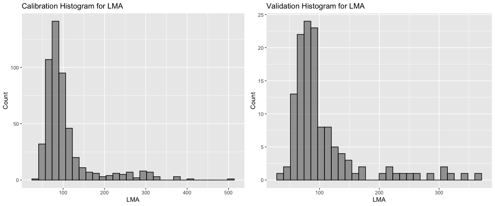
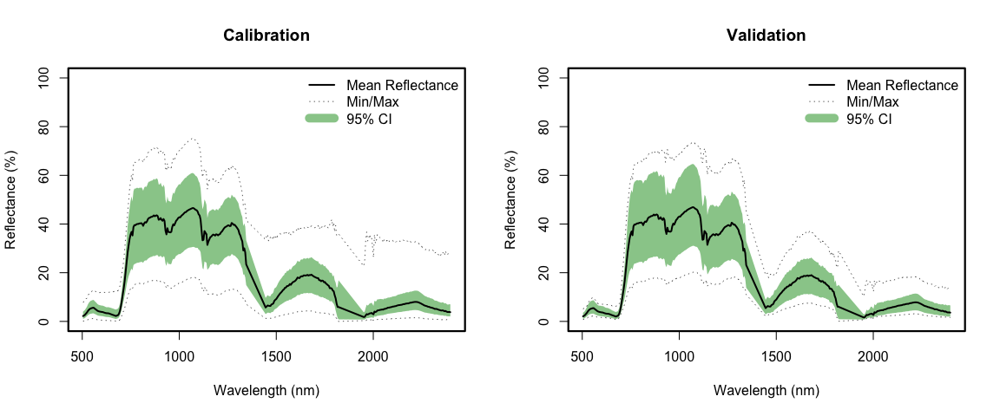
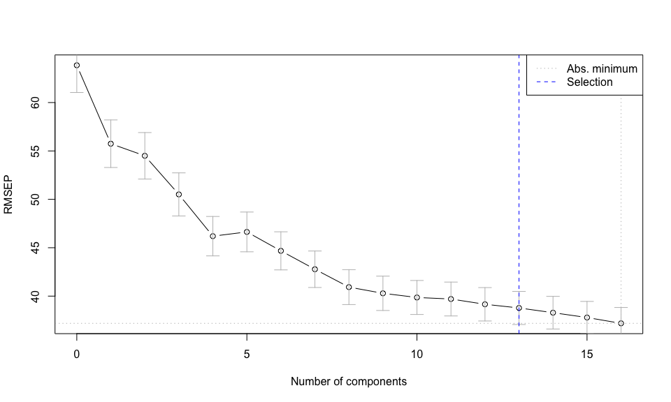
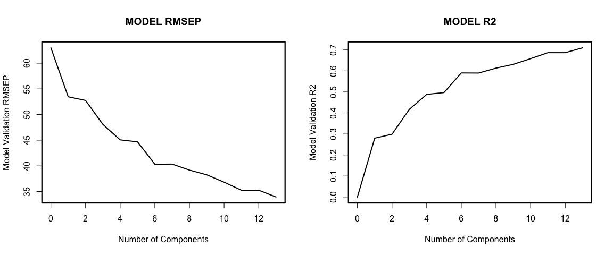
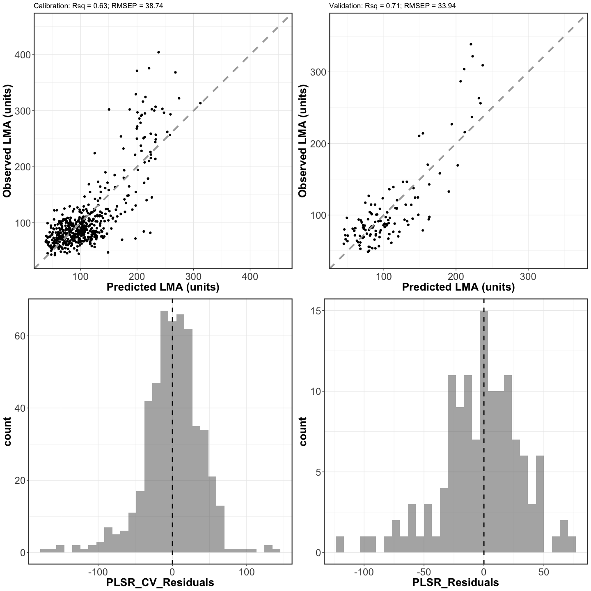
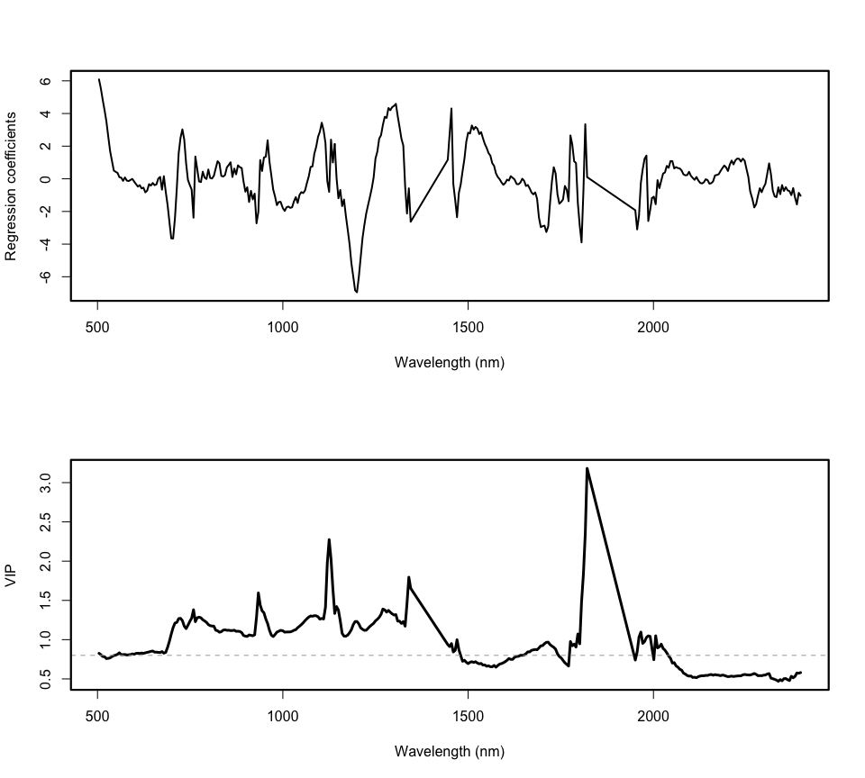
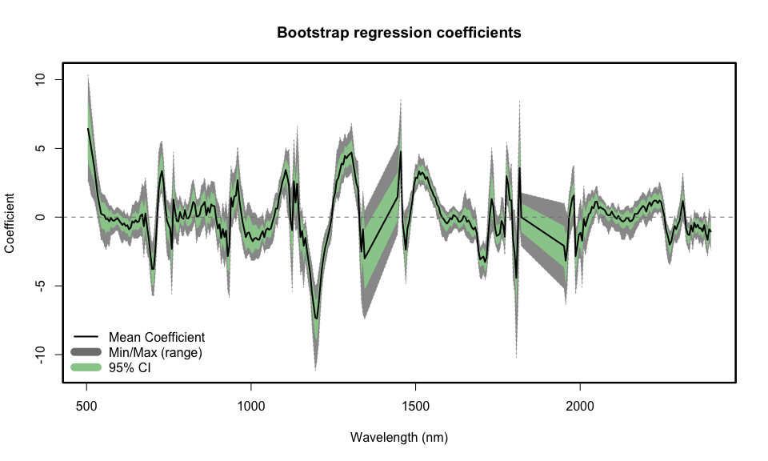
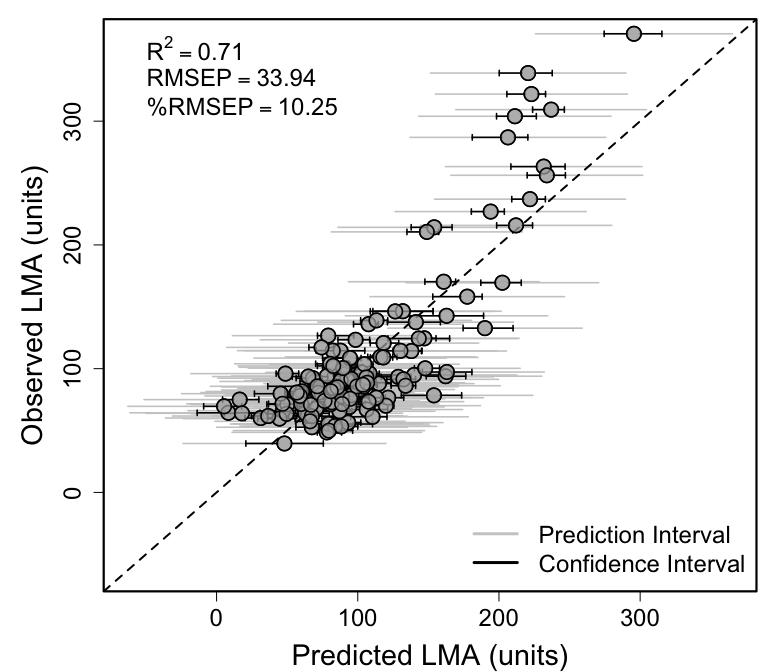

Spectra-trait PLSR example using NEON AOP pixel spectra and
field-sampled leaf nitrogen content from CONUS NEON sites
================
Shawn P. Serbin, Julien Lamour, & Jeremiah Anderson
2024-06-19

### Overview

This is an [R Markdown](http://rmarkdown.rstudio.com) Notebook to
illustrate how to develop pixel-scale spectra-trait PLSR models. This
example uses image data from NEON AOP and associated field measurements
of leaf nitrogen content collected across a range of CONUS NEON sites.
For more information refer to the dataset EcoSIS page:
<https://ecosis.org/package/canopy-spectra-to-map-foliar-functional-traits-over-neon-domains-in-eastern-united-states>

### Getting Started

### Load libraries

``` r
list.of.packages <- c("pls","dplyr","here","plotrix","ggplot2","gridExtra","spectratrait")
invisible(lapply(list.of.packages, library, character.only = TRUE))
```

    ## Warning: package 'pls' was built under R version 4.3.1

    ## 
    ## Attaching package: 'pls'

    ## The following object is masked from 'package:stats':
    ## 
    ##     loadings

    ## Warning: package 'dplyr' was built under R version 4.3.1

    ## 
    ## Attaching package: 'dplyr'

    ## The following objects are masked from 'package:stats':
    ## 
    ##     filter, lag

    ## The following objects are masked from 'package:base':
    ## 
    ##     intersect, setdiff, setequal, union

    ## here() starts at /Users/sserbin/Library/CloudStorage/OneDrive-NASA/Data/Github/spectratrait

    ## Warning: package 'plotrix' was built under R version 4.3.1

    ## Warning: package 'ggplot2' was built under R version 4.3.1

    ## 
    ## Attaching package: 'gridExtra'

    ## The following object is masked from 'package:dplyr':
    ## 
    ##     combine

### Setup other functions and options

``` r
### Setup options

# Script options
pls::pls.options(plsralg = "oscorespls")
pls::pls.options("plsralg")
```

    ## $plsralg
    ## [1] "oscorespls"

``` r
# Default par options
opar <- par(no.readonly = T)

# What is the target variable? What is the variable name in the input dataset?
inVar <- "LMA"

# What is the source dataset from EcoSIS?
ecosis_id <- "b9dbf3db-5b9c-4ab2-88c2-26c8b39d0903"

# Specify output directory, output_dir 
# Options: 
# tempdir - use a OS-specified temporary directory 
# user defined PATH - e.g. "~/scratch/PLSR"
output_dir <- "tempdir"
```

### Set working directory (scratch space)

    ## [1] "/private/var/folders/th/fpt_z3417gn8xgply92pvy6r0000gq/T/Rtmprf8pzl"

### Grab data from EcoSIS

``` r
print(paste0("Output directory: ",getwd()))  # check wd
```

    ## [1] "Output directory: /Users/sserbin/Library/CloudStorage/OneDrive-NASA/Data/Github/spectratrait/vignettes"

``` r
dat_raw <- spectratrait::get_ecosis_data(ecosis_id = ecosis_id)
```

    ## [1] "**** Downloading Ecosis data ****"

    ## Downloading data...

    ## Rows: 674 Columns: 459
    ## ── Column specification ────────────────────────────────────────────────────────
    ## Delimiter: ","
    ## chr   (4): Affiliation, PI, Plot_ID, Project
    ## dbl (455): Boron, Calcium, Carbon, Carotenoids_area, Carotenoids_mass, Cellu...
    ## 
    ## ℹ Use `spec()` to retrieve the full column specification for this data.
    ## ℹ Specify the column types or set `show_col_types = FALSE` to quiet this message.
    ## Download complete!

``` r
head(dat_raw)
```

    ## # A tibble: 6 × 459
    ##   Affiliation   Boron Calcium Carbon Carotenoids_area Carotenoids_mass Cellulose
    ##   <chr>         <dbl>   <dbl>  <dbl>            <dbl>            <dbl>     <dbl>
    ## 1 University … 0.0420   24.2    463.             9.19             1.18      221.
    ## 2 University … 0.0361    6.90   558.            10.8              1.17      183.
    ## 3 University … 0.0407   16.7    532.            12.2              1.52      133.
    ## 4 University … 0.0461   13.9    461.             9.16             1.50      220.
    ## 5 University … 0.0401   13.7    510.            11.0              1.53      101.
    ## 6 University … 0.0456   14.5    557.             8.90             1.24      214.
    ## # ℹ 452 more variables: Chlorophylls_area <dbl>, Chlorophylls_mass <dbl>,
    ## #   Copper <dbl>, EWT <dbl>, Fiber <dbl>, Flavonoids <dbl>, LMA <dbl>,
    ## #   Lignin <dbl>, Magnesium <dbl>, Manganese <dbl>, NSC <dbl>, Nitrogen <dbl>,
    ## #   PI <chr>, Phenolics <dbl>, Phosphorus <dbl>, Plot_ID <chr>,
    ## #   Potassium <dbl>, Project <chr>, SLA <dbl>, Sample_Year <dbl>, Starch <dbl>,
    ## #   Sugar <dbl>, Sulfur <dbl>, Water <dbl>, d13C <dbl>, d15N <dbl>,
    ## #   `384` <dbl>, `389` <dbl>, `394` <dbl>, `399` <dbl>, `404` <dbl>, …

``` r
names(dat_raw)[1:40]
```

    ##  [1] "Affiliation"       "Boron"             "Calcium"          
    ##  [4] "Carbon"            "Carotenoids_area"  "Carotenoids_mass" 
    ##  [7] "Cellulose"         "Chlorophylls_area" "Chlorophylls_mass"
    ## [10] "Copper"            "EWT"               "Fiber"            
    ## [13] "Flavonoids"        "LMA"               "Lignin"           
    ## [16] "Magnesium"         "Manganese"         "NSC"              
    ## [19] "Nitrogen"          "PI"                "Phenolics"        
    ## [22] "Phosphorus"        "Plot_ID"           "Potassium"        
    ## [25] "Project"           "SLA"               "Sample_Year"      
    ## [28] "Starch"            "Sugar"             "Sulfur"           
    ## [31] "Water"             "d13C"              "d15N"             
    ## [34] "384"               "389"               "394"              
    ## [37] "399"               "404"               "409"              
    ## [40] "414"

### Create full plsr dataset

``` r
# identify the trait data and other metadata
sample_info <- dat_raw[,names(dat_raw) %notin% seq(300,2600,1)]
head(sample_info)
```

    ## # A tibble: 6 × 33
    ##   Affiliation   Boron Calcium Carbon Carotenoids_area Carotenoids_mass Cellulose
    ##   <chr>         <dbl>   <dbl>  <dbl>            <dbl>            <dbl>     <dbl>
    ## 1 University … 0.0420   24.2    463.             9.19             1.18      221.
    ## 2 University … 0.0361    6.90   558.            10.8              1.17      183.
    ## 3 University … 0.0407   16.7    532.            12.2              1.52      133.
    ## 4 University … 0.0461   13.9    461.             9.16             1.50      220.
    ## 5 University … 0.0401   13.7    510.            11.0              1.53      101.
    ## 6 University … 0.0456   14.5    557.             8.90             1.24      214.
    ## # ℹ 26 more variables: Chlorophylls_area <dbl>, Chlorophylls_mass <dbl>,
    ## #   Copper <dbl>, EWT <dbl>, Fiber <dbl>, Flavonoids <dbl>, LMA <dbl>,
    ## #   Lignin <dbl>, Magnesium <dbl>, Manganese <dbl>, NSC <dbl>, Nitrogen <dbl>,
    ## #   PI <chr>, Phenolics <dbl>, Phosphorus <dbl>, Plot_ID <chr>,
    ## #   Potassium <dbl>, Project <chr>, SLA <dbl>, Sample_Year <dbl>, Starch <dbl>,
    ## #   Sugar <dbl>, Sulfur <dbl>, Water <dbl>, d13C <dbl>, d15N <dbl>

``` r
# spectra matrix
Spectra <- as.matrix(dat_raw[,names(dat_raw) %notin% names(sample_info)])

# set the desired spectra wavelength range to include
Start.wave <- 500
End.wave <- 2400
wv <- seq(Start.wave,End.wave,1)
final_spec <- Spectra[,round(as.numeric(colnames(Spectra))) %in% wv]
colnames(final_spec) <- c(paste0("Wave_",colnames(final_spec)))

## Drop bad spectra data - for canopy-scale reflectance, often the "water band" wavelengths
## are too noisy to use for trait estimation.  Its possible to remove these wavelengths
## prior to model fitting. Its best to first identify which wavelengths to drop
## before attempting PLSR, as these ranges may need to be considered on a case-by-case 
## basis or generalized for multiple datasets
dropwaves <- c(1350:1440, 1826:1946)
final_spec <- final_spec[,colnames(final_spec) %notin% paste0("Wave_",dropwaves)]
wv <- as.numeric(gsub(pattern = "Wave_",replacement = "", x = colnames(final_spec)))

## Drop bad spectra data - for canopy-scale reflectance, often the "water band" wavelengths
## are too noisy to use for trait estimation.  Its possible to remove these wavelengths
## prior to model fitting. Its best to first identify which wavelengths to drop
## before attempting PLSR, as these ranges may need to be considered on a case-by-case 
## basis or generalized for multiple datasets
dropwaves <- c(1350:1440, 1826:1946)
final_spec <- final_spec[,colnames(final_spec) %notin% paste0("Wave_",dropwaves)]
wv <- as.numeric(gsub(pattern = "Wave_",replacement = "", x = colnames(final_spec)))

# assemble example dataset - !!can add more traits here to try developing additional models
sample_info2 <- sample_info %>%
  select(Plot_ID,Sample_Year,SLA,LMA,Nitrogen)
site_plot <- data.frame(matrix(unlist(strsplit(sample_info2$Plot_ID, "_")), 
                               ncol=2, byrow=TRUE))
colnames(site_plot) <- c("Plot_Num","SampleID")
sample_info3 <- data.frame(site_plot,sample_info2)

plsr_data <- data.frame(sample_info3,final_spec*0.01)
rm(sample_info,sample_info2,sample_info3,Spectra, site_plot)
```

#### Example data cleaning.

``` r
# Example data cleaning.  End user needs to do what's appropriate for their 
# data. This may be an iterative process.
# Keep only complete rows of inVar and spec data before fitting
#
plsr_data <- plsr_data %>%  # remove erroneously high values, or "bad spectra"
  filter(Nitrogen<50) %>%
  filter(Wave_859<80) %>%
  filter(Wave_859>15)
plsr_data <- plsr_data[complete.cases(plsr_data[,names(plsr_data) %in% 
                                                  c(inVar,paste0("Wave_",wv))]),]
```

### Create cal/val datasets

``` r
## Make a stratified random sampling in the strata USDA_Species_Code and Domain

method <- "base" #base/dplyr
# base R - a bit slow
# dplyr - much faster
split_data <- spectratrait::create_data_split(dataset=plsr_data, approach=method, split_seed=2356326,
                                              prop=0.8, group_variables="Plot_Num")
```

    ## D02   Cal: 80.46%

    ## D03   Cal: 80.328%

    ## D05   Cal: 80%

    ## D06   Cal: 80.137%

    ## D07   Cal: 79.245%

    ## D08   Cal: 79.817%

    ## D09   Cal: 79.63%

``` r
names(split_data)
```

    ## [1] "cal_data" "val_data"

``` r
cal.plsr.data <- split_data$cal_data
head(cal.plsr.data)[1:8]
```

    ##   Plot_Num SampleID  Plot_ID Sample_Year      SLA      LMA Nitrogen  Wave_504
    ## 2      D02     0002 D02_0002        2017 10.77861 92.77636 27.70598 1.2909576
    ## 3      D02     0003 D02_0003        2017 12.46154 80.24688 34.63999 1.2976806
    ## 5      D02     0005 D02_0005        2017 17.27620 57.88311 26.64623 1.7735714
    ## 6      D02     0006 D02_0006        2017 12.92806 77.35113 20.69437 1.7786337
    ## 7      D02     0007 D02_0007        2017 10.21521 97.89327 28.87526 1.7981043
    ## 8      D02     0008 D02_0008        2017 20.87397 47.90656 33.63137 0.8780127

``` r
val.plsr.data <- split_data$val_data
head(val.plsr.data)[1:8]
```

    ##    Plot_Num SampleID  Plot_ID Sample_Year      SLA      LMA Nitrogen Wave_504
    ## 1       D02     0001 D02_0001        2017 13.66366 73.18685 31.18030 1.467240
    ## 4       D02     0004 D02_0004        2017 16.63205 60.12487 34.54034 1.551933
    ## 16      D02     0016 D02_0016        2017 14.44765 69.21540 22.87740 2.198174
    ## 18      D02     0019 D02_0019        2017 14.47103 69.10360 17.73126 1.961911
    ## 19      D02     0020 D02_0020        2017 18.98522 52.67256 21.32929 1.546430
    ## 20      D02     0021 D02_0021        2017 12.12731 82.45849 29.50256 1.936263

``` r
rm(split_data)

# Datasets:
print(paste("Cal observations: ",dim(cal.plsr.data)[1],sep=""))
```

    ## [1] "Cal observations: 516"

``` r
print(paste("Val observations: ",dim(val.plsr.data)[1],sep=""))
```

    ## [1] "Val observations: 129"

``` r
cal_hist_plot <- ggplot(data = cal.plsr.data, 
                        aes(x = cal.plsr.data[,paste0(inVar)])) + 
  geom_histogram(fill=I("grey50"),col=I("black"),alpha=I(.7)) + 
  labs(title=paste0("Calibration Histogram for ",inVar), x = paste0(inVar), 
       y = "Count")
val_hist_plot <- ggplot(data = val.plsr.data, 
                        aes(x = val.plsr.data[,paste0(inVar)])) +
  geom_histogram(fill=I("grey50"),col=I("black"),alpha=I(.7)) + 
  labs(title=paste0("Validation Histogram for ",inVar), x = paste0(inVar), 
       y = "Count")
histograms <- grid.arrange(cal_hist_plot, val_hist_plot, ncol=2)
```

    ## `stat_bin()` using `bins = 30`. Pick better value with `binwidth`.

    ## `stat_bin()` using `bins = 30`. Pick better value with `binwidth`.

<!-- -->

``` r
ggsave(filename = file.path(outdir,paste0(inVar,"_Cal_Val_Histograms.png")), plot = histograms, 
       device="png", width = 30, 
       height = 12, units = "cm",
       dpi = 300)
# output cal/val data
write.csv(cal.plsr.data,file=file.path(outdir,paste0(inVar,'_Cal_PLSR_Dataset.csv')),
          row.names=FALSE)
write.csv(val.plsr.data,file=file.path(outdir,paste0(inVar,'_Val_PLSR_Dataset.csv')),
          row.names=FALSE)
```

### Create calibration and validation PLSR datasets

``` r
cal_spec <- as.matrix(cal.plsr.data[, which(names(cal.plsr.data) %in% paste0("Wave_",wv))])
cal.plsr.data <- data.frame(cal.plsr.data[, which(names(cal.plsr.data) %notin% paste0("Wave_",wv))],
                            Spectra=I(cal_spec))
head(cal.plsr.data)[1:5]
```

    ##   Plot_Num SampleID  Plot_ID Sample_Year      SLA
    ## 2      D02     0002 D02_0002        2017 10.77861
    ## 3      D02     0003 D02_0003        2017 12.46154
    ## 5      D02     0005 D02_0005        2017 17.27620
    ## 6      D02     0006 D02_0006        2017 12.92806
    ## 7      D02     0007 D02_0007        2017 10.21521
    ## 8      D02     0008 D02_0008        2017 20.87397

``` r
val_spec <- as.matrix(val.plsr.data[, which(names(val.plsr.data) %in% paste0("Wave_",wv))])
val.plsr.data <- data.frame(val.plsr.data[, which(names(val.plsr.data) %notin% paste0("Wave_",wv))],
                            Spectra=I(val_spec))
head(val.plsr.data)[1:5]
```

    ##    Plot_Num SampleID  Plot_ID Sample_Year      SLA
    ## 1       D02     0001 D02_0001        2017 13.66366
    ## 4       D02     0004 D02_0004        2017 16.63205
    ## 16      D02     0016 D02_0016        2017 14.44765
    ## 18      D02     0019 D02_0019        2017 14.47103
    ## 19      D02     0020 D02_0020        2017 18.98522
    ## 20      D02     0021 D02_0021        2017 12.12731

### plot cal and val spectra

``` r
par(mfrow=c(1,2)) # B, L, T, R
spectratrait::f.plot.spec(Z=cal.plsr.data$Spectra,wv=wv,plot_label="Calibration")
spectratrait::f.plot.spec(Z=val.plsr.data$Spectra,wv=wv,plot_label="Validation")
```

<!-- -->

``` r
dev.copy(png,file.path(outdir,paste0(inVar,'_Cal_Val_Spectra.png')), 
         height=2500,width=4900, res=340)
```

    ## quartz_off_screen 
    ##                 3

``` r
dev.off();
```

    ## quartz_off_screen 
    ##                 2

``` r
par(mfrow=c(1,1))
```

### Use permutation to determine optimal number of components

``` r
if(grepl("Windows", sessionInfo()$running)){
  pls.options(parallel = NULL)
} else {
  pls.options(parallel = parallel::detectCores()-1)
}

method <- "pls" #pls, firstPlateau, firstMin
random_seed <- 1245565
seg <- 50
maxComps <- 16
iterations <- 80
prop <- 0.70
if (method=="pls") {
  # pls package approach - faster but estimates more components....
  nComps <- spectratrait::find_optimal_components(dataset=cal.plsr.data, targetVariable=inVar,
                                                  method=method, 
                                                  maxComps=maxComps, seg=seg, 
                                                  random_seed=random_seed)
  print(paste0("*** Optimal number of components: ", nComps))
} else {
  nComps <- spectratrait::find_optimal_components(dataset=cal.plsr.data, targetVariable=inVar,
                                                  method=method, 
                                                  maxComps=maxComps, iterations=iterations, 
                                                  seg=seg, prop=prop, 
                                                  random_seed=random_seed)
}
```

    ## [1] "*** Identifying optimal number of PLSR components ***"
    ## [1] "*** Running PLS permutation test ***"

<!-- -->

    ## [1] "*** Optimal number of components: 13"

``` r
dev.copy(png,file.path(outdir,paste0(paste0(inVar,"_PLSR_Component_Selection.png"))), 
         height=2800, width=3400,  res=340)
```

    ## quartz_off_screen 
    ##                 3

``` r
dev.off();
```

    ## quartz_off_screen 
    ##                 2

### Fit final model

``` r
plsr.out <- plsr(as.formula(paste(inVar,"~","Spectra")),scale=FALSE,ncomp=nComps,validation="LOO",
                 trace=FALSE,data=cal.plsr.data)
fit <- plsr.out$fitted.values[,1,nComps]
pls.options(parallel = NULL)

# External validation fit stats
par(mfrow=c(1,2)) # B, L, T, R
pls::RMSEP(plsr.out, newdata = val.plsr.data)
```

    ## (Intercept)      1 comps      2 comps      3 comps      4 comps      5 comps  
    ##       63.00        53.46        52.75        48.09        45.07        44.69  
    ##     6 comps      7 comps      8 comps      9 comps     10 comps     11 comps  
    ##       40.32        40.35        39.18        38.26        36.82        35.26  
    ##    12 comps     13 comps  
    ##       35.26        33.94

``` r
plot(pls::RMSEP(plsr.out,estimate=c("test"),newdata = val.plsr.data), main="MODEL RMSEP",
     xlab="Number of Components",ylab="Model Validation RMSEP",lty=1,col="black",cex=1.5,lwd=2)
box(lwd=2.2)

R2(plsr.out, newdata = val.plsr.data)
```

    ## (Intercept)      1 comps      2 comps      3 comps      4 comps      5 comps  
    ##  -4.712e-05    2.798e-01    2.987e-01    4.173e-01    4.882e-01    4.968e-01  
    ##     6 comps      7 comps      8 comps      9 comps     10 comps     11 comps  
    ##   5.903e-01    5.898e-01    6.132e-01    6.311e-01    6.583e-01    6.867e-01  
    ##    12 comps     13 comps  
    ##   6.867e-01    7.098e-01

``` r
plot(pls::R2(plsr.out,estimate=c("test"),newdata = val.plsr.data), main="MODEL R2",
     xlab="Number of Components",ylab="Model Validation R2",lty=1,col="black",cex=1.5,lwd=2)
box(lwd=2.2)
```

<!-- -->

``` r
dev.copy(png,file.path(outdir,paste0(paste0(inVar,"_Validation_RMSEP_R2_by_Component.png"))), 
         height=2800, width=4800,  res=340)
```

    ## quartz_off_screen 
    ##                 3

``` r
dev.off();
```

    ## quartz_off_screen 
    ##                 2

``` r
par(opar)
```

### PLSR fit observed vs. predicted plot data

``` r
#calibration
cal.plsr.output <- data.frame(cal.plsr.data[, which(names(cal.plsr.data) %notin% "Spectra")], 
                              PLSR_Predicted=fit,
                              PLSR_CV_Predicted=as.vector(plsr.out$validation$pred[,,nComps]))
cal.plsr.output <- cal.plsr.output %>%
  mutate(PLSR_CV_Residuals = PLSR_CV_Predicted-get(inVar))
head(cal.plsr.output)
```

    ##   Plot_Num SampleID  Plot_ID Sample_Year      SLA      LMA Nitrogen
    ## 2      D02     0002 D02_0002        2017 10.77861 92.77636 27.70598
    ## 3      D02     0003 D02_0003        2017 12.46154 80.24688 34.63999
    ## 5      D02     0005 D02_0005        2017 17.27620 57.88311 26.64623
    ## 6      D02     0006 D02_0006        2017 12.92806 77.35113 20.69437
    ## 7      D02     0007 D02_0007        2017 10.21521 97.89327 28.87526
    ## 8      D02     0008 D02_0008        2017 20.87397 47.90656 33.63137
    ##   PLSR_Predicted PLSR_CV_Predicted PLSR_CV_Residuals
    ## 2      103.49368         103.69951         10.923148
    ## 3       89.25497          89.41222          9.165342
    ## 5       27.39939          25.44901        -32.434102
    ## 6      100.42843         100.91913         23.568000
    ## 7      118.92179         119.82453         21.931263
    ## 8       71.24724          71.99274         24.086180

``` r
cal.R2 <- round(pls::R2(plsr.out,intercept=F)[[1]][nComps],2)
cal.RMSEP <- round(sqrt(mean(cal.plsr.output$PLSR_CV_Residuals^2)),2)

val.plsr.output <- data.frame(val.plsr.data[, which(names(val.plsr.data) %notin% "Spectra")],
                              PLSR_Predicted=as.vector(predict(plsr.out, 
                                                               newdata = val.plsr.data, 
                                                               ncomp=nComps, type="response")[,,1]))
val.plsr.output <- val.plsr.output %>%
  mutate(PLSR_Residuals = PLSR_Predicted-get(inVar))
head(val.plsr.output)
```

    ##    Plot_Num SampleID  Plot_ID Sample_Year      SLA      LMA Nitrogen
    ## 1       D02     0001 D02_0001        2017 13.66366 73.18685 31.18030
    ## 4       D02     0004 D02_0004        2017 16.63205 60.12487 34.54034
    ## 16      D02     0016 D02_0016        2017 14.44765 69.21540 22.87740
    ## 18      D02     0019 D02_0019        2017 14.47103 69.10360 17.73126
    ## 19      D02     0020 D02_0020        2017 18.98522 52.67256 21.32929
    ## 20      D02     0021 D02_0021        2017 12.12731 82.45849 29.50256
    ##    PLSR_Predicted PLSR_Residuals
    ## 1        88.88277      15.695919
    ## 4        31.24382     -28.881047
    ## 16       72.11545       2.900049
    ## 18       94.05676      24.953162
    ## 19       67.49522      14.822652
    ## 20       84.50151       2.043023

``` r
val.R2 <- round(pls::R2(plsr.out,newdata=val.plsr.data,intercept=F)[[1]][nComps],2)
val.RMSEP <- round(sqrt(mean(val.plsr.output$PLSR_Residuals^2)),2)

rng_quant <- quantile(cal.plsr.output[,inVar], probs = c(0.001, 0.999))
cal_scatter_plot <- ggplot(cal.plsr.output, aes(x=PLSR_CV_Predicted, y=get(inVar))) + 
  theme_bw() + geom_point() + geom_abline(intercept = 0, slope = 1, color="dark grey", 
                                          linetype="dashed", linewidth=1.5) + 
  xlim(rng_quant[1], rng_quant[2]) + 
  ylim(rng_quant[1], rng_quant[2]) +
  labs(x=paste0("Predicted ", paste(inVar), " (units)"),
       y=paste0("Observed ", paste(inVar), " (units)"),
       title=paste0("Calibration: ", paste0("Rsq = ", cal.R2), "; ", paste0("RMSEP = ", 
                                                                            cal.RMSEP))) +
  theme(axis.text=element_text(size=18), legend.position="none",
        axis.title=element_text(size=20, face="bold"), 
        axis.text.x = element_text(angle = 0,vjust = 0.5),
        panel.border = element_rect(linetype = "solid", fill = NA, linewidth=1.5))

cal_resid_histogram <- ggplot(cal.plsr.output, aes(x=PLSR_CV_Residuals)) +
  geom_histogram(alpha=.5, position="identity") + 
  geom_vline(xintercept = 0, color="black", 
             linetype="dashed", linewidth=1) + theme_bw() + 
  theme(axis.text=element_text(size=18), legend.position="none",
        axis.title=element_text(size=20, face="bold"), 
        axis.text.x = element_text(angle = 0,vjust = 0.5),
        panel.border = element_rect(linetype = "solid", fill = NA, linewidth=1.5))

rng_quant <- quantile(val.plsr.output[,inVar], probs = c(0.001, 0.999))
val_scatter_plot <- ggplot(val.plsr.output, aes(x=PLSR_Predicted, y=get(inVar))) + 
  theme_bw() + geom_point() + geom_abline(intercept = 0, slope = 1, color="dark grey", 
                                          linetype="dashed", linewidth=1.5) + 
  xlim(rng_quant[1], rng_quant[2]) + 
  ylim(rng_quant[1], rng_quant[2]) +
  labs(x=paste0("Predicted ", paste(inVar), " (units)"),
       y=paste0("Observed ", paste(inVar), " (units)"),
       title=paste0("Validation: ", paste0("Rsq = ", val.R2), "; ", paste0("RMSEP = ", 
                                                                           val.RMSEP))) +
  theme(axis.text=element_text(size=18), legend.position="none",
        axis.title=element_text(size=20, face="bold"), 
        axis.text.x = element_text(angle = 0,vjust = 0.5),
        panel.border = element_rect(linetype = "solid", fill = NA, linewidth=1.5))

val_resid_histogram <- ggplot(val.plsr.output, aes(x=PLSR_Residuals)) +
  geom_histogram(alpha=.5, position="identity") + 
  geom_vline(xintercept = 0, color="black", 
             linetype="dashed", size=1) + theme_bw() + 
  theme(axis.text=element_text(size=18), legend.position="none",
        axis.title=element_text(size=20, face="bold"), 
        axis.text.x = element_text(angle = 0,vjust = 0.5),
        panel.border = element_rect(linetype = "solid", fill = NA, size=1.5))
```

    ## Warning: Using `size` aesthetic for lines was deprecated in ggplot2 3.4.0.
    ## ℹ Please use `linewidth` instead.
    ## This warning is displayed once every 8 hours.
    ## Call `lifecycle::last_lifecycle_warnings()` to see where this warning was
    ## generated.

    ## Warning: The `size` argument of `element_rect()` is deprecated as of ggplot2 3.4.0.
    ## ℹ Please use the `linewidth` argument instead.
    ## This warning is displayed once every 8 hours.
    ## Call `lifecycle::last_lifecycle_warnings()` to see where this warning was
    ## generated.

``` r
# plot cal/val side-by-side
scatterplots <- grid.arrange(cal_scatter_plot, val_scatter_plot, cal_resid_histogram, 
                             val_resid_histogram, nrow=2,ncol=2)
```

    ## Warning: Removed 22 rows containing missing values or values outside the scale range
    ## (`geom_point()`).

    ## Warning: Removed 8 rows containing missing values or values outside the scale range
    ## (`geom_point()`).

    ## `stat_bin()` using `bins = 30`. Pick better value with `binwidth`.
    ## `stat_bin()` using `bins = 30`. Pick better value with `binwidth`.

<!-- -->

``` r
ggsave(filename = file.path(outdir,paste0(inVar,"_Cal_Val_Scatterplots.png")), 
       plot = scatterplots, device="png", width = 32, height = 30, units = "cm",
       dpi = 300)
```

### Generate Coefficient and VIP plots

``` r
vips <- spectratrait::VIP(plsr.out)[nComps,]

par(mfrow=c(2,1))
plot(plsr.out$coefficients[,,nComps], x=wv,xlab="Wavelength (nm)",
     ylab="Regression coefficients",lwd=2,type='l')
box(lwd=2.2)
plot(wv, vips, xlab="Wavelength (nm)",ylab="VIP",cex=0.01)
lines(wv, vips, lwd=3)
abline(h=0.8, lty=2, col="dark grey")
box(lwd=2.2)
```

<!-- -->

``` r
dev.copy(png, file.path(outdir, paste0(inVar,'_Coefficient_VIP_plot.png')), 
         height=3100, width=4100, res=340)
```

    ## quartz_off_screen 
    ##                 3

``` r
dev.off();
```

    ## quartz_off_screen 
    ##                 2

``` r
par(opar)
```

### Bootstrap validation

    ## [1] "*** Running permutation test.  Please hang tight, this can take awhile ***"
    ## [1] "Options:"
    ## [1] "Max Components: 13 Iterations: 500 Data Proportion (percent): 70"
    ## [1] "*** Providing PRESS and coefficient array output ***"

    ##    Plot_Num SampleID  Plot_ID Sample_Year      SLA      LMA Nitrogen
    ## 1       D02     0001 D02_0001        2017 13.66366 73.18685 31.18030
    ## 4       D02     0004 D02_0004        2017 16.63205 60.12487 34.54034
    ## 16      D02     0016 D02_0016        2017 14.44765 69.21540 22.87740
    ## 18      D02     0019 D02_0019        2017 14.47103 69.10360 17.73126
    ## 19      D02     0020 D02_0020        2017 18.98522 52.67256 21.32929
    ## 20      D02     0021 D02_0021        2017 12.12731 82.45849 29.50256
    ##    PLSR_Predicted PLSR_Residuals      LCI       UCI          LPI      UPI
    ## 1        88.88277      15.695919 80.31958  94.78715  21.91528946 155.8502
    ## 4        31.24382     -28.881047 20.11453  40.56775 -36.24765589  98.7353
    ## 16       72.11545       2.900049 56.63684  79.25216   4.53409981 139.6968
    ## 18       94.05676      24.953162 83.62375 101.86102  26.84773695 161.2658
    ## 19       67.49522      14.822652 56.21051  78.44636   0.01292422 134.9775
    ## 20       84.50151       2.043023 67.56962  96.22524  16.47738989 152.5256

### Jackknife coefficient plot

``` r
spectratrait::f.plot.coef(Z = t(bootstrap_coef), wv = wv, 
                          plot_label="Bootstrap regression coefficients", 
                          position = 'bottomleft')
abline(h=0,lty=2,col="grey50")
box(lwd=2.2)
```

<!-- -->

``` r
dev.copy(png,file.path(outdir,paste0(inVar,'_Bootstrap_Regression_Coefficients.png')), 
         height=2100, width=3800, res=340)
```

    ## quartz_off_screen 
    ##                 3

``` r
dev.off();
```

    ## quartz_off_screen 
    ##                 2

### Bootstrap validation plot

``` r
rmsep_percrmsep <- spectratrait::percent_rmse(plsr_dataset = val.plsr.output, 
                                              inVar = inVar, 
                                              residuals = val.plsr.output$PLSR_Residuals, 
                                              range="full")
RMSEP <- rmsep_percrmsep$rmse
perc_RMSEP <- rmsep_percrmsep$perc_rmse
r2 <- round(pls::R2(plsr.out, newdata = val.plsr.data, intercept=F)$val[nComps],2)
expr <- vector("expression", 3)
expr[[1]] <- bquote(R^2==.(r2))
expr[[2]] <- bquote(RMSEP==.(round(RMSEP,2)))
expr[[3]] <- bquote("%RMSEP"==.(round(perc_RMSEP,2)))
rng_vals <- c(min(val.plsr.output$LPI), max(val.plsr.output$UPI))
par(mfrow=c(1,1), mar=c(4.2,5.3,1,0.4), oma=c(0, 0.1, 0, 0.2))
plotrix::plotCI(val.plsr.output$PLSR_Predicted,val.plsr.output[,inVar], 
                li=val.plsr.output$LPI, ui=val.plsr.output$UPI, gap=0.009,sfrac=0.000, 
                lwd=1.6, xlim=c(rng_vals[1], rng_vals[2]), ylim=c(rng_vals[1], rng_vals[2]), 
                err="x", pch=21, col="black", pt.bg=scales::alpha("grey70",0.7), scol="grey80",
                cex=2, xlab=paste0("Predicted ", paste(inVar), " (units)"),
                ylab=paste0("Observed ", paste(inVar), " (units)"),
                cex.axis=1.5,cex.lab=1.8)
abline(0,1,lty=2,lw=2)
plotrix::plotCI(val.plsr.output$PLSR_Predicted,val.plsr.output[,inVar], 
                li=val.plsr.output$LCI, ui=val.plsr.output$UCI, gap=0.009,sfrac=0.004, 
                lwd=1.6, xlim=c(rng_vals[1], rng_vals[2]), ylim=c(rng_vals[1], rng_vals[2]), 
                err="x", pch=21, col="black", pt.bg=scales::alpha("grey70",0.7), scol="black",
                cex=2, xlab=paste0("Predicted ", paste(inVar), " (units)"),
                ylab=paste0("Observed ", paste(inVar), " (units)"),
                cex.axis=1.5,cex.lab=1.8, add=T)
legend("topleft", legend=expr, bty="n", cex=1.5)
legend("bottomright", legend=c("Prediction Interval","Confidence Interval"), 
       lty=c(1,1), col = c("grey80","black"), lwd=3, bty="n", cex=1.5)
box(lwd=2.2)
```

<!-- -->

``` r
dev.copy(png,file.path(outdir,paste0(inVar,"_PLSR_Validation_Scatterplot.png")), 
         height=2800, width=3200,  res=340)
```

    ## quartz_off_screen 
    ##                 3

``` r
dev.off();
```

    ## quartz_off_screen 
    ##                 2

### Output bootstrap results

``` r
out.jk.coefs <- data.frame(Iteration=seq(1,length(bootstrap_intercept),1),
                           Intercept=bootstrap_intercept,t(bootstrap_coef))
names(out.jk.coefs) <- c("Iteration","Intercept",paste0("Wave_",wv))
head(out.jk.coefs)[1:6]
```

    ##   Iteration Intercept Wave_504 Wave_509 Wave_514 Wave_519
    ## 1         1  142.6449 5.389061 5.063662 4.549220 3.934070
    ## 2         2  136.3290 5.778862 5.071949 4.480130 3.802164
    ## 3         3  137.9760 6.557700 5.852310 5.098870 4.180933
    ## 4         4  134.0813 4.481368 4.064646 3.625608 3.325396
    ## 5         5  150.0042 4.412705 4.119657 3.758452 3.367088
    ## 6         6  121.3683 7.114084 6.469596 5.689691 4.846154

``` r
write.csv(out.jk.coefs,file=file.path(outdir,paste0(inVar,'_Bootstrap_PLSR_Coefficients.csv')),
          row.names=FALSE)
```

### Create core PLSR outputs

``` r
print(paste("Output directory: ", getwd()))
```

    ## [1] "Output directory:  /Users/sserbin/Library/CloudStorage/OneDrive-NASA/Data/Github/spectratrait/vignettes"

``` r
# Observed versus predicted
write.csv(cal.plsr.output,file=file.path(outdir,
                                         paste0(inVar,'_Observed_PLSR_CV_Pred_',nComps,
                                                'comp.csv')),row.names=FALSE)

# Validation data
write.csv(val.plsr.output,file=file.path(outdir,
                                         paste0(inVar,'_Validation_PLSR_Pred_',nComps,
                                                'comp.csv')),row.names=FALSE)

# Model coefficients
coefs <- coef(plsr.out,ncomp=nComps,intercept=TRUE)
write.csv(coefs,file=file.path(outdir,paste0(inVar,'_PLSR_Coefficients_',
                                             nComps,'comp.csv')),
          row.names=TRUE)

# PLSR VIP
write.csv(vips,file=file.path(outdir,paste0(inVar,
                                            '_PLSR_VIPs_',nComps,
                                            'comp.csv')))
```

### Confirm files were written to temp space

``` r
print("**** PLSR output files: ")
```

    ## [1] "**** PLSR output files: "

``` r
print(list.files(outdir)[grep(pattern = inVar, 
                               list.files(outdir))])
```

    ##  [1] "LMA_Bootstrap_PLSR_Coefficients.csv"      
    ##  [2] "LMA_Bootstrap_Regression_Coefficients.png"
    ##  [3] "LMA_Cal_PLSR_Dataset.csv"                 
    ##  [4] "LMA_Cal_Val_Histograms.png"               
    ##  [5] "LMA_Cal_Val_Scatterplots.png"             
    ##  [6] "LMA_Cal_Val_Spectra.png"                  
    ##  [7] "LMA_Coefficient_VIP_plot.png"             
    ##  [8] "LMA_Observed_PLSR_CV_Pred_13comp.csv"     
    ##  [9] "LMA_PLSR_Coefficients_13comp.csv"         
    ## [10] "LMA_PLSR_Component_Selection.png"         
    ## [11] "LMA_PLSR_Validation_Scatterplot.png"      
    ## [12] "LMA_PLSR_VIPs_13comp.csv"                 
    ## [13] "LMA_Val_PLSR_Dataset.csv"                 
    ## [14] "LMA_Validation_PLSR_Pred_13comp.csv"      
    ## [15] "LMA_Validation_RMSEP_R2_by_Component.png"
