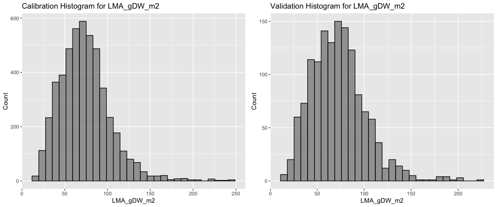
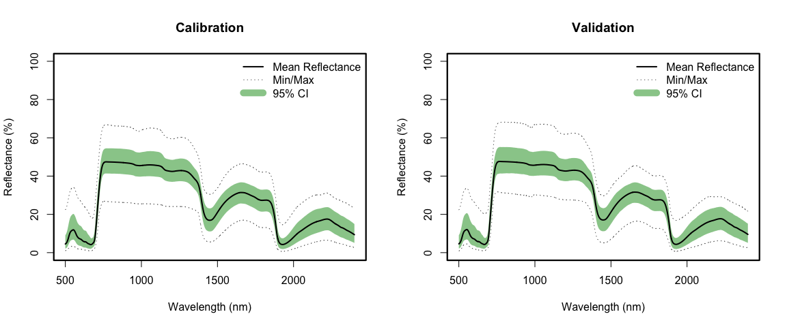
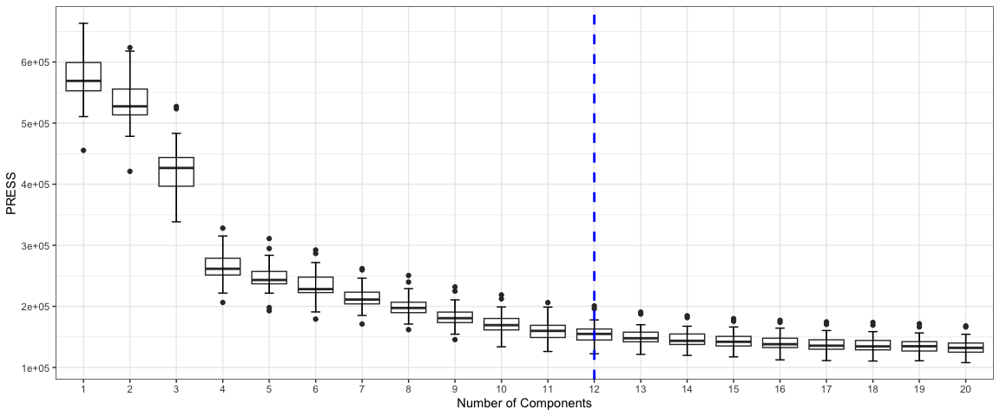
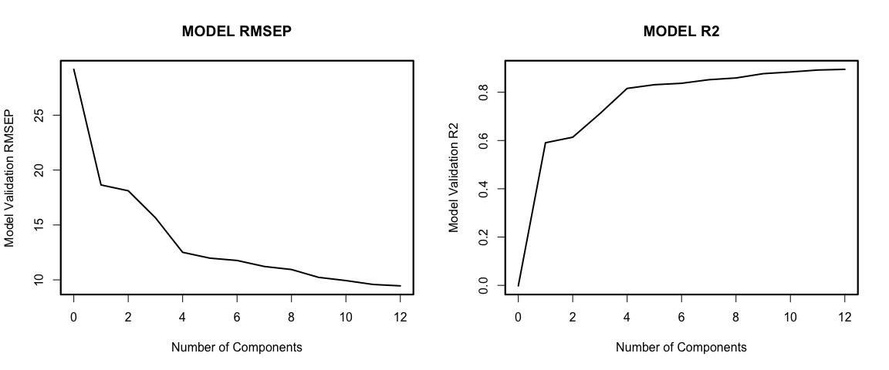
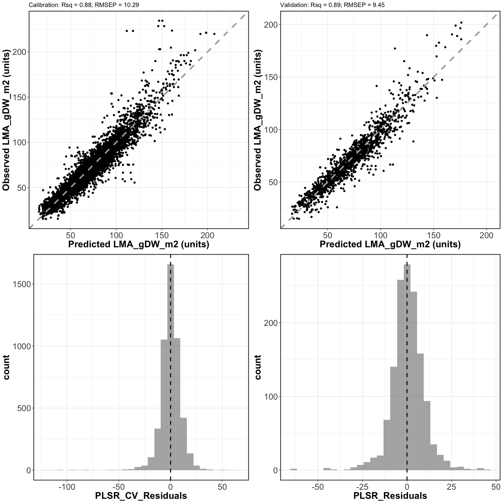
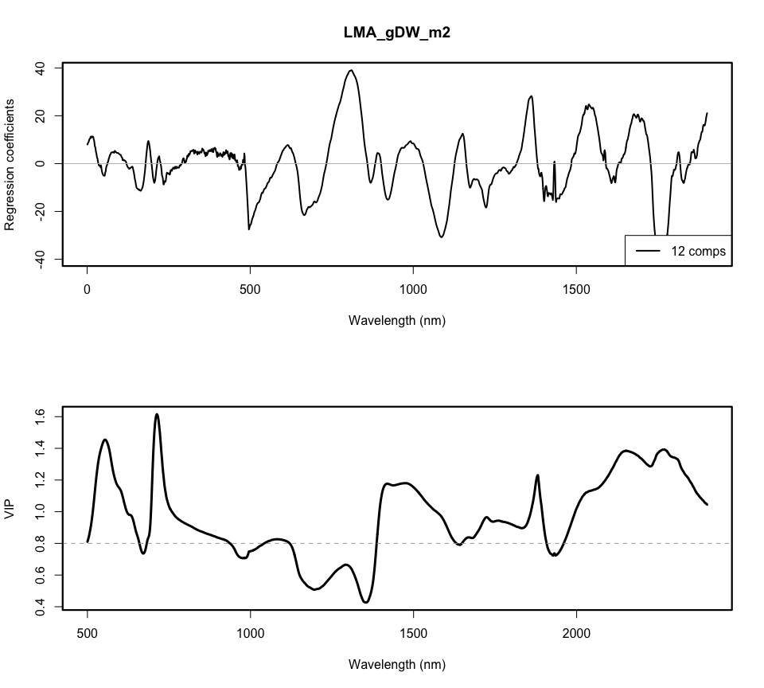
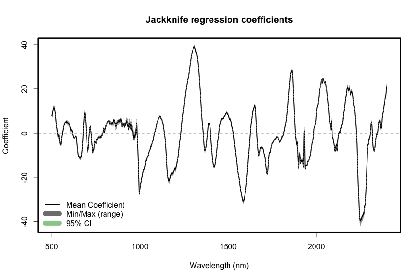

Spectra-trait PLSR example using leaf-level spectra and leaf mass per
area (LMA) data from CONUS NEON sites
================
Shawn P. Serbin, Julien Lamour, & Jeremiah Anderson
2025-10-29

### Overview

This is an [R Markdown](http://rmarkdown.rstudio.com) Notebook to
illustrate how to retrieve a dataset from the EcoSIS spectral database,
choose the “optimal” number of plsr components, and fit a plsr model for
leaf-mass area (LMA)

### Getting Started

### Load libraries

``` r
list.of.packages <- c("pls","dplyr","here","plotrix","ggplot2","gridExtra","spectratrait")
invisible(lapply(list.of.packages, library, character.only = TRUE))
```

    ## 
    ## Attaching package: 'pls'

    ## The following object is masked from 'package:stats':
    ## 
    ##     loadings

    ## 
    ## Attaching package: 'dplyr'

    ## The following objects are masked from 'package:stats':
    ## 
    ##     filter, lag

    ## The following objects are masked from 'package:base':
    ## 
    ##     intersect, setdiff, setequal, union

    ## here() starts at /Users/sserbin/Data/Github/spectratrait

    ## 
    ## Attaching package: 'gridExtra'

    ## The following object is masked from 'package:dplyr':
    ## 
    ##     combine

### Setup other functions and options

``` r
### Setup options

# Script options
pls::pls.options(plsralg = "oscorespls")
pls::pls.options("plsralg")
```

    ## $plsralg
    ## [1] "oscorespls"

``` r
# Default par options
opar <- par(no.readonly = T)

# What is the target variable?
inVar <- "LMA_gDW_m2"

# What is the source dataset from EcoSIS?
ecosis_id <- "5617da17-c925-49fb-b395-45a51291bd2d"

# Specify output directory, output_dir 
# Options: 
# tempdir - use a OS-specified temporary directory 
# user defined PATH - e.g. "~/scratch/PLSR"
output_dir <- "tempdir"
```

### Set working directory (scratch space)

    ## [1] "/private/var/folders/tq/tydmhlwn1bdf_0pmpcq70r2c0000gn/T/RtmpfHniCC"

### Grab data from EcoSIS

##### URL: <https://ecosis.org/package/fresh-leaf-spectra-to-estimate-lma-over-neon-domains-in-eastern-united-states>

``` r
print(paste0("Output directory: ",getwd()))  # check wd
```

    ## [1] "Output directory: /Users/sserbin/Data/Github/spectratrait/vignettes"

``` r
### Get source dataset from EcoSIS
dat_raw <- spectratrait::get_ecosis_data(ecosis_id = ecosis_id)
```

    ## [1] "**** Downloading Ecosis data ****"

    ## Downloading data...

    ## Rows: 6312 Columns: 2162
    ## ── Column specification ────────────────────────────────────────────────────────
    ## Delimiter: ","
    ## chr   (10): Affiliation, Common Name, Domain, Functional_type, Latin Genus, ...
    ## dbl (2152): LMA, 350, 351, 352, 353, 354, 355, 356, 357, 358, 359, 360, 361,...
    ## 
    ## ℹ Use `spec()` to retrieve the full column specification for this data.
    ## ℹ Specify the column types or set `show_col_types = FALSE` to quiet this message.
    ## Download complete!

``` r
head(dat_raw)
```

    ## # A tibble: 6 × 2,162
    ##   Affiliation           `Common Name` Domain Functional_type   LMA `Latin Genus`
    ##   <chr>                 <chr>         <chr>  <chr>           <dbl> <chr>        
    ## 1 University of Wiscon… black walnut  D02    broadleaf        72.9 Juglans      
    ## 2 University of Wiscon… black walnut  D02    broadleaf        72.9 Juglans      
    ## 3 University of Wiscon… black walnut  D02    broadleaf        60.8 Juglans      
    ## 4 University of Wiscon… black walnut  D02    broadleaf        60.8 Juglans      
    ## 5 University of Wiscon… black walnut  D02    broadleaf        85.9 Juglans      
    ## 6 University of Wiscon… black walnut  D02    broadleaf        85.9 Juglans      
    ## # ℹ 2,156 more variables: `Latin Species` <chr>, PI <chr>, Project <chr>,
    ## #   Sample_ID <chr>, `USDA Symbol` <chr>, `350` <dbl>, `351` <dbl>,
    ## #   `352` <dbl>, `353` <dbl>, `354` <dbl>, `355` <dbl>, `356` <dbl>,
    ## #   `357` <dbl>, `358` <dbl>, `359` <dbl>, `360` <dbl>, `361` <dbl>,
    ## #   `362` <dbl>, `363` <dbl>, `364` <dbl>, `365` <dbl>, `366` <dbl>,
    ## #   `367` <dbl>, `368` <dbl>, `369` <dbl>, `370` <dbl>, `371` <dbl>,
    ## #   `372` <dbl>, `373` <dbl>, `374` <dbl>, `375` <dbl>, `376` <dbl>, …

``` r
names(dat_raw)[1:40]
```

    ##  [1] "Affiliation"     "Common Name"     "Domain"          "Functional_type"
    ##  [5] "LMA"             "Latin Genus"     "Latin Species"   "PI"             
    ##  [9] "Project"         "Sample_ID"       "USDA Symbol"     "350"            
    ## [13] "351"             "352"             "353"             "354"            
    ## [17] "355"             "356"             "357"             "358"            
    ## [21] "359"             "360"             "361"             "362"            
    ## [25] "363"             "364"             "365"             "366"            
    ## [29] "367"             "368"             "369"             "370"            
    ## [33] "371"             "372"             "373"             "374"            
    ## [37] "375"             "376"             "377"             "378"

### Create full plsr dataset

``` r
### Create plsr dataset
Start.wave <- 500
End.wave <- 2400
wv <- seq(Start.wave,End.wave,1)
Spectra <- as.matrix(dat_raw[,names(dat_raw) %in% wv])
colnames(Spectra) <- c(paste0("Wave_",wv))
sample_info <- dat_raw[,names(dat_raw) %notin% seq(350,2500,1)]
head(sample_info)
```

    ## # A tibble: 6 × 11
    ##   Affiliation           `Common Name` Domain Functional_type   LMA `Latin Genus`
    ##   <chr>                 <chr>         <chr>  <chr>           <dbl> <chr>        
    ## 1 University of Wiscon… black walnut  D02    broadleaf        72.9 Juglans      
    ## 2 University of Wiscon… black walnut  D02    broadleaf        72.9 Juglans      
    ## 3 University of Wiscon… black walnut  D02    broadleaf        60.8 Juglans      
    ## 4 University of Wiscon… black walnut  D02    broadleaf        60.8 Juglans      
    ## 5 University of Wiscon… black walnut  D02    broadleaf        85.9 Juglans      
    ## 6 University of Wiscon… black walnut  D02    broadleaf        85.9 Juglans      
    ## # ℹ 5 more variables: `Latin Species` <chr>, PI <chr>, Project <chr>,
    ## #   Sample_ID <chr>, `USDA Symbol` <chr>

``` r
sample_info2 <- sample_info %>%
  select(Domain,Functional_type,Sample_ID,USDA_Species_Code=`USDA Symbol`,LMA_gDW_m2=LMA)
head(sample_info2)
```

    ## # A tibble: 6 × 5
    ##   Domain Functional_type Sample_ID USDA_Species_Code LMA_gDW_m2
    ##   <chr>  <chr>           <chr>     <chr>                  <dbl>
    ## 1 D02    broadleaf       P0001     JUNI                    72.9
    ## 2 D02    broadleaf       L0001     JUNI                    72.9
    ## 3 D02    broadleaf       P0002     JUNI                    60.8
    ## 4 D02    broadleaf       L0002     JUNI                    60.8
    ## 5 D02    broadleaf       P0003     JUNI                    85.9
    ## 6 D02    broadleaf       L0003     JUNI                    85.9

``` r
plsr_data <- data.frame(sample_info2,Spectra)
rm(sample_info,sample_info2,Spectra)
```

### Create cal/val datasets

``` r
### Create cal/val datasets
## Make a stratified random sampling in the strata USDA_Species_Code and Domain

method <- "dplyr" #base/dplyr
# base R - a bit slow
# dplyr - much faster
split_data <- spectratrait::create_data_split(dataset=plsr_data,approach=method, split_seed=2356812, 
                                              prop=0.8, group_variables=c("USDA_Species_Code","Domain"))
names(split_data)
```

    ## [1] "cal_data" "val_data"

``` r
cal.plsr.data <- split_data$cal_data
head(cal.plsr.data)[1:8]
```

    ##   Domain Functional_type Sample_ID USDA_Species_Code LMA_gDW_m2   Wave_500
    ## 1    D08       broadleaf     L2644              ACBA      44.18 0.04170800
    ## 2    D08       broadleaf     L2646              ACBA      41.71 0.05067800
    ## 3    D08       broadleaf     L2645              ACBA      40.66 0.04701700
    ## 4    D08       broadleaf     P2639              ACBA      44.18 0.04125300
    ## 5    D03       broadleaf     P0614              ACFL      52.91 0.03895800
    ## 6    D03       broadleaf     L0609              ACFL      81.67 0.04186169
    ##     Wave_501   Wave_502
    ## 1 0.04208700 0.04283700
    ## 2 0.05087600 0.05153500
    ## 3 0.04718200 0.04766500
    ## 4 0.04150300 0.04247100
    ## 5 0.03915100 0.03956200
    ## 6 0.04217802 0.04258768

``` r
val.plsr.data <- split_data$val_data
head(val.plsr.data)[1:8]
```

    ##    Domain Functional_type Sample_ID USDA_Species_Code LMA_gDW_m2 Wave_500
    ## 3     D02       broadleaf     P0002              JUNI      60.77 0.043758
    ## 12    D02       broadleaf     L0006              JUNI      42.54 0.044338
    ## 13    D02       broadleaf     P0007              QUVE     106.57 0.015643
    ## 19    D02       broadleaf     P0010              PRSE      78.82 0.033019
    ## 21    D02       broadleaf     P0011              PRSE      86.09 0.024819
    ## 28    D02       broadleaf     L0014              PRSE      67.11 0.040095
    ##    Wave_501 Wave_502
    ## 3  0.044171 0.044869
    ## 12 0.044748 0.045294
    ## 13 0.015579 0.015431
    ## 19 0.033102 0.033245
    ## 21 0.024826 0.025045
    ## 28 0.040397 0.040864

``` r
rm(split_data)

# Datasets:
print(paste("Cal observations: ",dim(cal.plsr.data)[1],sep=""))
```

    ## [1] "Cal observations: 4922"

``` r
print(paste("Val observations: ",dim(val.plsr.data)[1],sep=""))
```

    ## [1] "Val observations: 1390"

``` r
cal_hist_plot <- ggplot(data = cal.plsr.data, 
                        aes(x = cal.plsr.data[,paste0(inVar)])) + 
  geom_histogram(fill=I("grey50"),col=I("black"),alpha=I(.7)) + 
  labs(title=paste0("Calibration Histogram for ",inVar), x = paste0(inVar), 
       y = "Count")
val_hist_plot <- ggplot(data = val.plsr.data, 
                        aes(x = val.plsr.data[,paste0(inVar)])) +
  geom_histogram(fill=I("grey50"),col=I("black"),alpha=I(.7)) + 
  labs(title=paste0("Validation Histogram for ",inVar), x = paste0(inVar), 
       y = "Count")
histograms <- grid.arrange(cal_hist_plot, val_hist_plot, ncol=2)
```

    ## `stat_bin()` using `bins = 30`. Pick better value with `binwidth`.
    ## `stat_bin()` using `bins = 30`. Pick better value with `binwidth`.

<!-- -->

``` r
ggsave(filename = file.path(outdir,paste0(inVar,"_Cal_Val_Histograms.png")), 
       plot = histograms, device="png", width = 30, height = 12, units = "cm",
       dpi = 300)
# output cal/val data
write.csv(cal.plsr.data,file=file.path(outdir,paste0(inVar,'_Cal_PLSR_Dataset.csv')),
          row.names=FALSE)
write.csv(val.plsr.data,file=file.path(outdir,paste0(inVar,'_Val_PLSR_Dataset.csv')),
          row.names=FALSE)
```

### Create calibration and validation PLSR datasets

``` r
### Format PLSR data for model fitting 
cal_spec <- as.matrix(cal.plsr.data[, which(names(cal.plsr.data) %in% paste0("Wave_",wv))])
cal.plsr.data <- data.frame(cal.plsr.data[, which(names(cal.plsr.data) %notin% paste0("Wave_",wv))],
                            Spectra=I(cal_spec))
head(cal.plsr.data)[1:5]
```

    ##   Domain Functional_type Sample_ID USDA_Species_Code LMA_gDW_m2
    ## 1    D08       broadleaf     L2644              ACBA      44.18
    ## 2    D08       broadleaf     L2646              ACBA      41.71
    ## 3    D08       broadleaf     L2645              ACBA      40.66
    ## 4    D08       broadleaf     P2639              ACBA      44.18
    ## 5    D03       broadleaf     P0614              ACFL      52.91
    ## 6    D03       broadleaf     L0609              ACFL      81.67

``` r
val_spec <- as.matrix(val.plsr.data[, which(names(val.plsr.data) %in% paste0("Wave_",wv))])
val.plsr.data <- data.frame(val.plsr.data[, which(names(val.plsr.data) %notin% paste0("Wave_",wv))],
                            Spectra=I(val_spec))
head(val.plsr.data)[1:5]
```

    ##    Domain Functional_type Sample_ID USDA_Species_Code LMA_gDW_m2
    ## 3     D02       broadleaf     P0002              JUNI      60.77
    ## 12    D02       broadleaf     L0006              JUNI      42.54
    ## 13    D02       broadleaf     P0007              QUVE     106.57
    ## 19    D02       broadleaf     P0010              PRSE      78.82
    ## 21    D02       broadleaf     P0011              PRSE      86.09
    ## 28    D02       broadleaf     L0014              PRSE      67.11

### plot cal and val spectra

``` r
par(mfrow=c(1,2)) # B, L, T, R
spectratrait::f.plot.spec(Z=cal.plsr.data$Spectra,wv=wv,plot_label="Calibration")
spectratrait::f.plot.spec(Z=val.plsr.data$Spectra,wv=wv,plot_label="Validation")
```

<!-- -->

``` r
dev.copy(png,file.path(outdir,paste0(inVar,'_Cal_Val_Spectra.png')), 
         height=2500,width=4900, res=340)
```

    ## quartz_off_screen 
    ##                 3

``` r
dev.off();
```

    ## quartz_off_screen 
    ##                 2

``` r
par(mfrow=c(1,1))
```

### Use Jackknife permutation to determine optimal number of components

``` r
### Use permutation to determine the optimal number of components
if(grepl("Windows", sessionInfo()$running)){
  pls.options(parallel = NULL)
} else {
  pls.options(parallel = parallel::detectCores()-1)
}

method <- "firstPlateau" #pls, firstPlateau, firstMin
random_seed <- 2356812
seg <- 250
maxComps <- 20
iterations <- 40
prop <- 0.70
if (method=="pls") {
  nComps <- spectratrait::find_optimal_components(dataset=cal.plsr.data, targetVariable=inVar, 
                                                  method=method, 
                                                  maxComps=maxComps, seg=seg, 
                                                  random_seed=random_seed)
  print(paste0("*** Optimal number of components: ", nComps))
} else {
  nComps <- spectratrait::find_optimal_components(dataset=cal.plsr.data, targetVariable=inVar, 
                                                  method=method, 
                                                  maxComps=maxComps, iterations=iterations, 
                                                  seg=seg, prop=prop, 
                                                  random_seed=random_seed)
}
```

    ## [1] "*** Identifying optimal number of PLSR components ***"
    ## [1] "*** Running permutation test.  Please hang tight, this can take awhile ***"
    ## [1] "Options:"
    ## [1] "Max Components: 20 Iterations: 40 Data Proportion (percent): 70"
    ## [1] "*** Providing PRESS and coefficient array output ***"

    ## No id variables; using all as measure variables

    ## [1] "*** Optimal number of components based on t.test: 12"

<!-- -->

``` r
dev.copy(png,file.path(outdir,paste0(paste0(inVar,"_PLSR_Component_Selection.png"))), 
         height=2800, width=3400,  res=340)
```

    ## quartz_off_screen 
    ##                 3

``` r
dev.off();
```

    ## quartz_off_screen 
    ##                 2

### Fit final model

``` r
### Fit final model
segs <- 100
plsr.out <- plsr(as.formula(paste(inVar,"~","Spectra")),scale=FALSE,ncomp=nComps,
                 validation="CV",
                 segments=segs, segment.type="interleaved",trace=FALSE,
                 data=cal.plsr.data)
fit <- plsr.out$fitted.values[,1,nComps]
pls.options(parallel = NULL)

# External validation fit stats
par(mfrow=c(1,2)) # B, L, T, R
pls::RMSEP(plsr.out, newdata = val.plsr.data)
```

    ## (Intercept)      1 comps      2 comps      3 comps      4 comps      5 comps  
    ##      29.174       18.644       18.115       15.657       12.508       11.978  
    ##     6 comps      7 comps      8 comps      9 comps     10 comps     11 comps  
    ##      11.766       11.220       10.941       10.226        9.934        9.580  
    ##    12 comps  
    ##       9.453

``` r
plot(pls::RMSEP(plsr.out,estimate=c("test"),newdata = val.plsr.data), 
     main="MODEL RMSEP",
     xlab="Number of Components",ylab="Model Validation RMSEP",lty=1,col="black",
     cex=1.5,lwd=2)
box(lwd=2.2)

pls::R2(plsr.out, newdata = val.plsr.data)
```

    ## (Intercept)      1 comps      2 comps      3 comps      4 comps      5 comps  
    ##   -0.002151     0.590718     0.613614     0.711350     0.815784     0.831077  
    ##     6 comps      7 comps      8 comps      9 comps     10 comps     11 comps  
    ##    0.836995     0.851779     0.859055     0.876874     0.883790     0.891931  
    ##    12 comps  
    ##    0.894776

``` r
plot(pls::R2(plsr.out,estimate=c("test"),newdata = val.plsr.data), main="MODEL R2",
     xlab="Number of Components",ylab="Model Validation R2",lty=1,col="black",
     cex=1.5,lwd=2)
box(lwd=2.2)
```

<!-- -->

``` r
par(opar)
```

### PLSR fit observed vs. predicted plot data

``` r
#calibration
cal.plsr.output <- data.frame(cal.plsr.data[, which(names(cal.plsr.data) %notin% "Spectra")],
                              PLSR_Predicted=fit,
                              PLSR_CV_Predicted=as.vector(plsr.out$validation$pred[,,nComps]))
cal.plsr.output <- cal.plsr.output %>%
  mutate(PLSR_CV_Residuals = PLSR_CV_Predicted-get(inVar))
head(cal.plsr.output)
```

    ##   Domain Functional_type Sample_ID USDA_Species_Code LMA_gDW_m2 PLSR_Predicted
    ## 1    D08       broadleaf     L2644              ACBA      44.18       53.09004
    ## 2    D08       broadleaf     L2646              ACBA      41.71       44.34166
    ## 3    D08       broadleaf     L2645              ACBA      40.66       46.80029
    ## 4    D08       broadleaf     P2639              ACBA      44.18       50.07397
    ## 5    D03       broadleaf     P0614              ACFL      52.91       64.87644
    ## 6    D03       broadleaf     L0609              ACFL      81.67       96.80924
    ##   PLSR_CV_Predicted PLSR_CV_Residuals
    ## 1          53.10616          8.926162
    ## 2          44.39206          2.682061
    ## 3          46.80108          6.141077
    ## 4          50.16964          5.989638
    ## 5          65.06744         12.157436
    ## 6          96.86793         15.197935

``` r
cal.R2 <- round(pls::R2(plsr.out,intercept=F)[[1]][nComps],2)
cal.RMSEP <- round(sqrt(mean(cal.plsr.output$PLSR_CV_Residuals^2)),2)

val.plsr.output <- data.frame(val.plsr.data[, which(names(val.plsr.data) %notin% "Spectra")],
                              PLSR_Predicted=as.vector(predict(plsr.out, 
                                                               newdata = val.plsr.data, 
                                                               ncomp=nComps, type="response")[,,1]))
val.plsr.output <- val.plsr.output %>%
  mutate(PLSR_Residuals = PLSR_Predicted-get(inVar))
head(val.plsr.output)
```

    ##    Domain Functional_type Sample_ID USDA_Species_Code LMA_gDW_m2 PLSR_Predicted
    ## 3     D02       broadleaf     P0002              JUNI      60.77       64.26860
    ## 12    D02       broadleaf     L0006              JUNI      42.54       41.53156
    ## 13    D02       broadleaf     P0007              QUVE     106.57       99.94629
    ## 19    D02       broadleaf     P0010              PRSE      78.82       89.09997
    ## 21    D02       broadleaf     P0011              PRSE      86.09       84.86398
    ## 28    D02       broadleaf     L0014              PRSE      67.11       67.88234
    ##    PLSR_Residuals
    ## 3       3.4986044
    ## 12     -1.0084424
    ## 13     -6.6237126
    ## 19     10.2799665
    ## 21     -1.2260190
    ## 28      0.7723426

``` r
val.R2 <- round(pls::R2(plsr.out,newdata=val.plsr.data,intercept=F)[[1]][nComps],2)
val.RMSEP <- round(sqrt(mean(val.plsr.output$PLSR_Residuals^2)),2)

rng_quant <- quantile(cal.plsr.output[,inVar], probs = c(0.001, 0.999))
cal_scatter_plot <- ggplot(cal.plsr.output, aes(x=PLSR_CV_Predicted, 
                                                y=get(inVar))) + 
  theme_bw() + geom_point() + geom_abline(intercept = 0, slope = 1, 
                                          color="dark grey", 
                                          linetype="dashed", 
                                          linewidth=1.5) + 
  xlim(rng_quant[1], rng_quant[2]) + 
  ylim(rng_quant[1], rng_quant[2]) +
  labs(x=paste0("Predicted ", paste(inVar), " (units)"),
       y=paste0("Observed ", paste(inVar), " (units)"),
       title=paste0("Calibration: ", paste0("Rsq = ", cal.R2), "; ", 
                    paste0("RMSEP = ", 
                           cal.RMSEP))) +
  theme(axis.text=element_text(size=18), legend.position="none",
        axis.title=element_text(size=20, face="bold"), 
        axis.text.x = element_text(angle = 0,vjust = 0.5),
        panel.border = element_rect(linetype = "solid", 
                                    fill = NA, linewidth=1.5))

cal_resid_histogram <- ggplot(cal.plsr.output, 
                              aes(x=PLSR_CV_Residuals)) +
  geom_histogram(alpha=.5, position="identity") + 
  geom_vline(xintercept = 0, color="black", 
             linetype="dashed", linewidth=1) + theme_bw() + 
  theme(axis.text=element_text(size=18), legend.position="none",
        axis.title=element_text(size=20, face="bold"), 
        axis.text.x = element_text(angle = 0,vjust = 0.5),
        panel.border = element_rect(linetype = "solid", 
                                    fill = NA, linewidth=1.5))

rng_quant <- quantile(val.plsr.output[,inVar], 
                      probs = c(0.001, 0.999))
val_scatter_plot <- ggplot(val.plsr.output, 
                           aes(x=PLSR_Predicted, y=get(inVar))) + 
  theme_bw() + geom_point() + 
  geom_abline(intercept = 0, slope = 1, color="dark grey", 
              linetype="dashed", linewidth=1.5) + 
  xlim(rng_quant[1], rng_quant[2]) + 
  ylim(rng_quant[1], rng_quant[2]) +
  labs(x=paste0("Predicted ", paste(inVar), " (units)"),
       y=paste0("Observed ", paste(inVar), " (units)"),
       title=paste0("Validation: ", paste0("Rsq = ", val.R2), "; ", 
                    paste0("RMSEP = ", 
                           val.RMSEP))) +
  theme(axis.text=element_text(size=18), legend.position="none",
        axis.title=element_text(size=20, face="bold"), 
        axis.text.x = element_text(angle = 0,vjust = 0.5),
        panel.border = element_rect(linetype = "solid", fill = NA, 
                                    linewidth=1.5))

val_resid_histogram <- ggplot(val.plsr.output, aes(x=PLSR_Residuals)) +
  geom_histogram(alpha=.5, position="identity") + 
  geom_vline(xintercept = 0, color="black", 
             linetype="dashed", linewidth=1) + theme_bw() + 
  theme(axis.text=element_text(size=18), legend.position="none",
        axis.title=element_text(size=20, face="bold"), 
        axis.text.x = element_text(angle = 0,vjust = 0.5),
        panel.border = element_rect(linetype = "solid", fill = NA, 
                                    linewidth=1.5))

# plot cal/val side-by-side
scatterplots <- grid.arrange(cal_scatter_plot, val_scatter_plot, cal_resid_histogram, 
                             val_resid_histogram, nrow=2, ncol=2)
```

    ## Warning: Removed 22 rows containing missing values or values outside the scale range
    ## (`geom_point()`).

    ## Warning: Removed 8 rows containing missing values or values outside the scale range
    ## (`geom_point()`).

    ## `stat_bin()` using `bins = 30`. Pick better value with `binwidth`.
    ## `stat_bin()` using `bins = 30`. Pick better value with `binwidth`.

<!-- -->

``` r
ggsave(filename = file.path(outdir,paste0(inVar,"_Cal_Val_scatterplots.png")), 
       plot = scatterplots, device="png", width = 32, height = 30, units = "cm",
       dpi = 300)
```

### Generate Coefficient and VIP plots

``` r
vips <- spectratrait::VIP(plsr.out)[nComps,]

par(mfrow=c(2,1))
plot(plsr.out, plottype = "coef",xlab="Wavelength (nm)",
     ylab="Regression coefficients",legendpos = "bottomright",
     ncomp=nComps,lwd=2)
box(lwd=2.2)
plot(seq(Start.wave,End.wave,1),vips,xlab="Wavelength (nm)",ylab="VIP",cex=0.01)
lines(seq(Start.wave,End.wave,1),vips,lwd=3)
abline(h=0.8,lty=2,col="dark grey")
box(lwd=2.2)
```

<!-- -->

``` r
dev.copy(png,file.path(outdir,paste0(inVar,'_Coefficient_VIP_plot.png')), 
         height=3100, width=4100, res=340)
```

    ## quartz_off_screen 
    ##                 3

``` r
dev.off();
```

    ## quartz_off_screen 
    ##                 2

``` r
par(opar)
```

### Jackknife validation

``` r
if(grepl("Windows", sessionInfo()$running)){
  pls.options(parallel =NULL)
} else {
  pls.options(parallel = parallel::detectCores()-1)
}

seg <- 100
jk.plsr.out <- pls::plsr(as.formula(paste(inVar,"~","Spectra")), scale=FALSE, 
                         center=TRUE, ncomp=nComps, 
                         validation="CV", segments = seg, 
                         segment.type="interleaved", trace=FALSE, 
                         jackknife=TRUE, data=cal.plsr.data)
pls.options(parallel = NULL)

Jackknife_coef <- spectratrait::f.coef.valid(plsr.out = jk.plsr.out, data_plsr = cal.plsr.data, 
                               ncomp = nComps, inVar=inVar)
Jackknife_intercept <- Jackknife_coef[1,,,]
Jackknife_coef <- Jackknife_coef[2:dim(Jackknife_coef)[1],,,]

interval <- c(0.025,0.975)
Jackknife_Pred <- val.plsr.data$Spectra %*% Jackknife_coef + 
  matrix(rep(Jackknife_intercept, length(val.plsr.data[,inVar])), byrow=TRUE, 
         ncol=length(Jackknife_intercept))
Interval_Conf <- apply(X = Jackknife_Pred,MARGIN = 1,
                       FUN = quantile,probs=c(interval[1],interval[2]))
sd_mean <- apply(X = Jackknife_Pred,MARGIN = 1,FUN =sd)
sd_res <- sd(val.plsr.output$PLSR_Residuals)
sd_tot <- sqrt(sd_mean^2+sd_res^2)
val.plsr.output$LCI <- Interval_Conf[1,]
val.plsr.output$UCI <- Interval_Conf[2,]
val.plsr.output$LPI <- val.plsr.output$PLSR_Predicted-1.96*sd_tot
val.plsr.output$UPI <- val.plsr.output$PLSR_Predicted+1.96*sd_tot
head(val.plsr.output)
```

    ##    Domain Functional_type Sample_ID USDA_Species_Code LMA_gDW_m2 PLSR_Predicted
    ## 3     D02       broadleaf     P0002              JUNI      60.77       64.26860
    ## 12    D02       broadleaf     L0006              JUNI      42.54       41.53156
    ## 13    D02       broadleaf     P0007              QUVE     106.57       99.94629
    ## 19    D02       broadleaf     P0010              PRSE      78.82       89.09997
    ## 21    D02       broadleaf     P0011              PRSE      86.09       84.86398
    ## 28    D02       broadleaf     L0014              PRSE      67.11       67.88234
    ##    PLSR_Residuals      LCI       UCI      LPI       UPI
    ## 3       3.4986044 64.14006  64.47482 45.75155  82.78566
    ## 12     -1.0084424 41.40129  41.67150 23.01456  60.04855
    ## 13     -6.6237126 99.82564 100.08886 81.42930 118.46328
    ## 19     10.2799665 88.89305  89.27985 70.58206 107.61787
    ## 21     -1.2260190 84.71755  85.02180 66.34672 103.38124
    ## 28      0.7723426 67.76659  68.07148 49.36518  86.39950

### Jackknife coefficient plot

``` r
spectratrait::f.plot.coef(Z = t(Jackknife_coef), wv = wv, 
            plot_label="Jackknife regression coefficients",position = 'bottomleft')
abline(h=0,lty=2,col="grey50")
box(lwd=2.2)
```

<!-- -->

``` r
dev.copy(png,file.path(outdir,paste0(inVar,'_Jackknife_Regression_Coefficients.png')), 
         height=2100, width=3800, res=340)
```

    ## quartz_off_screen 
    ##                 3

``` r
dev.off();
```

    ## quartz_off_screen 
    ##                 2

### Jackknife validation plot

``` r
rmsep_percrmsep <- spectratrait::percent_rmse(plsr_dataset = val.plsr.output, 
                                              inVar = inVar, 
                                              residuals = val.plsr.output$PLSR_Residuals, 
                                              range="full")
RMSEP <- rmsep_percrmsep$rmse
perc_RMSEP <- rmsep_percrmsep$perc_rmse
r2 <- round(pls::R2(plsr.out, newdata = val.plsr.data, intercept=F)$val[nComps],2)
expr <- vector("expression", 3)
expr[[1]] <- bquote(R^2==.(r2))
expr[[2]] <- bquote(RMSEP==.(round(RMSEP,2)))
expr[[3]] <- bquote("%RMSEP"==.(round(perc_RMSEP,2)))
rng_vals <- c(min(val.plsr.output$LPI), max(val.plsr.output$UPI))
par(mfrow=c(1,1), mar=c(4.2,5.3,1,0.4), oma=c(0, 0.1, 0, 0.2))
plotrix::plotCI(val.plsr.output$PLSR_Predicted,val.plsr.output[,inVar], 
       li=val.plsr.output$LPI, ui=val.plsr.output$UPI, gap=0.009,sfrac=0.004, 
       lwd=1.6, xlim=c(rng_vals[1], rng_vals[2]), ylim=c(rng_vals[1], rng_vals[2]), 
       err="x", pch=21, col="black", pt.bg=scales::alpha("grey70",0.7), scol="grey50",
       cex=2, xlab=paste0("Predicted ", paste(inVar), " (units)"),
       ylab=paste0("Observed ", paste(inVar), " (units)"),
       cex.axis=1.5,cex.lab=1.8)
abline(0,1,lty=2,lw=2)
legend("topleft", legend=expr, bty="n", cex=1.5)
box(lwd=2.2)
```

<!-- -->

``` r
dev.copy(png,file.path(outdir,paste0(inVar,"_PLSR_Validation_Scatterplot.png")), 
         height=2800, width=3200,  res=340)
```

    ## quartz_off_screen 
    ##                 3

``` r
dev.off();
```

    ## quartz_off_screen 
    ##                 2

### Output jackknife results

``` r
out.jk.coefs <- data.frame(Iteration=seq(1,seg,1),
                           Intercept=Jackknife_intercept, 
                           t(Jackknife_coef))
head(out.jk.coefs)[1:6]
```

    ##       Iteration Intercept Wave_500 Wave_501 Wave_502 Wave_503
    ## Seg 1         1  68.80319 7.963544 8.372048 8.732315 8.996706
    ## Seg 2         2  68.33966 9.007372 9.404730 9.711349 9.942219
    ## Seg 3         3  67.96783 7.809066 8.218030 8.589660 8.855073
    ## Seg 4         4  68.56866 7.924350 8.269938 8.602341 8.843661
    ## Seg 5         5  68.06364 7.682055 8.080012 8.388390 8.653853
    ## Seg 6         6  67.73588 7.989043 8.385246 8.743061 8.962190

``` r
write.csv(out.jk.coefs,file=file.path(outdir, 
                                      paste0(inVar,
                                             '_Jackkife_PLSR_Coefficients.csv')),
          row.names=FALSE)
```

### Create core PLSR outputs

``` r
print(paste("Output directory: ", getwd()))
```

    ## [1] "Output directory:  /Users/sserbin/Data/Github/spectratrait/vignettes"

``` r
# Observed versus predicted
write.csv(cal.plsr.output,file=file.path(outdir,
                                         paste0(inVar,'_Observed_PLSR_CV_Pred_',
                                                nComps,'comp.csv')),
          row.names=FALSE)

# Validation data
write.csv(val.plsr.output,file=file.path(outdir,
                                         paste0(inVar,'_Validation_PLSR_Pred_',
                                                nComps,'comp.csv')),
          row.names=FALSE)

# Model coefficients
coefs <- coef(plsr.out,ncomp=nComps,intercept=TRUE)
write.csv(coefs,file=file.path(outdir,
                               paste0(inVar,'_PLSR_Coefficients_',
                                      nComps,'comp.csv')),
          row.names=TRUE)

# PLSR VIP
write.csv(vips,file=file.path(outdir,
                              paste0(inVar,'_PLSR_VIPs_',
                                     nComps,'comp.csv')))
```

### Confirm files were written to temp space

``` r
print("**** PLSR output files: ")
```

    ## [1] "**** PLSR output files: "

``` r
print(list.files(outdir)[grep(pattern = inVar, list.files(outdir))])
```

    ##  [1] "LMA_gDW_m2_Cal_PLSR_Dataset.csv"                 
    ##  [2] "LMA_gDW_m2_Cal_Val_Histograms.png"               
    ##  [3] "LMA_gDW_m2_Cal_Val_scatterplots.png"             
    ##  [4] "LMA_gDW_m2_Cal_Val_Spectra.png"                  
    ##  [5] "LMA_gDW_m2_Coefficient_VIP_plot.png"             
    ##  [6] "LMA_gDW_m2_Jackkife_PLSR_Coefficients.csv"       
    ##  [7] "LMA_gDW_m2_Jackknife_Regression_Coefficients.png"
    ##  [8] "LMA_gDW_m2_Observed_PLSR_CV_Pred_12comp.csv"     
    ##  [9] "LMA_gDW_m2_PLSR_Coefficients_12comp.csv"         
    ## [10] "LMA_gDW_m2_PLSR_Component_Selection.png"         
    ## [11] "LMA_gDW_m2_PLSR_Validation_Scatterplot.png"      
    ## [12] "LMA_gDW_m2_PLSR_VIPs_12comp.csv"                 
    ## [13] "LMA_gDW_m2_Val_PLSR_Dataset.csv"                 
    ## [14] "LMA_gDW_m2_Validation_PLSR_Pred_12comp.csv"
