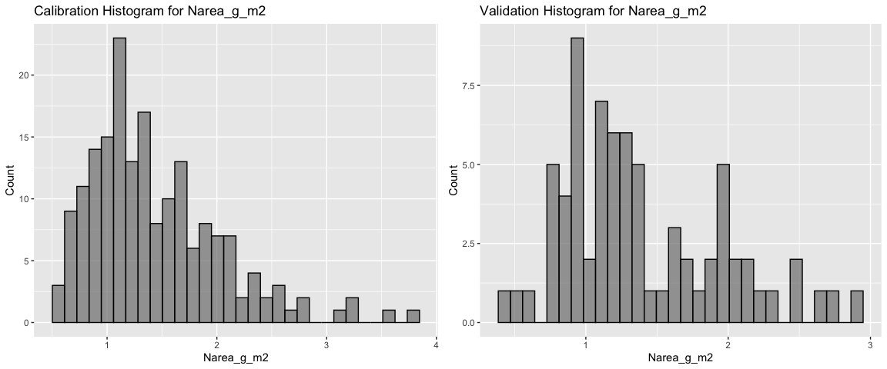
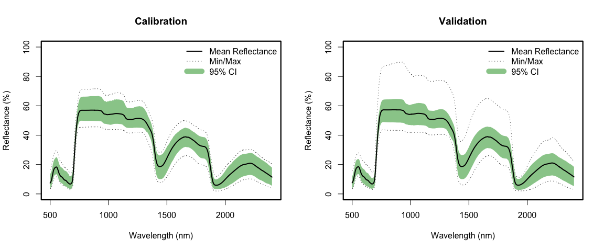
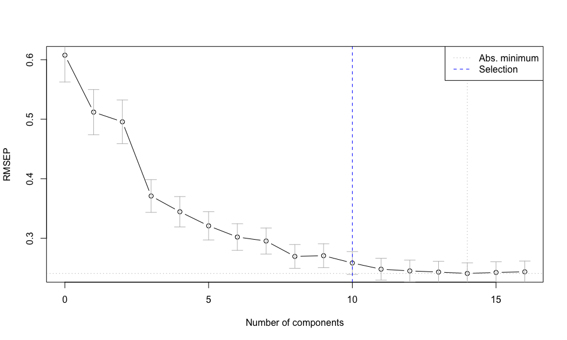
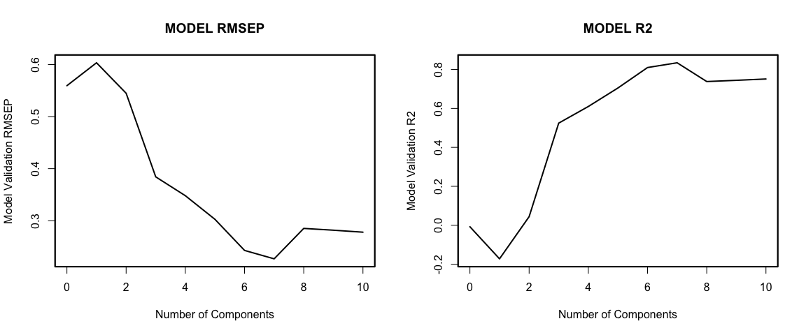
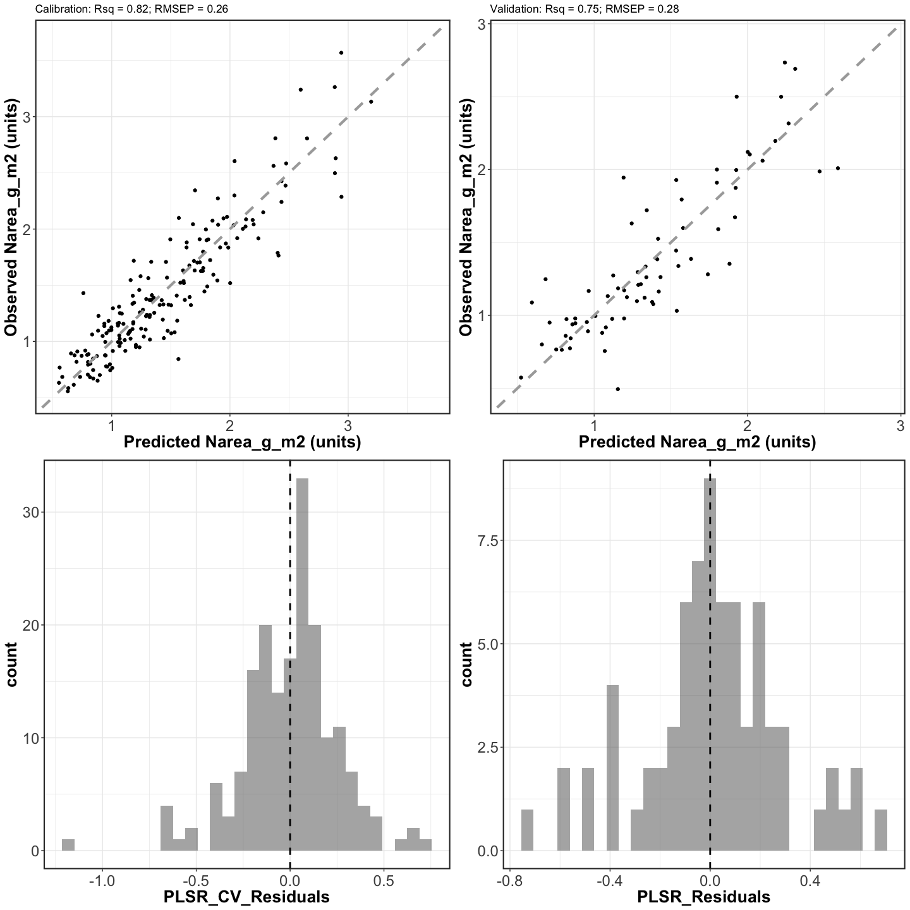
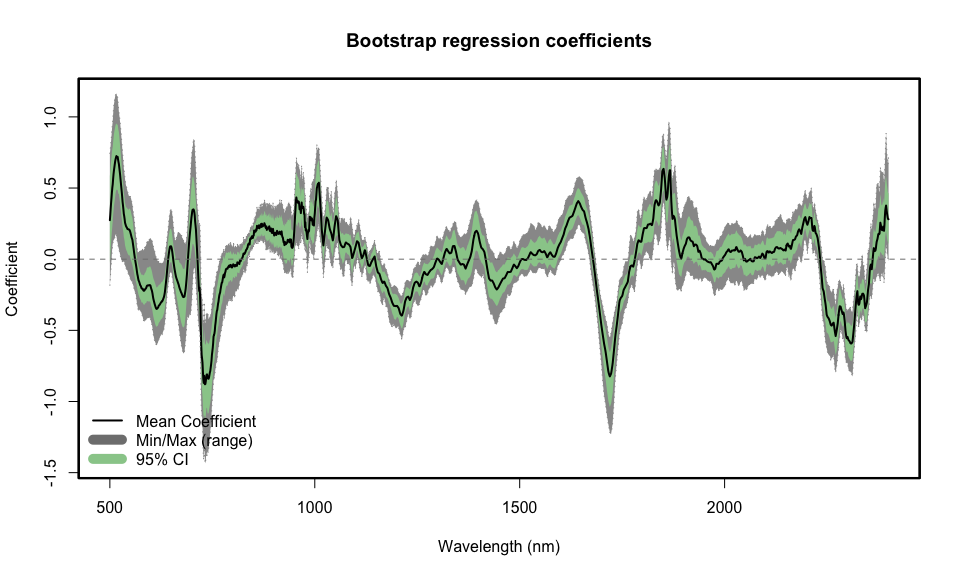
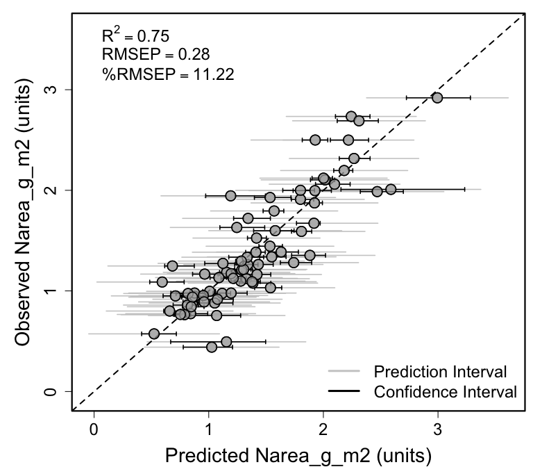

Spectra-trait PLSR example using leaf-level spectra and leaf nitrogen
content (Narea, g/m2) data from 36 species growing in Rosa rugosa
invaded coastal grassland communities in Belgium. Bootstrap validation
example
================
Shawn P. Serbin, Julien Lamour, & Jeremiah Anderson
2022-03-17

### Overview

This is an [R Markdown](http://rmarkdown.rstudio.com) Notebook to
illustrate how to retrieve a dataset from the EcoSIS spectral database,
choose the “optimal” number of plsr components, and fit a plsr model for
leaf nitrogen content (Narea, g/m2)

### Getting Started

### Load libraries

``` r
list.of.packages <- c("pls","dplyr","here","plotrix","ggplot2","gridExtra","spectratrait")
invisible(lapply(list.of.packages, library, character.only = TRUE))
```

    ## 
    ## Attaching package: 'pls'

    ## The following object is masked from 'package:stats':
    ## 
    ##     loadings

    ## Warning: package 'dplyr' was built under R version 4.0.5

    ## 
    ## Attaching package: 'dplyr'

    ## The following objects are masked from 'package:stats':
    ## 
    ##     filter, lag

    ## The following objects are masked from 'package:base':
    ## 
    ##     intersect, setdiff, setequal, union

    ## here() starts at /Users/sserbin/Data/GitHub/spectratrait

    ## 
    ## Attaching package: 'gridExtra'

    ## The following object is masked from 'package:dplyr':
    ## 
    ##     combine

### Setup other functions and options

``` r
### Setup options

# Script options
pls::pls.options(plsralg = "oscorespls")
pls::pls.options("plsralg")
```

    ## $plsralg
    ## [1] "oscorespls"

``` r
# Default par options
opar <- par(no.readonly = T)

# What is the target variable?
inVar <- "Narea_g_m2"

# What is the source dataset from EcoSIS?
ecosis_id <- "9db4c5a2-7eac-4e1e-8859-009233648e89"

# Specify output directory, output_dir 
# Options: 
# tempdir - use a OS-specified temporary directory 
# user defined PATH - e.g. "~/scratch/PLSR"
output_dir <- "tempdir"
```

### Set working directory (scratch space)

    ## [1] "/private/var/folders/xp/h3k9vf3n2jx181ts786_yjrn9c2gjq/T/Rtmp7T2QBK"

### Grab data from EcoSIS

``` r
print(paste0("Output directory: ",getwd()))  # check wd
```

    ## [1] "Output directory: /Users/sserbin/Data/GitHub/spectratrait/vignettes"

``` r
dat_raw <- spectratrait::get_ecosis_data(ecosis_id = ecosis_id)
```

    ## [1] "**** Downloading Ecosis data ****"

    ## Downloading data...

    ## Rows: 256 Columns: 2164
    ## ── Column specification ────────────────────────────────────────────────────────
    ## Delimiter: ","
    ## chr    (4): Latin Species, ids, plot code, species code
    ## dbl (2160): Cw/EWT (cm3/cm2), Leaf area (mm2), Leaf calcium content per leaf...
    ## 
    ## ℹ Use `spec()` to retrieve the full column specification for this data.
    ## ℹ Specify the column types or set `show_col_types = FALSE` to quiet this message.
    ## Download complete!

``` r
head(dat_raw)
```

    ## # A tibble: 6 × 2,164
    ##   `Cw/EWT (cm3/cm2)` `Latin Species`       `Leaf area (mm2)` `Leaf calcium con…`
    ##                <dbl> <chr>                             <dbl>               <dbl>
    ## 1            0.00887 Arrhenatherum elatius              696.              0.0291
    ## 2            0.00824 Bromus sterilis                    447.              0.0230
    ## 3            0.0280  Jacobaea vulgaris                 2418.              0.0950
    ## 4            0.0106  Rubus caesius                     5719.              0.0700
    ## 5            0.00851 Arrhenatherum elatius              671.              0.0286
    ## 6            0.0153  Crepis capillaris                 1401.              0.0470
    ## # … with 2,160 more variables:
    ## #   `Leaf magnesium content per leaf area (mg/mm2)` <dbl>,
    ## #   `Leaf mass per area (g/cm2)` <dbl>,
    ## #   `Leaf nitrogen content per leaf area (mg/mm2)` <dbl>,
    ## #   `Leaf phosphorus content per leaf area (mg/mm2)` <dbl>,
    ## #   `Leaf potassium content per leaf area (mg/mm2)` <dbl>,
    ## #   `Plant height vegetative (cm)` <dbl>, ids <chr>, `plot code` <chr>, …

``` r
names(dat_raw)[1:40]
```

    ##  [1] "Cw/EWT (cm3/cm2)"                              
    ##  [2] "Latin Species"                                 
    ##  [3] "Leaf area (mm2)"                               
    ##  [4] "Leaf calcium content per leaf area (mg/mm2)"   
    ##  [5] "Leaf magnesium content per leaf area (mg/mm2)" 
    ##  [6] "Leaf mass per area (g/cm2)"                    
    ##  [7] "Leaf nitrogen content per leaf area (mg/mm2)"  
    ##  [8] "Leaf phosphorus content per leaf area (mg/mm2)"
    ##  [9] "Leaf potassium content per leaf area (mg/mm2)" 
    ## [10] "Plant height vegetative (cm)"                  
    ## [11] "ids"                                           
    ## [12] "plot code"                                     
    ## [13] "species code"                                  
    ## [14] "350"                                           
    ## [15] "351"                                           
    ## [16] "352"                                           
    ## [17] "353"                                           
    ## [18] "354"                                           
    ## [19] "355"                                           
    ## [20] "356"                                           
    ## [21] "357"                                           
    ## [22] "358"                                           
    ## [23] "359"                                           
    ## [24] "360"                                           
    ## [25] "361"                                           
    ## [26] "362"                                           
    ## [27] "363"                                           
    ## [28] "364"                                           
    ## [29] "365"                                           
    ## [30] "366"                                           
    ## [31] "367"                                           
    ## [32] "368"                                           
    ## [33] "369"                                           
    ## [34] "370"                                           
    ## [35] "371"                                           
    ## [36] "372"                                           
    ## [37] "373"                                           
    ## [38] "374"                                           
    ## [39] "375"                                           
    ## [40] "376"

### Create full plsr dataset

``` r
### Create plsr dataset
Start.wave <- 500
End.wave <- 2400
wv <- seq(Start.wave,End.wave,1)
Spectra <- as.matrix(dat_raw[,names(dat_raw) %in% wv])
colnames(Spectra) <- c(paste0("Wave_",wv))
sample_info <- dat_raw[,names(dat_raw) %notin% seq(350,2500,1)]
head(sample_info)
```

    ## # A tibble: 6 × 13
    ##   `Cw/EWT (cm3/cm2)` `Latin Species`       `Leaf area (mm2)` `Leaf calcium con…`
    ##                <dbl> <chr>                             <dbl>               <dbl>
    ## 1            0.00887 Arrhenatherum elatius              696.              0.0291
    ## 2            0.00824 Bromus sterilis                    447.              0.0230
    ## 3            0.0280  Jacobaea vulgaris                 2418.              0.0950
    ## 4            0.0106  Rubus caesius                     5719.              0.0700
    ## 5            0.00851 Arrhenatherum elatius              671.              0.0286
    ## 6            0.0153  Crepis capillaris                 1401.              0.0470
    ## # … with 9 more variables:
    ## #   `Leaf magnesium content per leaf area (mg/mm2)` <dbl>,
    ## #   `Leaf mass per area (g/cm2)` <dbl>,
    ## #   `Leaf nitrogen content per leaf area (mg/mm2)` <dbl>,
    ## #   `Leaf phosphorus content per leaf area (mg/mm2)` <dbl>,
    ## #   `Leaf potassium content per leaf area (mg/mm2)` <dbl>,
    ## #   `Plant height vegetative (cm)` <dbl>, ids <chr>, `plot code` <chr>, …

``` r
sample_info2 <- sample_info %>%
  select(Plant_Species=`Latin Species`,Species_Code=`species code`,Plot=`plot code`,
         Narea_mg_mm2=`Leaf nitrogen content per leaf area (mg/mm2)`)
sample_info2 <- sample_info2 %>%
#  mutate(Narea_g_m2=Narea_mg_mm2*(0.001/1e-6)) # based on orig units should be this but conversion wrong
  mutate(Narea_g_m2=Narea_mg_mm2*100) # this assumes orig units were g/mm2 or mg/cm2
head(sample_info2)
```

    ## # A tibble: 6 × 5
    ##   Plant_Species         Species_Code Plot  Narea_mg_mm2 Narea_g_m2
    ##   <chr>                 <chr>        <chr>        <dbl>      <dbl>
    ## 1 Arrhenatherum elatius Arrela       DC1        0.0126       1.26 
    ## 2 Bromus sterilis       Broste       DC1        0.00682      0.682
    ## 3 Jacobaea vulgaris     Jacvul       DC1        0.0102       1.02 
    ## 4 Rubus caesius         Rubcae       DC1        0.0121       1.21 
    ## 5 Arrhenatherum elatius Arrela       DC2        0.0117       1.17 
    ## 6 Crepis capillaris     Creves       DC2        0.00877      0.877

``` r
plsr_data <- data.frame(sample_info2,Spectra)
rm(sample_info,sample_info2,Spectra)
```

#### Example data cleaning.

``` r
#### End user needs to do what's appropriate for their data.  
#### This may be an iterative process.
# Keep only complete rows of inVar and spec data before fitting
plsr_data <- plsr_data[complete.cases(plsr_data[,names(plsr_data) %in% 
                                                  c(inVar,paste0("Wave_",wv))]),]
```

### Create cal/val datasets

``` r
### Create cal/val datasets
## Make a stratified random sampling in the strata USDA_Species_Code and Domain

method <- "dplyr" #base/dplyr
# base R - a bit slow
# dplyr - much faster
split_data <- spectratrait::create_data_split(dataset=plsr_data, approach=method, split_seed=1245565, 
                                prop=0.8, group_variables="Species_Code")
names(split_data)
```

    ## [1] "cal_data" "val_data"

``` r
cal.plsr.data <- split_data$cal_data
head(cal.plsr.data)[1:8]
```

    ##        Plant_Species Species_Code Plot Narea_mg_mm2 Narea_g_m2 Wave_500
    ## 1 Ammophila arenaria       Ammare  ZC3   0.03240495   3.240495 0.130885
    ## 2 Ammophila arenaria       Ammare  MC2   0.02806279   2.806279 0.135785
    ## 3 Ammophila arenaria       Ammare  ZC1   0.02041612   2.041612 0.147665
    ## 4 Ammophila arenaria       Ammare  MC1   0.02426549   2.426549 0.142765
    ## 5 Ammophila arenaria       Ammare  WC3   0.02807281   2.807281 0.151750
    ## 6 Ammophila arenaria       Ammare  WR3   0.02286678   2.286678 0.150850
    ##   Wave_501 Wave_502
    ## 1  0.13175 0.132750
    ## 2  0.13685 0.138150
    ## 3  0.14910 0.150330
    ## 4  0.14390 0.145200
    ## 5  0.15275 0.154150
    ## 6  0.15185 0.152815

``` r
val.plsr.data <- split_data$val_data
head(val.plsr.data)[1:8]
```

    ##            Plant_Species Species_Code Plot Narea_mg_mm2 Narea_g_m2   Wave_500
    ## 1  Arrhenatherum elatius       Arrela  DC1   0.01261440   1.261440 0.07066700
    ## 4          Rubus caesius       Rubcae  DC1   0.01208978   1.208978 0.04144907
    ## 8      Jacobaea vulgaris       Jacvul  DC2   0.01185197   1.185197 0.05563100
    ## 11        Carex arenaria       Carare  DC3   0.02103830   2.103830 0.11588500
    ## 14     Jacobaea vulgaris       Jacvul  DC3   0.01121247   1.121247 0.06029327
    ## 19 Oenothera glazioviana       Oengla  DC4   0.01444293   1.444293 0.07391700
    ##      Wave_501  Wave_502
    ## 1  0.07160000 0.0725330
    ## 4  0.04197333 0.0426356
    ## 8  0.05622143 0.0569690
    ## 11 0.11705000 0.1184500
    ## 14 0.06112000 0.0620312
    ## 19 0.07515000 0.0765500

``` r
rm(split_data)

# Datasets:
print(paste("Cal observations: ",dim(cal.plsr.data)[1],sep=""))
```

    ## [1] "Cal observations: 183"

``` r
print(paste("Val observations: ",dim(val.plsr.data)[1],sep=""))
```

    ## [1] "Val observations: 73"

``` r
cal_hist_plot <- qplot(cal.plsr.data[,paste0(inVar)],geom="histogram",
                       main = paste0("Cal. Histogram for ",inVar),
                       xlab = paste0(inVar),ylab = "Count",fill=I("grey50"),col=I("black"),
                       alpha=I(.7))
val_hist_plot <- qplot(val.plsr.data[,paste0(inVar)],geom="histogram",
                       main = paste0("Val. Histogram for ",inVar),
                       xlab = paste0(inVar),ylab = "Count",fill=I("grey50"),col=I("black"),
                       alpha=I(.7))
histograms <- grid.arrange(cal_hist_plot, val_hist_plot, ncol=2)
```

    ## `stat_bin()` using `bins = 30`. Pick better value with `binwidth`.
    ## `stat_bin()` using `bins = 30`. Pick better value with `binwidth`.

<!-- -->

``` r
ggsave(filename = file.path(outdir,paste0(inVar,"_Cal_Val_Histograms.png")), plot = histograms, 
       device="png", width = 30, 
       height = 12, units = "cm",
       dpi = 300)
# output cal/val data
write.csv(cal.plsr.data,file=file.path(outdir,paste0(inVar,'_Cal_PLSR_Dataset.csv')),
          row.names=FALSE)
write.csv(val.plsr.data,file=file.path(outdir,paste0(inVar,'_Val_PLSR_Dataset.csv')),
          row.names=FALSE)
```

### Create calibration and validation PLSR datasets

``` r
### Format PLSR data for model fitting 
cal_spec <- as.matrix(cal.plsr.data[, which(names(cal.plsr.data) %in% paste0("Wave_",wv))])
cal.plsr.data <- data.frame(cal.plsr.data[, which(names(cal.plsr.data) %notin% paste0("Wave_",wv))],
                            Spectra=I(cal_spec))
head(cal.plsr.data)[1:5]
```

    ##        Plant_Species Species_Code Plot Narea_mg_mm2 Narea_g_m2
    ## 1 Ammophila arenaria       Ammare  ZC3   0.03240495   3.240495
    ## 2 Ammophila arenaria       Ammare  MC2   0.02806279   2.806279
    ## 3 Ammophila arenaria       Ammare  ZC1   0.02041612   2.041612
    ## 4 Ammophila arenaria       Ammare  MC1   0.02426549   2.426549
    ## 5 Ammophila arenaria       Ammare  WC3   0.02807281   2.807281
    ## 6 Ammophila arenaria       Ammare  WR3   0.02286678   2.286678

``` r
val_spec <- as.matrix(val.plsr.data[, which(names(val.plsr.data) %in% paste0("Wave_",wv))])
val.plsr.data <- data.frame(val.plsr.data[, which(names(val.plsr.data) %notin% paste0("Wave_",wv))],
                            Spectra=I(val_spec))
head(val.plsr.data)[1:5]
```

    ##            Plant_Species Species_Code Plot Narea_mg_mm2 Narea_g_m2
    ## 1  Arrhenatherum elatius       Arrela  DC1   0.01261440   1.261440
    ## 4          Rubus caesius       Rubcae  DC1   0.01208978   1.208978
    ## 8      Jacobaea vulgaris       Jacvul  DC2   0.01185197   1.185197
    ## 11        Carex arenaria       Carare  DC3   0.02103830   2.103830
    ## 14     Jacobaea vulgaris       Jacvul  DC3   0.01121247   1.121247
    ## 19 Oenothera glazioviana       Oengla  DC4   0.01444293   1.444293

### plot cal and val spectra

``` r
par(mfrow=c(1,2)) # B, L, T, R
spectratrait::f.plot.spec(Z=cal.plsr.data$Spectra,wv=wv,plot_label="Calibration")
spectratrait::f.plot.spec(Z=val.plsr.data$Spectra,wv=wv,plot_label="Validation")
```

<!-- -->

``` r
dev.copy(png,file.path(outdir,paste0(inVar,'_Cal_Val_Spectra.png')), 
         height=2500,width=4900, res=340)
```

    ## quartz_off_screen 
    ##                 3

``` r
dev.off();
```

    ## quartz_off_screen 
    ##                 2

``` r
par(mfrow=c(1,1))
```

### Use permutation to determine optimal number of components

``` r
### Use permutation to determine the optimal number of components
if(grepl("Windows", sessionInfo()$running)){
  pls.options(parallel = NULL)
} else {
  pls.options(parallel = parallel::detectCores()-1)
}

method <- "pls" #pls, firstPlateau, firstMin
random_seed <- 1245565
seg <- 50
maxComps <- 16
iterations <- 80
prop <- 0.70
if (method=="pls") {
  # pls package approach - faster but estimates more components....
  nComps <- spectratrait::find_optimal_components(dataset=cal.plsr.data, targetVariable=inVar, 
                                                  method=method, 
                                                  maxComps=maxComps, seg=seg, 
                                                  random_seed=random_seed)
  print(paste0("*** Optimal number of components: ", nComps))
} else {
  nComps <- spectratrait::find_optimal_components(dataset=cal.plsr.data, targetVariable=inVar,
                                                  method=method,
                                                  maxComps=maxComps, iterations=iterations, 
                                                  seg=seg, prop=prop, 
                                                  random_seed=random_seed)
}
```

    ## [1] "*** Identifying optimal number of PLSR components ***"
    ## [1] "*** Running PLS permutation test ***"

<!-- -->

    ## [1] "*** Optimal number of components: 10"

``` r
dev.copy(png,file.path(outdir,paste0(paste0(inVar,"_PLSR_Component_Selection.png"))), 
         height=2800, width=3400,  res=340)
```

    ## quartz_off_screen 
    ##                 3

``` r
dev.off();
```

    ## quartz_off_screen 
    ##                 2

### Fit final model

``` r
plsr.out <- plsr(as.formula(paste(inVar,"~","Spectra")),scale=FALSE,ncomp=nComps,validation="LOO",
                 trace=FALSE,data=cal.plsr.data)
fit <- plsr.out$fitted.values[,1,nComps]
pls.options(parallel = NULL)

# External validation fit stats
par(mfrow=c(1,2)) # B, L, T, R
pls::RMSEP(plsr.out, newdata = val.plsr.data)
```

    ## (Intercept)      1 comps      2 comps      3 comps      4 comps      5 comps  
    ##      0.5594       0.6034       0.5448       0.3842       0.3481       0.3027  
    ##     6 comps      7 comps      8 comps      9 comps     10 comps  
    ##      0.2429       0.2268       0.2852       0.2818       0.2780

``` r
plot(pls::RMSEP(plsr.out,estimate=c("test"),newdata = val.plsr.data), main="MODEL RMSEP",
     xlab="Number of Components",ylab="Model Validation RMSEP",lty=1,col="black",cex=1.5,lwd=2)
box(lwd=2.2)

pls::R2(plsr.out, newdata = val.plsr.data)
```

    ## (Intercept)      1 comps      2 comps      3 comps      4 comps      5 comps  
    ##   -0.007544    -0.172296     0.044153     0.524579     0.609920     0.704963  
    ##     6 comps      7 comps      8 comps      9 comps     10 comps  
    ##    0.809962     0.834383     0.738093     0.744325     0.751224

``` r
plot(pls::R2(plsr.out,estimate=c("test"),newdata = val.plsr.data), main="MODEL R2",
     xlab="Number of Components",ylab="Model Validation R2",lty=1,col="black",cex=1.5,lwd=2)
box(lwd=2.2)
```

<!-- -->

``` r
dev.copy(png,file.path(outdir,paste0(paste0(inVar,"_Validation_RMSEP_R2_by_Component.png"))), 
         height=2800, width=4800,  res=340)
```

    ## quartz_off_screen 
    ##                 3

``` r
dev.off();
```

    ## quartz_off_screen 
    ##                 2

``` r
par(opar)
```

### PLSR fit observed vs. predicted plot data

``` r
#calibration
cal.plsr.output <- data.frame(cal.plsr.data[, which(names(cal.plsr.data) %notin% "Spectra")],
                              PLSR_Predicted=fit,
                              PLSR_CV_Predicted=as.vector(plsr.out$validation$pred[,,nComps]))
cal.plsr.output <- cal.plsr.output %>%
  mutate(PLSR_CV_Residuals = PLSR_CV_Predicted-get(inVar))
head(cal.plsr.output)
```

    ##        Plant_Species Species_Code Plot Narea_mg_mm2 Narea_g_m2 PLSR_Predicted
    ## 1 Ammophila arenaria       Ammare  ZC3   0.03240495   3.240495       2.672029
    ## 2 Ammophila arenaria       Ammare  MC2   0.02806279   2.806279       2.651863
    ## 3 Ammophila arenaria       Ammare  ZC1   0.02041612   2.041612       2.178056
    ## 4 Ammophila arenaria       Ammare  MC1   0.02426549   2.426549       2.412013
    ## 5 Ammophila arenaria       Ammare  WC3   0.02807281   2.807281       2.452711
    ## 6 Ammophila arenaria       Ammare  WR3   0.02286678   2.286678       2.792340
    ##   PLSR_CV_Predicted PLSR_CV_Residuals
    ## 1          2.598245      -0.642250440
    ## 2          2.652066      -0.154212969
    ## 3          2.200588       0.158975634
    ## 4          2.435784       0.009234491
    ## 5          2.384049      -0.423231444
    ## 6          2.943186       0.656508493

``` r
cal.R2 <- round(pls::R2(plsr.out,intercept=F)[[1]][nComps],2)
cal.RMSEP <- round(sqrt(mean(cal.plsr.output$PLSR_CV_Residuals^2)),2)

val.plsr.output <- data.frame(val.plsr.data[, which(names(val.plsr.data) %notin% "Spectra")],
                              PLSR_Predicted=as.vector(predict(plsr.out, 
                                                               newdata = val.plsr.data, 
                                                               ncomp=nComps, type="response")[,,1]))
val.plsr.output <- val.plsr.output %>%
  mutate(PLSR_Residuals = PLSR_Predicted-get(inVar))
head(val.plsr.output)
```

    ##            Plant_Species Species_Code Plot Narea_mg_mm2 Narea_g_m2
    ## 1  Arrhenatherum elatius       Arrela  DC1   0.01261440   1.261440
    ## 4          Rubus caesius       Rubcae  DC1   0.01208978   1.208978
    ## 8      Jacobaea vulgaris       Jacvul  DC2   0.01185197   1.185197
    ## 11        Carex arenaria       Carare  DC3   0.02103830   2.103830
    ## 14     Jacobaea vulgaris       Jacvul  DC3   0.01121247   1.121247
    ## 19 Oenothera glazioviana       Oengla  DC4   0.01444293   1.444293
    ##    PLSR_Predicted PLSR_Residuals
    ## 1        1.340135     0.07869548
    ## 4        1.288026     0.07904830
    ## 8        1.155840    -0.02935675
    ## 11       2.014712    -0.08911757
    ## 14       1.328742     0.20749565
    ## 19       1.534162     0.08986811

``` r
val.R2 <- round(pls::R2(plsr.out,newdata=val.plsr.data,intercept=F)[[1]][nComps],2)
val.RMSEP <- round(sqrt(mean(val.plsr.output$PLSR_Residuals^2)),2)

rng_quant <- quantile(cal.plsr.output[,inVar], probs = c(0.001, 0.999))
cal_scatter_plot <- ggplot(cal.plsr.output, aes(x=PLSR_CV_Predicted, y=get(inVar))) + 
  theme_bw() + geom_point() + geom_abline(intercept = 0, slope = 1, color="dark grey", 
                                          linetype="dashed", size=1.5) + xlim(rng_quant[1], 
                                                                              rng_quant[2]) + 
  ylim(rng_quant[1], rng_quant[2]) +
  labs(x=paste0("Predicted ", paste(inVar), " (units)"),
       y=paste0("Observed ", paste(inVar), " (units)"),
       title=paste0("Calibration: ", paste0("Rsq = ", cal.R2), "; ", paste0("RMSEP = ", 
                                                                            cal.RMSEP))) +
  theme(axis.text=element_text(size=18), legend.position="none",
        axis.title=element_text(size=20, face="bold"), 
        axis.text.x = element_text(angle = 0,vjust = 0.5),
        panel.border = element_rect(linetype = "solid", fill = NA, size=1.5))

cal_resid_histogram <- ggplot(cal.plsr.output, aes(x=PLSR_CV_Residuals)) +
  geom_histogram(alpha=.5, position="identity") + 
  geom_vline(xintercept = 0, color="black", 
             linetype="dashed", size=1) + theme_bw() + 
  theme(axis.text=element_text(size=18), legend.position="none",
        axis.title=element_text(size=20, face="bold"), 
        axis.text.x = element_text(angle = 0,vjust = 0.5),
        panel.border = element_rect(linetype = "solid", fill = NA, size=1.5))

rng_quant <- quantile(val.plsr.output[,inVar], probs = c(0.001, 0.999))
val_scatter_plot <- ggplot(val.plsr.output, aes(x=PLSR_Predicted, y=get(inVar))) + 
  theme_bw() + geom_point() + geom_abline(intercept = 0, slope = 1, color="dark grey", 
                                          linetype="dashed", size=1.5) + xlim(rng_quant[1], 
                                                                              rng_quant[2]) + 
  ylim(rng_quant[1], rng_quant[2]) +
  labs(x=paste0("Predicted ", paste(inVar), " (units)"),
       y=paste0("Observed ", paste(inVar), " (units)"),
       title=paste0("Validation: ", paste0("Rsq = ", val.R2), "; ", paste0("RMSEP = ", 
                                                                           val.RMSEP))) +
  theme(axis.text=element_text(size=18), legend.position="none",
        axis.title=element_text(size=20, face="bold"), 
        axis.text.x = element_text(angle = 0,vjust = 0.5),
        panel.border = element_rect(linetype = "solid", fill = NA, size=1.5))

val_resid_histogram <- ggplot(val.plsr.output, aes(x=PLSR_Residuals)) +
  geom_histogram(alpha=.5, position="identity") + 
  geom_vline(xintercept = 0, color="black", 
             linetype="dashed", size=1) + theme_bw() + 
  theme(axis.text=element_text(size=18), legend.position="none",
        axis.title=element_text(size=20, face="bold"), 
        axis.text.x = element_text(angle = 0,vjust = 0.5),
        panel.border = element_rect(linetype = "solid", fill = NA, size=1.5))

# plot cal/val side-by-side
scatterplots <- grid.arrange(cal_scatter_plot, val_scatter_plot, cal_resid_histogram, 
                             val_resid_histogram, nrow=2,ncol=2)
```

    ## Warning: Removed 2 rows containing missing values (geom_point).
    ## Removed 2 rows containing missing values (geom_point).

    ## `stat_bin()` using `bins = 30`. Pick better value with `binwidth`.
    ## `stat_bin()` using `bins = 30`. Pick better value with `binwidth`.

<!-- -->

``` r
ggsave(filename = file.path(outdir,paste0(inVar,"_Cal_Val_Scatterplots.png")), 
       plot = scatterplots, device="png", 
       width = 32, 
       height = 30, units = "cm",
       dpi = 300)
```

### Generate Coefficient and VIP plots

``` r
vips <- spectratrait::VIP(plsr.out)[nComps,]
par(mfrow=c(2,1))
plot(plsr.out, plottype = "coef",xlab="Wavelength (nm)",
     ylab="Regression coefficients",legendpos = "bottomright",
     ncomp=nComps,lwd=2)
box(lwd=2.2)
plot(seq(Start.wave,End.wave,1),vips,xlab="Wavelength (nm)",ylab="VIP",cex=0.01)
lines(seq(Start.wave,End.wave,1),vips,lwd=3)
abline(h=0.8,lty=2,col="dark grey")
box(lwd=2.2)
```

<!-- -->

``` r
dev.copy(png,file.path(outdir,paste0(inVar,'_Coefficient_VIP_plot.png')), 
         height=3100, width=4100, res=340)
```

    ## quartz_off_screen 
    ##                 3

``` r
dev.off();
```

    ## quartz_off_screen 
    ##                 2

### Bootstrap validation

``` r
if(grepl("Windows", sessionInfo()$running)){
  pls.options(parallel =NULL)
} else {
  pls.options(parallel = parallel::detectCores()-1)
}

### PLSR bootstrap permutation uncertainty analysis
iterations <- 500    # how many permutation iterations to run
prop <- 0.70          # fraction of training data to keep for each iteration
plsr_permutation <- spectratrait::pls_permutation(dataset=cal.plsr.data, targetVariable=inVar,
                                                  maxComps=nComps, 
                                                  iterations=iterations, prop=prop,
                                                  verbose = FALSE)
```

    ## [1] "*** Running permutation test.  Please hang tight, this can take awhile ***"
    ## [1] "Options:"
    ## [1] "Max Components: 10 Iterations: 500 Data Proportion (percent): 70"
    ## [1] "*** Providing PRESS and coefficient array output ***"

``` r
bootstrap_intercept <- plsr_permutation$coef_array[1,,nComps]
bootstrap_coef <- plsr_permutation$coef_array[2:length(plsr_permutation$coef_array[,1,nComps]),
                                              ,nComps]
rm(plsr_permutation)

# apply coefficients to left-out validation data
interval <- c(0.025,0.975)
Bootstrap_Pred <- val.plsr.data$Spectra %*% bootstrap_coef + 
  matrix(rep(bootstrap_intercept, length(val.plsr.data[,inVar])), byrow=TRUE, 
         ncol=length(bootstrap_intercept))
Interval_Conf <- apply(X = Bootstrap_Pred, MARGIN = 1, FUN = quantile, 
                       probs=c(interval[1], interval[2]))
sd_mean <- apply(X = Bootstrap_Pred, MARGIN = 1, FUN = sd)
sd_res <- sd(val.plsr.output$PLSR_Residuals)
sd_tot <- sqrt(sd_mean^2+sd_res^2)
val.plsr.output$LCI <- Interval_Conf[1,]
val.plsr.output$UCI <- Interval_Conf[2,]
val.plsr.output$LPI <- val.plsr.output$PLSR_Predicted-1.96*sd_tot
val.plsr.output$UPI <- val.plsr.output$PLSR_Predicted+1.96*sd_tot
head(val.plsr.output)
```

    ##            Plant_Species Species_Code Plot Narea_mg_mm2 Narea_g_m2
    ## 1  Arrhenatherum elatius       Arrela  DC1   0.01261440   1.261440
    ## 4          Rubus caesius       Rubcae  DC1   0.01208978   1.208978
    ## 8      Jacobaea vulgaris       Jacvul  DC2   0.01185197   1.185197
    ## 11        Carex arenaria       Carare  DC3   0.02103830   2.103830
    ## 14     Jacobaea vulgaris       Jacvul  DC3   0.01121247   1.121247
    ## 19 Oenothera glazioviana       Oengla  DC4   0.01444293   1.444293
    ##    PLSR_Predicted PLSR_Residuals      LCI      UCI       LPI      UPI
    ## 1        1.340135     0.07869548 1.226834 1.429328 0.7824784 1.897793
    ## 4        1.288026     0.07904830 1.182535 1.382687 0.7308093 1.845242
    ## 8        1.155840    -0.02935675 1.094629 1.236994 0.6033307 1.708349
    ## 11       2.014712    -0.08911757 1.887670 2.098661 1.4570138 2.572411
    ## 14       1.328742     0.20749565 1.278652 1.359115 0.7791767 1.878308
    ## 19       1.534162     0.08986811 1.437618 1.642761 0.9768182 2.091505

### Jackknife coefficient plot

``` r
# Bootstrap regression coefficient plot
spectratrait::f.plot.coef(Z = t(bootstrap_coef), wv = wv, 
            plot_label="Bootstrap regression coefficients",position = 'bottomleft')
abline(h=0,lty=2,col="grey50")
box(lwd=2.2)
```

<!-- -->

``` r
dev.copy(png,file.path(outdir,paste0(inVar,'_Bootstrap_Regression_Coefficients.png')), 
         height=2100, width=3800, res=340)
```

    ## quartz_off_screen 
    ##                 3

``` r
dev.off();
```

    ## quartz_off_screen 
    ##                 2

### Bootstrap validation plot

``` r
rmsep_percrmsep <- spectratrait::percent_rmse(plsr_dataset = val.plsr.output, 
                                              inVar = inVar, 
                                              residuals = val.plsr.output$PLSR_Residuals, 
                                              range="full")
RMSEP <- rmsep_percrmsep$rmse
perc_RMSEP <- rmsep_percrmsep$perc_rmse
r2 <- round(pls::R2(plsr.out, newdata = val.plsr.data,intercept=F)$val[nComps],2)
expr <- vector("expression", 3)
expr[[1]] <- bquote(R^2==.(r2))
expr[[2]] <- bquote(RMSEP==.(round(RMSEP,2)))
expr[[3]] <- bquote("%RMSEP"==.(round(perc_RMSEP,2)))
rng_vals <- c(min(val.plsr.output$LPI), max(val.plsr.output$UPI))
par(mfrow=c(1,1), mar=c(4.2,5.3,1,0.4), oma=c(0, 0.1, 0, 0.2))
plotrix::plotCI(val.plsr.output$PLSR_Predicted,val.plsr.output[,inVar], 
       li=val.plsr.output$LPI, ui=val.plsr.output$UPI, gap=0.009,sfrac=0.000, 
       lwd=1.6, xlim=c(rng_vals[1], rng_vals[2]), ylim=c(rng_vals[1], rng_vals[2]), 
       err="x", pch=21, col="black", pt.bg=scales::alpha("grey70",0.7), scol="grey80",
       cex=2, xlab=paste0("Predicted ", paste(inVar), " (units)"),
       ylab=paste0("Observed ", paste(inVar), " (units)"),
       cex.axis=1.5,cex.lab=1.8)
abline(0,1,lty=2,lw=2)
plotrix::plotCI(val.plsr.output$PLSR_Predicted,val.plsr.output[,inVar], 
       li=val.plsr.output$LCI, ui=val.plsr.output$UCI, gap=0.009,sfrac=0.004, 
       lwd=1.6, xlim=c(rng_vals[1], rng_vals[2]), ylim=c(rng_vals[1], rng_vals[2]), 
       err="x", pch=21, col="black", pt.bg=scales::alpha("grey70",0.7), scol="black",
       cex=2, xlab=paste0("Predicted ", paste(inVar), " (units)"),
       ylab=paste0("Observed ", paste(inVar), " (units)"),
       cex.axis=1.5,cex.lab=1.8, add=T)
legend("topleft", legend=expr, bty="n", cex=1.5)
legend("bottomright", legend=c("Prediction Interval","Confidence Interval"), 
       lty=c(1,1), col = c("grey80","black"), lwd=3, bty="n", cex=1.5)
box(lwd=2.2)
```

<!-- -->

``` r
dev.copy(png,file.path(outdir,paste0(inVar,"_PLSR_Validation_Scatterplot.png")), 
         height=2800, width=3200,  res=340)
```

    ## quartz_off_screen 
    ##                 3

``` r
dev.off();
```

    ## quartz_off_screen 
    ##                 2

### Output bootstrap results

``` r
# Bootstrap Coefficients
out.jk.coefs <- data.frame(Iteration=seq(1,length(bootstrap_intercept),1),
                           Intercept=bootstrap_intercept,t(bootstrap_coef))
names(out.jk.coefs) <- c("Iteration","Intercept",paste0("Wave_",wv))
head(out.jk.coefs)[1:6]
```

    ##   Iteration   Intercept   Wave_500  Wave_501  Wave_502  Wave_503
    ## 1         1 -0.13686765 0.29141489 0.3287594 0.3654695 0.3999712
    ## 2         2 -0.17612080 0.24114488 0.2827001 0.3182992 0.3552505
    ## 3         3  0.34135463 0.21939317 0.2562451 0.2984578 0.3330333
    ## 4         4  0.01511507 0.09404839 0.1299058 0.1792805 0.2240698
    ## 5         5  0.06136605 0.12835311 0.1662322 0.2116938 0.2539193
    ## 6         6  0.10925409 0.28154095 0.3107509 0.3539714 0.3932620

``` r
write.csv(out.jk.coefs,file=file.path(outdir,paste0(inVar,
                                                    '_Bootstrap_PLSR_Coefficients.csv')),
          row.names=FALSE)
```

### Create core PLSR outputs

``` r
print(paste("Output directory: ", outdir))
```

    ## [1] "Output directory:  /var/folders/xp/h3k9vf3n2jx181ts786_yjrn9c2gjq/T//Rtmp7T2QBK"

``` r
# Observed versus predicted
write.csv(cal.plsr.output,file=file.path(outdir,
                                         paste0(inVar,'_Observed_PLSR_CV_Pred_',
                                                nComps,'comp.csv')),
          row.names=FALSE)

# Validation data
write.csv(val.plsr.output,file=file.path(outdir,
                                         paste0(inVar,'_Validation_PLSR_Pred_',
                                                nComps,'comp.csv')),
          row.names=FALSE)

# Model coefficients
coefs <- coef(plsr.out,ncomp=nComps,intercept=TRUE)
write.csv(coefs,file=file.path(outdir,
                               paste0(inVar,'_PLSR_Coefficients_',
                                      nComps,'comp.csv')),
          row.names=TRUE)

# PLSR VIP
write.csv(vips,file=file.path(outdir,
                              paste0(inVar,'_PLSR_VIPs_',
                                     nComps,'comp.csv')))
```

### Confirm files were written to temp space

``` r
print("**** PLSR output files: ")
```

    ## [1] "**** PLSR output files: "

``` r
print(list.files(outdir)[grep(pattern = inVar, list.files(outdir))])
```

    ##  [1] "Narea_g_m2_Bootstrap_PLSR_Coefficients.csv"      
    ##  [2] "Narea_g_m2_Bootstrap_Regression_Coefficients.png"
    ##  [3] "Narea_g_m2_Cal_PLSR_Dataset.csv"                 
    ##  [4] "Narea_g_m2_Cal_Val_Histograms.png"               
    ##  [5] "Narea_g_m2_Cal_Val_Scatterplots.png"             
    ##  [6] "Narea_g_m2_Cal_Val_Spectra.png"                  
    ##  [7] "Narea_g_m2_Coefficient_VIP_plot.png"             
    ##  [8] "Narea_g_m2_Observed_PLSR_CV_Pred_10comp.csv"     
    ##  [9] "Narea_g_m2_PLSR_Coefficients_10comp.csv"         
    ## [10] "Narea_g_m2_PLSR_Component_Selection.png"         
    ## [11] "Narea_g_m2_PLSR_Validation_Scatterplot.png"      
    ## [12] "Narea_g_m2_PLSR_VIPs_10comp.csv"                 
    ## [13] "Narea_g_m2_Val_PLSR_Dataset.csv"                 
    ## [14] "Narea_g_m2_Validation_PLSR_Pred_10comp.csv"      
    ## [15] "Narea_g_m2_Validation_RMSEP_R2_by_Component.png"
