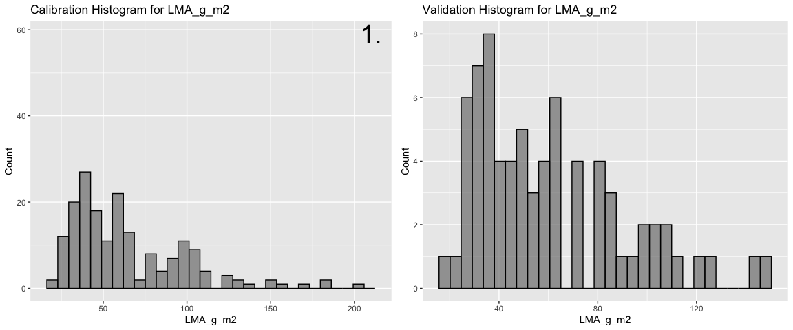
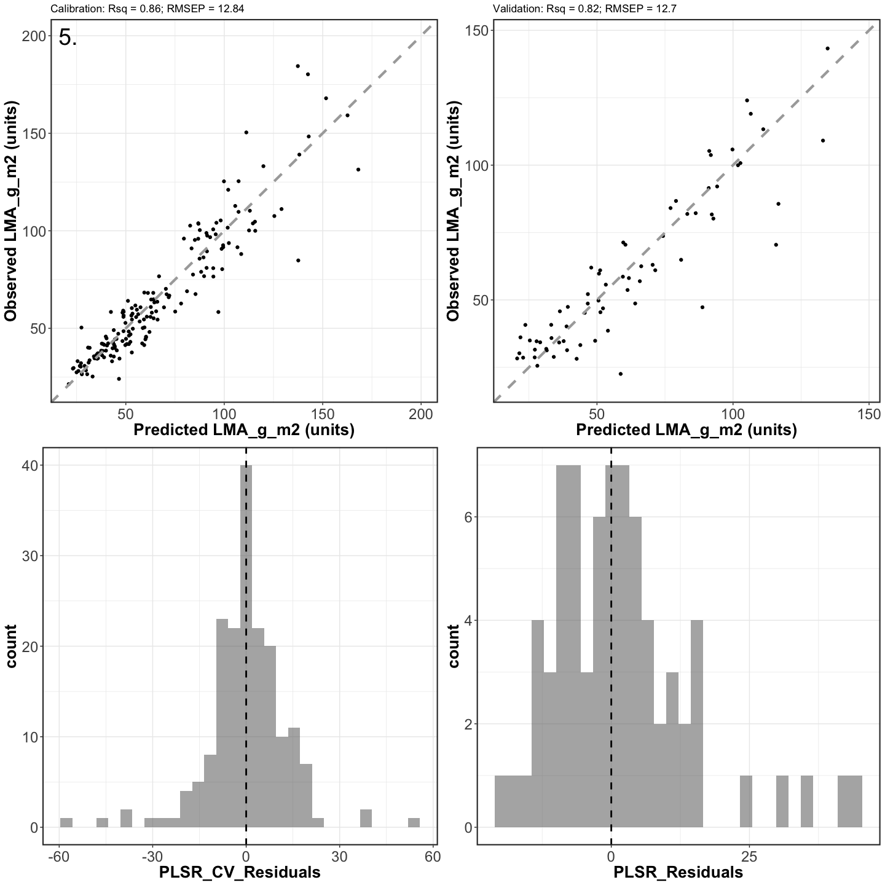
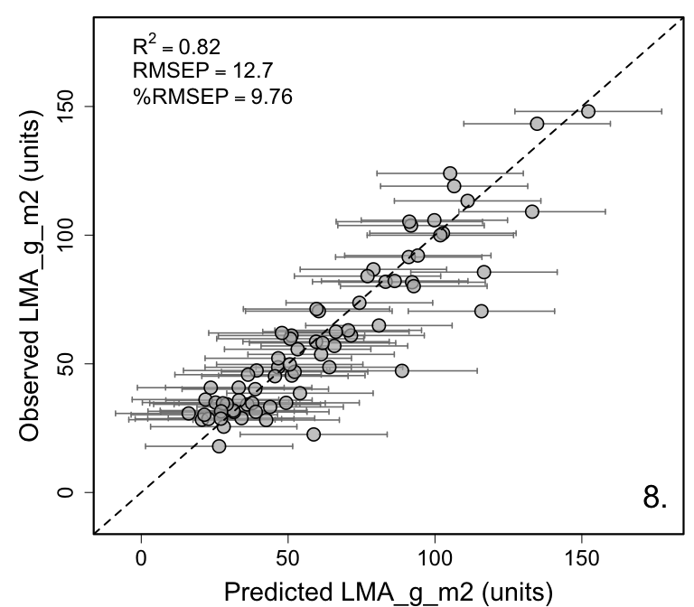

Spectra-trait PLSR example using leaf-level spectra and leaf mass per
area (LMA) data from 36 species growing in Rosa rugosa invaded coastal
grassland communities in Belgium
================
Shawn P. Serbin, Julien Lamour, & Jeremiah Anderson
2022-03-15

### Overview

This is an [R Markdown](http://rmarkdown.rstudio.com) Notebook to
illustrate how to retrieve a dataset from the EcoSIS spectral database,
choose the “optimal” number of plsr components, and fit a plsr model for
leaf-mass area (LMA)

### Getting Started

### Step 1. Load libraries needed to run example script

``` r
list.of.packages <- c("pls","dplyr","here","plotrix","ggplot2","gridExtra","spectratrait")
invisible(lapply(list.of.packages, library, character.only = TRUE))
```

    ## 
    ## Attaching package: 'pls'

    ## The following object is masked from 'package:stats':
    ## 
    ##     loadings

    ## 
    ## Attaching package: 'dplyr'

    ## The following objects are masked from 'package:stats':
    ## 
    ##     filter, lag

    ## The following objects are masked from 'package:base':
    ## 
    ##     intersect, setdiff, setequal, union

    ## here() starts at /Users/sserbin/Data/GitHub/spectratrait

    ## 
    ## Attaching package: 'gridExtra'

    ## The following object is masked from 'package:dplyr':
    ## 
    ##     combine

### Step 2. Setup other functions and options

``` r
### Setup options

# Script options
pls::pls.options(plsralg = "oscorespls")
pls::pls.options("plsralg")
```

    ## $plsralg
    ## [1] "oscorespls"

``` r
# Default par options
opar <- par(no.readonly = T)

# What is the target variable?
inVar <- "LMA_g_m2"

# What is the source dataset from EcoSIS?
ecosis_id <- "9db4c5a2-7eac-4e1e-8859-009233648e89"

# Specify output directory, output_dir 
# Options: 
# tempdir - use a OS-specified temporary directory 
# user defined PATH - e.g. "~/scratch/PLSR"
output_dir <- "tempdir"
```

### Step 3. Set working directory (scratch space)

    ## [1] "/private/var/folders/xp/h3k9vf3n2jx181ts786_yjrn9c2gjq/T/RtmpBge300"

### Step 4. Pull example dataset from EcoSIS (ecosis.org)

``` r
print(paste0("Output directory: ",getwd()))  # check wd
```

    ## [1] "Output directory: /Users/sserbin/Data/GitHub/spectratrait/vignettes"

``` r
### Get source dataset from EcoSIS
dat_raw <- spectratrait::get_ecosis_data(ecosis_id = ecosis_id)
```

    ## [1] "**** Downloading Ecosis data ****"

    ## Downloading data...

    ## Rows: 256 Columns: 2164
    ## ── Column specification ────────────────────────────────────────────────────────
    ## Delimiter: ","
    ## chr    (4): Latin Species, ids, plot code, species code
    ## dbl (2160): Cw/EWT (cm3/cm2), Leaf area (mm2), Leaf calcium content per leaf...
    ## 
    ## ℹ Use `spec()` to retrieve the full column specification for this data.
    ## ℹ Specify the column types or set `show_col_types = FALSE` to quiet this message.
    ## Download complete!

``` r
head(dat_raw)
```

    ## # A tibble: 6 × 2,164
    ##   `Cw/EWT (cm3/cm2)` `Latin Species`       `Leaf area (mm2)` `Leaf calcium con…`
    ##                <dbl> <chr>                             <dbl>               <dbl>
    ## 1            0.00887 Arrhenatherum elatius              696.              0.0291
    ## 2            0.00824 Bromus sterilis                    447.              0.0230
    ## 3            0.0280  Jacobaea vulgaris                 2418.              0.0950
    ## 4            0.0106  Rubus caesius                     5719.              0.0700
    ## 5            0.00851 Arrhenatherum elatius              671.              0.0286
    ## 6            0.0153  Crepis capillaris                 1401.              0.0470
    ## # … with 2,160 more variables:
    ## #   `Leaf magnesium content per leaf area (mg/mm2)` <dbl>,
    ## #   `Leaf mass per area (g/cm2)` <dbl>,
    ## #   `Leaf nitrogen content per leaf area (mg/mm2)` <dbl>,
    ## #   `Leaf phosphorus content per leaf area (mg/mm2)` <dbl>,
    ## #   `Leaf potassium content per leaf area (mg/mm2)` <dbl>,
    ## #   `Plant height vegetative (cm)` <dbl>, ids <chr>, `plot code` <chr>, …

``` r
names(dat_raw)[1:40]
```

    ##  [1] "Cw/EWT (cm3/cm2)"                              
    ##  [2] "Latin Species"                                 
    ##  [3] "Leaf area (mm2)"                               
    ##  [4] "Leaf calcium content per leaf area (mg/mm2)"   
    ##  [5] "Leaf magnesium content per leaf area (mg/mm2)" 
    ##  [6] "Leaf mass per area (g/cm2)"                    
    ##  [7] "Leaf nitrogen content per leaf area (mg/mm2)"  
    ##  [8] "Leaf phosphorus content per leaf area (mg/mm2)"
    ##  [9] "Leaf potassium content per leaf area (mg/mm2)" 
    ## [10] "Plant height vegetative (cm)"                  
    ## [11] "ids"                                           
    ## [12] "plot code"                                     
    ## [13] "species code"                                  
    ## [14] "350"                                           
    ## [15] "351"                                           
    ## [16] "352"                                           
    ## [17] "353"                                           
    ## [18] "354"                                           
    ## [19] "355"                                           
    ## [20] "356"                                           
    ## [21] "357"                                           
    ## [22] "358"                                           
    ## [23] "359"                                           
    ## [24] "360"                                           
    ## [25] "361"                                           
    ## [26] "362"                                           
    ## [27] "363"                                           
    ## [28] "364"                                           
    ## [29] "365"                                           
    ## [30] "366"                                           
    ## [31] "367"                                           
    ## [32] "368"                                           
    ## [33] "369"                                           
    ## [34] "370"                                           
    ## [35] "371"                                           
    ## [36] "372"                                           
    ## [37] "373"                                           
    ## [38] "374"                                           
    ## [39] "375"                                           
    ## [40] "376"

### Step 5. Create full plsr dataset

``` r
### Create plsr dataset
Start.wave <- 500
End.wave <- 2400
wv <- seq(Start.wave,End.wave,1)
Spectra <- as.matrix(dat_raw[,names(dat_raw) %in% wv])
colnames(Spectra) <- c(paste0("Wave_",wv))
sample_info <- dat_raw[,names(dat_raw) %notin% seq(350,2500,1)]
head(sample_info)
```

    ## # A tibble: 6 × 13
    ##   `Cw/EWT (cm3/cm2)` `Latin Species`       `Leaf area (mm2)` `Leaf calcium con…`
    ##                <dbl> <chr>                             <dbl>               <dbl>
    ## 1            0.00887 Arrhenatherum elatius              696.              0.0291
    ## 2            0.00824 Bromus sterilis                    447.              0.0230
    ## 3            0.0280  Jacobaea vulgaris                 2418.              0.0950
    ## 4            0.0106  Rubus caesius                     5719.              0.0700
    ## 5            0.00851 Arrhenatherum elatius              671.              0.0286
    ## 6            0.0153  Crepis capillaris                 1401.              0.0470
    ## # … with 9 more variables:
    ## #   `Leaf magnesium content per leaf area (mg/mm2)` <dbl>,
    ## #   `Leaf mass per area (g/cm2)` <dbl>,
    ## #   `Leaf nitrogen content per leaf area (mg/mm2)` <dbl>,
    ## #   `Leaf phosphorus content per leaf area (mg/mm2)` <dbl>,
    ## #   `Leaf potassium content per leaf area (mg/mm2)` <dbl>,
    ## #   `Plant height vegetative (cm)` <dbl>, ids <chr>, `plot code` <chr>, …

``` r
sample_info2 <- sample_info %>%
  select(Plant_Species=`Latin Species`,Species_Code=`species code`,Plot=`plot code`,
         LMA_g_cm2=`Leaf mass per area (g/cm2)`)
sample_info2 <- sample_info2 %>%
  mutate(LMA_g_m2=LMA_g_cm2*10000)
head(sample_info2)
```

    ## # A tibble: 6 × 5
    ##   Plant_Species         Species_Code Plot  LMA_g_cm2 LMA_g_m2
    ##   <chr>                 <chr>        <chr>     <dbl>    <dbl>
    ## 1 Arrhenatherum elatius Arrela       DC1     0.00342     34.2
    ## 2 Bromus sterilis       Broste       DC1     0.00282     28.2
    ## 3 Jacobaea vulgaris     Jacvul       DC1     0.00417     41.7
    ## 4 Rubus caesius         Rubcae       DC1     0.00566     56.6
    ## 5 Arrhenatherum elatius Arrela       DC2     0.00361     36.1
    ## 6 Crepis capillaris     Creves       DC2     0.00283     28.3

``` r
plsr_data <- data.frame(sample_info2,Spectra)
rm(sample_info,sample_info2,Spectra)
```

### Step 6. Example data cleaning.

``` r
#### Example data cleaning.  End user needs to do what's appropriate for their 
#### data.  This may be an iterative process.
# Keep only complete rows of inVar and spec data before fitting
plsr_data <- plsr_data[complete.cases(plsr_data[,names(plsr_data) %in% 
                                                  c(inVar,paste0("Wave_",wv))]),]
```

### Step 7. Create cal/val datasets

``` r
method <- "dplyr" #base/dplyr
# base R - a bit slow
# dplyr - much faster
split_data <- spectratrait::create_data_split(dataset=plsr_data, approach=method, 
                                              split_seed=7529075, prop=0.8, 
                                              group_variables="Species_Code")
names(split_data)
```

    ## [1] "cal_data" "val_data"

``` r
cal.plsr.data <- split_data$cal_data
head(cal.plsr.data)[1:8]
```

    ##        Plant_Species Species_Code Plot  LMA_g_cm2 LMA_g_m2 Wave_500 Wave_501
    ## 1 Ammophila arenaria       Ammare  MC2 0.01679492 167.9492 0.135785  0.13685
    ## 2 Ammophila arenaria       Ammare  WC3 0.01844376 184.4376 0.151750  0.15275
    ## 3 Ammophila arenaria       Ammare  MC4 0.02030190 203.0190 0.156830  0.15790
    ## 4 Ammophila arenaria       Ammare  ZC2 0.01591894 159.1894 0.144450  0.14525
    ## 5 Ammophila arenaria       Ammare  ZC1 0.01483469 148.3469 0.147665  0.14910
    ## 6 Ammophila arenaria       Ammare  ZC3 0.01802409 180.2409 0.130885  0.13175
    ##   Wave_502
    ## 1 0.138150
    ## 2 0.154150
    ## 3 0.159065
    ## 4 0.146220
    ## 5 0.150330
    ## 6 0.132750

``` r
val.plsr.data <- split_data$val_data
head(val.plsr.data)[1:8]
```

    ##            Plant_Species Species_Code Plot   LMA_g_cm2  LMA_g_m2 Wave_500
    ## 1  Arrhenatherum elatius       Arrela  DC1 0.003420518  34.20518 0.070667
    ## 2        Bromus sterilis       Broste  DC1 0.002816940  28.16940 0.105300
    ## 5  Arrhenatherum elatius       Arrela  DC2 0.003611619  36.11619 0.076300
    ## 6      Crepis capillaris       Creves  DC2 0.002828699  28.28699 0.062717
    ## 11        Carex arenaria       Carare  DC3 0.010579908 105.79908 0.115885
    ## 16      Elytrigia juncea       Elyjun  DC4 0.012400353 124.00353 0.116320
    ##    Wave_501 Wave_502
    ## 1   0.07160 0.072533
    ## 2   0.10710 0.109030
    ## 5   0.07670 0.077300
    ## 6   0.06365 0.064850
    ## 11  0.11705 0.118450
    ## 16  0.11745 0.118850

``` r
rm(split_data)

# Datasets:
print(paste("Cal observations: ",dim(cal.plsr.data)[1],sep=""))
```

    ## [1] "Cal observations: 183"

``` r
print(paste("Val observations: ",dim(val.plsr.data)[1],sep=""))
```

    ## [1] "Val observations: 73"

``` r
text_loc <- c(max(hist(cal.plsr.data[,paste0(inVar)], plot=FALSE)$counts),
              max(hist(cal.plsr.data[,paste0(inVar)], plot=FALSE)$mids))
cal_hist_plot <- qplot(cal.plsr.data[,paste0(inVar)],geom="histogram",
                       main = paste0("Calibration Histogram for ",inVar),
                       xlab = paste0(inVar),ylab = "Count",fill=I("grey50"),col=I("black"),
                       alpha=I(.7)) + 
  annotate("text", x=text_loc[2], y=text_loc[1], label= "1.",size=10)
val_hist_plot <- qplot(val.plsr.data[,paste0(inVar)],geom="histogram",
                       main = paste0("Validation Histogram for ",inVar),
                       xlab = paste0(inVar),ylab = "Count",fill=I("grey50"),col=I("black"),
                       alpha=I(.7))
histograms <- grid.arrange(cal_hist_plot, val_hist_plot, ncol=2)
```

    ## `stat_bin()` using `bins = 30`. Pick better value with `binwidth`.
    ## `stat_bin()` using `bins = 30`. Pick better value with `binwidth`.

<!-- -->

``` r
# Figure S1. The resulting leaf mass area (LMA, g/m2) distribution (histogram) for the 
# calibration (i.e. model training) and validation datasets. The data was split using 
# the spectratrait::create_data_split() function using "Species_Code" as the 
# group_variable and using a data split proportion per group of 80% to calibration 
# and 20% to validation
```

``` r
ggsave(filename = file.path(outdir,paste0(inVar,"_Cal_Val_Histograms.png")), 
       plot = histograms, device="png", width = 30, height = 12, units = "cm", 
       dpi = 300)
# output cal/val data
write.csv(cal.plsr.data,file=file.path(outdir,paste0(inVar,'_Cal_PLSR_Dataset.csv')),
          row.names=FALSE)
write.csv(val.plsr.data,file=file.path(outdir,paste0(inVar,'_Val_PLSR_Dataset.csv')),
          row.names=FALSE)
```

### Step 8. Create calibration and validation PLSR datasets

``` r
### Format PLSR data for model fitting 
cal_spec <- as.matrix(cal.plsr.data[, which(names(cal.plsr.data) %in% 
                                              paste0("Wave_",wv))])
cal.plsr.data <- data.frame(cal.plsr.data[, which(names(cal.plsr.data) %notin% 
                                                    paste0("Wave_",wv))], 
                            Spectra=I(cal_spec))
head(cal.plsr.data)[1:5]
```

    ##        Plant_Species Species_Code Plot  LMA_g_cm2 LMA_g_m2
    ## 1 Ammophila arenaria       Ammare  MC2 0.01679492 167.9492
    ## 2 Ammophila arenaria       Ammare  WC3 0.01844376 184.4376
    ## 3 Ammophila arenaria       Ammare  MC4 0.02030190 203.0190
    ## 4 Ammophila arenaria       Ammare  ZC2 0.01591894 159.1894
    ## 5 Ammophila arenaria       Ammare  ZC1 0.01483469 148.3469
    ## 6 Ammophila arenaria       Ammare  ZC3 0.01802409 180.2409

``` r
val_spec <- as.matrix(val.plsr.data[, which(names(val.plsr.data) %in% 
                                              paste0("Wave_",wv))])
val.plsr.data <- data.frame(val.plsr.data[, which(names(val.plsr.data) %notin% 
                                                    paste0("Wave_",wv))],
                            Spectra=I(val_spec))
head(val.plsr.data)[1:5]
```

    ##            Plant_Species Species_Code Plot   LMA_g_cm2  LMA_g_m2
    ## 1  Arrhenatherum elatius       Arrela  DC1 0.003420518  34.20518
    ## 2        Bromus sterilis       Broste  DC1 0.002816940  28.16940
    ## 5  Arrhenatherum elatius       Arrela  DC2 0.003611619  36.11619
    ## 6      Crepis capillaris       Creves  DC2 0.002828699  28.28699
    ## 11        Carex arenaria       Carare  DC3 0.010579908 105.79908
    ## 16      Elytrigia juncea       Elyjun  DC4 0.012400353 124.00353

### Step 9. Calibration and Validation spectra plot

``` r
par(mfrow=c(1,2)) # B, L, T, R
spectratrait::f.plot.spec(Z=cal.plsr.data$Spectra,wv=wv,
            plot_label="Calibration")
text(550,95,labels = "2.",cex=3)
spectratrait::f.plot.spec(Z=val.plsr.data$Spectra,wv=wv,
            plot_label="Validation")
```

<!-- -->

``` r
# Figure S2. The resulting calibration and validation spectral reflectance distribution by
# wavelength. The spectra split was done at the same time as LMA, as described in
# Supplemental Figure S1.

dev.copy(png,file.path(outdir,paste0(inVar,'_Cal_Val_Spectra.png')), 
         height=2500,width=4900, res=340)
```

    ## quartz_off_screen 
    ##                 3

``` r
dev.off();
```

    ## quartz_off_screen 
    ##                 2

``` r
par(mfrow=c(1,1))
```

### Step 10. Use permutation to determine the optimal number of components

``` r
### Use permutation to determine the optimal number of components
if(grepl("Windows", sessionInfo()$running)){
  pls.options(parallel = NULL)
} else {
  pls.options(parallel = parallel::detectCores()-1)
}

method <- "firstMin" #pls, firstPlateau, firstMin
random_seed <- 7529075
seg <- 80
maxComps <- 16
iterations <- 50
prop <- 0.70
if (method=="pls") {
  nComps <- spectratrait::find_optimal_components(dataset=cal.plsr.data, targetVariable=inVar,
                                                  method=method, 
                                                  maxComps=maxComps, seg=seg, 
                                                  random_seed=random_seed)
  print(paste0("*** Optimal number of components: ", nComps))
} else {
  nComps <- spectratrait::find_optimal_components(dataset=cal.plsr.data, targetVariable=inVar,
                                                  method=method, 
                                                  maxComps=maxComps, iterations=iterations, 
                                                  seg=seg, prop=prop, 
                                                  random_seed=random_seed)
}
```

    ## [1] "*** Identifying optimal number of PLSR components ***"
    ## [1] "*** Running permutation test.  Please hang tight, this can take awhile ***"
    ## [1] "Options:"
    ## [1] "Max Components: 16 Iterations: 50 Data Proportion (percent): 70"
    ## [1] "*** Providing PRESS and coefficient array output ***"

    ## No id variables; using all as measure variables

    ## [1] "*** Optimal number of components based on t.test: 11"

<!-- -->

``` r
# Figure S3. Selection of the optimal number of components based on the 
# minimization of the PRESS statistic.  In this example we show "firstMin" 
# option that selects the number of components corresponding to the first 
# statistical minimum PRESS value (vertical broken blue line).

dev.copy(png,file.path(outdir,paste0(paste0("Figure_3_",inVar,
                                            "_PLSR_Component_Selection.png"))), 
         height=2800, width=3400,  res=340)
```

    ## quartz_off_screen 
    ##                 3

``` r
dev.off();
```

    ## quartz_off_screen 
    ##                 2

### Step 11. Fit final model

``` r
### Fit final model - using leave-one-out cross validation
plsr.out <- plsr(as.formula(paste(inVar,"~","Spectra")),scale=FALSE,ncomp=nComps,
                 validation="LOO",trace=FALSE,data=cal.plsr.data)
fit <- plsr.out$fitted.values[,1,nComps]
pls.options(parallel = NULL)

# External validation fit stats
text_loc <- c(max(RMSEP(plsr.out, newdata = val.plsr.data)$comps),
              RMSEP(plsr.out, newdata = val.plsr.data)$val[1])
par(mfrow=c(1,2)) # B, L, T, R
pls::RMSEP(plsr.out, newdata = val.plsr.data)
```

    ## (Intercept)      1 comps      2 comps      3 comps      4 comps      5 comps  
    ##       30.50        38.30        35.20        22.78        20.14        17.39  
    ##     6 comps      7 comps      8 comps      9 comps     10 comps     11 comps  
    ##       13.10        12.56        14.13        17.45        15.61        12.70

``` r
plot(pls::RMSEP(plsr.out,estimate=c("test"),newdata = val.plsr.data), main="MODEL RMSEP",
     xlab="Number of Components",ylab="Model Validation RMSEP",lty=1,col="black",cex=1.5,lwd=2)
text(text_loc[1],text_loc[2],labels = "4.", cex=2)
box(lwd=2.2)

pls::R2(plsr.out, newdata = val.plsr.data)
```

    ## (Intercept)      1 comps      2 comps      3 comps      4 comps      5 comps  
    ##    -0.02137     -0.60981     -0.36001      0.43050      0.55467      0.66818  
    ##     6 comps      7 comps      8 comps      9 comps     10 comps     11 comps  
    ##     0.81156      0.82673      0.78088      0.66593      0.73244      0.82292

``` r
plot(pls::R2(plsr.out,estimate=c("test"),newdata = val.plsr.data), main="MODEL R2",
     xlab="Number of Components",ylab="Model Validation R2",lty=1,col="black",cex=1.5,lwd=2)
box(lwd=2.2)
```

<!-- -->

``` r
# Figure S4. A plot of the validation root mean square error of prediction (RMSEP, left) 
# and coefficient of determination (right) for the 0 to optimal number of components

dev.copy(png,file.path(outdir,paste0(paste0(inVar,"_Validation_RMSEP_R2_by_Component.png"))), 
         height=2800, width=4800,  res=340)
```

    ## quartz_off_screen 
    ##                 3

``` r
dev.off();
```

    ## quartz_off_screen 
    ##                 2

``` r
par(opar)
```

### Step 12. PLSR fit observed vs. predicted plot data

``` r
#calibration
cal.plsr.output <- data.frame(cal.plsr.data[, which(names(cal.plsr.data) %notin% 
                                                      "Spectra")],
                              PLSR_Predicted=fit,
                              PLSR_CV_Predicted=as.vector(plsr.out$validation$pred[,,
                                                                                   nComps]))
cal.plsr.output <- cal.plsr.output %>%
  mutate(PLSR_CV_Residuals = PLSR_CV_Predicted-get(inVar))
head(cal.plsr.output)
```

    ##        Plant_Species Species_Code Plot  LMA_g_cm2 LMA_g_m2 PLSR_Predicted
    ## 1 Ammophila arenaria       Ammare  MC2 0.01679492 167.9492       154.1892
    ## 2 Ammophila arenaria       Ammare  WC3 0.01844376 184.4376       147.0878
    ## 3 Ammophila arenaria       Ammare  MC4 0.02030190 203.0190       153.8674
    ## 4 Ammophila arenaria       Ammare  ZC2 0.01591894 159.1894       161.6047
    ## 5 Ammophila arenaria       Ammare  ZC1 0.01483469 148.3469       144.9268
    ## 6 Ammophila arenaria       Ammare  ZC3 0.01802409 180.2409       148.2100
    ##   PLSR_CV_Predicted PLSR_CV_Residuals
    ## 1          151.7161        -16.233027
    ## 2          137.3863        -47.051273
    ## 3          144.2584        -58.760574
    ## 4          162.6250          3.435614
    ## 5          142.9101         -5.436767
    ## 6          142.5160        -37.724928

``` r
cal.R2 <- round(pls::R2(plsr.out,intercept=F)[[1]][nComps],2)
cal.RMSEP <- round(sqrt(mean(cal.plsr.output$PLSR_CV_Residuals^2)),2)

val.plsr.output <- data.frame(val.plsr.data[, which(names(val.plsr.data) %notin% 
                                                      "Spectra")],
                              PLSR_Predicted=as.vector(predict(plsr.out, 
                                                               newdata = val.plsr.data, 
                                                               ncomp=nComps, 
                                                               type="response")[,,1]))
val.plsr.output <- val.plsr.output %>%
  mutate(PLSR_Residuals = PLSR_Predicted-get(inVar))
head(val.plsr.output)
```

    ##            Plant_Species Species_Code Plot   LMA_g_cm2  LMA_g_m2 PLSR_Predicted
    ## 1  Arrhenatherum elatius       Arrela  DC1 0.003420518  34.20518       36.09345
    ## 2        Bromus sterilis       Broste  DC1 0.002816940  28.16940       42.52977
    ## 5  Arrhenatherum elatius       Arrela  DC2 0.003611619  36.11619       21.87053
    ## 6      Crepis capillaris       Creves  DC2 0.002828699  28.28699       20.66219
    ## 11        Carex arenaria       Carare  DC3 0.010579908 105.79908       99.79501
    ## 16      Elytrigia juncea       Elyjun  DC4 0.012400353 124.00353      105.16400
    ##    PLSR_Residuals
    ## 1        1.888268
    ## 2       14.360370
    ## 5      -14.245663
    ## 6       -7.624796
    ## 11      -6.004066
    ## 16     -18.839527

``` r
val.R2 <- round(pls::R2(plsr.out,newdata=val.plsr.data,intercept=F)[[1]][nComps],2)
val.RMSEP <- round(sqrt(mean(val.plsr.output$PLSR_Residuals^2)),2)

rng_quant <- quantile(cal.plsr.output[,inVar], probs = c(0.001, 0.999))
cal_scatter_plot <- ggplot(cal.plsr.output, aes(x=PLSR_CV_Predicted, y=get(inVar))) + 
  theme_bw() + geom_point() + geom_abline(intercept = 0, slope = 1, color="dark grey", 
                                          linetype="dashed", size=1.5) + 
  xlim(rng_quant[1], rng_quant[2]) + 
  ylim(rng_quant[1], rng_quant[2]) +
  labs(x=paste0("Predicted ", paste(inVar), " (units)"),
       y=paste0("Observed ", paste(inVar), " (units)"),
       title=paste0("Calibration: ", paste0("Rsq = ", cal.R2), "; ", 
                    paste0("RMSEP = ", cal.RMSEP))) +
  theme(axis.text=element_text(size=18), legend.position="none",
        axis.title=element_text(size=20, face="bold"), 
        axis.text.x = element_text(angle = 0,vjust = 0.5),
        panel.border = element_rect(linetype = "solid", fill = NA, size=1.5)) + 
  annotate("text", x=rng_quant[1], y=rng_quant[2], label= "5.",size=10)

cal_resid_histogram <- ggplot(cal.plsr.output, aes(x=PLSR_CV_Residuals)) +
  geom_histogram(alpha=.5, position="identity") + 
  geom_vline(xintercept = 0, color="black", 
             linetype="dashed", size=1) + theme_bw() + 
  theme(axis.text=element_text(size=18), legend.position="none",
        axis.title=element_text(size=20, face="bold"), 
        axis.text.x = element_text(angle = 0,vjust = 0.5),
        panel.border = element_rect(linetype = "solid", fill = NA, size=1.5))

rng_quant <- quantile(val.plsr.output[,inVar], probs = c(0.001, 0.999))
val_scatter_plot <- ggplot(val.plsr.output, aes(x=PLSR_Predicted, y=get(inVar))) + 
  theme_bw() + geom_point() + geom_abline(intercept = 0, slope = 1, color="dark grey", 
                                          linetype="dashed", size=1.5) + 
  xlim(rng_quant[1], rng_quant[2]) + 
  ylim(rng_quant[1], rng_quant[2]) +
  labs(x=paste0("Predicted ", paste(inVar), " (units)"),
       y=paste0("Observed ", paste(inVar), " (units)"),
       title=paste0("Validation: ", paste0("Rsq = ", val.R2), "; ", 
                    paste0("RMSEP = ", val.RMSEP))) +
  theme(axis.text=element_text(size=18), legend.position="none",
        axis.title=element_text(size=20, face="bold"), 
        axis.text.x = element_text(angle = 0,vjust = 0.5),
        panel.border = element_rect(linetype = "solid", fill = NA, size=1.5))

val_resid_histogram <- ggplot(val.plsr.output, aes(x=PLSR_Residuals)) +
  geom_histogram(alpha=.5, position="identity") + 
  geom_vline(xintercept = 0, color="black", 
             linetype="dashed", size=1) + theme_bw() + 
  theme(axis.text=element_text(size=18), legend.position="none",
        axis.title=element_text(size=20, face="bold"), 
        axis.text.x = element_text(angle = 0,vjust = 0.5),
        panel.border = element_rect(linetype = "solid", fill = NA, size=1.5))

# plot cal/val side-by-side
scatterplots <- grid.arrange(cal_scatter_plot, val_scatter_plot, cal_resid_histogram, 
                             val_resid_histogram, nrow=2, ncol=2)
```

    ## Warning: Removed 6 rows containing missing values (geom_point).

    ## Warning: Removed 3 rows containing missing values (geom_point).

    ## `stat_bin()` using `bins = 30`. Pick better value with `binwidth`.
    ## `stat_bin()` using `bins = 30`. Pick better value with `binwidth`.

<!-- -->

``` r
# Figure S5. The calibration model and independent validation scatter plot results for 
# the example LMA PLSR model (top row). Also shown are the calibration model and 
# validation PLSR residuals, where the calibration results are based on the internal 
# model cross-validation and the validation residuals are the predicted minus observed 
# values of LMA.
```

### Step 13. Generate Coefficient and VIP plots

``` r
vips <- spectratrait::VIP(plsr.out)[nComps,]

par(mfrow=c(2,1))
plot(plsr.out, plottype = "coef",xlab="Wavelength (nm)",
     ylab="Regression coefficients",legendpos = "bottomright",
     ncomp=nComps,lwd=2)
legend("topleft",legend = "6.", cex=2, bty="n")
box(lwd=2.2)
plot(seq(Start.wave,End.wave,1),vips,xlab="Wavelength (nm)",ylab="VIP",cex=0.01)
lines(seq(Start.wave,End.wave,1),vips,lwd=3)
abline(h=0.8,lty=2,col="dark grey")
box(lwd=2.2)
```

<!-- -->

``` r
# Figure S6. The calibration model PLSR regression coefficient (top) and variable 
# importance of projection (bottom) plots

dev.copy(png,file.path(outdir,paste0(inVar,'_Coefficient_VIP_plot.png')), 
         height=3100, width=4100, res=340)
```

    ## quartz_off_screen 
    ##                 3

``` r
dev.off();
```

    ## quartz_off_screen 
    ##                 2

### Step 14. Permutation analysis to derive uncertainty estimates

``` r
if(grepl("Windows", sessionInfo()$running)){
  pls.options(parallel =NULL)
} else {
  pls.options(parallel = parallel::detectCores()-1)
}

jk.plsr.out <- pls::plsr(as.formula(paste(inVar,"~","Spectra")), scale=FALSE, 
                         center=TRUE, ncomp=nComps, validation="LOO", trace=FALSE, 
                         jackknife=TRUE, 
                         data=cal.plsr.data)
pls.options(parallel = NULL)

Jackknife_coef <- spectratrait::f.coef.valid(plsr.out = jk.plsr.out, 
                                             data_plsr = cal.plsr.data, 
                                             ncomp = nComps, inVar=inVar)
Jackknife_intercept <- Jackknife_coef[1,,,]
Jackknife_coef <- Jackknife_coef[2:dim(Jackknife_coef)[1],,,]

interval <- c(0.025,0.975)
Jackknife_Pred <- val.plsr.data$Spectra %*% Jackknife_coef + 
  matrix(rep(Jackknife_intercept, length(val.plsr.data[,inVar])), byrow=TRUE, 
         ncol=length(Jackknife_intercept))
Interval_Conf <- apply(X = Jackknife_Pred, MARGIN = 1, FUN = quantile, 
                       probs=c(interval[1], interval[2]))
sd_mean <- apply(X = Jackknife_Pred, MARGIN = 1, FUN =sd)
sd_res <- sd(val.plsr.output$PLSR_Residuals)
sd_tot <- sqrt(sd_mean^2+sd_res^2)
val.plsr.output$LCI <- Interval_Conf[1,]
val.plsr.output$UCI <- Interval_Conf[2,]
val.plsr.output$LPI <- val.plsr.output$PLSR_Predicted-1.96*sd_tot
val.plsr.output$UPI <- val.plsr.output$PLSR_Predicted+1.96*sd_tot
head(val.plsr.output)
```

    ##            Plant_Species Species_Code Plot   LMA_g_cm2  LMA_g_m2 PLSR_Predicted
    ## 1  Arrhenatherum elatius       Arrela  DC1 0.003420518  34.20518       36.09345
    ## 2        Bromus sterilis       Broste  DC1 0.002816940  28.16940       42.52977
    ## 5  Arrhenatherum elatius       Arrela  DC2 0.003611619  36.11619       21.87053
    ## 6      Crepis capillaris       Creves  DC2 0.002828699  28.28699       20.66219
    ## 11        Carex arenaria       Carare  DC3 0.010579908 105.79908       99.79501
    ## 16      Elytrigia juncea       Elyjun  DC4 0.012400353 124.00353      105.16400
    ##    PLSR_Residuals       LCI       UCI       LPI       UPI
    ## 1        1.888268  35.22975  36.83681 11.182998  61.00390
    ## 2       14.360370  41.61622  43.52851 17.617164  67.44238
    ## 5      -14.245663  20.07042  23.96996 -3.085793  46.82685
    ## 6       -7.624796  20.27384  21.15353 -4.234964  45.55935
    ## 11      -6.004066  98.52166 100.58017 74.888636 124.70139
    ## 16     -18.839527 104.18470 105.69273 80.260059 130.06795

``` r
### Permutation coefficient plot
spectratrait::f.plot.coef(Z = t(Jackknife_coef), wv = wv, 
            plot_label="Jackknife regression coefficients",position = 'bottomleft')
abline(h=0,lty=2,col="grey50")
legend("topleft",legend = "7.", cex=2, bty="n")
box(lwd=2.2)
```

<!-- -->

``` r
# Figure S7. The calibration model jackknife PLSR regression coefficients 

dev.copy(png,file.path(outdir,paste0(inVar,'_Jackknife_Regression_Coefficients.png')), 
         height=2100, width=3800, res=340)
```

    ## quartz_off_screen 
    ##                 3

``` r
dev.off();
```

    ## quartz_off_screen 
    ##                 2

``` r
### Permutation validation plot
rmsep_percrmsep <- spectratrait::percent_rmse(plsr_dataset = val.plsr.output, 
                                              inVar = inVar, 
                                              residuals = val.plsr.output$PLSR_Residuals, 
                                              range="full")
RMSEP <- rmsep_percrmsep$rmse
perc_RMSEP <- rmsep_percrmsep$perc_rmse
r2 <- round(pls::R2(plsr.out, newdata = val.plsr.data,intercept=F)$val[nComps],2)
expr <- vector("expression", 3)
expr[[1]] <- bquote(R^2==.(r2))
expr[[2]] <- bquote(RMSEP==.(round(RMSEP,2)))
expr[[3]] <- bquote("%RMSEP"==.(round(perc_RMSEP,2)))
rng_vals <- c(min(val.plsr.output$LPI), max(val.plsr.output$UPI))
par(mfrow=c(1,1), mar=c(4.2,5.3,1,0.4), oma=c(0, 0.1, 0, 0.2))
plotrix::plotCI(val.plsr.output$PLSR_Predicted,val.plsr.output[,inVar], 
       li=val.plsr.output$LPI, ui=val.plsr.output$UPI, gap=0.009,sfrac=0.004, 
       lwd=1.6, xlim=c(rng_vals[1], rng_vals[2]), ylim=c(rng_vals[1], rng_vals[2]), 
       err="x", pch=21, col="black", pt.bg=scales::alpha("grey70",0.7), scol="grey50",
       cex=2, xlab=paste0("Predicted ", paste(inVar), " (units)"),
       ylab=paste0("Observed ", paste(inVar), " (units)"),
       cex.axis=1.5,cex.lab=1.8)
abline(0,1,lty=2,lw=2)
legend("topleft", legend=expr, bty="n", cex=1.5)
legend("bottomright", legend="8.", bty="n", cex=2.2)
box(lwd=2.2)
```

<!-- -->

``` r
# Figure S8. Independent validation results for the LMA PLSR model with associated 
# jackknife uncertainty estimate 95% prediction intervals for each estimate LMA 
# value. The %RMSEP is the model prediction performance standardized to the 
# percentage of the response range, in this case the range of LMA values

dev.copy(png,file.path(outdir,paste0(inVar,"_PLSR_Validation_Scatterplot.png")), 
         height=2800, width=3200,  res=340)
```

    ## quartz_off_screen 
    ##                 3

``` r
dev.off();
```

    ## quartz_off_screen 
    ##                 2

### Step 15. Output permutation coefficients for later use

``` r
out.jk.coefs <- data.frame(Iteration=seq(1,length(Jackknife_intercept),1),
                           Intercept=Jackknife_intercept,t(Jackknife_coef))
head(out.jk.coefs)[1:6]
```

    ##       Iteration Intercept   Wave_500   Wave_501   Wave_502   Wave_503
    ## Seg 1         1  18.33909  -7.580446  -6.724083  -5.886226  -4.984744
    ## Seg 2         2  21.22164  -8.574931  -7.084795  -6.255716  -5.384000
    ## Seg 3         3  19.63843 -18.104491 -17.260522 -16.154983 -14.960119
    ## Seg 4         4  15.90905 -10.715594  -9.874766  -8.926979  -8.007834
    ## Seg 5         5  17.51805  -8.952143  -8.305344  -7.136167  -6.221407
    ## Seg 6         6  12.18563  -7.702160  -7.128890  -6.532276  -5.840220

``` r
write.csv(out.jk.coefs,file=file.path(outdir,
                                      paste0(inVar,
                                             '_Jackkife_PLSR_Coefficients.csv')),
          row.names=FALSE)
```

### Step 16. Output remaining core PLSR outputs

``` r
print(paste("Output directory: ", outdir))
```

    ## [1] "Output directory:  /var/folders/xp/h3k9vf3n2jx181ts786_yjrn9c2gjq/T//RtmpBge300"

``` r
# Observed versus predicted
write.csv(cal.plsr.output,file=file.path(outdir,
                                         paste0(inVar,'_Observed_PLSR_CV_Pred_',
                                                nComps,'comp.csv')),
          row.names=FALSE)

# Validation data
write.csv(val.plsr.output,file=file.path(outdir,
                                         paste0(inVar,'_Validation_PLSR_Pred_',
                                                nComps,'comp.csv')),
          row.names=FALSE)

# Model coefficients
coefs <- coef(plsr.out,ncomp=nComps,intercept=TRUE)
write.csv(coefs,file=file.path(outdir,
                               paste0(inVar,'_PLSR_Coefficients_',
                                      nComps,'comp.csv')),
          row.names=TRUE)

# PLSR VIP
write.csv(vips,file=file.path(outdir,
                              paste0(inVar,'_PLSR_VIPs_',
                                     nComps,'comp.csv')))
```

### Step 17. Confirm files were written to temp space

``` r
print("**** PLSR output files: ")
```

    ## [1] "**** PLSR output files: "

``` r
print(list.files(outdir)[grep(pattern = inVar, list.files(outdir))])
```

    ##  [1] "Figure_3_LMA_g_m2_PLSR_Component_Selection.png"
    ##  [2] "LMA_g_m2_Cal_PLSR_Dataset.csv"                 
    ##  [3] "LMA_g_m2_Cal_Val_Histograms.png"               
    ##  [4] "LMA_g_m2_Cal_Val_Scatterplots.png"             
    ##  [5] "LMA_g_m2_Cal_Val_Spectra.png"                  
    ##  [6] "LMA_g_m2_Coefficient_VIP_plot.png"             
    ##  [7] "LMA_g_m2_Jackkife_PLSR_Coefficients.csv"       
    ##  [8] "LMA_g_m2_Jackknife_Regression_Coefficients.png"
    ##  [9] "LMA_g_m2_Observed_PLSR_CV_Pred_11comp.csv"     
    ## [10] "LMA_g_m2_PLSR_Coefficients_11comp.csv"         
    ## [11] "LMA_g_m2_PLSR_Validation_Scatterplot.png"      
    ## [12] "LMA_g_m2_PLSR_VIPs_11comp.csv"                 
    ## [13] "LMA_g_m2_Val_PLSR_Dataset.csv"                 
    ## [14] "LMA_g_m2_Validation_PLSR_Pred_11comp.csv"      
    ## [15] "LMA_g_m2_Validation_RMSEP_R2_by_Component.png"
