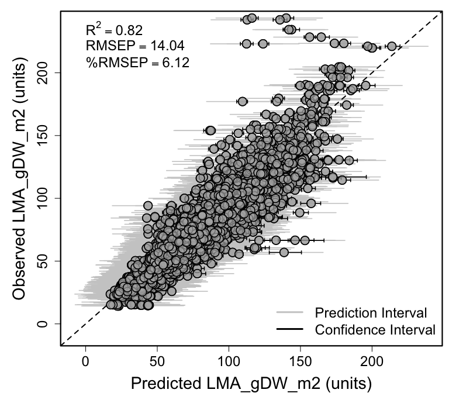

An example showing how to apply an existing PLSR model to new data. In
this case applying the LMA model from Serbin et al., (2019; DOI -
10.1111/nph.16123) to a dataset collected at CONUS NEON field sites
================
Shawn P. Serbin, Julien Lamour, & Jeremiah Anderson
2022-03-17

### Getting Started

### Load libraries

``` r
list.of.packages <- c("pls","dplyr","reshape2","here","plotrix","ggplot2","gridExtra",
                      "spectratrait")
invisible(lapply(list.of.packages, library, character.only = TRUE))
```

    ## 
    ## Attaching package: 'pls'

    ## The following object is masked from 'package:stats':
    ## 
    ##     loadings

    ## Warning: package 'dplyr' was built under R version 4.0.5

    ## 
    ## Attaching package: 'dplyr'

    ## The following objects are masked from 'package:stats':
    ## 
    ##     filter, lag

    ## The following objects are masked from 'package:base':
    ## 
    ##     intersect, setdiff, setequal, union

    ## here() starts at /Users/sserbin/Data/GitHub/spectratrait

    ## 
    ## Attaching package: 'gridExtra'

    ## The following object is masked from 'package:dplyr':
    ## 
    ##     combine

### Setup other functions and options

``` r
### Setup options

# Script options
pls::pls.options(plsralg = "oscorespls")
pls::pls.options("plsralg")
```

    ## $plsralg
    ## [1] "oscorespls"

``` r
# Default par options
opar <- par(no.readonly = T)

# What is the target variable?
inVar <- "LMA_gDW_m2"

# What is the source dataset from EcoSIS?
ecosis_id <- "5617da17-c925-49fb-b395-45a51291bd2d"

# Specify output directory, output_dir 
# Options: 
# tempdir - use a OS-specified temporary directory 
# user defined PATH - e.g. "~/scratch/PLSR"
output_dir <- "tempdir"
```

### Set working directory (scratch space)

    ## [1] "/private/var/folders/xp/h3k9vf3n2jx181ts786_yjrn9c2gjq/T/RtmpfDvF7M"

### Grab PLSR Coefficients from GitHub

``` r
git_repo <- "https://raw.githubusercontent.com/serbinsh/SSerbin_etal_2019_NewPhytologist/master/"
print("**** Downloading PLSR coefficients ****")
```

    ## [1] "**** Downloading PLSR coefficients ****"

``` r
githubURL <- paste0(git_repo,"SSerbin_multibiome_lma_plsr_model/sqrt_LMA_gDW_m2_PLSR_Coefficients_10comp.csv")
LeafLMA.plsr.coeffs <- spectratrait::source_GitHubData(githubURL)
rm(githubURL)
githubURL <- paste0(git_repo,"SSerbin_multibiome_lma_plsr_model/sqrt_LMA_gDW_m2_Jackkife_PLSR_Coefficients.csv")
LeafLMA.plsr.jk.coeffs <- spectratrait::source_GitHubData(githubURL)
rm(githubURL)
```

### Get source dataset from EcoSIS

``` r
dat_raw <- spectratrait::get_ecosis_data(ecosis_id = ecosis_id)
```

    ## [1] "**** Downloading Ecosis data ****"

    ## Downloading data...

    ## Rows: 6312 Columns: 2162
    ## ── Column specification ────────────────────────────────────────────────────────
    ## Delimiter: ","
    ## chr   (10): Affiliation, Common Name, Domain, Functional_type, Latin Genus, ...
    ## dbl (2152): LMA, 350, 351, 352, 353, 354, 355, 356, 357, 358, 359, 360, 361,...
    ## 
    ## ℹ Use `spec()` to retrieve the full column specification for this data.
    ## ℹ Specify the column types or set `show_col_types = FALSE` to quiet this message.
    ## Download complete!

``` r
head(dat_raw)
```

    ## # A tibble: 6 × 2,162
    ##   Affiliation           `Common Name` Domain Functional_type   LMA `Latin Genus`
    ##   <chr>                 <chr>         <chr>  <chr>           <dbl> <chr>        
    ## 1 University of Wiscon… black walnut  D02    broadleaf        72.9 Juglans      
    ## 2 University of Wiscon… black walnut  D02    broadleaf        72.9 Juglans      
    ## 3 University of Wiscon… black walnut  D02    broadleaf        60.8 Juglans      
    ## 4 University of Wiscon… black walnut  D02    broadleaf        60.8 Juglans      
    ## 5 University of Wiscon… black walnut  D02    broadleaf        85.9 Juglans      
    ## 6 University of Wiscon… black walnut  D02    broadleaf        85.9 Juglans      
    ## # … with 2,156 more variables: `Latin Species` <chr>, PI <chr>, Project <chr>,
    ## #   Sample_ID <chr>, `USDA Symbol` <chr>, `350` <dbl>, `351` <dbl>,
    ## #   `352` <dbl>, `353` <dbl>, `354` <dbl>, `355` <dbl>, `356` <dbl>,
    ## #   `357` <dbl>, `358` <dbl>, `359` <dbl>, `360` <dbl>, `361` <dbl>,
    ## #   `362` <dbl>, `363` <dbl>, `364` <dbl>, `365` <dbl>, `366` <dbl>,
    ## #   `367` <dbl>, `368` <dbl>, `369` <dbl>, `370` <dbl>, `371` <dbl>,
    ## #   `372` <dbl>, `373` <dbl>, `374` <dbl>, `375` <dbl>, `376` <dbl>, …

``` r
names(dat_raw)[1:40]
```

    ##  [1] "Affiliation"     "Common Name"     "Domain"          "Functional_type"
    ##  [5] "LMA"             "Latin Genus"     "Latin Species"   "PI"             
    ##  [9] "Project"         "Sample_ID"       "USDA Symbol"     "350"            
    ## [13] "351"             "352"             "353"             "354"            
    ## [17] "355"             "356"             "357"             "358"            
    ## [21] "359"             "360"             "361"             "362"            
    ## [25] "363"             "364"             "365"             "366"            
    ## [29] "367"             "368"             "369"             "370"            
    ## [33] "371"             "372"             "373"             "374"            
    ## [37] "375"             "376"             "377"             "378"

### Prepare new data for estimation

``` r
Start.wave <- 500
End.wave <- 2400
wv <- seq(Start.wave,End.wave,1)
Spectra <- as.matrix(dat_raw[,names(dat_raw) %in% wv])
colnames(Spectra) <- c(paste0("Wave_",wv))
head(Spectra)[1:6,1:10]
```

    ##      Wave_500 Wave_501 Wave_502 Wave_503 Wave_504 Wave_505 Wave_506 Wave_507
    ## [1,] 0.044226 0.044605 0.044927 0.045473 0.046241 0.046878 0.047826 0.049090
    ## [2,] 0.046855 0.047601 0.047944 0.048478 0.049381 0.050235 0.051161 0.052191
    ## [3,] 0.043758 0.044171 0.044869 0.045465 0.045984 0.046933 0.047993 0.049090
    ## [4,] 0.041154 0.041603 0.042088 0.042408 0.042639 0.043260 0.044140 0.045058
    ## [5,] 0.037296 0.037944 0.038209 0.038677 0.039388 0.039948 0.040630 0.041501
    ## [6,] 0.043878 0.044257 0.044723 0.045295 0.045949 0.046575 0.047378 0.048357
    ##      Wave_508 Wave_509
    ## [1,] 0.050268 0.051525
    ## [2,] 0.053322 0.054357
    ## [3,] 0.050168 0.051441
    ## [4,] 0.045700 0.046476
    ## [5,] 0.042613 0.043731
    ## [6,] 0.049392 0.050387

``` r
sample_info <- dat_raw[,names(dat_raw) %notin% seq(350,2500,1)]
head(sample_info)
```

    ## # A tibble: 6 × 11
    ##   Affiliation           `Common Name` Domain Functional_type   LMA `Latin Genus`
    ##   <chr>                 <chr>         <chr>  <chr>           <dbl> <chr>        
    ## 1 University of Wiscon… black walnut  D02    broadleaf        72.9 Juglans      
    ## 2 University of Wiscon… black walnut  D02    broadleaf        72.9 Juglans      
    ## 3 University of Wiscon… black walnut  D02    broadleaf        60.8 Juglans      
    ## 4 University of Wiscon… black walnut  D02    broadleaf        60.8 Juglans      
    ## 5 University of Wiscon… black walnut  D02    broadleaf        85.9 Juglans      
    ## 6 University of Wiscon… black walnut  D02    broadleaf        85.9 Juglans      
    ## # … with 5 more variables: `Latin Species` <chr>, PI <chr>, Project <chr>,
    ## #   Sample_ID <chr>, `USDA Symbol` <chr>

``` r
sample_info2 <- sample_info %>%
  select(Domain,Functional_type,Sample_ID,USDA_Species_Code=`USDA Symbol`,LMA_gDW_m2=LMA)
head(sample_info2)
```

    ## # A tibble: 6 × 5
    ##   Domain Functional_type Sample_ID USDA_Species_Code LMA_gDW_m2
    ##   <chr>  <chr>           <chr>     <chr>                  <dbl>
    ## 1 D02    broadleaf       P0001     JUNI                    72.9
    ## 2 D02    broadleaf       L0001     JUNI                    72.9
    ## 3 D02    broadleaf       P0002     JUNI                    60.8
    ## 4 D02    broadleaf       L0002     JUNI                    60.8
    ## 5 D02    broadleaf       P0003     JUNI                    85.9
    ## 6 D02    broadleaf       L0003     JUNI                    85.9

``` r
plsr_data <- data.frame(sample_info2,Spectra)
rm(sample_info,sample_info2,Spectra)
```

#### Example data cleaning.

``` r
#### End user needs to do what's appropriate for their data.  This may be an iterative process.
# Keep only complete rows of inVar and spec data before fitting
plsr_data <- plsr_data[complete.cases(plsr_data[,names(plsr_data) %in% 
                                                  c(inVar,paste0("Wave_",wv))]),]
```

#### Prepare PLSR model

``` r
print("**** Applying PLSR model to estimate LMA from spectral observations ****")
```

    ## [1] "**** Applying PLSR model to estimate LMA from spectral observations ****"

``` r
# setup model
dims <- dim(LeafLMA.plsr.coeffs)
LeafLMA.plsr.intercept <- LeafLMA.plsr.coeffs[1,]
LeafLMA.plsr.coeffs <- data.frame(LeafLMA.plsr.coeffs[2:dims[1],])
names(LeafLMA.plsr.coeffs) <- c("wavelength","coefs")
LeafLMA.plsr.coeffs.vec <- as.vector(LeafLMA.plsr.coeffs[,2])
sub_spec <- droplevels(plsr_data[,which(names(plsr_data) %in% 
                                                   paste0("Wave_",seq(Start.wave,End.wave,1)))])
```

#### Apply PLSR model

``` r
plsr_pred <- as.matrix(sub_spec) %*% LeafLMA.plsr.coeffs.vec + LeafLMA.plsr.intercept[,2]
leafLMA <- plsr_pred[,1]^2  # convert to standard LMA units from sqrt(LMA)
names(leafLMA) <- "PLSR_LMA_gDW_m2"

# organize output
LeafLMA.PLSR.dataset <- data.frame(plsr_data[,which(names(plsr_data) %notin% 
                                                      paste0("Wave_",seq(Start.wave,End.wave,1)))],
                                   PLSR_LMA_gDW_m2=leafLMA, PLSR_Residuals=leafLMA-plsr_data[,inVar])
head(LeafLMA.PLSR.dataset)
```

    ##   Domain Functional_type Sample_ID USDA_Species_Code LMA_gDW_m2 PLSR_LMA_gDW_m2
    ## 1    D02       broadleaf     P0001              JUNI      72.87        96.26243
    ## 2    D02       broadleaf     L0001              JUNI      72.87        90.09453
    ## 3    D02       broadleaf     P0002              JUNI      60.77        77.16475
    ## 4    D02       broadleaf     L0002              JUNI      60.77        60.99039
    ## 5    D02       broadleaf     P0003              JUNI      85.92       101.22709
    ## 6    D02       broadleaf     L0003              JUNI      85.92        97.13018
    ##   PLSR_Residuals
    ## 1     23.3924343
    ## 2     17.2245326
    ## 3     16.3947533
    ## 4      0.2203913
    ## 5     15.3070857
    ## 6     11.2101840

#### Generate PLSR uncertainty estimates

``` r
print("**** Generate PLSR uncertainty estimates ****")
```

    ## [1] "**** Generate PLSR uncertainty estimates ****"

``` r
jk_coef <- data.frame(LeafLMA.plsr.jk.coeffs[,3:dim(LeafLMA.plsr.jk.coeffs)[2]])
jk_coef <- t(jk_coef)
head(jk_coef)[,1:6]
```

    ##               [,1]      [,2]      [,3]      [,4]      [,5]      [,6]
    ## Wave_500 1.0005875 0.9952840 0.5652908 0.9793160 1.1052207 0.9370473
    ## Wave_501 0.9584235 0.9631434 0.5230544 0.9330803 1.0477469 0.9042780
    ## Wave_502 0.8960202 0.9065954 0.4597413 0.8710298 0.9658130 0.8628370
    ## Wave_503 0.8722135 0.8936197 0.4420696 0.8456098 0.9272967 0.8513741
    ## Wave_504 0.8452831 0.8644923 0.4159567 0.8110004 0.8903192 0.8320347
    ## Wave_505 0.8240743 0.8378399 0.3902871 0.7829891 0.8570048 0.8150339

``` r
jk_int <- t(LeafLMA.plsr.jk.coeffs[,2])
head(jk_int)[,1:6]
```

    ## [1] 7.787098 7.959443 8.015161 8.018586 7.658080 7.998432

``` r
jk_pred <- as.matrix(sub_spec) %*% jk_coef + matrix(rep(jk_int, length(plsr_data[,inVar])), 
                                                    byrow=TRUE, ncol=length(jk_int))
jk_pred <- jk_pred^2
head(jk_pred)[,1:6]
```

    ##       [,1]      [,2]      [,3]     [,4]      [,5]      [,6]
    ## 1 94.28721  96.77712  96.44452 95.11992  96.72830  95.33877
    ## 2 90.36051  90.57120  90.77562 89.77821  90.24826  89.61806
    ## 3 75.71088  77.91861  76.42730 76.11473  77.67179  76.68756
    ## 4 61.37001  61.30963  60.56606 60.72330  61.63712  60.69649
    ## 5 99.24456 101.75948 101.22916 99.96305 101.70397 100.16758
    ## 6 97.40414  97.65463  97.52687 97.00817  97.33677  96.08535

``` r
dim(jk_pred)
```

    ## [1] 6312 1000

``` r
interval <- c(0.025,0.975)
Interval_Conf <- apply(X = jk_pred, MARGIN = 1, FUN = quantile, 
                       probs=c(interval[1], interval[2]))
sd_mean <- apply(X = jk_pred, MARGIN = 1, FUN =sd)
sd_res <- sd(LeafLMA.PLSR.dataset$PLSR_Residuals)
sd_tot <- sqrt(sd_mean^2+sd_res^2)
LeafLMA.PLSR.dataset$LCI <- Interval_Conf[1,]
LeafLMA.PLSR.dataset$UCI <- Interval_Conf[2,]
LeafLMA.PLSR.dataset$LPI <- LeafLMA.PLSR.dataset$PLSR_LMA_gDW_m2-1.96*sd_tot
LeafLMA.PLSR.dataset$UPI <- LeafLMA.PLSR.dataset$PLSR_LMA_gDW_m2+1.96*sd_tot
head(LeafLMA.PLSR.dataset)
```

    ##   Domain Functional_type Sample_ID USDA_Species_Code LMA_gDW_m2 PLSR_LMA_gDW_m2
    ## 1    D02       broadleaf     P0001              JUNI      72.87        96.26243
    ## 2    D02       broadleaf     L0001              JUNI      72.87        90.09453
    ## 3    D02       broadleaf     P0002              JUNI      60.77        77.16475
    ## 4    D02       broadleaf     L0002              JUNI      60.77        60.99039
    ## 5    D02       broadleaf     P0003              JUNI      85.92       101.22709
    ## 6    D02       broadleaf     L0003              JUNI      85.92        97.13018
    ##   PLSR_Residuals      LCI       UCI      LPI      UPI
    ## 1     23.3924343 93.95423  99.03625 71.30476 121.2201
    ## 2     17.2245326 88.81329  92.00078 65.21071 114.9784
    ## 3     16.3947533 74.79509  79.85715 52.19722 102.1323
    ## 4      0.2203913 59.80058  62.29402 36.12678  85.8540
    ## 5     15.3070857 98.86570 103.97701 76.26586 126.1883
    ## 6     11.2101840 95.50843  99.66865 72.20971 122.0507

#### Generate PLSR estimated LMA observed vs predicted plot

``` r
rmsep_percrmsep <- spectratrait::percent_rmse(plsr_dataset = LeafLMA.PLSR.dataset, 
                                              inVar = inVar, 
                                              residuals = LeafLMA.PLSR.dataset$PLSR_Residuals, 
                                              range="full")
RMSEP <- rmsep_percrmsep$rmse
perc_RMSEP <- rmsep_percrmsep$perc_rmse
r2 <- round(summary(lm(LeafLMA.PLSR.dataset$PLSR_LMA_gDW_m2~
                         LeafLMA.PLSR.dataset[,inVar]))$adj.r.squared,2)
expr <- vector("expression", 3)
expr[[1]] <- bquote(R^2==.(r2))
expr[[2]] <- bquote(RMSEP==.(round(RMSEP,2)))
expr[[3]] <- bquote("%RMSEP"==.(round(perc_RMSEP,2)))
rng_vals <- c(min(LeafLMA.PLSR.dataset$LPI), max(LeafLMA.PLSR.dataset$UPI))
par(mfrow=c(1,1), mar=c(4,5.3,1,0.4), oma=c(0.1, 0.1, 0.1, 0.2))
plotrix::plotCI(LeafLMA.PLSR.dataset$PLSR_LMA_gDW_m2,LeafLMA.PLSR.dataset[,inVar], 
                li=LeafLMA.PLSR.dataset$LPI, ui=LeafLMA.PLSR.dataset$UPI, gap=0.009,sfrac=0.000, 
                lwd=1.6, xlim=c(rng_vals[1], rng_vals[2]), ylim=c(rng_vals[1], rng_vals[2]), 
                err="x", pch=21, col="black", pt.bg=scales::alpha("grey70",0.7), scol="grey80",
                cex=2, xlab=paste0("Predicted ", paste(inVar), " (units)"),
                ylab=paste0("Observed ", paste(inVar), " (units)"),
                cex.axis=1.5,cex.lab=1.8)
abline(0,1,lty=2,lw=2)
plotrix::plotCI(LeafLMA.PLSR.dataset$PLSR_LMA_gDW_m2,LeafLMA.PLSR.dataset[,inVar], 
                li=LeafLMA.PLSR.dataset$LCI, ui=LeafLMA.PLSR.dataset$UCI, gap=0.009,sfrac=0.004, 
                lwd=1.6, xlim=c(rng_vals[1], rng_vals[2]), ylim=c(rng_vals[1], rng_vals[2]), 
                err="x", pch=21, col="black", pt.bg=scales::alpha("grey70",0.7), scol="black",
                cex=2, xlab=paste0("Predicted ", paste(inVar), " (units)"),
                ylab=paste0("Observed ", paste(inVar), " (units)"),
                cex.axis=1.5,cex.lab=1.8, add=T)
legend("topleft", legend=expr, bty="n", cex=1.5)
legend("bottomright", legend=c("Prediction Interval","Confidence Interval"), 
       lty=c(1,1), col = c("grey80","black"), lwd=3, bty="n", cex=1.5)
box(lwd=2.2)
```

<!-- -->

``` r
dev.copy(png,file.path(outdir,paste0(inVar,"_PLSR_Validation_Scatterplot.png")), 
         height=2800, width=3200,  res=340)
```

    ## quartz_off_screen 
    ##                 3

``` r
dev.off();
```

    ## quartz_off_screen 
    ##                 2

``` r
print(paste("Output directory: ", outdir))
```

    ## [1] "Output directory:  /var/folders/xp/h3k9vf3n2jx181ts786_yjrn9c2gjq/T//RtmpfDvF7M"

``` r
# Observed versus predicted
write.csv(LeafLMA.PLSR.dataset,file=file.path(outdir,
                                         paste0(inVar,'_PLSR_Estimates.csv')),
          row.names=FALSE)
```

### Confirm files were written to temp space

``` r
print("**** PLSR output files: ")
```

    ## [1] "**** PLSR output files: "

``` r
print(list.files(outdir)[grep(pattern = inVar, list.files(outdir))])
```

    ## [1] "LMA_gDW_m2_PLSR_Estimates.csv"             
    ## [2] "LMA_gDW_m2_PLSR_Validation_Scatterplot.png"
